# Two-Brain Model: Comprehensive Rules Audit Report

**Date:** 2025-12-21  
**Status:** Complete Analysis  
**Purpose:** Identify optimization opportunities for Two-Brain Model

---

## Executive Summary

**Overall Assessment:** ⚠️ **MIXED STATE** - Core structure is correct, but significant conflicts remain

**Key Findings:**
- ✅ Brain B (LLM) rules structure is correct (3-4 lightweight files)
- ❌ Brain A (Enforcer) rules still contain Step 0.5/4.5 (Single-Brain concepts)
- ⚠️ Context management has conflicting instructions
- ⚠️ Path inconsistencies in some files
- ⚠️ Recommendations file sends mixed signals to LLM

**Critical Issues:** 3  
**Optimization Opportunities:** 8  
**Documentation Issues:** 2

---

## 1. Brain B (LLM) Rules Structure ✅

### Current State

**Files in `.cursor/rules/` (LLM Interface):**
- ✅ `00-llm-interface.mdc` (215 lines, alwaysApply: true)
- ✅ `01-llm-security-lite.mdc` (114 lines, alwaysApply: true)
- ✅ `02-llm-fix-mode.mdc` (199 lines, alwaysApply: false)
- ✅ `SESSION_RESTART_REQUIRED.mdc` (dynamic, auto-generated)

**Total:** 3-4 files (~8-15k tokens) ✅ **CORRECT**

### Assessment

✅ **STRENGTHS:**
- Clean separation from heavy rules
- Only essential interface files
- Clear Two-Brain Model messaging
- No Step 0.5/4.5 references in LLM rules

✅ **NO ISSUES FOUND**

---

## 2. Brain A (Enforcer) Rules Structure ❌

### Current State

**Files in `.cursor/enforcement/rules/`:**
- 18 heavy rule files (00-master.mdc through 14-verification.mdc)
- `python_bible.mdc`, `typescript_bible.mdc`
- `context_enforcement.mdc` (auto-generated)
- `context/context-schema_prisma.mdc` (auto-generated)

### Critical Issues Found

#### ❌ Issue 1: Step 0.5/4.5 in Enforcement Rules

**File:** `.cursor/enforcement/rules/01-enforcement.mdc`

**Problem:**
- Contains full Step 0.5 (Context Loading) instructions (lines 90-157)
- Contains full Step 4.5 (Context Management) instructions (lines 373-432)
- These are Single-Brain Model concepts where LLM managed its own context

**Impact:**
- If LLM ever reads this file, it will see conflicting instructions
- Enforcer may check for Step 0.5/4.5 compliance (defeats Two-Brain Model)
- Creates confusion about who manages context

**Evidence:**
```markdown
### Step 0.5: Context Loading (MANDATORY - HARD STOP) ⭐ **CRITICAL**
...
### Step 4.5: Context Management (MANDATORY - HARD STOP) ⭐ **CRITICAL**
```

**Recommendation:**
- Remove Step 0.5/4.5 from `01-enforcement.mdc`
- These steps should be enforcer-internal only (not in LLM-facing rules)
- Enforcer can manage context without LLM knowing about it

---

#### ❌ Issue 2: Context Files Still Contain Step 0.5/4.5

**Files:**
- `.cursor/enforcement/rules/context/context-schema_prisma.mdc`
- `.cursor/enforcement/rules/context_enforcement.mdc`

**Problem:**
- Both files contain Step 0.5/4.5 instructions
- Both tell LLM to manage context loading/unloading
- Both have "MANDATORY" requirements for LLM

**Impact:**
- If these files are ever loaded by LLM, it will see Single-Brain instructions
- Defeats the purpose of Two-Brain Model

**Evidence:**
```markdown
## ⚠️ MANDATORY: Context Management Requirements
**CRITICAL:** The AI agent MUST follow these requirements...
### Task Start Requirements (MANDATORY)
### Task End Requirements (MANDATORY)
```

**Recommendation:**
- These files are in correct location (enforcement/rules)
- But they should NOT contain LLM-facing instructions
- Should be marked as "enforcer-only" or restructured

---

#### ⚠️ Issue 3: Enforcer Checks Step 0.5/4.5 Compliance

**File:** `.cursor/scripts/auto-enforcer.py`

**Problem:**
- Enforcer code checks for Step 0.5/4.5 compliance (lines 1286-1501)
- Verifies LLM completed context loading/unloading
- This is Single-Brain Model behavior

**Impact:**
- Enforcer expects LLM to manage context (defeats Two-Brain Model)
- May block LLM if it doesn't complete Step 0.5/4.5

**Evidence:**
```python
# Check Step 0.5 compliance (task start)
# Check Step 4.5 compliance (task end)
```

**Recommendation:**
- Remove Step 0.5/4.5 compliance checks from enforcer
- Enforcer should manage context internally, not check LLM compliance

---

## 3. Context Management System ⚠️

### Current State

**Files:**
- `.cursor/context_manager/recommendations.md` (auto-generated)
- `.cursor/context_manager/context_profiles.yaml`
- `.cursor/context_manager/context_state.json`

### Issues Found

#### ⚠️ Issue 4: Recommendations File Has Conflicting Messages

**File:** `.cursor/context_manager/recommendations.md`

**Problem:**
- Contains "Two-Brain Model: Context Management" section saying LLM doesn't need to manage context
- BUT also contains "Failure to Comply" section telling LLM to manage context
- Mixed signals: "Don't manage context" vs "You must manage context"

**Evidence:**
```markdown
## ⚠️ Two-Brain Model: Context Management
**NOTE:** In the Two-Brain Model, context management is handled by the enforcer (Brain A).
The LLM (Brain B) does not need to manage context loading/unloading.

## Failure to Comply
**HARD STOP:** If you do not:
- Read this file at task start/end
- Load required PRIMARY context files
- Unload obsolete context files
- Pre-load predicted context files
```

**Impact:**
- LLM receives conflicting instructions
- May cause confusion or incorrect behavior

**Recommendation:**
- Remove "Failure to Comply" section from recommendations.md
- Keep only Two-Brain Model messaging
- Or clarify that context management is optional/informational only

---

#### ⚠️ Issue 5: Recommendations Still Tell LLM to Load Heavy Rules

**File:** `.cursor/context_manager/recommendations.md`

**Problem:**
- Tells LLM to load `@.cursor/enforcement/rules/python_bible.mdc`
- Tells LLM to load `@.cursor/enforcement/rules/02-core.mdc`
- These are heavy rules that should be enforcer-only

**Evidence:**
```markdown
### Dynamic Context (Load These - REQUIRED)
- `@.cursor/enforcement/rules/python_bible.mdc` (PRIMARY - REQUIRED: Load with @ mention)
- `@.cursor/enforcement/rules/02-core.mdc` (PRIMARY - REQUIRED: Load with @ mention)
```

**Impact:**
- LLM will load heavy rules into context (defeats Two-Brain Model)
- Increases token usage significantly
- Defeats the purpose of separation

**Recommendation:**
- Recommendations should NOT suggest loading enforcement rules
- Only suggest lightweight files (patterns, docs, code files)
- Or remove context recommendations entirely for Two-Brain Model

---

#### ⚠️ Issue 6: Path Inconsistencies in Context Profiles

**File:** `.cursor/context_manager/context_profiles.yaml`

**Problem:**
- Dependencies section still references old paths:
  - `"@.cursor/enforcement/rules/python_bible.mdc": ["@.cursor/rules/02-core.mdc"]`
  - Should be `"@.cursor/enforcement/rules/02-core.mdc"`

**Evidence:**
```yaml
dependencies:
  "@.cursor/enforcement/rules/python_bible.mdc":
    - "@.cursor/rules/02-core.mdc"  # ❌ Wrong path
    - "@.cursor/rules/07-observability.mdc"  # ❌ Wrong path
```

**Impact:**
- May cause enforcer to generate incorrect recommendations
- References non-existent files

**Recommendation:**
- Update all dependency paths to `.cursor/enforcement/rules/`
- Verify all paths are correct

---

## 4. Recommendations File Content ⚠️

### Issues Found

#### ⚠️ Issue 7: Recommendations References Old Paths

**File:** `.cursor/context_manager/recommendations.md`

**Problem:**
- Line 55: `@.cursor/rules/02-core.mdc` (should not exist in LLM context)
- Line 56: `@.cursor/rules/07-observability.mdc` (should not exist in LLM context)

**Evidence:**
```markdown
- `@.cursor/rules/02-core.mdc` (OPTIONAL - Load manually if needed)
- `@.cursor/rules/07-observability.mdc` (OPTIONAL - Load manually if needed)
```

**Impact:**
- Suggests loading files that don't exist in `.cursor/rules/`
- May confuse LLM

**Recommendation:**
- Remove references to non-existent files
- Only suggest files that actually exist

---

## 5. Memory Bank Summary ✅

### Current State

**File:** `.cursor/memory-bank/summary.md`

**Assessment:**
- ✅ Correctly compressed for LLM
- ✅ Provides essential context without full files
- ✅ Properly formatted
- ✅ No issues found

---

## 6. .cursorrules File ✅

### Current State

**File:** `.cursorrules`

**Assessment:**
- ✅ Clean Two-Brain Model version
- ✅ Only references 3-4 lightweight files
- ✅ No old enforcement logic
- ✅ No issues found

---

## 7. Optimization Opportunities

### High Priority

#### 🔴 Opportunity 1: Remove Step 0.5/4.5 from All Enforcement Rules

**Impact:** High  
**Effort:** Medium  
**Benefit:** Eliminates Single-Brain Model conflicts

**Action:**
- Remove Step 0.5/4.5 from `01-enforcement.mdc`
- Remove Step 0.5/4.5 from context files
- Update enforcer to not check Step 0.5/4.5 compliance

---

#### 🔴 Opportunity 2: Clarify Context Management for LLM

**Impact:** High  
**Effort:** Low  
**Benefit:** Eliminates confusion

**Action:**
- Remove "Failure to Comply" section from recommendations.md
- Make it clear context management is enforcer-only
- Remove instructions for LLM to load/unload context

---

#### 🔴 Opportunity 3: Stop Recommending Heavy Rules to LLM

**Impact:** High  
**Effort:** Low  
**Benefit:** Maintains Two-Brain Model separation

**Action:**
- Update recommendations.md generation to not suggest enforcement rules
- Only suggest lightweight files (patterns, docs, code)
- Or remove context recommendations entirely

---

### Medium Priority

#### 🟡 Opportunity 4: Fix Path Inconsistencies

**Impact:** Medium  
**Effort:** Low  
**Benefit:** Prevents errors

**Action:**
- Update `context_profiles.yaml` dependencies section
- Fix all path references to use `.cursor/enforcement/rules/`
- Remove references to non-existent files

---

#### 🟡 Opportunity 5: Mark Context Files as Enforcer-Only

**Impact:** Medium  
**Effort:** Low  
**Benefit:** Prevents accidental loading by LLM

**Action:**
- Add clear "ENFORCER-ONLY" markers to context files
- Update file headers to indicate they're not for LLM
- Consider moving to `.cursor/enforcement/internal/` subdirectory

---

#### 🟡 Opportunity 6: Simplify Recommendations File

**Impact:** Medium  
**Effort:** Medium  
**Benefit:** Reduces confusion

**Action:**
- Remove all context management instructions
- Keep only informational content (current task, predictions)
- Make it clear it's for reference only, not instructions

---

### Low Priority

#### 🟢 Opportunity 7: Consolidate Context Files

**Impact:** Low  
**Effort:** Medium  
**Benefit:** Cleaner structure

**Action:**
- Consider consolidating `context_enforcement.mdc` and `context-schema_prisma.mdc`
- Or clearly separate enforcer-internal vs LLM-facing content

---

#### 🟢 Opportunity 8: Update Documentation

**Impact:** Low  
**Effort:** Low  
**Benefit:** Better understanding

**Action:**
- Update documentation to reflect Two-Brain Model context management
- Document that LLM should NOT manage context
- Clarify enforcer's role in context management

---

## 8. Summary of Issues

### Critical (Must Fix)

1. ❌ Step 0.5/4.5 in `01-enforcement.mdc` (enforcer rules)
2. ❌ Step 0.5/4.5 in context files (`context-schema_prisma.mdc`, `context_enforcement.mdc`)
3. ❌ Enforcer checks Step 0.5/4.5 compliance (defeats Two-Brain Model)

### High Priority (Should Fix)

4. ⚠️ Conflicting messages in recommendations.md
5. ⚠️ Recommendations tell LLM to load heavy rules
6. ⚠️ Path inconsistencies in context_profiles.yaml

### Medium Priority (Nice to Have)

7. ⚠️ References to non-existent files in recommendations
8. ⚠️ Context files not clearly marked as enforcer-only

---

## 9. Recommendations

### Immediate Actions

1. **Remove Step 0.5/4.5 from enforcement rules**
   - These are Single-Brain Model concepts
   - Enforcer should manage context internally, not instruct LLM

2. **Clarify context management messaging**
   - Remove conflicting instructions from recommendations.md
   - Make it clear LLM doesn't manage context

3. **Stop recommending heavy rules to LLM**
   - Update recommendations generation
   - Only suggest lightweight files or remove recommendations entirely

### Short-Term Actions

4. **Fix path inconsistencies**
   - Update all paths in context_profiles.yaml
   - Remove references to non-existent files

5. **Mark context files as enforcer-only**
   - Add clear markers
   - Consider restructuring

### Long-Term Actions

6. **Simplify context management system**
   - Consider if recommendations.md is needed at all
   - Or make it purely informational

7. **Update documentation**
   - Document Two-Brain Model context management
   - Clarify roles and responsibilities

---

## 10. Expected Benefits After Fixes

### Token Usage
- **Current:** LLM may load heavy rules (~50k+ tokens)
- **After:** LLM only loads 3-4 lightweight files (~8-15k tokens)
- **Improvement:** 70-80% reduction

### Clarity
- **Current:** Conflicting instructions cause confusion
- **After:** Clear separation of responsibilities
- **Improvement:** Eliminates confusion

### Compliance
- **Current:** Enforcer checks LLM context management (wrong)
- **After:** Enforcer manages context internally (correct)
- **Improvement:** Proper Two-Brain Model implementation

---

## 11. Risk Assessment

### Low Risk
- Removing Step 0.5/4.5 from enforcement rules (enforcer-only files)
- Fixing path inconsistencies
- Updating documentation

### Medium Risk
- Removing context management instructions (may break existing workflows)
- Stopping recommendations of heavy rules (may reduce context availability)

### High Risk
- None identified

---

## Conclusion

The Two-Brain Model structure is **correctly implemented** at the core level:
- ✅ Brain B (LLM) has only 3-4 lightweight files
- ✅ Brain A (Enforcer) has all heavy rules
- ✅ Separation is clear

However, **significant conflicts remain**:
- ❌ Enforcement rules still contain Single-Brain Model concepts (Step 0.5/4.5)
- ⚠️ Context management sends mixed signals to LLM
- ⚠️ Recommendations may cause LLM to load heavy rules

**Priority:** Fix critical issues first (Step 0.5/4.5 removal), then address context management conflicts.

---

**Next Steps:**
1. Review this audit report
2. Prioritize fixes based on impact
3. Implement fixes systematically
4. Test after each fix
5. Monitor for any regressions

---

## 12. Complete Rules Structure & Detailed Analysis

### 12.1 Brain B (LLM) Rules Structure

**Location:** `.cursor/rules/`  
**Purpose:** Lightweight interface for LLM (Brain B)  
**Total Files:** 3-4 files  
**Total Size:** ~8-15k tokens

#### File 1: `00-llm-interface.mdc`

**Metadata:**
- `description`: "VeroField LLM Interface - Two-Brain Model (Brain B)"
- `alwaysApply`: true
- `lines`: 215

**Sections:**
1. **Your Role** - Defines Brain B as implementation agent
2. **Normal Operation Mode** - Simple 5-step implementation process
3. **Fix Mode: [FOLLOW_ENFORCER_REPORT]** - Protocol for applying enforcer fixes
4. **Memory Bank Usage** - How to use compressed summary
5. **Context & Recommendations** - Optional context loading guidance
6. **Security Reminders (Lite)** - 5 critical security rules
7. **Response Format** - Normal vs Fix mode formats
8. **Tech Stack Reference** - Backend/Frontend stack
9. **When in Doubt** - Trust the system guidance
10. **Special Commands** - Enforcer commands to follow

**Key Rules:**
- ✅ Implement code requested by users
- ✅ Apply fixes from ENFORCER_REPORT.json
- ❌ NOT responsible for enforcing all rules
- ❌ NOT responsible for running 5-step pipeline
- ❌ NOT responsible for managing context

---

#### File 2: `01-llm-security-lite.mdc`

**Metadata:**
- `description`: "Security Essentials (Lite Version) - For Brain B (LLM Agent)"
- `alwaysApply`: true
- `lines`: 114

**Sections:**
1. **Multi-Tenant Isolation** - Always filter by tenant_id
2. **Row-Level Security (RLS)** - Prisma middleware or manual guards
3. **Authentication** - Verify user before operations
4. **Input Validation** - Always validate user input
5. **Security Logging** - Log security events

**Key Rules:**
- Always filter by `tenant_id` in queries
- Use Prisma RLS middleware or manual guards
- Verify user has permission before operations
- Validate all user input
- Log security-relevant events

**Note:** Full security rules in `.cursor/enforcement/rules/03-security.mdc` (enforcer-only)

---

#### File 3: `02-llm-fix-mode.mdc`

**Metadata:**
- `description`: "Fix Mode Protocol - For Brain B when applying enforcer fixes"
- `alwaysApply`: false (only when `[FOLLOW_ENFORCER_REPORT]` tag detected)
- `lines`: 199

**Sections:**
1. **When This Activates** - Trigger conditions
2. **Fix Mode Behavior** - 5-step fix process
3. **Output Format** - Required `[FIX_COMPLETE]` tag
4. **What Happens Next** - Re-audit loop
5. **Special Cases** - Unclear violations, blocked fixes, auto-fixes

**Key Rules:**
- Fix all `BLOCKING` violations first
- Fix `WARNING` violations if simple
- Trust the report (from enforcer's full analysis)
- Keep changes minimal and focused
- Output `[FIX_COMPLETE]` when done

**Fix Mode Protocol:**
```
INPUT: [FOLLOW_ENFORCER_REPORT] + ENFORCER_REPORT.json
PROCESS: Read violations → Apply fixes → Output [FIX_COMPLETE]
OUTPUT: Enforcer re-audits → Loop until clean
```

---

#### File 4: `SESSION_RESTART_REQUIRED.mdc`

**Metadata:**
- `description`: Dynamic file (auto-generated by enforcer)
- `alwaysApply`: N/A (informational only)
- `lines`: Variable

**Purpose:**
- Alerts LLM when core context has changed
- Instructs user to start new chat session
- Auto-removed after 5 minutes or when new session detected

**Content:**
- Lists created/deleted rule files
- Provides restart instructions
- Explains why restart is needed

---

### 12.2 Brain A (Enforcer) Rules Structure

**Location:** `.cursor/enforcement/rules/`  
**Purpose:** Complete rule system for enforcer (Brain A)  
**Total Files:** 18+ files  
**Total Size:** ~50k+ tokens (not loaded by LLM)

#### Core Enforcement Rules (00-14)

**File 1: `00-master.mdc`**
- **Purpose:** Master rule with CI integration, REWARD_SCORE, pattern system
- **Key Sections:**
  - Rule Precedence (supersedes all other rules)
  - Pre-Flight Check (MANDATORY prerequisite)
  - Hard Stop Conditions (6 conditions that block execution)
  - Routing & Mode Selection (TRIAGER)
  - Conditional Bible Rule Loading (Python/TypeScript)
  - Modular Prompts (role-based guidance)
  - @LEAD PR Review Mode (CI-assisted)
- **Always Apply:** true

**File 2: `01-enforcement.mdc`**
- **Purpose:** Mandatory 5-step enforcement pipeline
- **Key Sections:**
  - Step 0: Memory Bank Context Loading (MANDATORY)
  - Step 0.5: Context Loading ⚠️ **CONFLICT** (Single-Brain concept)
  - Step 1: Search & Discovery
  - Step 2: Pattern Analysis
  - Step 3: Compliance Check
  - Step 4: Implementation Plan
  - Step 4.5: Context Management ⚠️ **CONFLICT** (Single-Brain concept)
  - Step 5: Post-Implementation Audit
- **Always Apply:** true
- **⚠️ ISSUE:** Contains Step 0.5/4.5 (should be removed)

**File 3: `02-core.mdc`**
- **Purpose:** Core philosophy, date handling, tech stack standards
- **Key Sections:**
  - Date & Time Handling (HARD STOP on hardcoded dates)
  - Project Context & Architecture
  - Tech Stack (NestJS, Prisma, React, React Native)
  - Code Organization
  - Naming Conventions
- **Always Apply:** true

**File 4: `03-security.mdc`**
- **Purpose:** Security rules: tenant isolation, RLS, authentication, secrets
- **Key Sections:**
  - Tenant Isolation & Row Level Security (RLS)
  - Authentication & Authorization (JWT)
  - Secrets Management
  - Input Validation
  - Security Logging
- **Always Apply:** true

**File 5: `04-architecture.mdc`**
- **Purpose:** Monorepo structure, service boundaries, architectural scope limits
- **Key Sections:**
  - Monorepo Structure (authoritative)
  - Service Boundaries (no cross-service imports)
  - Architectural Scope Limits
- **Always Apply:** true

**File 6: `05-data.mdc`**
- **Purpose:** Data contracts, state machines, layer synchronization
- **Key Sections:**
  - Sources of Truth (DB schema, DTOs, frontend types, events)
  - State Machines (business stateful entities)
  - Layer Synchronization Rule
- **Always Apply:** true

**File 7: `06-error-resilience.mdc`**
- **Purpose:** Error handling, resilience patterns, no silent failures
- **Key Sections:**
  - No Silent Failures (NON-NEGOTIABLE)
  - Error Categories (Validation, Business, System)
  - User-Facing Messages
- **Always Apply:** true

**File 8: `07-observability.mdc`**
- **Purpose:** Structured logging, tracing, metrics
- **Key Sections:**
  - Structured Logging (JSON-like format)
  - Trace ID Propagation
  - Metrics (latency, error rate, DB queries)
- **Always Apply:** true

**File 9: `08-backend.mdc`**
- **Purpose:** Backend architecture: NestJS, Prisma, controller-service-DTO patterns
- **Key Sections:**
  - Module Structure (Controllers, Services, DTOs)
  - Prisma Usage (tenant-scoped queries, transactions)
  - Testing Requirements
- **Always Apply:** false (contextual - only for backend files)
- **Globs:** `apps/*/src/**/*.ts,libs/common/**/*.ts`

**File 10: `09-frontend.mdc`**
- **Purpose:** Frontend architecture: React/React Native, hooks, components, design system
- **Key Sections:**
  - Directory Structure
  - Data Fetching (React Query)
  - Design System Usage (MANDATORY)
  - UX Consistency Rules
- **Always Apply:** false (contextual - only for frontend files)
- **Globs:** `frontend/**/*.{ts,tsx},VeroFieldMobile/**/*.{ts,tsx}`

**File 11: `10-quality.mdc`**
- **Purpose:** Quality standards: testing, regression, performance budgets
- **Key Sections:**
  - Testing Rules (unit, integration, E2E)
  - Performance Budgets (backend/frontend)
  - Anti-Performance Patterns (HARD STOP)
- **Always Apply:** false (contextual)
- **Globs:** `**/*.{ts,tsx}`

**File 12: `11-operations.mdc`**
- **Purpose:** CI/CD workflows, reward score integration, deployments
- **Key Sections:**
  - Workflow Requirements
  - Required Checks (lint, tests, security, reward score)
  - Deployment Rules
- **Always Apply:** false (contextual - only for CI/CD files)
- **Globs:** `.github/workflows/**/*.{yml,yaml}`

**File 13: `12-tech-debt.mdc`**
- **Purpose:** Tech debt logging, TODO/FIXME management
- **Always Apply:** false (contextual)

**File 14: `13-ux-consistency.mdc`**
- **Purpose:** UI/UX coherence, design system consistency
- **Always Apply:** false (contextual - only for frontend files)

**File 15: `14-verification.mdc`**
- **Purpose:** Verification & testing standards
- **Always Apply:** false (contextual)

---

#### Language-Specific Rules

**File 16: `python_bible.mdc`**
- **Purpose:** Python-specific coding standards and patterns
- **Always Apply:** false (conditional - only when working with Python files)
- **Apply When:** `**/*.py`, `**/*.pyi`, `**/requirements*.txt`, etc.

**File 17: `typescript_bible.mdc`**
- **Purpose:** TypeScript-specific coding standards and patterns
- **Always Apply:** false (conditional - only when working with TypeScript files)
- **Apply When:** `**/*.ts`, `**/*.tsx`, `**/tsconfig.json`, etc.

---

#### Auto-Generated Context Rules

**File 18: `context_enforcement.mdc`**
- **Purpose:** Dynamic context priorities (auto-generated)
- **Location:** `.cursor/enforcement/rules/context_enforcement.mdc`
- **⚠️ ISSUE:** Contains Step 0.5/4.5 instructions (should be enforcer-only)
- **Always Apply:** N/A (enforcer-only, not loaded by LLM)

**File 19: `context/context-schema_prisma.mdc`**
- **Purpose:** Context management for Prisma schema (auto-generated)
- **Location:** `.cursor/enforcement/rules/context/context-schema_prisma.mdc`
- **⚠️ ISSUE:** Contains Step 0.5/4.5 instructions (should be enforcer-only)
- **Always Apply:** N/A (enforcer-only, not loaded by LLM)

---

### 12.3 Rules Relationship Diagram


**Legend:**
- 🟢 Green: Correct (Brain B lightweight files)
- 🔴 Pink: Contains conflicts (Step 0.5/4.5)
- Solid arrows: Direct dependencies
- Dotted arrows: Data flow

---

### 12.4 Two-Brain System Architecture Diagram

```mermaid
graph LR
    subgraph "User Request"
        USER[User]
    end
    
    subgraph "Brain B - LLM Agent"
        LLM[LLM Agent<br/>Cursor]
        LLM_RULES["Rules Loaded:<br/>• 00-llm-interface.mdc<br/>• 01-llm-security-lite.mdc<br/>• 02-llm-fix-mode.mdc<br/>• memory-bank/summary.md<br/><br/>~8-15k tokens"]
        CODE[Code Implementation]
    end
    
    subgraph "Brain A - Auto-Enforcer"
        ENFORCER[auto-enforcer.py]
        ENF_RULES["Rules Loaded:<br/>• All 18 enforcement rules<br/>• Full Memory Bank<br/>• Complete codebase analysis<br/><br/>~50k+ tokens"]
        AUDIT[Rule Audit]
        VIOLATIONS[Violation Detection]
        REPORT[ENFORCER_REPORT.json]
    end
    
    subgraph "Communication Bridge"
        BRIDGE[ENFORCER_REPORT.json<br/>+<br/>[FOLLOW_ENFORCER_REPORT] tag]
    end
    
    USER -->|"Implement feature X"| LLM
    LLM --> LLM_RULES
    LLM_RULES --> CODE
    CODE -->|File Changes| ENFORCER
    ENFORCER --> ENF_RULES
    ENF_RULES --> AUDIT
    AUDIT --> VIOLATIONS
    VIOLATIONS --> REPORT
    REPORT --> BRIDGE
    BRIDGE -->|"[FOLLOW_ENFORCER_REPORT]"| LLM
    LLM -->|Applies Fixes| CODE
    CODE -->|Re-audit| ENFORCER
    ENFORCER -->|Status: OK| USER
    
    style LLM fill:#90EE90
    style ENFORCER fill:#87CEEB
    style BRIDGE fill:#FFD700
    style CODE fill:#DDA0DD
```

**Key Points:**
- **Brain B** only loads 3-4 lightweight files
- **Brain A** loads all 18+ heavy rules
- **Communication** via ENFORCER_REPORT.json
- **Separation** is clear and maintained

---

### 12.5 Enforcer-Rules Relationship Diagram

```mermaid
graph TB
    subgraph "Enforcer Engine"
        ENFORCER[auto-enforcer.py<br/>Main Enforcement Engine]
        WATCHER[watch-files.py<br/>File Watcher]
        PREFLIGHT[pre-flight-check.py<br/>Pre-Flight Validation]
    end
    
    subgraph "Enforcement Rules (Brain A)"
        MASTER[00-master.mdc<br/>Precedence & CI]
        ENFORCE[01-enforcement.mdc<br/>5-Step Pipeline]
        CORE[02-core.mdc<br/>Dates & Standards]
        SEC[03-security.mdc<br/>Security]
        ARCH[04-architecture.mdc<br/>Structure]
        DATA[05-data.mdc<br/>Contracts]
        ERR[06-error-resilience.mdc<br/>Errors]
        OBS[07-observability.mdc<br/>Logging]
        BACK[08-backend.mdc<br/>Backend]
        FRONT[09-frontend.mdc<br/>Frontend]
        QUAL[10-quality.mdc<br/>Quality]
        OPS[11-operations.mdc<br/>CI/CD]
        DEBT[12-tech-debt.mdc<br/>Tech Debt]
        UX[13-ux-consistency.mdc<br/>UX]
        VER[14-verification.mdc<br/>Testing]
        PY[python_bible.mdc<br/>Python]
        TS[typescript_bible.mdc<br/>TypeScript]
    end
    
    subgraph "Enforcer Checks"
        CHECK1[Memory Bank Compliance<br/>Step 0]
        CHECK2[Date Handling<br/>02-core.mdc]
        CHECK3[Security Rules<br/>03-security.mdc]
        CHECK4[Error Handling<br/>06-error-resilience.mdc]
        CHECK5[Logging<br/>07-observability.mdc]
        CHECK6[Python Bible<br/>python_bible.mdc]
        CHECK7[Step 0.5/4.5<br/>⚠️ CONFLICT]
    end
    
    subgraph "Outputs"
        STATUS[AGENT_STATUS.md]
        VIOLATIONS[VIOLATIONS.md]
        REPORT[ENFORCER_REPORT.json]
        FIXES[AUTO_FIXES.md]
    end
    
    ENFORCER --> MASTER
    ENFORCER --> ENFORCE
    ENFORCER --> CORE
    ENFORCER --> SEC
    ENFORCER --> ARCH
    ENFORCER --> DATA
    ENFORCER --> ERR
    ENFORCER --> OBS
    ENFORCER --> BACK
    ENFORCER --> FRONT
    ENFORCER --> QUAL
    ENFORCER --> OPS
    ENFORCER --> DEBT
    ENFORCER --> UX
    ENFORCER --> VER
    ENFORCER --> PY
    ENFORCER --> TS
    
    MASTER --> CHECK1
    ENFORCE --> CHECK1
    ENFORCE --> CHECK7
    CORE --> CHECK2
    SEC --> CHECK3
    ERR --> CHECK4
    OBS --> CHECK5
    PY --> CHECK6
    
    CHECK1 --> STATUS
    CHECK2 --> VIOLATIONS
    CHECK3 --> VIOLATIONS
    CHECK4 --> VIOLATIONS
    CHECK5 --> VIOLATIONS
    CHECK6 --> VIOLATIONS
    CHECK7 --> STATUS
    
    ENFORCER --> REPORT
    ENFORCER --> FIXES
    
    WATCHER --> ENFORCER
    PREFLIGHT --> ENFORCER
    
    style CHECK7 fill:#FFB6C1
    style ENFORCE fill:#FFB6C1
```



**Key Points:**
- Enforcer loads ALL enforcement rules
- Enforcer performs checks based on rules
- ⚠️ **CONFLICT:** Enforcer checks Step 0.5/4.5 (should be removed)
- Enforcer generates status files and reports

---

### 12.6 Rules Precedence & Dependencies


**Precedence Rules:**
1. **00-master.mdc** - Highest precedence (supersedes all)
2. **01-enforcement.mdc** - Defines mandatory pipeline
3. **03-security.mdc** - Security overrides all other rules
4. **02-core.mdc** - Core standards (dates, tech stack)
5. **Domain rules (04-14)** - Context-specific
6. **Bible rules** - Language-specific (conditional)

---

### 12.7 File Size & Token Estimates

| Category | Files | Estimated Tokens | Status |
|----------|-------|------------------|--------|
| **Brain B (LLM)** | 3-4 | ~8-15k | ✅ Correct |
| **Brain A (Enforcer)** | 18+ | ~50k+ | ✅ Correct (not loaded by LLM) |
| **Memory Bank Summary** | 1 | ~2-3k | ✅ Correct |
| **Total LLM Context** | 4-5 | ~10-18k | ✅ Target achieved |

**Comparison:**
- **Single-Brain Model:** ~84k tokens (all rules + Memory Bank)
- **Two-Brain Model:** ~10-18k tokens (lightweight interface only)
- **Reduction:** 78-88% token usage reduction ✅

---

### 12.8 Rules Loading Flow


---

### 12.9 Detailed Rules by Category

#### Critical Rules (Always Apply)

| File | Purpose | Key Rules | Always Apply |
|------|---------|-----------|--------------|
| `00-master.mdc` | Master precedence | Rule precedence, pre-flight check, hard stops | ✅ Yes |
| `01-enforcement.mdc` | 5-step pipeline | Step 0-5, Memory Bank, compliance checks | ✅ Yes |
| `02-core.mdc` | Core standards | Date handling (HARD STOP), tech stack, naming | ✅ Yes |
| `03-security.mdc` | Security | Tenant isolation, RLS, auth, secrets, validation | ✅ Yes |

#### Architecture Rules (Always Apply)

| File | Purpose | Key Rules | Always Apply |
|------|---------|-----------|--------------|
| `04-architecture.mdc` | Monorepo structure | Service boundaries, file paths, no cross-imports | ✅ Yes |
| `05-data.mdc` | Data contracts | Layer sync, state machines, schema consistency | ✅ Yes |

#### Quality Rules (Always Apply)

| File | Purpose | Key Rules | Always Apply |
|------|---------|-----------|--------------|
| `06-error-resilience.mdc` | Error handling | No silent failures, error categories, user messages | ✅ Yes |
| `07-observability.mdc` | Logging | Structured logs, trace IDs, metrics | ✅ Yes |

#### Contextual Rules (Conditional Apply)

| File | Purpose | Apply When | Key Rules |
|------|---------|------------|-----------|
| `08-backend.mdc` | Backend patterns | `apps/*/src/**/*.ts` | NestJS, Prisma, DTOs |
| `09-frontend.mdc` | Frontend patterns | `frontend/**/*.{ts,tsx}` | React, hooks, design system |
| `10-quality.mdc` | Quality standards | `**/*.{ts,tsx}` | Testing, performance budgets |
| `11-operations.mdc` | CI/CD | `.github/workflows/**` | Workflows, reward score |
| `12-tech-debt.mdc` | Tech debt | When touching debt | Logging, TODO management |
| `13-ux-consistency.mdc` | UX | Frontend files | Design system, consistency |
| `14-verification.mdc` | Testing | Test files | Test standards |

#### Language-Specific Rules (Conditional Apply)

| File | Purpose | Apply When | Key Rules |
|------|---------|------------|-----------|
| `python_bible.mdc` | Python standards | `**/*.py` | Python patterns, best practices |
| `typescript_bible.mdc` | TypeScript standards | `**/*.ts` | TypeScript patterns, best practices |

---

### 12.10 Rules Conflict Matrix

| Rule File | Conflicts With | Conflict Type | Severity |
|-----------|----------------|---------------|----------|
| `01-enforcement.mdc` | Two-Brain Model | Contains Step 0.5/4.5 | 🔴 Critical |
| `context_enforcement.mdc` | Two-Brain Model | Contains Step 0.5/4.5 | 🔴 Critical |
| `context-schema_prisma.mdc` | Two-Brain Model | Contains Step 0.5/4.5 | 🔴 Critical |
| `recommendations.md` | Two-Brain Model | Conflicting messages | ⚠️ High |
| `context_profiles.yaml` | Path consistency | Old paths in dependencies | ⚠️ Medium |

---

### 12.11 Rules Enforcement Flow

```mermaid
flowchart TD
    START[User Request] --> PREFLIGHT{Pre-Flight Check}
    PREFLIGHT -->|ENFORCEMENT_BLOCK.md exists| BLOCKED[🔴 BLOCKED - Stop]
    PREFLIGHT -->|Check AGENT_STATUS.md| STATUS{Status?}
    STATUS -->|🔴 BLOCKED| BLOCKED
    STATUS -->|🟡 WARNING| WARN[Continue with Warnings]
    STATUS -->|🟢 COMPLIANT| STEP0[Step 0: Memory Bank]
    
    STEP0 --> STEP1[Step 1: Search & Discovery]
    STEP1 --> STEP2[Step 2: Pattern Analysis]
    STEP2 --> STEP3[Step 3: Compliance Check]
    STEP3 -->|Violations| FIX[Apply Fixes]
    STEP3 -->|Clean| STEP4[Step 4: Implementation Plan]
    STEP4 --> IMPL[Implementation]
    IMPL --> STEP5[Step 5: Post-Implementation Audit]
    
    STEP5 --> ENFORCER_CHECK{Enforcer Audit}
    ENFORCER_CHECK -->|Violations Found| REPORT[Generate ENFORCER_REPORT.json]
    REPORT --> FIX_MODE[LLM Fix Mode]
    FIX_MODE --> FIX
    FIX --> ENFORCER_CHECK
    
    ENFORCER_CHECK -->|Clean| COMPLETE[✅ Complete]
    
    WARN --> STEP0
    
    style BLOCKED fill:#FF6B6B
    style WARN fill:#FFD700
    style COMPLETE fill:#90EE90
    style FIX_MODE fill:#87CEEB
```



---

### 12.12 Summary: Rules Structure

**Brain B (LLM) - 3-4 Files:**
1. `00-llm-interface.mdc` - Core protocol (215 lines)
2. `01-llm-security-lite.mdc` - Security essentials (114 lines)
3. `02-llm-fix-mode.mdc` - Fix mode protocol (199 lines, conditional)
4. `SESSION_RESTART_REQUIRED.mdc` - Dynamic alert (variable)

**Brain A (Enforcer) - 18+ Files:**
1. `00-master.mdc` - Master rule (precedence)
2. `01-enforcement.mdc` - 5-step pipeline ⚠️ (contains Step 0.5/4.5)
3. `02-core.mdc` - Core standards
4. `03-security.mdc` - Security rules
5. `04-architecture.mdc` - Architecture
6. `05-data.mdc` - Data contracts
7. `06-error-resilience.mdc` - Error handling
8. `07-observability.mdc` - Logging
9. `08-backend.mdc` - Backend (conditional)
10. `09-frontend.mdc` - Frontend (conditional)
11. `10-quality.mdc` - Quality (conditional)
12. `11-operations.mdc` - CI/CD (conditional)
13. `12-tech-debt.mdc` - Tech debt (conditional)
14. `13-ux-consistency.mdc` - UX (conditional)
15. `14-verification.mdc` - Testing (conditional)
16. `python_bible.mdc` - Python (conditional)
17. `typescript_bible.mdc` - TypeScript (conditional)
18. `context_enforcement.mdc` - Context rules ⚠️ (auto-generated)
19. `context/context-schema_prisma.mdc` - Schema context ⚠️ (auto-generated)

**Total:** 22 rule files (3-4 for LLM, 18+ for Enforcer)

