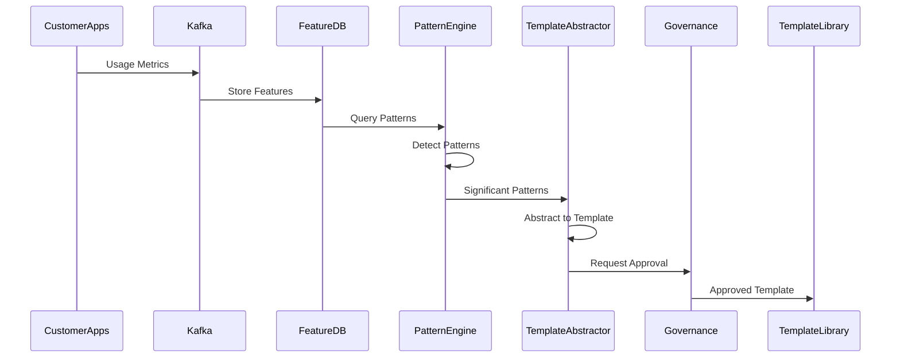

# VeroForge Intelligence Engine Design

**Status:** Strategic Initiative - Post-VeroAI  
**Last Updated:** 2025-12-05

---

## Overview

The VeroForge Intelligence Engine analyzes cross-customer usage patterns to automatically improve templates and the generator pipeline. It leverages VeroAI's pattern detection capabilities and creates a self-improving platform.

---

## Architecture

### High-Level Flow

```
Customer Apps (Generated)
    │
    └─→ Telemetry (Kafka: veroforge_metrics)
            │
            └─→ Feature DB (Feast + Redis)
                    │
                    └─→ Pattern Engine
                            │
                            ├─→ SQL Pattern Detector
                            └─→ ML Clustering
                                    │
                                    └─→ Template Abstractor
                                            │
                                            └─→ Human Review
                                                    │
                                                    └─→ Template Library
```

### Component Architecture

```
apps/forge-intelligence/
├── src/
│   ├── pattern-detection/
│   │   ├── sql-pattern-detector.service.ts
│   │   ├── ml-clustering.service.ts
│   │   └── pattern-analyzer.service.ts
│   ├── template-abstractor/
│   │   ├── template-promoter.service.ts
│   │   └── template-generator.service.ts
│   └── auto-remediation/
│       ├── suggestion-engine.service.ts
│       └── improvement-applicator.service.ts
```

---

## Pattern Detection

### SQL Pattern Detector

**Purpose:** Detect inefficient database query patterns.

**Location:** `apps/forge-intelligence/src/pattern-detection/sql-pattern-detector.service.ts`

**Detection Patterns:**

1. **Missing Indexes**
   - Detect slow queries (P99 >200ms)
   - Identify frequently filtered columns
   - Suggest index creation

2. **N+1 Queries**
   - Detect multiple sequential queries
   - Identify relationship loading patterns
   - Suggest eager loading

3. **Full Table Scans**
   - Detect queries without WHERE clauses
   - Identify missing filters
   - Suggest query optimization

**Implementation:**
```typescript
@Injectable()
export class SQLPatternDetectorService {
  async detectPatterns(metrics: QueryMetrics[]): Promise<SQLPattern[]> {
    const patterns: SQLPattern[] = [];
    
    // Detect slow queries
    const slowQueries = metrics.filter(m => m.p99Latency > 200);
    for (const query of slowQueries) {
      const pattern = await this.analyzeQuery(query);
      if (pattern.type === 'missing_index') {
        patterns.push({
          type: 'missing_index',
          severity: 'high',
          query: query.sql,
          suggestion: {
            index: pattern.suggestedIndex,
            expectedImprovement: '40% faster'
          }
        });
      }
    }
    
    return patterns;
  }
}
```

### ML Clustering

**Purpose:** Group similar patterns using machine learning.

**Location:** `apps/forge-intelligence/src/pattern-detection/ml-clustering.service.ts`

**Clustering Approach:**

1. **Feature Extraction**
   - Code structure features
   - Usage frequency
   - Performance metrics
   - Customer satisfaction

2. **Clustering Algorithm**
   - K-means clustering
   - DBSCAN for outlier detection
   - Hierarchical clustering for taxonomy

3. **Pattern Identification**
   - Common customizations
   - Performance bottlenecks
   - Security vulnerabilities

**Implementation:**
```typescript
@Injectable()
export class MLClusteringService {
  async clusterPatterns(patterns: Pattern[]): Promise<PatternCluster[]> {
    // Extract features
    const features = patterns.map(p => this.extractFeatures(p));
    
    // Perform clustering
    const clusters = await this.kmeans(features, { k: 10 });
    
    // Identify significant clusters
    const significantClusters = clusters.filter(c => 
      c.size > 10 && c.cohesion > 0.7
    );
    
    return significantClusters.map(c => ({
      id: c.id,
      patterns: c.patterns,
      centroid: c.centroid,
      significance: c.significance
    }));
  }
}
```

---

## Template Abstractor

### Template Promoter

**Purpose:** Promote detected patterns to new templates.

**Location:** `apps/forge-intelligence/src/template-abstractor/template-promoter.service.ts`

**Promotion Criteria:**

1. **Frequency Threshold**
   - Pattern appears in 80%+ of customers
   - Minimum 10 occurrences

2. **Quality Metrics**
   - Pattern improves performance
   - Pattern reduces code complexity
   - Pattern enhances security

3. **Abstraction Feasibility**
   - Pattern can be generalized
   - Pattern has clear variables
   - Pattern is testable

**Process:**
```typescript
@Injectable()
export class TemplatePromoterService {
  async promotePattern(pattern: PatternCluster): Promise<TemplateCandidate> {
    // Check promotion criteria
    if (!this.meetsPromotionCriteria(pattern)) {
      return null;
    }
    
    // Abstract pattern to template
    const template = await this.abstractPattern(pattern);
    
    // Generate template code
    const templateCode = await this.generateTemplateCode(template);
    
    // Create template manifest
    const manifest = this.createTemplateManifest(template, templateCode);
    
    return {
      template,
      code: templateCode,
      manifest,
      confidence: this.calculateConfidence(pattern)
    };
  }
  
  private async abstractPattern(pattern: PatternCluster): Promise<Template> {
    // Extract common structure
    const commonStructure = this.extractCommonStructure(pattern.patterns);
    
    // Identify variables
    const variables = this.identifyVariables(commonStructure);
    
    // Create template structure
    return {
      id: this.generateTemplateId(pattern),
      structure: commonStructure,
      variables,
      hooks: this.identifyHooks(pattern.patterns)
    };
  }
}
```

### Template Generator

**Purpose:** Generate template code from abstracted pattern.

**Location:** `apps/forge-intelligence/src/template-abstractor/template-generator.service.ts`

**Generation Process:**

1. **Code Analysis**
   - Parse pattern code
   - Identify code structure
   - Extract reusable components

2. **Template Creation**
   - Create template files
   - Add variable placeholders
   - Generate manifest

3. **Test Generation**
   - Generate unit tests
   - Generate integration tests
   - Ensure test coverage

**Implementation:**
```typescript
@Injectable()
export class TemplateGeneratorService {
  async generateTemplate(
    abstractedPattern: Template,
    patternExamples: Pattern[]
  ): Promise<TemplateCode> {
    const templateCode: TemplateCode = {
      api: {},
      ui: {},
      prisma: {},
      tests: {}
    };
    
    // Generate API code
    templateCode.api = await this.generateAPICode(
      abstractedPattern,
      patternExamples
    );
    
    // Generate UI code
    templateCode.ui = await this.generateUICode(
      abstractedPattern,
      patternExamples
    );
    
    // Generate Prisma schema
    templateCode.prisma = await this.generatePrismaCode(
      abstractedPattern,
      patternExamples
    );
    
    // Generate tests
    templateCode.tests = await this.generateTests(
      abstractedPattern,
      templateCode
    );
    
    return templateCode;
  }
}
```

---

## Auto-Remediation

### Suggestion Engine

**Purpose:** Generate improvement suggestions from detected patterns.

**Location:** `apps/forge-intelligence/src/auto-remediation/suggestion-engine.service.ts`

**Suggestion Types:**

1. **Performance Improvements**
   - Add database indexes
   - Optimize queries
   - Add caching

2. **Security Hardening**
   - Add input validation
   - Fix SQL injection risks
   - Add RLS policies

3. **Code Quality**
   - Reduce duplication
   - Improve error handling
   - Add logging

**Implementation:**
```typescript
@Injectable()
export class SuggestionEngineService {
  async generateSuggestions(pattern: Pattern): Promise<Suggestion[]> {
    const suggestions: Suggestion[] = [];
    
    // Performance suggestions
    if (pattern.type === 'slow_query') {
      suggestions.push({
        type: 'performance',
        severity: 'high',
        title: 'Add database index',
        description: `Query on ${pattern.table}.${pattern.column} is slow`,
        fix: {
          type: 'add_index',
          code: this.generateIndexCode(pattern),
          expectedImprovement: '40% faster'
        },
        autoApply: true
      });
    }
    
    // Security suggestions
    if (pattern.type === 'sql_injection_risk') {
      suggestions.push({
        type: 'security',
        severity: 'critical',
        title: 'Fix SQL injection vulnerability',
        description: `Query uses string concatenation: ${pattern.query}`,
        fix: {
          type: 'use_parameterized_query',
          code: this.generateSafeQuery(pattern),
          expectedImprovement: 'Eliminates SQL injection risk'
        },
        autoApply: false // Requires review
      });
    }
    
    return suggestions;
  }
}
```

### Improvement Applicator

**Purpose:** Apply approved improvements automatically.

**Location:** `apps/forge-intelligence/src/auto-remediation/improvement-applicator.service.ts`

**Application Process:**

1. **Risk Assessment**
   - Evaluate improvement risk
   - Check auto-apply eligibility
   - Route for approval if needed

2. **Application**
   - Update template code
   - Update generator code
   - Deploy via canary

3. **Verification**
   - Run tests
   - Monitor metrics
   - Rollback if issues

**Implementation:**
```typescript
@Injectable()
export class ImprovementApplicatorService {
  constructor(
    private templateUpdater: TemplateUpdaterService,
    private generatorUpdater: GeneratorUpdaterService,
    private veroAIGovernance: VeroAIGovernanceClient
  ) {}
  
  async applyImprovement(improvement: Improvement): Promise<void> {
    // Assess risk
    const risk = this.assessRisk(improvement);
    
    if (risk === 'low' && improvement.autoApply) {
      // Auto-apply low-risk improvements
      await this.applyDirectly(improvement);
    } else {
      // Route for approval
      await this.routeForApproval(improvement);
    }
  }
  
  private async applyDirectly(improvement: Improvement): Promise<void> {
    if (improvement.type === 'template') {
      await this.templateUpdater.update(
        improvement.templateId,
        improvement.code
      );
    } else if (improvement.type === 'generator') {
      await this.generatorUpdater.update(
        improvement.component,
        improvement.code
      );
    }
    
    // Deploy via canary
    await this.deployCanary(improvement);
  }
  
  private async routeForApproval(improvement: Improvement): Promise<void> {
    const approval = await this.veroAIGovernance.requestApproval({
      type: improvement.type,
      change: {
        description: improvement.description,
        code: improvement.code,
        risk: this.assessRisk(improvement),
        impact: improvement.affectedTemplates
      }
    });
    
    if (approval.status === 'approved') {
      await this.applyDirectly(improvement);
    }
  }
}
```

---

## Integration with VeroAI

### VeroAI Pattern Detection

**Integration:** Uses VeroAI's pattern detection for initial analysis.

```typescript
async detectPatterns(): Promise<Pattern[]> {
  // Use VeroAI pattern detection
  const veroAIPatterns = await this.veroAIPatternDetection.analyze({
    source: 'veroforge_metrics',
    timeRange: '7d',
    minOccurrences: 10
  });
  
  // Map to VeroForge patterns
  return veroAIPatterns.map(p => this.mapToVeroForgePattern(p));
}
```

### VeroAI CodeGen

**Integration:** Uses VeroAI CodeGen to generate template code.

```typescript
async generateTemplateCode(template: Template): Promise<string> {
  const code = await this.veroAICodeGen.generate({
    prompt: `Generate template code for ${template.id} with variables: ${template.variables}`,
    context: { template, examples: template.examples },
    template: 'template-generator'
  });
  
  return code;
}
```

### VeroAI Governance

**Integration:** Uses VeroAI Governance for approval workflow.

```typescript
async requestApproval(improvement: Improvement): Promise<Approval> {
  return await this.veroAIGovernance.requestApproval({
    type: improvement.type,
    change: {
      description: improvement.description,
      code: improvement.code,
      risk: this.assessRisk(improvement)
    },
    autoApprove: improvement.risk === 'low'
  });
}
```

---

## Data Flow

### Pattern Detection Flow



---

## Success Metrics

### Pattern Detection

- ✅ Detect 90%+ of performance issues
- ✅ Identify 80%+ of common customizations
- ✅ Find 95%+ of security vulnerabilities

### Template Promotion

- ✅ 10+ new templates created from patterns (Month 30)
- ✅ 50%+ of template improvements from patterns (Month 24)
- ✅ <24 hours from pattern detection to template (Month 24)

### Auto-Remediation

- ✅ 80%+ of security fixes auto-applied (Month 24)
- ✅ 50%+ of performance improvements auto-applied (Month 24)
- ✅ Zero manual intervention for low-risk improvements (Month 24)

---

## Related Documentation

- [VeroForge Development Plan](VEROFORGE_DEVELOPMENT_PLAN.md)
- [VeroAI Integration](VEROFORGE_VEROAI_INTEGRATION.md)
- [Template System](VEROFORGE_TEMPLATE_SYSTEM.md)

---

**Last Updated:** 2025-12-05  
**Status:** Planning - Awaiting VeroAI Completion  
**Owner:** Platform Engineering Team

