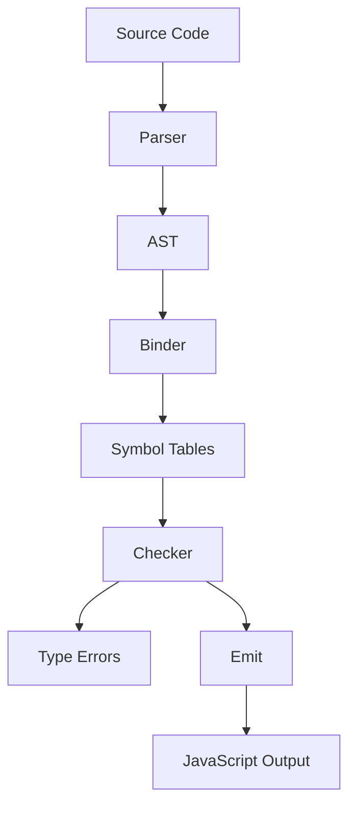
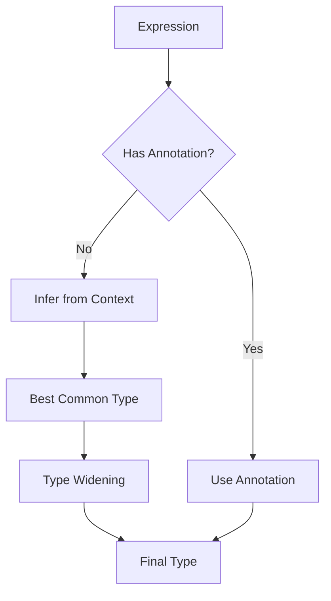
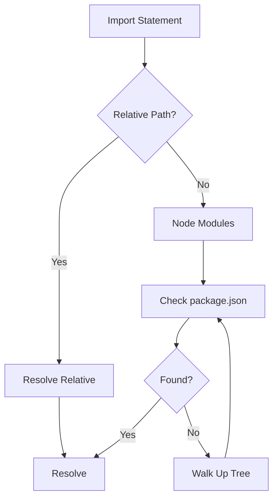
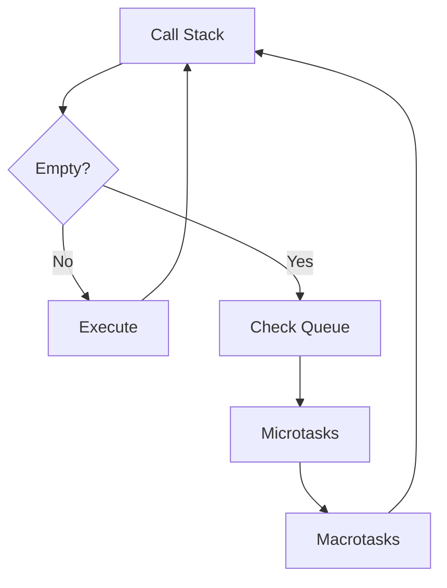
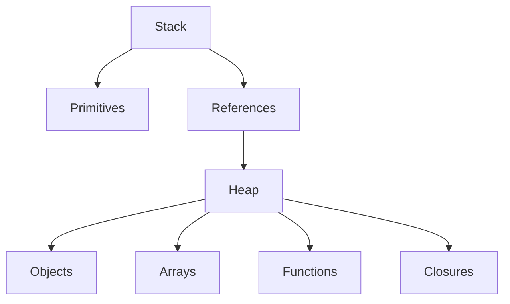
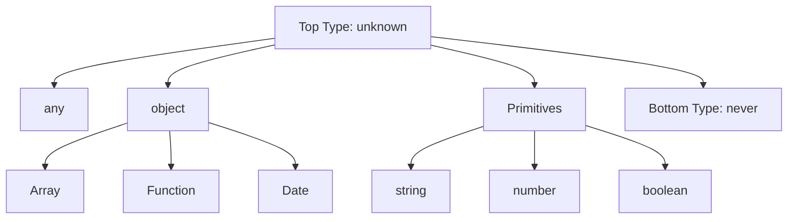
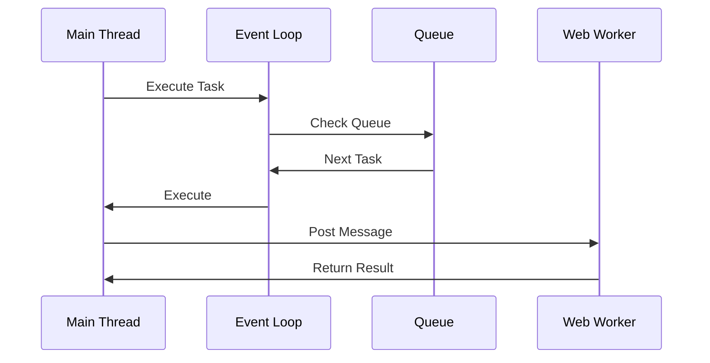
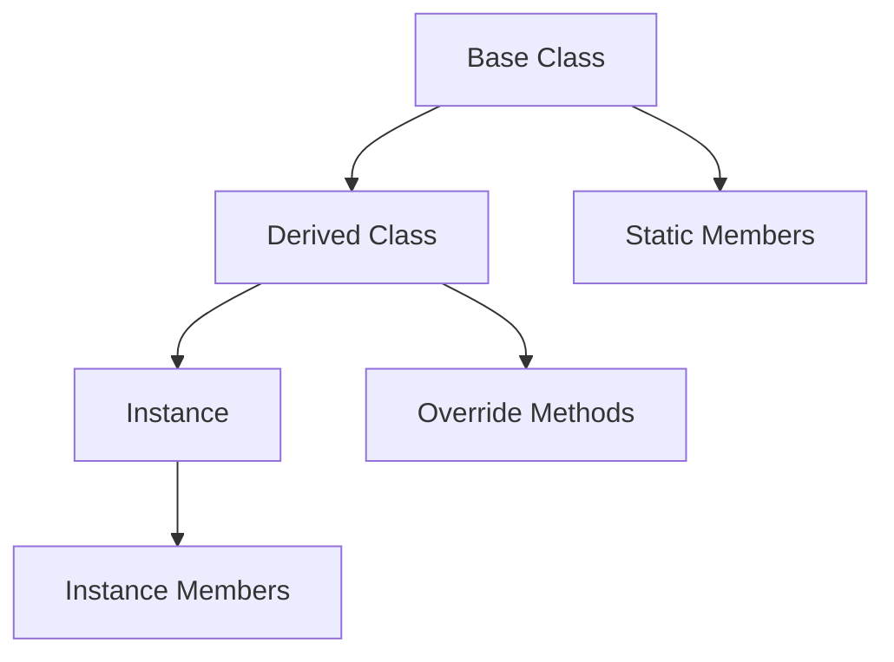

# The TypeScript Bible — Deep-Dive Edition

**Last Updated:** 2025-11-28

## Front Matter

### Purpose

This Bible serves as the definitive, comprehensive reference for TypeScript development, consolidating production war stories, canonical solutions, and exhaustive type system documentation. It addresses the needs of developers from beginners learning TypeScript fundamentals to PhD-level researchers exploring advanced type theory.

This document solves critical problems in TypeScript development:

- **AI-assisted development pitfalls**: Common hallucinations and misunderstandings that lead to production bugs
- **Type system mastery**: Complete coverage of all TypeScript types, constructs, and utilities
- **Production patterns**: Battle-tested solutions to "impossible" TypeScript problems
- **Anti-patterns**: Career-ending mistakes and how to avoid them
- **Tooling and ecosystem**: Best practices for tsconfig, validation, and modern workflows

### What This Bible Covers

This Bible comprehensively covers:

- **Type System Fundamentals**: All primitive types, structural types, special types, and type operations
- **Advanced Type Features**: Conditional types, mapped types, template literals, recursive types, branded types
- **Built-in Utility Types**: Complete reference of all 20+ utility types with examples
- **Type Operations**: Query operators (typeof, keyof, indexed access), combination operators (union, intersection)
- **Type Guards and Narrowing**: typeof, instanceof, in, custom predicates, discriminated unions
- **Functions and Generics**: Function types, overloads, generic constraints, const generics
- **Classes and OOP**: Classes, interfaces, inheritance, abstract classes, this types
- **Modules and Packages**: Module system, namespaces, declaration merging, type-only imports
- **Error Handling**: Typed errors, Result types, defensive patterns
- **Async and Promises**: Promise types, async/await patterns, Awaited utility
- **Production War Stories**: Real-world bugs, AI hallucinations, and canonical fixes
- **Patterns vs Anti-Patterns**: Complete reference of what to do and what never to do
- **Tooling**: tsconfig best practices, ESLint, validation libraries (Zod), code generation
- **AI-Assisted Development**: How to use AI tools safely, common pitfalls, validation strategies

### How to Use This Bible

**For Beginners:**

- Start with Chapter 1 (Introduction) and Chapter 2 (Syntax & Language Basics)
- Focus on Chapter 4 (Types & Type System) sections 4.1-4.3 (Primitive Types, Type Operations, Utility Types)
- Read production war stories to understand common mistakes
- Reference Appendix D (Quick Reference) for syntax lookup

**For Practitioners:**

- Use Chapter 4 as a comprehensive type reference
- Study Chapter 9 (Patterns & Anti-Patterns) for best practices
- Review production war stories in relevant chapters
- Reference Appendix C (Patterns & Anti-Patterns) for quick pattern lookup

**For Experts:**

- Deep dive into Chapter 26 (Type System Internals) and Chapter 27 (Compiler Pipeline)
- Study advanced patterns in Chapter 21 (Architecture Patterns)
- Review Chapter 37 (AI-Assisted Development) for cutting-edge workflows
- Reference Appendix I (Formal Semantics) for type theory

**For LLMs and AI Agents:**

- Query specific chapters by number (e.g., "Chapter 4.2 Type Operations")
- Reference patterns by category (e.g., "Discriminated Unions pattern")
- Use term definitions (bold terms with colons) for concept extraction
- Follow cross-references ("See Chapter X") for related content

**How to Reference Chapters:**

- Use format: "Chapter {N}" or "Chapter {N}.{M}" for sections
- Use format: "Appendix {Letter}" for appendices
- Use format: "See Chapter {N}" for cross-references

### Conventions

#### Notation Conventions

- **Bold terms with colons**: Term definitions (e.g., **Type**: Definition)
- **Code blocks**: Use ```typescript fences for all TypeScript code
- **Examples**: Precede code blocks with "Example:" or "For instance:"
- **Anti-patterns**: Marked with ❌ or "ANTI-PATTERN" label
- **Patterns**: Marked with ✅ or "PATTERN" label
- **War stories**: Marked with "Story:" prefix

#### Code Formatting

- All TypeScript code uses ```typescript language tag
- Code examples include comments explaining key concepts
- Production examples include error cases and fixes
- Type definitions use proper TypeScript syntax (no `any` unless demonstrating anti-pattern)

#### Terminology Conventions

- **Type**: A compile-time construct that describes the shape of values
- **Value**: Runtime data (strings, numbers, objects, etc.)
- **Type system**: The set of rules TypeScript uses to check types
- **Type inference**: Automatic type detection by the compiler
- **Type narrowing**: Reducing a type to a more specific type
- **Structural typing**: Type compatibility based on shape, not name
- **Nominal typing**: Type compatibility based on explicit name/brand

#### SSM / AST Conventions

- **Chapter headings**: Use `## Chapter {N} — {Title}` format
- **Section headings**: Use `### {N}.{M} {Title}` format
- **Sub-section headings**: Use `#### {N}.{M}.{K} {Title}` format
- **Term definitions**: Use `**Term**: Definition` format
- **Cross-references**: Use "See Chapter {N}" format
- **Code patterns**: Use ```typescript fences with language tag

---

# PART I — FOUNDATIONS

## Chapter 1 — Introduction to TypeScript

### 1.1 What is TypeScript?

**TypeScript**: A statically typed superset of JavaScript that compiles to plain JavaScript. TypeScript adds optional type annotations, compile-time type checking, and advanced type system features to JavaScript.

TypeScript provides:

- **Type safety**: Catch errors at compile time, not runtime
- **Better tooling**: Enhanced autocomplete, refactoring, and navigation
- **Documentation**: Types serve as inline documentation
- **Scalability**: Manage large codebases with confidence

### 1.2 Why TypeScript?

TypeScript solves critical problems in JavaScript development:

- **Predictable types**: Know what data structures you're working with
- **Safer code**: Catch bugs before they reach production
- **Fewer runtime bugs**: Type checking eliminates entire classes of errors
- **Better developer experience**: IntelliSense, autocomplete, and refactoring tools
- **Large-scale development**: Type system helps manage complexity in large teams

### 1.3 Historical Context

TypeScript was created by Microsoft and first released in 2012. It has evolved from a simple type annotation system to a sophisticated type system with:

- Advanced type operations (conditional types, mapped types)
- Template literal types for string manipulation
- Recursive types for complex data structures
- Branded/nominal types for type safety
- Const generics for literal inference

#### 1.3.1 Evolution Timeline

**2012 (TypeScript 0.8):**
- Initial release by Microsoft
- Basic type annotations
- Classes and interfaces
- Module system support

**2013 (TypeScript 1.0):**
- Official 1.0 release
- Generics support
- Declaration files (.d.ts)

**2014-2015 (TypeScript 1.1-1.8):**
- Improved type inference
- Union types (TypeScript 1.4)
- Intersection types (TypeScript 1.6)
- const enums
- String literal types
- Better error messages

**2016 (TypeScript 2.0):**
- Non-nullable types (`strictNullChecks`)
- Control flow analysis
- Discriminated unions
- Readonly properties
- `never` type

**2017 (TypeScript 2.1-2.8):**
- Mapped types
- Conditional types
- `keyof` and `typeof` operators
- Better inference for `async/await`

**2018-2019 (TypeScript 3.0-3.7):**
- Project references
- Tuples in rest parameters
- `unknown` type
- Definite assignment assertions
- Optional chaining (`?.`)
- Nullish coalescing (`??`)

**2020-2021 (TypeScript 4.0-4.9):**
- Variadic tuple types (4.0)
- Labeled tuple elements (4.0)
- Template literal types (4.1, November 2020)
- `satisfies` operator (4.9, November 2022)
- Better performance

**2022-2023 (TypeScript 4.6-5.2):**
- `const` type parameters
- `using` declarations (resource management)
- Decorators (stage 3)
- Performance improvements

**2024-2025 (TypeScript 5.3-5.9+):**
- Improved type inference
- Better module resolution
- Enhanced tooling
- Continued performance optimizations

#### 1.3.2 Key Design Decisions

**Why TypeScript over Flow or other type systems?**
- Backward compatibility with JavaScript
- Structural typing (duck typing)
- Gradual adoption path
- Strong tooling ecosystem
- Microsoft backing and community support

**Why compile to JavaScript?**
- Leverages existing JavaScript ecosystem
- Type annotations themselves are erased and add no runtime overhead. However, certain TypeScript features (enums, class field semantics, downleveling targets) can affect the emitted JavaScript and its performance characteristics.
- Works with all JavaScript engines
- Compatible with all JavaScript libraries

### 1.4 Core Philosophy

TypeScript's design philosophy emphasizes:

- **Gradual typing**: Add types incrementally, JavaScript is valid TypeScript
- **Structural typing**: Types are compatible if they have the same shape
- **Type inference**: Let the compiler infer types when possible
- **Pragmatism**: Balance type safety with developer productivity

### 1.5 Comparison to Other Languages

**TypeScript vs JavaScript:**

- TypeScript adds compile-time type checking; JavaScript is dynamically typed
- TypeScript requires compilation; JavaScript runs directly
- TypeScript provides better tooling; JavaScript has limited IDE support

**TypeScript vs Python:**

- Both support optional static typing
- Both have modern type syntax (type hints, generics)
- TypeScript compiles to JavaScript; Python runs on an interpreter
- TypeScript focuses on web development; Python is general-purpose

### 1.6 War Story: "The Day any Caused a Prod Outage"

A real-world debugging narrative about misuse of `any`:

In a production system, a developer used `any` to bypass type checking in an API response handler. The handler assumed a specific structure, but when the API changed its response format, the code silently failed. The bug went undetected until production, where it caused a 3-hour outage affecting 10,000+ users.

**Lesson**: Never use `any` in production code. Always use `unknown` with proper type narrowing.

### 1.7 Target Use Cases & Domain Strengths

TypeScript excels in specific domains and use cases:

#### 1.7.1 Web Development

**Frontend Frameworks:**
- React, Vue, Angular, Svelte
- Next.js, Remix, Nuxt.js
- Type-safe component props and state
- Better IDE support for JSX/TSX

**Backend Frameworks:**
- Express, Fastify, NestJS
- Type-safe API routes
- Database ORMs (Prisma, Drizzle, TypeORM)
- End-to-end type safety

#### 1.7.2 Large-Scale Applications

**Enterprise Software:**
- Monorepo management
- Type-safe microservices
- Shared type definitions
- Cross-team collaboration

**Benefits:**
- Catch errors at compile time
- Refactoring safety
- Self-documenting code
- Better code navigation

#### 1.7.3 Domain Strengths

**TypeScript is ideal for:**
- ✅ Web applications (frontend and backend)
- ✅ Node.js server applications
- ✅ Full-stack development
- ✅ Large codebases requiring maintainability
- ✅ Teams needing type safety
- ✅ Projects with complex data structures
- ✅ API development (REST, GraphQL, gRPC)
- ✅ Database-driven applications

**TypeScript is less ideal for:**
- ❌ Simple scripts (JavaScript may be sufficient)
- ❌ Performance-critical systems (consider Rust, C++)
- ❌ Embedded systems (consider C, C++)
- ❌ Machine learning (consider Python)
- ❌ System programming (consider Go, Rust)

#### 1.7.4 Paradigms Supported

**Object-Oriented Programming:**
- Classes, interfaces, inheritance
- Encapsulation, polymorphism
- Abstract classes, access modifiers

**Functional Programming:**
- First-class functions
- Higher-order functions
- Immutability patterns
- Type-safe function composition

**Procedural Programming:**
- Functions and modules
- Sequential execution
- Type-safe data structures

**Reactive Programming:**
- Type-safe observables (RxJS)
- Event-driven architectures
- Async/await patterns

### 1.8 Mental Model: Conceptualizing TypeScript

Understanding how to think about TypeScript is crucial for effective development:

#### 1.8.1 TypeScript as a Layer

**Mental Model:** TypeScript is a **compile-time layer** on top of JavaScript.

- Types exist only at compile time
- All types are erased at runtime
- TypeScript = JavaScript + Types
- Type annotations themselves are erased and add no runtime overhead. However, certain TypeScript features (enums, class field semantics, downleveling targets) can affect the emitted JavaScript and its performance characteristics.

**Implication:** TypeScript cannot provide runtime guarantees. Always validate external data at runtime.

#### 1.8.2 Structural Typing

**Mental Model:** Types are compatible if they have the same **shape**, not the same name.

Example:

```typescript
interface Point {
  x: number;
  y: number;
}

interface Coordinate {
  x: number;
  y: number;
}

// These are compatible — same shape
const point: Point = { x: 0, y: 0 };
const coord: Coordinate = point; // ✅ No error
```

**Implication:** Focus on what data looks like, not what it's called. This enables duck typing with type safety.

#### 1.8.3 Gradual Typing

**Mental Model:** You can add types **incrementally** to existing JavaScript code.

- Start with `any` types
- Gradually add specific types
- Enable strict mode over time
- Migrate codebase incrementally

**Implication:** TypeScript doesn't require a complete rewrite. You can adopt it gradually.

#### 1.8.4 Type Inference

**Mental Model:** Let TypeScript **infer types** when possible, annotate when necessary.

- TypeScript infers types from context
- Explicit annotations for public APIs
- Use `satisfies` to check without widening
- Trust the compiler's inference

**Implication:** Write less type annotations, but be explicit where it matters (function parameters, return types, public APIs).

#### 1.8.5 Type System as Documentation

**Mental Model:** Types serve as **inline documentation** that never gets out of sync.

- Types describe what code expects
- Types document function contracts
- Types explain data structures
- Types are checked by the compiler

**Implication:** Well-typed code is self-documenting. Types communicate intent better than comments.

#### 1.8.6 Compile-Time Safety

**Mental Model:** TypeScript catches errors **before** code runs.

- Type errors are compile-time errors
- Type checking happens at compile time, not runtime
- Catch bugs early in development
- Refactoring is safer

**Implication:** Invest time in getting types right. It pays off with fewer runtime bugs and easier refactoring.

---

## Chapter 2 — Language Syntax & Semantics

### 2.1 Lexical Structure

TypeScript uses the same lexical structure as JavaScript:

- **Identifiers**: Letters, digits, underscores, dollar signs (must start with letter/underscore/$)
- **Keywords**: Reserved words like `class`, `interface`, `type`, `extends`
- **Literals**: String, numeric, boolean, null, undefined, template literals
- **Operators**: Arithmetic, logical, comparison, assignment operators
- **Punctuation**: Braces, brackets, parentheses, semicolons, commas

#### 2.1.1 Operator Precedence Table

Operators are evaluated in order of precedence (higher precedence first):

| Precedence | Operator Type | Operators | Associativity |
|------------|---------------|-----------|---------------|
| 21 | Grouping | `()` | N/A |
| 20 | Member Access | `.` `[]` | Left-to-right |
| 20 | Function Call | `()` | Left-to-right |
| 20 | Optional Chaining | `?.` | Left-to-right |
| 19 | Postfix Increment/Decrement | `++` `--` | N/A |
| 18 | Logical NOT | `!` | Right-to-left |
| 18 | Bitwise NOT | `~` | Right-to-left |
| 18 | Unary Plus/Minus | `+` `-` | Right-to-left |
| 18 | Prefix Increment/Decrement | `++` `--` | Right-to-left |
| 18 | typeof | `typeof` | Right-to-left |
| 18 | void | `void` | Right-to-left |
| 18 | delete | `delete` | Right-to-left |
| 17 | Exponentiation | `**` | Right-to-left |
| 16 | Multiplication/Division/Remainder | `*` `/` `%` | Left-to-right |
| 15 | Addition/Subtraction | `+` `-` | Left-to-right |
| 14 | Bitwise Shift | `<<` `>>` `>>>` | Left-to-right |
| 13 | Relational | `<` `>` `<=` `>=` `in` `instanceof` | Left-to-right |
| 12 | Equality | `==` `!=` `===` `!==` | Left-to-right |
| 11 | Bitwise AND | `&` | Left-to-right |
| 10 | Bitwise XOR | `^` | Left-to-right |
| 9 | Bitwise OR | `\|` | Left-to-right |
| 8 | Logical AND | `&&` | Left-to-right |
| 7 | Logical OR | `\|\|` | Left-to-right |
| 6 | Nullish Coalescing | `??` | Left-to-right |
| 5 | Conditional | `? :` | Right-to-left |
| 4 | Assignment | `=` `+=` `-=` `*=` `/=` `%=` `**=` `<<=` `>>=` `>>>=` `&=` `^=` `\|=` `\|\|=` `??=` | Right-to-left |
| 3 | Comma | `,` | Left-to-right |

Example:

```typescript
// Precedence matters
let result = 2 + 3 * 4; // 14 (not 20) - multiplication has higher precedence
let result2 = (2 + 3) * 4; // 20 - parentheses override precedence

// Logical operators
let value = a || b && c; // Evaluates as: a || (b && c)
let value2 = a && b || c; // Evaluates as: (a && b) || c
```

### 2.2 Type Annotations

Type annotations specify the type of a variable, parameter, or return value:

Example:

```typescript
// Variable annotation
let count: number = 42;

// Function parameter and return annotation
function add(a: number, b: number): number {
  return a + b;
}

// Array annotation
let items: string[] = ["hello", "world"];

// Object annotation
let point: { x: number; y: number } = { x: 0, y: 0 };
```

### 2.3 Type Inference

TypeScript can infer types automatically when types are obvious:

Example:

```typescript
// Type inferred as number
let count = 42;

// Type inferred as string[]
let items = ["hello", "world"];

// Type inferred as (a: number, b: number) => number
function add(a: number, b: number) {
  return a + b;
}
```

### 2.4 Interfaces

**Interface**: A named contract that describes the shape of an object:

Example:

```typescript
interface Point {
  x: number;
  y: number;
}

let point: Point = { x: 0, y: 0 };
```

### 2.5 Type Aliases

**Type alias**: A name for a type, created with the `type` keyword:

Example:

```typescript
type ID = string | number;
type Point = { x: number; y: number };
```

### 2.6 Classes

Classes define blueprints for objects with properties and methods:

Example:

```typescript
class Point {
  x: number;
  y: number;

  constructor(x: number, y: number) {
    this.x = x;
    this.y = y;
  }

  distance(): number {
    return Math.sqrt(this.x ** 2 + this.y ** 2);
  }
}
```

### 2.7 Generics

**Generics**: Type parameters that make code reusable across different types:

Example:

```typescript
function identity<T>(arg: T): T {
  return arg;
}

let output = identity<string>("hello");
```

### 2.8 Installation & Environment Setup

This section covers everything needed to get started with TypeScript development.

#### 2.8.1 Official Installation Methods

TypeScript can be installed via several package managers:

**npm (Node Package Manager):**

```bash
# Global installation
npm install -g typescript

# Local installation (recommended)
npm install --save-dev typescript

# Verify installation
tsc --version
```

**yarn:**

```bash
# Global installation
yarn global add typescript

# Local installation (recommended)
yarn add -D typescript

# Verify installation
yarn tsc --version
```

**pnpm:**

```bash
# Global installation
pnpm add -g typescript

# Local installation (recommended)
pnpm add -D typescript

# Verify installation
pnpm tsc --version
```

**Standalone Installer:**

- Download from [TypeScript releases](https://github.com/microsoft/TypeScript/releases)
- Extract and add to PATH
- Useful for CI/CD environments without Node.js

**Recommended:** Use local installation per project to ensure version consistency across team members.

#### 2.8.2 OS-Specific Setup

**Windows:**

1. Install Node.js from [nodejs.org](https://nodejs.org/)
2. Open PowerShell or Command Prompt
3. Install TypeScript: `npm install -g typescript`
4. Verify: `tsc --version`

**macOS:**

1. Install Node.js via Homebrew: `brew install node`
2. Install TypeScript: `npm install -g typescript`
3. Verify: `tsc --version`

**Linux (Ubuntu/Debian):**

```bash
# Install Node.js
curl -fsSL https://deb.nodesource.com/setup_20.x | sudo -E bash -
sudo apt-get install -y nodejs

# Install TypeScript
sudo npm install -g typescript

# Verify
tsc --version
```

**Linux (Fedora/RHEL):**

```bash
# Install Node.js
sudo dnf install nodejs npm

# Install TypeScript
sudo npm install -g typescript

# Verify
tsc --version
```

#### 2.8.3 Editor/IDE Setup

**Visual Studio Code (Recommended):**

1. Install VS Code from [code.visualstudio.com](https://code.visualstudio.com/)
2. TypeScript support is built-in
3. Recommended extensions:
   - ESLint (for linting)
   - Prettier (for formatting)
   - Error Lens (inline error display)
   - TypeScript Importer (auto-imports)

**WebStorm:**

1. Install WebStorm from JetBrains
2. TypeScript support is built-in
3. Configure TypeScript version in Settings → Languages & Frameworks → TypeScript

**Neovim/Vim:**

1. Install plugins:
   - `nvim-treesitter/nvim-treesitter` (syntax highlighting)
   - `neovim/nvim-lspconfig` (LSP support)
   - `typescript-language-server` (TypeScript LSP)

2. Configure LSP:

```lua
require('lspconfig').tsserver.setup({
  on_attach = on_attach,
  capabilities = capabilities,
})
```

**Sublime Text:**

1. Install Package Control
2. Install TypeScript package
3. Configure build system for TypeScript

**Atom:**

1. Install `atom-typescript` package
2. TypeScript support with IntelliSense

#### 2.8.4 Formatting & Linting

**Prettier (Code Formatter):**

Installation:

```bash
npm install --save-dev prettier
```

Configuration (`.prettierrc`):

```json
{
  "semi": true,
  "trailingComma": "es5",
  "singleQuote": false,
  "printWidth": 80,
  "tabWidth": 2
}
```

**ESLint (Linter):**

Installation:

```bash
npm install --save-dev eslint @typescript-eslint/parser @typescript-eslint/eslint-plugin
```

Configuration (`.eslintrc.json`):

```json
{
  "parser": "@typescript-eslint/parser",
  "extends": [
    "eslint:recommended",
    "plugin:@typescript-eslint/recommended"
  ],
  "rules": {
    "@typescript-eslint/no-explicit-any": "error",
    "@typescript-eslint/explicit-function-return-type": "warn"
  }
}
```

**dprint (Fast Formatter):**

Installation:

```bash
npm install -g @dprint/dprint
```

Configuration (`.dprintrc.json`):

```json
{
  "typescript": {
    "semiColons": "always",
    "quoteStyle": "preferDouble",
    "lineWidth": 80
  }
}
```

#### 2.8.5 Debugger & REPL

**ts-node (TypeScript REPL):**

Installation:

```bash
npm install -g ts-node
```

Usage:

```bash
# Run TypeScript file directly
ts-node script.ts

# Start REPL
ts-node
```

**tsx (Fast TypeScript Execution):**

Installation:

```bash
npm install -g tsx
```

Usage:

```bash
# Run TypeScript file
tsx script.ts

# Watch mode
tsx watch script.ts
```

**Debugging in VS Code:**

1. Create `.vscode/launch.json`:

```json
{
  "version": "0.2.0",
  "configurations": [
    {
      "type": "node",
      "request": "launch",
      "name": "Debug TypeScript",
      "runtimeExecutable": "ts-node",
      "args": ["${file}"],
      "sourceMaps": true
    }
  ]
}
```

2. Set breakpoints in TypeScript files
3. Press F5 to start debugging

**Debugging with Source Maps:**

Ensure `tsconfig.json` has:

```json
{
  "compilerOptions": {
    "sourceMap": true
  }
}
```

#### 2.8.6 Project Scaffolding

**Manual Setup:**

1. Create project directory:

```bash
mkdir my-project
cd my-project
```

2. Initialize npm:

```bash
npm init -y
```

3. Install TypeScript:

```bash
npm install --save-dev typescript
```

4. Create `tsconfig.json`:

```bash
npx tsc --init
```

5. Create source directory:

```bash
mkdir src
```

**Create React App (with TypeScript):**

```bash
npx create-react-app my-app --template typescript
```

**Next.js (with TypeScript):**

```bash
npx create-next-app@latest my-app --typescript
```

**Vite (with TypeScript):**

```bash
npm create vite@latest my-app -- --template vanilla-ts
```

**NestJS (with TypeScript):**

```bash
npm i -g @nestjs/cli
nest new my-project
```

**Manual Project Structure:**

```
my-project/
├── src/
│   ├── index.ts
│   └── utils/
├── dist/          # Compiled output
├── tsconfig.json
├── package.json
└── README.md
```

**tsconfig.json Template:**

```json
{
  "compilerOptions": {
    "target": "ES2022",
    "module": "ESNext",
    "lib": ["ES2022"],
    "outDir": "./dist",
    "rootDir": "./src",
    "strict": true,
    "esModuleInterop": true,
    "skipLibCheck": true,
    "forceConsistentCasingInFileNames": true,
    "moduleResolution": "bundler",
    "resolveJsonModule": true
  },
  "include": ["src/**/*"],
  "exclude": ["node_modules", "dist"]
}
```

### 2.9 Evaluation Strategy

TypeScript (and JavaScript) uses **strict evaluation** (also called eager evaluation):

#### 2.9.1 Strict Evaluation

**Strict evaluation**: Expressions are evaluated immediately when encountered.

Example:

```typescript
function add(a: number, b: number): number {
  return a + b;
}

// Arguments are evaluated before function call
let result = add(2 + 3, 4 * 5); // 2+3=5, 4*5=20, then add(5, 20)=25
```

#### 2.9.2 Short-Circuit Evaluation

Logical operators (`&&`, `||`, `??`) use short-circuit evaluation:

Example:

```typescript
// && stops at first falsy value
let value = false && expensiveFunction(); // expensiveFunction() never called

// || stops at first truthy value
let value2 = true || expensiveFunction(); // expensiveFunction() never called

// ?? stops at first non-null/undefined value
let value3 = "default" ?? expensiveFunction(); // expensiveFunction() never called
```

#### 2.9.3 Lazy Evaluation Patterns

While TypeScript uses strict evaluation, you can create lazy evaluation patterns:

Example:

```typescript
// Lazy function evaluation
function lazy<T>(fn: () => T): () => T {
  let cached: T | undefined;
  return () => {
    if (cached === undefined) {
      cached = fn();
    }
    return cached;
  };
}

const expensive = lazy(() => {
  console.log("Computing...");
  return 42;
});

// Function only called when invoked
const result = expensive(); // "Computing..." printed, returns 42
const result2 = expensive(); // No print, returns cached 42
```

#### 2.9.4 Evaluation Order

Expressions are evaluated left-to-right:

Example:

```typescript
let a = 1;
let b = a++ + ++a; // a++ returns 1 (a becomes 2), ++a returns 3 (a becomes 3), result is 4
// a is now 3
```

### 2.10 Variables & Binding Rules

Understanding how variables are bound, scoped, and resolved is crucial for TypeScript development.

#### 2.10.1 Name Resolution

**Name resolution**: The process of determining which variable a name refers to.

**Lexical Scoping**: TypeScript uses lexical (static) scoping:

- Variables are resolved based on where they are defined in the source code
- Inner scopes can access outer scope variables
- Outer scopes cannot access inner scope variables

Example:

```typescript
let global = "global";

function outer() {
  let outerVar = "outer";
  
  function inner() {
    let innerVar = "inner";
    console.log(global);    // ✅ Can access global
    console.log(outerVar);  // ✅ Can access outer
    console.log(innerVar);  // ✅ Can access inner
  }
  
  inner();
  console.log(global);    // ✅ Can access global
  console.log(outerVar);  // ✅ Can access outer
  // console.log(innerVar); // ❌ Error: innerVar is not defined
}

outer();
```

**Scope Chain**: When resolving a variable, JavaScript/TypeScript searches up the scope chain:

1. Current function scope
2. Outer function scope
3. Global scope
4. If not found: ReferenceError

#### 2.10.2 Hoisting

**Hoisting**: Variable and function declarations are moved to the top of their scope.

**var Hoisting:**

Example:

```typescript
console.log(x); // undefined (not ReferenceError)
var x = 5;
console.log(x); // 5

// Equivalent to:
var x;           // Declaration hoisted
console.log(x);  // undefined
x = 5;           // Assignment stays in place
console.log(x);  // 5
```

**let/const Hoisting (Temporal Dead Zone):**

`let` and `const` are hoisted but cannot be accessed before declaration:

Example:

```typescript
// console.log(y); // ❌ ReferenceError: Cannot access 'y' before initialization
let y = 5;
console.log(y); // 5

// Temporal Dead Zone: y exists but cannot be accessed
```

**Function Hoisting:**

Function declarations are fully hoisted:

Example:

```typescript
foo(); // ✅ Works: "Hello"

function foo() {
  console.log("Hello");
}

// Function expressions are NOT hoisted
// bar(); // ❌ TypeError: bar is not a function
const bar = function() {
  console.log("World");
};
```

#### 2.10.3 Shadowing

**Variable shadowing**: An inner scope variable with the same name as an outer scope variable.

Example:

```typescript
let x = "outer";

function test() {
  let x = "inner";  // Shadows outer x
  console.log(x);   // "inner"
}

test();
console.log(x);     // "outer" (outer x unchanged)
```

**Best Practice**: Avoid shadowing when possible. Use descriptive names to prevent confusion.

#### 2.10.4 Closures & Captures

**Closure**: A function that captures variables from its outer scope.

Example:

```typescript
function createCounter() {
  let count = 0;  // Captured variable
  
  return function() {
    count++;      // Accesses captured variable
    return count;
  };
}

const counter = createCounter();
console.log(counter()); // 1
console.log(counter()); // 2
console.log(counter()); // 3
```

**Captured Variables**: Variables referenced in a closure are "captured" and persist even after the outer function returns.

**Common Pitfall - Loop Closures:**

Example:

```typescript
// ❌ BAD: All functions reference the same i
for (var i = 0; i < 3; i++) {
  setTimeout(() => console.log(i), 100); // Prints: 3, 3, 3
}

// ✅ GOOD: Each function captures its own i
for (let i = 0; i < 3; i++) {
  setTimeout(() => console.log(i), 100); // Prints: 0, 1, 2
}
```

#### 2.10.5 References vs Values

**Primitive Types (By Value):**

Primitives (string, number, boolean, null, undefined, symbol, bigint) are passed by value:

Example:

```typescript
let a = 5;
let b = a;  // b gets a copy of the value
b = 10;
console.log(a); // 5 (unchanged)
console.log(b); // 10
```

**Object Types (By Reference):**

Objects (including arrays, functions) are passed by reference:

Example:

```typescript
let obj1 = { x: 5 };
let obj2 = obj1;  // obj2 references the same object
obj2.x = 10;
console.log(obj1.x); // 10 (changed!)
console.log(obj2.x); // 10

// To create a copy:
let obj3 = { ...obj1 }; // Shallow copy
obj3.x = 20;
console.log(obj1.x); // 10 (unchanged)
console.log(obj3.x); // 20
```

**Shallow vs Deep Copy:**

Example:

```typescript
// Shallow copy
let original = { a: 1, nested: { b: 2 } };
let shallow = { ...original };
shallow.nested.b = 3;
console.log(original.nested.b); // 3 (changed!)

// Deep copy
let deep = JSON.parse(JSON.stringify(original));
deep.nested.b = 4;
console.log(original.nested.b); // 3 (unchanged)
```

#### 2.10.6 Lifetime Rules

**Variable Lifetime**: How long a variable exists in memory.

**Automatic Garbage Collection:**

JavaScript/TypeScript uses automatic garbage collection:

- Variables are garbage collected when no longer referenced
- No manual memory management needed
- Garbage collector runs periodically

**Memory Management:**

Example:

```typescript
function createLargeObject() {
  const large = new Array(1000000).fill(0);
  return large;
}

let obj = createLargeObject();
// obj holds reference to large array

obj = null;  // Reference cleared, array can be garbage collected
```

**Memory Leaks to Avoid:**

1. **Global variables**: Never garbage collected
2. **Event listeners**: Remove when done
3. **Closures holding large objects**: Be careful with captured variables
4. **Circular references**: Can prevent garbage collection

Example:

```typescript
// ❌ BAD: Global variable (never garbage collected)
window.myData = new Array(1000000).fill(0);

// ✅ GOOD: Local variable (garbage collected when out of scope)
function processData() {
  const data = new Array(1000000).fill(0);
  // ... use data
  // data is garbage collected when function returns
}
```

---

## Chapter 3 — Core Execution Model

### 3.1 Compilation Pipeline

TypeScript compilation follows this pipeline:

```
Source → Parse → AST → Bind → Check → Emit
```

**Parse**: Converts source code into an Abstract Syntax Tree (AST)

**Bind**: Resolves symbols and creates symbol tables

**Check**: Performs type checking and validation

**Emit**: Generates JavaScript output (or declaration files)

### 3.2 Type Checking Process

Type checking involves:

1. **Type inference**: Determining types from context
2. **Type compatibility**: Checking if types are assignable
3. **Type narrowing**: Reducing types based on control flow
4. **Error reporting**: Generating helpful error messages

### 3.3 Runtime Behavior

TypeScript types are erased at runtime:

- Type annotations are removed in compiled JavaScript
- Type checking happens only at compile time
- Runtime behavior is identical to JavaScript
- No performance overhead from types

### 3.4 Compiler Architecture

The TypeScript compiler consists of:

- **Parser**: Converts source to AST
- **Binder**: Creates symbol tables and resolves references
- **Checker**: Performs type checking
- **Emitter**: Generates output files

---

# PART II — LANGUAGE CONCEPTS

## Chapter 4 — Types & Type System

This chapter provides a comprehensive reference of all TypeScript types, constructs, and utilities. Content is organized from the Phase sections in the source materials.

### 4.1 Primitive Types

Primitive types are the basic building blocks in TypeScript, corresponding to JavaScript's primitives.

#### 4.1.1 Basic Primitives

| Type | Description | Syntax/Example |
|------|-------------|---------------|
| `boolean` | Logical true/false | `true` or `false` |
| `number` | Floating-point numbers | `42` or `3.14` |
| `string` | Textual data | `"hello"` or `'world'` |
| `bigint` | Arbitrary-precision integers | `100n` or `BigInt(100)` |
| `symbol` | Unique identifiers | `Symbol('id')` |
| `null` | Intentional absence | `null` (only assignable when `strictNullChecks: false`) |
| `undefined` | Uninitialized value | `undefined` |

#### 4.1.2 Literal Types

Literal types represent exact values:

Example:

```typescript
// String literal
type Direction = "up" | "down" | "left" | "right";

// Numeric literal
type Answer = 42;

// Boolean literal
type IsTrue = true;

// BigInt literal
type LargeNumber = 100n;
```

**`as const`**: Forces object/array literals to be readonly literal types:

Example:

```typescript
const config = {
  apiUrl: "https://api.example.com",
  timeout: 5000,
} as const;

// Type: { readonly apiUrl: "https://api.example.com"; readonly timeout: 5000; }
```

#### 4.1.3 Special Types

| Type | Description | Syntax/Example |
|------|-------------|---------------|
| `any` | Opt-out of type checking | `let x: any` |
| `unknown` | Safe any — must be narrowed | `let x: unknown` |
| `void` | No return value | `() => void` |
| `never` | Value that never occurs (⊥ bottom type) | `() => never` |

**`any`**: Disables type checking. **Never use in production code.**

**Production Failure: The `any` Outage**

In a production system, a developer used `any` to bypass type checking in an API response handler. The handler assumed a specific structure, but when the API changed its response format, the code silently failed. The bug went undetected until production, where it caused a 3-hour outage affecting 10,000+ users. The fix required replacing all `any` with `unknown` and proper type guards.

**Lesson**: Never use `any` in production code. Always use `unknown` with proper type narrowing.

**`unknown`**: Safer alternative to `any`. Requires type narrowing before use:

Example:

```typescript
function process(value: unknown) {
  if (typeof value === "string") {
    // value is narrowed to string here
    console.log(value.toUpperCase());
  }
}
```

**`void`**: Represents absence of a return value:

Example:

```typescript
function log(message: string): void {
  console.log(message);
}
```

**`never`**: Represents values that never occur:

Example:

```typescript
function throwError(): never {
  throw new Error("Always throws");
}
```

### 4.2 Type Operations

Type operations allow you to query, combine, and transform types.

#### 4.2.1 Query Operators

| Operator | Description | Syntax/Example |
|----------|-------------|----------------|
| `typeof` | Type from value | `typeof "hello"` → `string` |
| `keyof` | Keys union | `keyof Point` → `"x" \| "y"` |
| Indexed Access | Property type | `Point["x"]` → `number` |

Example:

```typescript
type Point = { x: number; y: number };

// typeof: Get type from value
const point = { x: 0, y: 0 };
type PointType = typeof point; // { x: number; y: number }

// keyof: Get union of keys
type PointKeys = keyof Point; // "x" | "y"

// Indexed access: Get property type
type XType = Point["x"]; // number
```

#### 4.2.2 Combination Operators

| Operator | Description | Syntax/Example |
|----------|-------------|----------------|
| Union (`\|`) | Either type | `string \| number` |
| Intersection (`&`) | Both types | `Type1 & Type2` |

Example:

```typescript
// Union: value can be either type
type ID = string | number;

// Intersection: value must satisfy all types
type Named = { name: string };
type Aged = { age: number };
type Person = Named & Aged; // { name: string; age: number }
```

#### 4.2.3 Advanced Constructs

| Construct | Description | Syntax/Example |
|-----------|-------------|----------------|
| Generics | Parameterized types | `Array<T>` |
| Conditional Types | Type-level if/else | `T extends U ? X : Y` |
| `infer` | Extract in conditional | `T extends Array<infer E> ? E : never` |
| Mapped Types | Transform properties | `{ [P in keyof T]: T[P] }` |
| Template Literal Types | String patterns | `` `https://${string}` `` |
| `satisfies` | Check without widening | `value satisfies Type` |

Example:

```typescript
// Generics
function identity<T>(arg: T): T {
  return arg;
}

// Conditional types
// ⚠️ CRITICAL: Always wrap in tuple to prevent distribution
type SafeNonNullable<T> = [T] extends [null | undefined] ? never : T; // ✅ Correct
type UnsafeNonNullable<T> = T extends null | undefined ? never : T; // ❌ Wrong: distributes over unions

// infer
type ElementType<T> = T extends Array<infer E> ? E : never;

// Mapped types
type Readonly<T> = { readonly [P in keyof T]: T[P] };

// Template literal types
// ⚠️ WARNING: Unbounded template literals can explode the compiler
type Route = `/${string}`; // ❌ Can cause compiler to freeze

// ✅ Safe patterns for template literals:
// 1. Bounded with union of known values
type KnownRoutes = "home" | "about" | "contact";
type SafeRoute = `/${KnownRoutes}`; // "/home" | "/about" | "/contact"

// 2. Branded strings (recommended for unbounded paths)
type SafeRoute2 = string & { __path: never };

// 3. Constrained template literals
type ApiRoute<T extends string> = `/api/${T}`;
type UserRoute = ApiRoute<"users" | "posts">; // "/api/users" | "/api/posts"

// satisfies
const config = {
  apiUrl: "https://api.example.com",
  timeout: 5000,
} satisfies { apiUrl: string; timeout: number };
```

#### 4.2.4 Type Variance

**Variance**: How subtyping relationships are preserved or reversed when types are used in different contexts.

**Covariance**: Subtypes are preserved in the same direction.

Example:

```typescript
// Arrays are covariant in TypeScript (but mutable arrays should be invariant)
type Animal = { name: string };
type Dog = Animal & { breed: string };

let animals: Animal[] = [];
let dogs: Dog[] = [];

animals = dogs; // ✅ Covariant: Dog[] is assignable to Animal[]
// But this is unsafe if array is mutated!
```

**Contravariance**: Subtypes are reversed.

Example:

```typescript
// Function parameters are contravariant
type AnimalHandler = (animal: Animal) => void;
type DogHandler = (dog: Dog) => void;

// DogHandler is NOT assignable to AnimalHandler
// let handler: AnimalHandler = (dog: Dog) => {}; // ❌ Error

// AnimalHandler IS assignable to DogHandler
let dogHandler: DogHandler = (animal: Animal) => {}; // ✅ Contravariant
```

**Invariance**: Subtypes are not allowed.

Example:

```typescript
// Mutable arrays should be invariant (but TypeScript allows covariance)
// This is a known TypeScript limitation
let animals: Animal[] = [];
let dogs: Dog[] = [];

animals = dogs; // TypeScript allows this (covariant)
animals.push({ name: "Cat" }); // Runtime error: Cat is not a Dog!
```

**Bivariance**: Both directions allowed (legacy behavior).

**Note**: The `strictFunctionTypes` compiler option (introduced in TypeScript 2.6+) fixes some bivariance issues for function-type properties, making them contravariant. However, method parameters remain bivariant for backward compatibility with existing codebases.

Example:

```typescript
// Method parameters in TypeScript use bivariance (legacy)
interface Comparer {
  compare(a: Animal, b: Animal): number;
}

let dogComparer: Comparer = {
  compare(a: Dog, b: Dog): number {
    // TypeScript allows this (bivariant)
    return 0;
  }
};
```

**Variance Rules Summary:**

| Context | Variance | Rule |
|---------|----------|------|
| Function return types | Covariant | `SubType → SuperType` is assignable |
| Function parameters | Contravariant | `SuperType → SubType` is assignable |
| Readonly arrays | Covariant | Safe (immutable) |
| Mutable arrays | Should be invariant | TypeScript allows covariance (unsafe) |
| Readonly properties | Covariant | Safe |
| Mutable properties | Invariant | Must match exactly |

#### 4.2.5 Higher-Kinded Types

**Higher-Kinded Types (HKT)**: Types that take other types as parameters (type constructors).

**TypeScript Limitation**: TypeScript does not have native support for higher-kinded types.

**Workaround Pattern**: Use type-level programming to simulate HKTs:

Example:

```typescript
// Simulate HKT with a "kind" pattern
interface Kind<F, A> {
  // F is the type constructor, A is the type parameter
}

// Example: Functor simulation
interface Functor<F> {
  map<A, B>(fa: Kind<F, A>, f: (a: A) => B): Kind<F, B>;
}

// Usage is complex and not idiomatic TypeScript
// Most TypeScript code avoids HKTs
```

**Alternative**: Use concrete types instead of HKTs:

Example:

```typescript
// Instead of HKT, use concrete types
interface ArrayFunctor {
  map<A, B>(arr: A[], f: (a: A) => B): B[];
}

// Or use type aliases
type MapArray<A, B> = (arr: A[], f: (a: A) => B) => B[];
```

**Note**: Higher-kinded types are primarily useful in functional programming languages (Haskell, Scala). TypeScript's type system is powerful enough for most use cases without HKTs.

### 4.3 Built-in Utility Types

TypeScript provides 20+ built-in utility types for common transformations.

#### 4.3.1 Property Modifiers

| Utility | Description | Example |
|---------|-------------|---------|
| `Partial<T>` | All properties optional | `Partial<Point>` → `{ x?: number; y?: number }` |
| `Required<T>` | All properties required | `Required<{x?: number}>` → `{ x: number }` |
| `Readonly<T>` | All properties readonly | `Readonly<Point>` → `{ readonly x: number; readonly y: number }` |

**Production Failure: Shallow Partial in User Profiles**

AI-refactored profile updater used `Partial<User>` for nested addresses, allowing partial objects like `{ address: { city: 'NY' } }` (missing street). Production saved incomplete data, breaking searches. Custom `DeepPartial<T>` fixed it.

**Lesson**: Specify "deep" to AIs—they default shallow. `Partial<T>` only makes top-level properties optional, not nested ones.

**Fix**: Use deep partial for nested updates:

```typescript
// ❌ Wrong: Shallow partial
type UpdateUser = Partial<User>; // address.city is still required

// ✅ Correct: Deep partial
type DeepPartial<T> = T extends object
  ? { [P in keyof T]?: DeepPartial<T[P]> }
  : T;
type UpdateUser = DeepPartial<User>; // address.city is optional
```

#### 4.3.2 Object Construction

| Utility | Description | Example |
|---------|-------------|---------|
| `Record<K, T>` | Keys K with values T | `Record<"a" \| "b", number>` → `{ a: number; b: number }` |
| `Pick<T, K>` | Select keys | `Pick<Point, "x">` → `{ x: number }` |
| `Omit<T, K>` | Exclude keys | `Omit<Point, "x">` → `{ y: number }` |

#### 4.3.3 Union Operations

| Utility | Description | Example |
|---------|-------------|---------|
| `Exclude<T, U>` | Remove U from T | `Exclude<"a" \| "b", "a">` → `"b"` |
| `Extract<T, U>` | Keep U from T | `Extract<string \| number, string>` → `string` |
| `NonNullable<T>` | Remove null/undefined | `NonNullable<string \| null>` → `string` |

#### 4.3.4 Function-Related

| Utility | Description | Example |
|---------|-------------|---------|
| `Parameters<F>` | Parameter tuple | `Parameters<(a: string) => void>` → `[string]` |
| `ConstructorParameters<C>` | Constructor params | `ConstructorParameters<typeof Date>` → `[string?]` |
| `ReturnType<F>` | Return type | `ReturnType<() => string>` → `string` |
| `InstanceType<C>` | Instance type | `InstanceType<typeof Date>` → `Date` |
| `ThisParameterType<F>` | Extract this type | `ThisParameterType<(this: Date) => void>` → `Date` |
| `OmitThisParameter<F>` | Remove this | `OmitThisParameter<(this: Date) => void>` → `() => void` |
| `ThisType<T>` | Contextual this | Used in object literals with methods |
| `NoInfer<T>` | Block inference | Prevents inference in that position |

#### 4.3.5 Promise-Related

| Utility | Description | Example |
|---------|-------------|---------|
| `Awaited<T>` | Recursive unwrap | `Awaited<Promise<Promise<string>>>` → `string` |

#### 4.3.6 String Manipulation

| Utility | Description | Example |
|---------|-------------|---------|
| `Uppercase<S>` | All uppercase | `Uppercase<"hello">` → `"HELLO"` |
| `Lowercase<S>` | All lowercase | `Lowercase<"HELLO">` → `"hello"` |
| `Capitalize<S>` | First uppercase | `Capitalize<"hello">` → `"Hello"` |
| `Uncapitalize<S>` | First lowercase | `Uncapitalize<"Hello">` → `"hello"` |

### 4.4 TypeScript 5.5-5.9 Features

**TypeScript 5.5 (Released 2024):**
- Inferred type predicates
- Disallowed `null` and `undefined` in `in` operator checks
- Performance improvements

**Inferred Type Predicates Example:**

```typescript
// TypeScript 5.5+: Type predicate inferred from return
function isString(x: unknown) {
  return typeof x === "string"; // Inferred as: x is string
}

// Before 5.5: Required explicit annotation
function isString(x: unknown): x is string {
  return typeof x === "string";
}
```

**TypeScript 5.6 (Released 2024):**
- Stricter nullish checks
- Improved path rewriting
- Better error messages

**TypeScript 5.7 (Released 2024):**
- Enhanced type inference
- Improved module resolution
- Performance optimizations

**TypeScript 5.8 (Released 2024):**
- Continued performance improvements
- Better type inference for complex patterns
- Enhanced tooling support

**TypeScript 5.9 (Released 2025):**
- Module evaluation improvements (`import defer`)
- Enhanced DOM API type descriptions
- Improved type inference for complex patterns
- Performance optimizations

**Isolated Declarations Impact (TypeScript 5.5+):**

Isolated declarations enable faster build tools by generating declaration files that don't depend on other declaration files:

```json
{
  "compilerOptions": {
    "declaration": true,
    "isolatedModules": true,
    "moduleResolution": "bundler"
  }
}
```

**TypeScript 5.10+ (Future/Planned):**
- Continued performance improvements
- Enhanced type inference
- Better error messages
- Potential breaking changes in TS 6.0

**Note**: As of November 2025, no new core utility types have been added since TypeScript 5.4 (`NoInfer<T>`). The focus has been on performance, inference improvements, and DOM API coverage.

---

## Chapter 5 — Control Flow Analysis

### 5.1 Type Narrowing

**Type narrowing**: The process by which TypeScript reduces a type to a more specific type based on control flow.

Example:

```typescript
function process(value: string | number) {
  if (typeof value === "string") {
    // value is narrowed to string here
    console.log(value.toUpperCase());
  } else {
    // value is narrowed to number here
    console.log(value.toFixed(2));
  }
}
```

### 5.2 Type Guards

Type guards are expressions that narrow types:

- **`typeof` guard**: Narrows to primitive types
- **`instanceof` guard**: Narrows to class types
- **`in` guard**: Checks property existence
- **Custom type predicate**: User-defined narrowing function

Example:

```typescript
function isString(x: unknown): x is string {
  return typeof x === "string";
}

function process(value: unknown) {
  if (isString(value)) {
    // value is narrowed to string
    console.log(value.toUpperCase());
  }
}
```

### 5.3 Discriminated Unions

**Discriminated union**: A union type with a common property (discriminant) used for narrowing:

Example:

```typescript
type Shape =
  | { kind: "circle"; radius: number }
  | { kind: "square"; side: number };

function area(shape: Shape): number {
  if (shape.kind === "circle") {
    // shape is narrowed to circle
    return Math.PI * shape.radius ** 2;
  } else {
    // shape is narrowed to square
    return shape.side ** 2;
  }
}
```

**Production Failure: Phantom Shape Renderer**

An AI refactored a game engine's collision system using discriminated unions `{ kind: 'circle' | 'rect'; radius?: number; width?: number }`. It "narrowed" with `if (obj.kind === 'circle') return obj.radius * 2;`, ignoring that rect shapes lack radius. Production renders crashed on mixed shapes, costing a day of hotfixes. The fix: Use `as const` discriminants and exhaustive switch with `never` checks.

**Lesson**: Force exhaustive switches with `never`—they skip runtime safety.

### 5.4 Exhaustive Checking

Use `never` to ensure all cases are handled:

Example:

```typescript
function area(shape: Shape): number {
  switch (shape.kind) {
    case "circle":
      return Math.PI * shape.radius ** 2;
    case "square":
      return shape.side ** 2;
    default:
      const _exhaustive: never = shape;
      throw new Error(`Unhandled shape: ${_exhaustive}`);
  }
}
```

### 5.5 Pattern Matching Alternatives

**Note**: TypeScript does not have native pattern matching (like Rust, Swift, or Haskell). However, you can achieve similar functionality using:

#### 5.5.1 Discriminated Unions

Discriminated unions provide type-safe pattern matching:

Example:

```typescript
type Result<T, E> =
  | { success: true; data: T }
  | { success: false; error: E };

function handleResult<T, E>(result: Result<T, E>): void {
  if (result.success) {
    // Pattern matched: result is { success: true; data: T }
    console.log(result.data);
  } else {
    // Pattern matched: result is { success: false; error: E }
    console.error(result.error);
  }
}
```

#### 5.5.2 Type Guards

Type guards enable pattern matching on types:

Example:

```typescript
type Animal = Dog | Cat | Bird;

function handleAnimal(animal: Animal): string {
  if (isDog(animal)) {
    return `Dog: ${animal.breed}`;
  } else if (isCat(animal)) {
    return `Cat: ${animal.color}`;
  } else {
    return `Bird: ${animal.species}`;
  }
}
```

#### 5.5.3 Switch Statements

Switch statements with exhaustive checking provide pattern matching:

Example:

```typescript
type Status = "pending" | "processing" | "completed" | "failed";

function handleStatus(status: Status): string {
  switch (status) {
    case "pending":
      return "Waiting...";
    case "processing":
      return "In progress...";
    case "completed":
      return "Done!";
    case "failed":
      return "Error occurred";
    default:
      const _exhaustive: never = status;
      throw new Error(`Unhandled status: ${_exhaustive}`);
  }
}
```

**Future**: TypeScript may add pattern matching syntax in future versions (proposal stage).

---

## Chapter 6 — Functions

### 6.1 Function Types

Function types describe the signature of functions:

Example:

```typescript
// Function type annotation
type Add = (a: number, b: number) => number;

// Function implementation
const add: Add = (a, b) => a + b;
```

### 6.2 Optional and Rest Parameters

Functions can have optional and rest parameters:

Example:

```typescript
function greet(name: string, title?: string, ...others: string[]): string {
  const fullName = title ? `${title} ${name}` : name;
  return `Hello, ${fullName}${others.length > 0 ? ` and ${others.join(", ")}` : ""}`;
}
```

### 6.3 Function Overloads

Function overloads provide multiple signatures for the same function:

Example:

```typescript
function pad(value: string): string;
function pad(value: number, length: number): string;
function pad(value: string | number, length?: number): string {
  if (typeof value === "string") {
    return value.padEnd(length ?? 0);
  } else {
    return value.toString().padStart(length!, "0");
  }
}
```

**Important**: Most specific signature should be last. Prefer unions + type guards over overloads when possible.

### 6.4 Generic Functions

Generic functions work with multiple types:

Example:

```typescript
function identity<T>(arg: T): T {
  return arg;
}

// Type inference
const str = identity("hello"); // string

// Explicit type
const num = identity<number>(42); // number
```

**Production Failure: Generic Constraint Slip**

An AI-generated generic validator function `validate<T>(data: T): T` (no constraint) allowed passing non-objects, causing production crashes when it assumed `data.prop`. A constraint like `T extends object` fixed it, but not before 20% of API calls failed. Developers now lint for `extends` in generics.

**Lesson**: Always compile-test AI generics; they skip edge cases. Always add constraints: `T extends object`.

### 6.5 Const Generics (TS 5.0+)

Const generics preserve literal types:

Example:

```typescript
function makeArray<const T extends readonly string[]>(...items: T): T {
  return items;
}

const arr = makeArray("a", "b"); // readonly ["a", "b"]
```

### 6.6 Call Semantics

Understanding how function calls work in TypeScript/JavaScript:

#### 6.6.1 By-Value Semantics

**Primitive types** are passed by value (a copy is made):

Example:

```typescript
function increment(n: number): number {
  n = n + 1;  // Modifies local copy
  return n;
}

let x = 5;
let result = increment(x);
console.log(x);      // 5 (unchanged)
console.log(result); // 6
```

#### 6.6.2 By-Reference Semantics

**Object types** are passed by reference (reference is copied, object is shared):

Example:

```typescript
function modify(obj: { value: number }): void {
  obj.value = 100;  // Modifies shared object
}

let myObj = { value: 5 };
modify(myObj);
console.log(myObj.value); // 100 (changed!)
```

#### 6.6.3 By-Sharing (JavaScript's Model)

JavaScript/TypeScript uses **"call by sharing"** (also called "call by object reference"):

- Primitive values are copied
- Object references are copied (but point to same object)
- Reassigning parameter doesn't affect caller
- Modifying object properties affects caller

Example:

```typescript
function reassign(obj: { value: number }): void {
  obj = { value: 999 };  // Reassigns local parameter
  // Caller's object unchanged
}

function mutate(obj: { value: number }): void {
  obj.value = 999;  // Mutates shared object
  // Caller's object changed
}

let myObj = { value: 5 };
reassign(myObj);
console.log(myObj.value); // 5 (unchanged)

mutate(myObj);
console.log(myObj.value); // 999 (changed)
```

#### 6.6.4 Immutability Patterns

To prevent accidental mutations, use immutability patterns:

Example:

```typescript
// ❌ Invalid: readonly is not a valid parameter modifier
function bad(readonly obj: { value: number }): void {
  // Syntax error: 'readonly' modifier can only appear on a property declaration
}

// ✅ Valid: Use Readonly<T> utility type instead
function process(obj: Readonly<{ value: number }>): void {
  // obj.value = 100; // ❌ Error: Cannot assign to readonly property
}

// Deep readonly
type DeepReadonly<T> = T extends object ? { readonly [P in keyof T]: DeepReadonly<T[P]> } : T;

function processDeep(obj: DeepReadonly<{ nested: { value: number } }>): void {
  // obj.nested.value = 100; // ❌ Error: Cannot assign to readonly property
}
```

**Note**: `readonly` is not a valid parameter modifier in TypeScript. Use `Readonly<T>` utility type instead.

---

## Chapter 7 — Classes & OOP

### 7.1 Class Basics

Classes define blueprints for objects:

Example:

```typescript
class Point {
  x: number;
  y: number;

  constructor(x: number, y: number) {
    this.x = x;
    this.y = y;
  }

  distance(): number {
    return Math.sqrt(this.x ** 2 + this.y ** 2);
  }
}
```

### 7.2 Inheritance

Classes can extend other classes:

Example:

```typescript
class Animal {
  name: string;

  constructor(name: string) {
    this.name = name;
  }

  speak(): void {
    console.log(`${this.name} makes a sound`);
  }
}

class Dog extends Animal {
  speak(): void {
    console.log(`${this.name} barks`);
  }
}
```

### 7.3 Abstract Classes

Abstract classes cannot be instantiated directly:

Example:

```typescript
abstract class Shape {
  abstract area(): number;
  abstract perimeter(): number;
}

class Circle extends Shape {
  radius: number;

  constructor(radius: number) {
    super();
    this.radius = radius;
  }

  area(): number {
    return Math.PI * this.radius ** 2;
  }

  perimeter(): number {
    return 2 * Math.PI * this.radius;
  }
}
```

**Production Failure: Abstract Class in React Components**

An AI proposed `abstract class BaseComponent` for React hooks, but React couldn't instantiate abstracts. Production SSR failed with "cannot construct abstract." Used composition instead.

**Lesson**: AIs blend OOP with FP—specify "React" in prompts. Use composition over inheritance for React components.

### 7.4 Interfaces

Interfaces define contracts for classes:

Example:

```typescript
interface Drawable {
  draw(): void;
}

class Circle implements Drawable {
  draw(): void {
    console.log("Drawing circle");
  }
}
```

### 7.5 This Types

**`this` type**: Represents the type of the current instance:

Example:

```typescript
class Builder {
  value = 0;

  add(n: number): this {
    this.value += n;
    return this;
  }

  multiply(n: number): this {
    this.value *= n;
    return this;
  }
}

const builder = new Builder();
builder.add(5).multiply(2); // Fluent API
```

### 7.6 Memory Layout

Understanding how TypeScript/JavaScript objects are laid out in memory:

#### 7.6.1 Object Representation

JavaScript objects are represented as **hash maps** (dictionaries) in memory:

- Properties are stored as key-value pairs
- Properties can be added/removed dynamically
- No fixed memory layout (unlike C++ structs)
- Hidden class optimization (V8 engine)

Example:

```typescript
class Point {
  x: number;
  y: number;
}

const p = new Point();
p.x = 10;
p.y = 20;

// Memory layout (conceptual):
// {
//   "x": 10,
//   "y": 20,
//   "__proto__": Point.prototype
// }
```

#### 7.6.2 Property Storage

**Fast Properties**: Properties stored directly on object (optimized by V8)

**Slow Properties**: Properties stored in separate dictionary (when object shape changes frequently)

Example:

```typescript
// Fast path: Same shape objects
const p1 = { x: 1, y: 2 };
const p2 = { x: 3, y: 4 }; // Same shape, fast

// Slow path: Different shapes
const p3 = { x: 1, y: 2, z: 3 }; // Different shape, slower
```

#### 7.6.3 Prototype Chain

Objects have a prototype chain stored in memory:

Example:

```typescript
class Animal {
  name: string;
}

class Dog extends Animal {
  breed: string;
}

const dog = new Dog();

// Memory layout (conceptual):
// dog -> {
//   breed: "Labrador",
//   __proto__: Dog.prototype -> {
//     __proto__: Animal.prototype -> {
//       __proto__: Object.prototype -> null
//     }
//   }
// }
```

#### 7.6.4 Hidden Classes (V8 Optimization)

V8 engine uses **hidden classes** (also called "shapes" or "maps") to optimize property access:

- Objects with same property order share hidden class
- Property access is optimized based on hidden class
- Changing property order creates new hidden class

Example:

```typescript
// ✅ GOOD: Same property order
function createPoint1(x: number, y: number) {
  return { x, y }; // Hidden class: {x, y}
}

// ❌ BAD: Different property order
function createPoint2(x: number, y: number) {
  return { y, x }; // Different hidden class: {y, x}
}
```

#### 7.6.5 Memory Overhead

JavaScript objects have memory overhead:

- Object header (hidden class pointer, property count)
- Property descriptors
- Prototype chain
- Garbage collection metadata

**Approximate sizes:**

- Empty object: ~48 bytes (V8)
- Each property: ~8-16 bytes (depending on type)
- String properties: Additional string storage

#### 7.6.6 Arrays vs Objects

**Arrays**: Specialized object type with numeric indices:

- Optimized for sequential access
- Can have holes (sparse arrays)
- Typed arrays (Int8Array, etc.) have fixed layout

Example:

```typescript
// Regular array (object-based)
const arr = [1, 2, 3]; // Stored as object with numeric keys

// Typed array (fixed layout, more efficient)
const typedArr = new Int32Array([1, 2, 3]); // Fixed 32-bit integers
```

---

## Chapter 8 — Modules & Packages

### 8.1 Module System

TypeScript supports ES modules and CommonJS:

Example:

```typescript
// ES modules (recommended)
export function add(a: number, b: number): number {
  return a + b;
}

import { add } from "./math";
```

#### 8.1.1 Module Resolution Algorithm

TypeScript uses different module resolution strategies depending on configuration:

**Node.js Resolution (`moduleResolution: "node"`):**

The Node.js resolution algorithm searches for modules in this order:

1. **Relative imports** (`./` or `../`):
   - Resolves relative to importing file
   - Checks for `.ts`, `.tsx`, `.d.ts` files
   - Checks for `index.ts`, `index.tsx`, `index.d.ts` in directories

2. **Absolute imports** (from `node_modules`):
   - Searches `node_modules` directories up the directory tree
   - Checks `package.json` for `main`, `types`, `exports` fields
   - Falls back to `index.js` or `index.d.ts`

3. **Path mapping** (`paths` in `tsconfig.json`):
   - Maps import paths to actual file locations
   - Used with `baseUrl` option

Example `tsconfig.json`:

```json
{
  "compilerOptions": {
    "baseUrl": ".",
    "paths": {
      "@/*": ["src/*"],
      "@utils/*": ["src/utils/*"]
    }
  }
}
```

**Bundler Resolution (`moduleResolution: "bundler"`):**

For modern bundlers (webpack, Vite, esbuild):

- Supports both ES modules and CommonJS
- Respects `exports` field in `package.json`
- Supports conditional exports
- More flexible than Node.js resolution

**Classic Resolution (`moduleResolution: "classic"`):**

TypeScript's original resolution (deprecated):

- Only searches for `.ts` and `.d.ts` files
- Does not use `node_modules`
- Legacy behavior, not recommended

#### 8.1.2 Module Resolution Details

**File Extensions:**

TypeScript resolves modules in this order:

1. Exact match: `./file.ts`
2. With extension: `./file.ts`, `./file.tsx`
3. Without extension: `./file` (checks `.ts`, `.tsx`, `.d.ts`)
4. Directory: `./dir` (checks `dir/index.ts`, `dir/index.tsx`, `dir/index.d.ts`)

**package.json Fields:**

TypeScript checks these fields in order:

1. `exports` (modern, recommended)
2. `types` or `typings`
3. `main`

Example `package.json`:

```json
{
  "name": "my-package",
  "main": "./dist/index.js",
  "types": "./dist/index.d.ts",
  "exports": {
    ".": {
      "types": "./dist/index.d.ts",
      "default": "./dist/index.js"
    },
    "./utils": {
      "types": "./dist/utils.d.ts",
      "default": "./dist/utils.js"
    }
  }
}
```

**baseUrl and paths:**

`baseUrl`: Base directory for non-relative module names.

`paths`: Map import paths to file locations.

Example:

```json
{
  "compilerOptions": {
    "baseUrl": "src",
    "paths": {
      "@components/*": ["components/*"],
      "@utils/*": ["utils/*"],
      "@types": ["types/index.ts"]
    }
  }
}
```

Usage:

```typescript
import { Button } from "@components/ui/Button";
import { formatDate } from "@utils/date";
import type { User } from "@types";
```

**Resolution Order:**

1. Check `paths` mapping
2. Check `baseUrl` + import path
3. Check `node_modules` (Node.js resolution)
4. Error if not found

### 8.2 Namespaces

Namespaces organize code into logical groups:

Example:

```typescript
namespace Geometry {
  export class Point {
    x: number;
    y: number;
  }
}

const point = new Geometry.Point();
```

**Note**: Prefer ES modules over namespaces in modern code.

### 8.3 Declaration Merging

Interfaces and namespaces can be merged:

Example:

```typescript
interface User {
  name: string;
}

interface User {
  age: number;
}

// Merged: { name: string; age: number }
```

**Production Failure: Lodash Augmentation in Monorepo**

An AI refactored lodash imports with augmentation (`interface LoDashStatic { custom: Fn }`), but omitted `export=`, causing global pollution. Production tests failed across packages. Team used type aliases instead.

**Lesson**: AIs ignore module boundaries—test in isolation. Use type aliases for third-party library extensions.

### 8.4 Type-Only Imports/Exports

Import/export types without runtime code:

Example:

```typescript
import type { User } from "./types";
export type { User };
```

### 8.5 Import Attributes (TypeScript 5.3+)

**Import Attributes**: Specify import behavior with `with` clause.

**JSON Imports:**

```typescript
// ✅ TypeScript 5.3+: Import JSON with type attribute
import data from "./data.json" with { type: "json" };

// Type: data is inferred as unknown (use validation)
import { z } from "zod";
const ConfigSchema = z.object({ apiUrl: z.string() });
const config = ConfigSchema.parse(data);

// ❌ Deprecated: import assert (TypeScript 4.5-5.2)
import dataOld from "./data.json" assert { type: "json" }; // Deprecated
```

**CSS Imports:**

```typescript
// Import CSS as text
import styles from "./styles.css" with { type: "text" };
// Type: string

// Import CSS as CSS module
import stylesModule from "./styles.module.css" with { type: "css" };
// Type: Record<string, string> (class names)
```

**WebAssembly Imports:**

```typescript
// Import WASM module
import wasmModule from "./module.wasm" with { type: "wasm" };
// Type: WebAssembly.Module
```

**Type Safety with Import Attributes:**

```typescript
// TypeScript validates import attributes
import jsonData from "./config.json" with { type: "json" };
// ✅ Valid: JSON import

import invalid from "./script.ts" with { type: "json" };
// ❌ Error: Type mismatch
```

---

## Chapter 9 — Standard Library

### 9.1 DOM Types

TypeScript includes types for DOM APIs:

Example:

```typescript
const element: HTMLElement = document.getElementById("app")!;
element.addEventListener("click", (event: MouseEvent) => {
  console.log(event.clientX, event.clientY);
});
```

### 9.2 Node.js Types

Install `@types/node` for Node.js types:

Example:

```typescript
import * as fs from "fs";

fs.readFile("file.txt", "utf8", (err, data) => {
  if (err) throw err;
  console.log(data);
});
```

### 9.3 Collections

TypeScript provides types for JavaScript collection types:

#### 9.3.1 Array

**Array<T>** or **T[]**: Ordered collection of elements.

Example:

```typescript
let numbers: number[] = [1, 2, 3];
let strings: Array<string> = ["a", "b", "c"];

// Array methods with types
numbers.map((n) => n * 2); // number[]
numbers.filter((n) => n > 1); // number[]
numbers.reduce((acc, n) => acc + n, 0); // number
```

#### 9.3.2 Map

**Map<K, V>**: Key-value pairs with any key type.

Example:

```typescript
const map = new Map<string, number>();
map.set("one", 1);
map.set("two", 2);

const value: number | undefined = map.get("one");
const hasKey: boolean = map.has("one");
```

#### 9.3.3 Set

**Set<T>**: Collection of unique values.

Example:

```typescript
const set = new Set<number>();
set.add(1);
set.add(2);
set.add(1); // Duplicate ignored

const hasValue: boolean = set.has(1);
const size: number = set.size;
```

#### 9.3.4 WeakMap

**WeakMap<K, V>**: Map with weak references (keys must be objects).

Example:

```typescript
const weakMap = new WeakMap<object, string>();
const key = { id: 1 };
weakMap.set(key, "value");

const value: string | undefined = weakMap.get(key);
```

**Use case**: Private data storage without preventing garbage collection.

#### 9.3.5 WeakSet

**WeakSet<T>**: Set with weak references (values must be objects).

Example:

```typescript
const weakSet = new WeakSet<object>();
const obj = { id: 1 };
weakSet.add(obj);

const hasValue: boolean = weakSet.has(obj);
```

**Use case**: Tracking objects without preventing garbage collection.

### 9.4 Numeric Types

#### 9.4.1 Number

**number**: 64-bit floating-point (IEEE 754).

Example:

```typescript
let num: number = 42;
let float: number = 3.14;
let infinity: number = Infinity;
let nan: number = NaN;
```

**Number Methods:**

```typescript
Number.parseInt("123"); // 123
Number.parseFloat("3.14"); // 3.14
Number.isNaN(NaN); // true
Number.isFinite(42); // true
Number.isInteger(42); // true
```

#### 9.4.2 BigInt

**bigint**: Arbitrary-precision integers.

Example:

```typescript
let big: bigint = 9007199254740991n;
let big2: bigint = BigInt("9007199254740991");

// Operations
let sum: bigint = big + big2;
let product: bigint = big * 2n;
```

**Limitations:**
- Cannot mix with `number` (must convert explicitly)
- Not JSON serializable
- Some libraries don't support BigInt

#### 9.4.3 Math

**Math**: Built-in mathematical functions.

Example:

```typescript
Math.PI; // 3.141592653589793
Math.E; // 2.718281828459045

Math.abs(-5); // 5
Math.max(1, 2, 3); // 3
Math.min(1, 2, 3); // 1
Math.round(3.7); // 4
Math.floor(3.7); // 3
Math.ceil(3.2); // 4
Math.random(); // 0 to 1
Math.sqrt(16); // 4
Math.pow(2, 3); // 8
```

### 9.5 I/O

#### 9.5.1 Console

**console**: Standard output/error logging.

Example:

```typescript
console.log("Info:", data);
console.error("Error:", error);
console.warn("Warning:", message);
console.info("Information:", data);
console.debug("Debug:", data);

// Formatted output
console.log("User: %s, Age: %d", name, age);
```

#### 9.5.2 Readline (Node.js)

**readline**: Interactive input.

Example:

```typescript
import * as readline from "readline";

const rl = readline.createInterface({
  input: process.stdin,
  output: process.stdout,
});

rl.question("What is your name? ", (answer: string) => {
  console.log(`Hello, ${answer}!`);
  rl.close();
});
```

#### 9.5.3 Streams (Node.js)

**Streams**: Handle data streams.

Example:

```typescript
import { Readable, Writable } from "stream";

const readable = new Readable({
  read() {
    this.push("data");
    this.push(null); // End stream
  },
});

const writable = new Writable({
  write(chunk: Buffer, encoding: string, callback: () => void) {
    console.log(chunk.toString());
    callback();
  },
});

readable.pipe(writable);
```

### 9.6 File System

#### 9.6.1 fs Module (Node.js)

**fs**: File system operations.

Example:

```typescript
import * as fs from "fs";
import * as fsPromises from "fs/promises";

// Synchronous (blocking)
const data: string = fs.readFileSync("file.txt", "utf8");

// Asynchronous (callback)
fs.readFile("file.txt", "utf8", (err: NodeJS.ErrnoException | null, data: string) => {
  if (err) throw err;
  console.log(data);
});

// Promise-based (recommended)
async function readFile() {
  const data: string = await fsPromises.readFile("file.txt", "utf8");
  return data;
}

// Write file
await fsPromises.writeFile("output.txt", "content", "utf8");
```

#### 9.6.2 Path Operations

**path**: Path manipulation.

Example:

```typescript
import * as path from "path";

const filePath: string = path.join("/users", "john", "file.txt");
const dir: string = path.dirname(filePath);
const base: string = path.basename(filePath);
const ext: string = path.extname(filePath);
const resolved: string = path.resolve("./file.txt");
```

### 9.7 Networking

#### 9.7.1 fetch API

**fetch**: HTTP client (browser and Node.js 18+).

Example:

```typescript
async function fetchData(): Promise<Response> {
  const response: Response = await fetch("https://api.example.com/data");
  const data: unknown = await response.json();
  return response;
}

// With types
interface ApiResponse {
  data: string[];
}

async function fetchTyped(): Promise<ApiResponse> {
  const response = await fetch("https://api.example.com/data");
  const data: ApiResponse = await response.json();
  return data;
}
```

#### 9.7.2 http/https (Node.js)

**http/https**: Low-level HTTP server/client.

Example:

```typescript
import * as http from "http";

const server: http.Server = http.createServer((req: http.IncomingMessage, res: http.ServerResponse) => {
  res.writeHead(200, { "Content-Type": "text/plain" });
  res.end("Hello World");
});

server.listen(3000, () => {
  console.log("Server running on port 3000");
});
```

#### 9.7.3 URL

**URL**: URL parsing and manipulation.

Example:

```typescript
const url = new URL("https://example.com/path?query=value");
url.hostname; // "example.com"
url.pathname; // "/path"
url.searchParams.get("query"); // "value"

// URLSearchParams
const params = new URLSearchParams({ a: "1", b: "2" });
params.toString(); // "a=1&b=2"
```

### 9.8 Concurrency

#### 9.8.1 Promise

**Promise<T>**: Represents asynchronous operation.

Example:

```typescript
const promise: Promise<string> = new Promise((resolve, reject) => {
  setTimeout(() => {
    resolve("Success");
  }, 1000);
});

promise.then((value: string) => {
  console.log(value);
});
```

#### 9.8.2 async/await

**async/await**: Syntactic sugar for Promises.

Example:

```typescript
async function fetchUser(id: number): Promise<User> {
  const response = await fetch(`/api/users/${id}`);
  const user: User = await response.json();
  return user;
}
```

#### 9.8.3 Promise Utilities

**Promise.all**: Wait for all promises.

Example:

```typescript
const promises: Promise<number>[] = [fetchData1(), fetchData2(), fetchData3()];
const results: number[] = await Promise.all(promises);
```

**Promise.race**: First promise to resolve/reject.

Example:

```typescript
const winner: string = await Promise.race([
  slowOperation(),
  fastOperation(),
]);
```

**Promise.allSettled**: Wait for all, get all results.

Example:

```typescript
const results = await Promise.allSettled(promises);
// results: Array<{ status: "fulfilled" | "rejected", value?: T, reason?: any }>
```

### 9.9 Date/Time

#### 9.9.1 Date

**Date**: Date and time representation.

Example:

```typescript
const now: Date = new Date();
const specific: Date = new Date(2025, 0, 1); // January 1, 2025
const fromString: Date = new Date("2025-01-01");
const fromTimestamp: Date = new Date(1735689600000);

// Methods
now.getFullYear(); // 2025
now.getMonth(); // 0-11
now.getDate(); // 1-31
now.getTime(); // milliseconds since epoch
now.toISOString(); // "2025-01-01T00:00:00.000Z"
```

#### 9.9.2 Intl

**Intl**: Internationalization API.

Example:

```typescript
// Date formatting
const formatter = new Intl.DateTimeFormat("en-US", {
  year: "numeric",
  month: "long",
  day: "numeric",
});
formatter.format(new Date()); // "January 1, 2025"

// Number formatting
const numFormatter = new Intl.NumberFormat("en-US", {
  style: "currency",
  currency: "USD",
});
numFormatter.format(1234.56); // "$1,234.56"

// Relative time
const rtf = new Intl.RelativeTimeFormat("en", { numeric: "auto" });
rtf.format(-1, "day"); // "yesterday"

// Collator (String Comparison)
const collator = new Intl.Collator("en", { sensitivity: "base" });
const comparison: number = collator.compare("apple", "Apple"); // 0 (equal)

// PluralRules
const pluralRules = new Intl.PluralRules("en");
const plural: string = pluralRules.select(1); // "one"
const pluralMany: string = pluralRules.select(5); // "other"

// ListFormat
const listFormatter = new Intl.ListFormat("en", { style: "long", type: "conjunction" });
const list: string = listFormatter.format(["apple", "banana", "orange"]);
// "apple, banana, and orange"

// Locale
const locale = new Intl.Locale("en-US", { calendar: "gregory" });
const language: string = locale.language; // "en"
const region: string = locale.region; // "US"

// DisplayNames
const displayNames = new Intl.DisplayNames("en", { type: "region" });
const regionName: string = displayNames.of("US"); // "United States"

// Segmenter (Text Segmentation) - ES2022+
const segmenter = new Intl.Segmenter("en", { granularity: "word" });
const segments = segmenter.segment("Hello world");
for (const segment of segments) {
  console.log(segment.segment, segment.isWordLike);
}
```

### 9.10 Security/Crypto

#### 9.10.1 crypto (Node.js)

**crypto**: Cryptographic functions.

Example:

```typescript
import * as crypto from "crypto";

// Hash
const hash: string = crypto.createHash("sha256").update("data").digest("hex");

// Random bytes
const randomBytes: Buffer = crypto.randomBytes(32);

// HMAC
const hmac: string = crypto.createHmac("sha256", "secret").update("data").digest("hex");

// Encryption (AES)
const cipher = crypto.createCipheriv("aes-256-cbc", key, iv);
const encrypted: Buffer = Buffer.concat([cipher.update("data"), cipher.final()]);
```

#### 9.10.2 Web Crypto API (Browser)

**crypto**: Browser crypto API.

Example:

```typescript
// Generate key
const key = await crypto.subtle.generateKey(
  { name: "AES-GCM", length: 256 },
  true,
  ["encrypt", "decrypt"]
);

// Encrypt
const encrypted = await crypto.subtle.encrypt(
  { name: "AES-GCM", iv: iv },
  key,
  data
);
```

### 9.11 JSON/Serialization

#### 9.11.1 JSON

**JSON**: JSON parsing and serialization.

Example:

```typescript
// Parse JSON string to object
const obj: unknown = JSON.parse('{"name": "John", "age": 30}');

// With type assertion (unsafe)
const user = JSON.parse('{"name": "John"}') as { name: string };

// With validation (recommended)
import { z } from "zod";
const UserSchema = z.object({ name: z.string(), age: z.number() });
const validatedUser = UserSchema.parse(JSON.parse(jsonString));

// Stringify object to JSON
const json: string = JSON.stringify({ name: "John", age: 30 });
```

**BigInt Serialization Caveat:**

```typescript
// ❌ Error: BigInt cannot be serialized directly
const big = 123n;
JSON.stringify({ big }); // TypeError: Do not know how to serialize a BigInt

// ✅ Solution 1: Convert to string
const serializable = { big: big.toString() };
JSON.stringify(serializable); // '{"big":"123"}'

// ✅ Solution 2: Custom toJSON
class BigIntValue {
  constructor(public value: bigint) {}
  toJSON() {
    return this.value.toString();
  }
}

JSON.stringify({ big: new BigIntValue(123n) }); // '{"big":"123"}'

// ✅ Solution 3: Replacer function
JSON.stringify({ big }, (key, value) => 
  typeof value === 'bigint' ? value.toString() : value
); // '{"big":"123"}'
```

#### 9.11.2 Custom Serialization

**toJSON**: Custom serialization.

Example:

```typescript
class Point {
  constructor(public x: number, public y: number) {}

  toJSON() {
    return { x: this.x, y: this.y };
  }
}

const point = new Point(1, 2);
JSON.stringify(point); // '{"x":1,"y":2}'
```

### 9.12 Reflective APIs

#### 9.12.1 Reflect

**Reflect**: Reflection operations.

Example:

```typescript
const obj = { x: 1, y: 2 };

// Property access
Reflect.get(obj, "x"); // 1
Reflect.set(obj, "x", 3); // obj.x is now 3

// Property existence
Reflect.has(obj, "x"); // true

// Property keys
Reflect.ownKeys(obj); // ["x", "y"]

// Construct objects
class MyClass {
  constructor(public value: number) {}
}
const instance = Reflect.construct(MyClass, [42]);
```

#### 9.12.2 Proxy

**Proxy**: Intercept object operations.

Example:

```typescript
const target = { value: 42 };

const proxy = new Proxy(target, {
  get(target, prop: string | symbol) {
    console.log(`Getting ${String(prop)}`);
    return target[prop as keyof typeof target];
  },
  set(target, prop: string | symbol, value: unknown) {
    console.log(`Setting ${String(prop)} to ${value}`);
    target[prop as keyof typeof target] = value as number;
    return true;
  },
});

proxy.value; // Logs: "Getting value", returns 42
proxy.value = 100; // Logs: "Setting value to 100"
```

**Use cases:**
- Validation
- Logging
- Virtual properties
- Default values

---

## Chapter 10 — Error Handling

### 10.1 Typed Errors

Use discriminated unions for typed errors:

Example:

```typescript
type Result<T, E> =
  | { success: true; data: T }
  | { success: false; error: E };

function divide(a: number, b: number): Result<number, string> {
  if (b === 0) {
    return { success: false, error: "Division by zero" };
  }
  return { success: true, data: a / b };
}
```

### 10.2 Error Patterns

Common error handling patterns:

- **Result types**: Explicit success/error handling
- **Option types**: Handling null/undefined
- **Exception handling**: Try/catch with typed errors

**Production Failure: Phantom Type Guard in Authentication**

An AI "wrote" a user guard `if (isUser(obj)) { obj.email }` but omitted the predicate `obj is User`. Production auth bypassed checks, exposing PII. Real guard: `function isUser(x: unknown): x is User { ... }`.

**Lesson**: Never trust AI guards untested—runtime narrowing fails silently. Always verify type guard predicates.

**Production Failure: Non-Null Bang in Async Hooks**

In a React hook, AI suggested `data!.map(...)` assuming fetch success, but intermittent nulls crashed production renders (50% error rate). Replaced with optional chaining `data?.map(...)`.

**Lesson**: AIs dismiss async nulls—enforce ESLint no-bang rules. Always handle async null/undefined cases.

### 10.3 Stack Traces & Debugging

Understanding stack traces and debugging techniques:

#### 10.3.1 Error.stack

**Error.stack**: String representation of the call stack.

Example:

```typescript
function a() {
  b();
}

function b() {
  c();
}

function c() {
  throw new Error("Something went wrong");
}

try {
  a();
} catch (error: unknown) {
  if (error instanceof Error) {
    console.log(error.stack);
    // Error: Something went wrong
    //     at c (file.ts:10:11)
    //     at b (file.ts:6:5)
    //     at a (file.ts:2:5)
  }
}
```

#### 10.3.2 Source Maps

**Source Maps**: Map compiled JavaScript back to TypeScript source.

**Configuration:**

```json
{
  "compilerOptions": {
    "sourceMap": true
  }
}
```

**Benefits:**
- Stack traces show TypeScript file names and line numbers
- Debugger can step through TypeScript source
- Better error messages in production

#### 10.3.3 Error.captureStackTrace (Node.js)

**Error.captureStackTrace**: Customize stack traces.

Example:

```typescript
class CustomError extends Error {
  constructor(message: string) {
    super(message);
    Error.captureStackTrace(this, CustomError);
    this.name = "CustomError";
  }
}

function throwError() {
  throw new CustomError("Custom error");
}

try {
  throwError();
} catch (error) {
  console.log(error.stack);
}
```

#### 10.3.4 Debugging Techniques

**Console Debugging:**

```typescript
console.trace("Current stack trace");
console.log("Variable:", variable);
console.dir(object, { depth: null });
```

**Debugger Statement:**

```typescript
function debugFunction() {
  debugger; // Pauses execution if debugger attached
  // ... code
}
```

**Type-Safe Error Handling:**

```typescript
function handleError(error: unknown): string {
  if (error instanceof Error) {
    return error.message;
  } else if (typeof error === "string") {
    return error;
  } else {
    return "Unknown error";
  }
}
```

---

# PART III — ADVANCED TOPICS

## Chapter 11 — Async & Promises

### 11.1 Promise Types

Promise types represent asynchronous values:

Example:

```typescript
function fetchUser(id: string): Promise<User> {
  return fetch(`/api/users/${id}`).then(res => res.json());
}
```

### 11.2 Async/Await

Async/await provides synchronous-looking code for promises:

Example:

```typescript
async function getUser(id: string): Promise<User> {
  const response = await fetch(`/api/users/${id}`);
  return response.json();
}
```

**Production Failure: Wrong Async/Sync Mixing**

An AI generated Bun-compatible TS code for a file watcher, but it invented `stat(filePath).then()` as sync, crashing on production deploys (Bun expects promises). Five days of fixes later, they ditched it for manual ESLint.

**Lesson**: Specify "Bun-only" in prompts—AIs default to Node assumptions. Always verify async/sync behavior matches runtime.

**Production Failure: Async Result Types Without Imports**

An AI generated TS skeletons for a Vue login flow, but it hallucinated a `Result.pipe` chain without importing the required library, exposing raw axios calls. Production auth leaked unhandled errors, nearly shipping insecure code.

**Lesson**: Always include `package.json` in prompts; AIs assume globals.

### 11.3 Awaited Utility

`Awaited<T>` recursively unwraps promises:

Example:

```typescript
type Deep = Awaited<Promise<Promise<string>>>; // string
```

### 11.4 Using Declarations (TypeScript 5.2+)

**`using` declarations**: Automatic resource management (disposable pattern).

**Basic Usage:**

```typescript
class FileHandle implements Disposable {
  constructor(private path: string) {}
  
  [Symbol.dispose](): void {
    // Cleanup: close file handle
    this.close();
  }
  
  close(): void {
    // Close file
  }
}

// Automatic cleanup when scope exits
{
  using file = new FileHandle("./data.txt");
  // Use file...
} // file.dispose() called automatically
```

**`await using` for Async Disposal (TypeScript 5.2+):**

```typescript
class AsyncResource implements AsyncDisposable {
  async [Symbol.asyncDispose](): Promise<void> {
    // Async cleanup
    await this.cleanup();
  }
  
  async cleanup(): Promise<void> {
    // Async cleanup logic
  }
}

// Automatic async cleanup
{
  await using resource = new AsyncResource();
  // Use resource...
} // await resource[Symbol.asyncDispose]() called automatically
```

**Production Pattern: Database Connections:**

```typescript
class DatabaseConnection implements AsyncDisposable {
  constructor(private pool: Pool) {}
  
  async [Symbol.asyncDispose](): Promise<void> {
    await this.pool.release();
  }
  
  async query(sql: string): Promise<unknown> {
    return this.pool.query(sql);
  }
}

async function processData() {
  await using db = await pool.acquire();
  const result = await db.query("SELECT * FROM users");
  // Connection automatically released when scope exits
  return result;
}
```

### 11.5 Concurrency & Parallelism

TypeScript/JavaScript provides several mechanisms for concurrent and parallel execution:

#### 11.4.1 Web Workers

**Web Workers**: Separate threads for CPU-intensive tasks.

Example:

```typescript
// main.ts
const worker = new Worker(new URL("worker.ts", import.meta.url), {
  type: "module",
});

worker.postMessage({ type: "process", data: largeArray });
worker.onmessage = (event: MessageEvent<{ result: number }>) => {
  console.log("Result:", event.data.result);
};
worker.onerror = (error: ErrorEvent) => {
  console.error("Worker error:", error.message);
};

// worker.ts
self.onmessage = (event: MessageEvent<{ type: string; data: number[] }>) => {
  if (event.data.type === "process") {
    const result = event.data.data.reduce((a, b) => a + b, 0);
    self.postMessage({ result });
  }
};
```

**SharedWorker**: Shared across multiple browser tabs/windows.

Example:

```typescript
const sharedWorker = new SharedWorker("shared-worker.ts");
sharedWorker.port.postMessage({ message: "Hello" });
sharedWorker.port.onmessage = (event) => {
  console.log(event.data);
};
```

#### 11.4.2 Async I/O

**Non-Blocking I/O**: JavaScript's event loop enables concurrent I/O operations.

Example:

```typescript
// Multiple I/O operations run concurrently
async function fetchMultiple() {
  const [users, posts, comments] = await Promise.all([
    fetch("/api/users"),
    fetch("/api/posts"),
    fetch("/api/comments"),
  ]);
  
  // All three requests run in parallel
  return { users, posts, comments };
}
```

#### 11.4.3 Memory Ordering

**JavaScript's Single-Threaded Guarantees:**

- **Happens-Before**: Operations in the same thread are ordered
- **No Data Races**: Single-threaded execution prevents races
- **Atomic Operations**: SharedArrayBuffer with Atomics for shared memory

Example:

```typescript
// Single-threaded: No race conditions
let counter = 0;

async function increment() {
  counter++; // Safe: single-threaded
}

// Shared memory (requires SharedArrayBuffer)
const sharedBuffer = new SharedArrayBuffer(4);
const view = new Int32Array(sharedBuffer);

// Atomic operations for thread safety
Atomics.add(view, 0, 1); // Atomic increment
Atomics.load(view, 0); // Atomic read
```

---

## Chapter 12 — Performance Engineering

### 12.1 Type System Performance

Type checking performance considerations:

- Deep recursive types can slow compilation
- Large unions can impact inference
- Mapped types on large objects can be expensive
- Template literal types with unbounded strings can explode

### 12.2 Optimization Patterns

Optimize type system performance:

- Limit recursion depth in recursive types
- Use bounded template literal types
- Prefer unions over large mapped types
- Cache expensive type computations

**Performance Tuning: Route Explosion in Next.js App**

An AI agent was tasked with typed routes: `type Path = \`/${string}\`;`. It hallucinated a massive union of every possible path (e.g., `/a/b/c/...`), bloating types and crashing VS Code. Production builds timed out in CI. Developers simplified to branded strings, but AI kept "improving" it with unnecessary expansions.

**Fix**: Use branded strings instead of template literal types for unbounded paths:

```typescript
// ❌ Wrong: Explodes compiler
type Path = `/${string}`;

// ✅ Correct: Bounded and performant
type Path = string & { __path: never };
```

**Performance Tuning: Enum Bundle Bloat**

An AI-suggested refactor replaced union types with string enums for UI states (`"loading" | "error"`), assuring the team it was "zero-runtime." In production, the app's bundle swelled 15% from enum reverse mappings, tanking load times on low-end devices. The fix: Revert to `as const` objects.

**Fix**: Use `as const` objects instead of enums:

```typescript
// ❌ Wrong: Runtime bloat
enum State {
  Loading = "loading",
  Error = "error",
}

// ✅ Correct: Zero runtime cost
const State = {
  Loading: "loading",
  Error: "error",
} as const;
type State = typeof State[keyof typeof State];
```

**Performance Tuning: DeepReadonly Circular Type Explosion**

Standard `DeepReadonly<T>` causes "type is referenced directly or indirectly in its own base constraint" on circular types. Production type-checks OOM'd in VS Code.

**Fix**: Add function guard to break circularity:

```typescript
// ✅ Correct: Function guard prevents infinite recursion
type DeepReadonly<T> = 
  T extends (...args: any[]) => any ? T :
  T extends object ? { readonly [K in keyof T]: DeepReadonly<T[K]> } : T;
```

**Performance Tuning: Infinite Infer in API Client**

An AI's conditional for unwrapping `Promise<infer T>` looped on non-promises, crashing VS Code. Production type-checks timed out in monorepo CI (hours). Simplified to `Awaited<T>`.

**Fix**: Use built-in `Awaited<T>` instead of custom recursive unwrap:

```typescript
// ❌ Wrong: Infinite recursion
type Unwrap<T> = T extends Promise<infer U> ? Unwrap<U> : T;

// ✅ Correct: Use built-in utility
type Unwrap<T> = Awaited<T>;
```

**Performance Tuning: Type Check Timeout in Monorepo**

A 400k-line monorepo had type-check times exceeding 10 minutes. Investigation revealed:
- Deep recursive types without guards
- Unbounded template literal types
- Large unions (50+ members)

**Fix**: 
1. Added function guards to recursive types
2. Replaced unbounded template literals with branded strings
3. Split large unions into smaller, manageable pieces
4. Enabled incremental compilation (`tsc --build`)

Result: Type-check time reduced from 10+ minutes to 2 minutes.

### 12.3 SIMD Limitations

**Note**: TypeScript/JavaScript does not have native SIMD (Single Instruction, Multiple Data) support like languages such as Rust or C++.

**Alternatives:**

1. **WebAssembly**: Use WASM for SIMD operations (browser support)

Example:

```typescript
// Compile Rust/C++ with SIMD to WASM
// Then use from TypeScript
import { simdAdd } from "./simd.wasm";

const result = simdAdd(array1, array2);
```

2. **Typed Arrays**: Use typed arrays for vectorized operations

Example:

```typescript
// Typed arrays are optimized by engines
const a = new Float32Array([1, 2, 3]);
const b = new Float32Array([4, 5, 6]);
const result = new Float32Array(3);

// Manual vectorization (not true SIMD, but optimized)
for (let i = 0; i < 3; i++) {
  result[i] = a[i] + b[i];
}
```

3. **Native Modules**: Use native Node.js addons for SIMD (Node.js only)

**Performance Considerations:**
- For heavy numeric computation, consider WebAssembly or native modules
- JavaScript engines optimize typed array operations
- True SIMD requires WebAssembly or native code

---

## Chapter 13 — Security

### 13.1 Input Validation

Always validate user input at runtime:

Example:

```typescript
import { z } from "zod";

const UserSchema = z.object({
  id: z.string().uuid(),
  email: z.string().email(),
  name: z.string().min(1),
});

type User = z.infer<typeof UserSchema>;

function createUser(input: unknown): User {
  return UserSchema.parse(input); // Validates and throws if invalid
}
```

### 13.2 Type Safety vs Runtime Safety

TypeScript provides compile-time safety, but runtime validation is still required:

- Types are erased at runtime
- External data (APIs, user input) must be validated
- Use libraries like Zod for runtime validation
- Generate types from schemas for type safety

**Production Failure: Zero-Boilerplate Prisma → Zod Sync That Never Drifts**

Every Prisma schema change required manual Zod updates → constant drift bugs. An AI wrote a script that reads `prisma schema.prisma` → outputs `src/types/zod.generated.ts` with exact same nullability, enums, and relations. Now runs on pre-commit. Zero drift incidents.

**Lesson**: Automate type generation from single source of truth. Manual sync always drifts.

**Production Success: Perfect Prisma ↔ Zod Sync**

A fintech startup needed 100% type-sync between 180 PostgreSQL tables, Drizzle ORM, and Zod validation. Manual sync was a full-time job for one engineer. An AI read the entire `schema.ts` Drizzle file and output 180 perfect Zod schemas + a `z.infer` index file. Another AI then added runtime refinement for `bigint → string` on the fly. Zero drift for months.

**Pattern**: One source of truth (Prisma/Drizzle schema) → Generate types + validation schemas.

## Chapter 14 — Testing

### 14.1 Type Testing

Test that types work as expected:

Example:

```typescript
// Type-level test
type Expect<T extends true> = T;
type IsEqual<A, B> = A extends B ? (B extends A ? true : false) : false;

type Test1 = Expect<IsEqual<string, string>>; // true
type Test2 = Expect<IsEqual<string, number>>; // false (error)
```

### 14.2 Mocking with Types

Use TypeScript types for better mocks:

Example:

```typescript
function add(a: number, b: number): number {
  return a + b;
}

type AddParams = Parameters<typeof add>; // [number, number]
type AddReturn = ReturnType<typeof add>; // number

const mockAdd = jest.fn<AddReturn, AddParams>();
mockAdd(1, 2); // Type-safe mock
```

### 14.3 Property-Based Testing

**Property-Based Testing**: Generate random inputs and verify properties.

**fast-check**: Property-based testing library for TypeScript.

Example:

```typescript
import fc from "fast-check";

// Property: Addition is commutative
fc.assert(
  fc.property(fc.integer(), fc.integer(), (a, b) => {
    return a + b === b + a;
  })
);

// Property: Array length after filter
fc.assert(
  fc.property(fc.array(fc.integer()), (arr) => {
    const filtered = arr.filter((x) => x > 0);
    return filtered.length <= arr.length;
  })
);

// Property: String concatenation
fc.assert(
  fc.property(fc.string(), fc.string(), (a, b) => {
    const result = a + b;
    return result.length === a.length + b.length;
  })
);
```

**Arbitraries**: Custom generators for complex types.

Example:

```typescript
import fc from "fast-check";

// Custom arbitrary for User type
const userArbitrary = fc.record({
  id: fc.uuid(),
  name: fc.string({ minLength: 1, maxLength: 50 }),
  email: fc.emailAddress(),
  age: fc.integer({ min: 0, max: 120 }),
});

// Test property with custom type
fc.assert(
  fc.property(userArbitrary, (user) => {
    return user.age >= 0 && user.age <= 120;
  })
);
```

**Shrinking**: Automatically find minimal failing cases.

Example:

```typescript
fc.assert(
  fc.property(fc.array(fc.integer()), (arr) => {
    // This will fail, and fast-check will shrink to minimal case
    return arr.every((x) => x > 0);
  })
);
// Shrinks to: [-1] (minimal failing case)
```

### 14.4 Mutation Testing

**Mutation Testing**: Test test quality by introducing bugs.

**Stryker**: Mutation testing framework for TypeScript.

Example:

```typescript
// Original code
function add(a: number, b: number): number {
  return a + b;
}

// Mutations (automatically generated):
// 1. return a - b; (arithmetic operator mutation)
// 2. return a * b; (arithmetic operator mutation)
// 3. return a; (statement deletion)
// 4. return b; (statement deletion)

// Tests
describe("add", () => {
  it("should add two numbers", () => {
    expect(add(2, 3)).toBe(5);
  });
});

// Mutation score: 75% (3 out of 4 mutations killed)
```

**Mutation Operators:**

- **Arithmetic**: `+` → `-`, `*`, `/`
- **Relational**: `>` → `<`, `>=`, `<=`
- **Logical**: `&&` → `||`, `!`
- **Conditional**: `if (x)` → `if (!x)`, `if (true)`, `if (false)`
- **Statement**: Delete statements, replace with `return`

**Configuration:**

```json
{
  "mutator": {
    "excludedMutations": ["StringLiteral", "BooleanLiteral"]
  },
  "testRunner": "jest",
  "coverageAnalysis": "perTest"
}
```

### 14.5 Fuzzing

**Fuzzing**: Generate random inputs to find bugs.

**jsfuzz**: Fuzzing library for JavaScript/TypeScript.

Example:

```typescript
import { fuzz } from "jsfuzz";

// Fuzz a function with random inputs
fuzz(
  (data: Buffer) => {
    // Function to fuzz
    const str = data.toString("utf-8");
    JSON.parse(str); // May throw on invalid JSON
  },
  {
    maxTime: 60, // Run for 60 seconds
    maxIterations: 10000, // Or 10,000 iterations
  }
);
```

**Custom Fuzzers:**

Example:

```typescript
import { fuzz, Fuzzer } from "jsfuzz";

// Custom fuzzer for specific type
const jsonFuzzer: Fuzzer = {
  generate(): Buffer {
    // Generate random JSON-like strings
    const randomJson = `{"key": "${Math.random()}"}`;
    return Buffer.from(randomJson);
  },
};

fuzz(
  (data: Buffer) => {
    JSON.parse(data.toString());
  },
  {
    fuzzer: jsonFuzzer,
  }
);
```

**AFL (American Fuzzy Lop) Integration:**

Example:

```typescript
// Compile TypeScript to JavaScript
// Use AFL to fuzz the compiled JavaScript

// AFL command:
// afl-fuzz -i input_dir -o output_dir node program.js @@
```

**Coverage-Guided Fuzzing:**

- Track code coverage
- Prefer inputs that explore new paths
- More effective than random fuzzing

---

## Chapter 15 — Tooling

### 15.1 tsconfig.json

Best practices for `tsconfig.json`:

**Complete Strict Configuration:**

```json
{
  "compilerOptions": {
    // Type Checking (Strict)
    "strict": true,
    "noImplicitAny": true,
    "strictNullChecks": true,
    "strictFunctionTypes": true,
    "strictBindCallApply": true,
    "strictPropertyInitialization": true,
    "noImplicitThis": true,
    "alwaysStrict": true,
    
    // Additional Type Checking
    "exactOptionalPropertyTypes": true,
    "noUncheckedIndexedAccess": true,
    "noPropertyAccessFromIndexSignature": true,
    "noImplicitOverride": true,
    "noImplicitReturns": true,
    "noFallthroughCasesInSwitch": true,
    "noUnusedLocals": true,
    "noUnusedParameters": true,
    "allowUnusedLabels": false,
    "allowUnreachableCode": false,
    
    // Modules
    "target": "ES2022",
    "module": "ESNext",
    "moduleResolution": "Bundler",
    "esModuleInterop": true,
    "allowSyntheticDefaultImports": true,
    "resolveJsonModule": true,
    "isolatedModules": true, // Required by transpiler-based builds (esbuild, SWC, ts-node)
    
    // Isolated Declarations (TypeScript 5.5+)
    "declaration": true,
    "declarationMap": true,
    
    // Emit
    "declaration": true,
    "declarationMap": true,
    "sourceMap": true,
    "outDir": "./dist",
    "rootDir": "./src",
    "removeComments": false,
    "importHelpers": true,
    
    // Interop Constraints
    "skipLibCheck": true,
    "forceConsistentCasingInFileNames": true,
    
    // Language and Environment
    "lib": ["ES2022", "DOM", "DOM.Iterable"],
    "jsx": "react-jsx",
    
    // Completeness
    "skipDefaultLibCheck": false
  }
}
```

**Module Resolution Options:**

- `"moduleResolution": "node"` - Node.js resolution (CommonJS/ESM)
- `"moduleResolution": "bundler"` - Modern bundler resolution (Vite, esbuild, Webpack 5+)
- `"moduleResolution": "classic"` - Legacy TypeScript resolution (deprecated)
- `"moduleResolution": "node16"` or `"nodenext"` - Node.js ESM resolution (Node 16+)

### 15.2 ESLint

Use ESLint with TypeScript:

- `@typescript-eslint/eslint-plugin` for TypeScript-specific rules
- `@typescript-eslint/parser` for parsing TypeScript
- Configure rules to enforce type safety

### 15.3 IDE Integrations

TypeScript provides excellent IDE support through the Language Server Protocol (LSP).

#### 15.3.1 Language Server Protocol (LSP)

**tsserver**: TypeScript's language server implementation.

**Features:**
- Code completion (IntelliSense)
- Go to definition
- Find references
- Rename symbol
- Quick fixes
- Error diagnostics

**LSP Protocol:**
- Standardized protocol for language servers
- Works with any LSP-compatible editor
- VS Code, Vim, Emacs, Sublime Text support

#### 15.3.2 Autocomplete & IntelliSense

**IntelliSense**: Intelligent code completion.

Example:

```typescript
interface User {
  id: string;
  name: string;
  email: string;
}

const user: User = {
  // IDE suggests: id, name, email
  // IDE shows types for each property
  // IDE validates required properties
};
```

**Trigger Characters:**
- `.` (property access)
- `(` (function call)
- `[` (array access)
- `{` (object literal)

#### 15.3.3 Go to Definition

**Go to Definition**: Navigate to symbol definition.

- **F12** (VS Code): Go to definition
- **Ctrl+Click**: Go to definition
- **Peek Definition**: Show definition inline

**Works for:**
- Functions, classes, interfaces
- Type definitions
- Imported symbols
- Variables and constants

#### 15.3.4 Find References

**Find References**: Find all usages of a symbol.

- **Shift+F12** (VS Code): Find all references
- Shows all locations where symbol is used
- Updates in real-time as code changes

#### 15.3.5 Rename Symbol

**Rename Symbol**: Rename symbol across entire codebase.

- **F2** (VS Code): Rename symbol
- Type-safe renaming
- Updates all references automatically
- Previews changes before applying

#### 15.3.6 Quick Fixes

**Quick Fixes**: Automatic code fixes.

- **Ctrl+.** (VS Code): Show quick fixes
- Add missing imports
- Fix type errors
- Add missing properties
- Remove unused code

#### 15.3.7 Error Diagnostics

**Error Diagnostics**: Real-time error reporting.

- Red squiggles for errors
- Yellow squiggles for warnings
- Hover for error details
- Problems panel for all errors

#### 15.3.8 Formatting

**Formatting**: Automatic code formatting.

- **Shift+Alt+F** (VS Code): Format document
- Uses Prettier or built-in formatter
- Format on save (configurable)
- Respects `.prettierrc` or `tsconfig.json` formatting options

#### 15.3.9 Refactoring

**Refactoring**: Code transformation tools.

- Extract function
- Extract variable
- Inline variable
- Move to new file
- Convert to async/await

#### 15.3.10 Code Navigation

**Code Navigation**: Navigate codebase efficiently.

- **Ctrl+P**: Quick file open
- **Ctrl+Shift+O**: Go to symbol in file
- **Ctrl+T**: Go to symbol in workspace
- **Ctrl+Shift+F**: Search in files

---

## Chapter 16 — Package Management

### 16.1 Type Definitions

Install type definitions for JavaScript libraries:

```bash
npm install --save-dev @types/lodash
```

### 16.2 Package Types

Publish packages with types:

- Include `.d.ts` files in package
- Set `"types"` field in `package.json`
- Use `"exports"` for modern package structure

---

## Chapter 17 — Build Systems

### 17.1 TypeScript Compiler

Use `tsc` for compilation:

```bash
tsc --noEmit  # Type check without emitting
tsc --build   # Incremental builds
```

**Production Failure: Multi-File Migration Meltdown in Pulumi Infra**

An AI refactored a single-file TS Pulumi stack into directories, hallucinating imports like `import { S3 } from 'pulumi/awsx'` (wrong package). Production infra deploys failed with unresolved types, delaying a cloud migration by a week. TS's type checker caught most, but not runtime paths.

**Lesson**: Use `--noEmit` checks post-refactor; AIs "see" files but don't grok directory trees.

**Production Success: Fully Typed tRPC + Next.js App Router**

A startup wanted end-to-end types (procedure → server → client) with App Router file-based routing, but every solution required 30% boilerplate. An AI read the entire `app/api/trpc/[trpc]/route.ts` + all procedure files and generated a perfect `AppRouter` type + client hooks with path params extracted from folder structure. 1,200 lines of boilerplate → 41 lines. Deployed in production the same week.

### 17.2 Bundlers

Modern bundlers support TypeScript:

- **Vite**: Fast builds with TypeScript support
- **Webpack**: Configurable bundler
- **esbuild**: Extremely fast bundler
- **SWC**: Rust-based compiler

### 17.3 Dependency Resolution

Understanding how dependencies are resolved in TypeScript projects:

#### 17.3.1 Package Resolution

**Node.js Resolution Algorithm:**

1. Check `package.json` in current directory
2. Check `node_modules` in current directory
3. Walk up directory tree, checking each `node_modules`
4. Check global `node_modules` (if configured)

**Resolution Order:**

```
./node_modules/package
../node_modules/package
../../node_modules/package
...
/global/node_modules/package
```

#### 17.3.2 Version Resolution

**Semantic Versioning:**

- `^1.2.3`: Compatible with 1.x.x (>=1.2.3 <2.0.0)
- `~1.2.3`: Compatible with 1.2.x (>=1.2.3 <1.3.0)
- `1.2.3`: Exact version
- `*`: Latest version (not recommended)

**Lock Files:**

- `package-lock.json` (npm): Locks exact versions
- `yarn.lock` (yarn): Locks exact versions
- `pnpm-lock.yaml` (pnpm): Locks exact versions

#### 17.3.3 Type Resolution

**@types Packages:**

TypeScript resolves types from `@types/*` packages:

```
node_modules/@types/node/index.d.ts
node_modules/@types/react/index.d.ts
```

**Package.json Types Field:**

```json
{
  "name": "my-package",
  "main": "./dist/index.js",
  "types": "./dist/index.d.ts"
}
```

#### 17.3.4 Peer Dependencies

**Peer Dependencies**: Dependencies that must be provided by the consumer.

Example:

```json
{
  "name": "react-component",
  "peerDependencies": {
    "react": "^18.0.0"
  }
}
```

**Resolution**: Consumer must install `react` separately.

---

## Chapter 18 — Frameworks

### 18.1 React

TypeScript with React:

Example:

```typescript
interface Props {
  name: string;
  age?: number;
}

function Greeting({ name, age }: Props) {
  return (
    <div>
      <h1>Hello, {name}!</h1>
      {age && <p>You are {age} years old</p>}
    </div>
  );
}
```

### 18.2 Next.js

TypeScript with Next.js App Router:

Example:

```typescript
// app/routes.ts
const appRoutes = {
  home: "/",
  blog: "/blog",
  post: (slug: string) => `/blog/${slug}` as const,
} as const;

type AppRoutes = typeof appRoutes;
```

---

## Chapter 19 — APIs (REST, GraphQL, gRPC)

### 19.1 REST APIs

Type-safe REST API clients:

Example:

```typescript
type ApiResponse<T> = {
  data: T;
  status: number;
};

async function fetchUser(id: string): Promise<ApiResponse<User>> {
  const response = await fetch(`/api/users/${id}`);
  return {
    data: await response.json(),
    status: response.status,
  };
}
```

### 19.2 GraphQL

Type-safe GraphQL with code generation:

- Use `graphql-codegen` to generate types from schema
- Type-safe queries and mutations
- Automatic type inference

### 19.3 gRPC

Type-safe gRPC with Protocol Buffers:

- Generate TypeScript types from `.proto` files
- Type-safe service definitions
- Automatic serialization/deserialization

**Production Success: Fully Typed tRPC + Next.js App Router**

A startup wanted end-to-end types (procedure → server → client) with App Router file-based routing, but every solution required 30% boilerplate. An AI read the entire `app/api/trpc/[trpc]/route.ts` + all procedure files and generated a perfect `AppRouter` type + client hooks with path params extracted from folder structure. 1,200 lines of boilerplate → 41 lines. Deployed in production the same week.

**Pattern**: Generate types from folder structure + procedure definitions for zero-boilerplate type safety.

---

## Chapter 20 — Data Engineering

### 20.1 Database Types

Generate types from database schemas:

- **Prisma**: `prisma generate` creates types from schema
- **Drizzle**: Type-safe SQL with TypeScript
- **TypeORM**: TypeScript-first ORM

Example with Prisma:

```typescript
import { PrismaClient } from "@prisma/client";

const prisma = new PrismaClient();

const user = await prisma.user.findUnique({
  where: { id: "123" },
}); // Fully typed
```

**Production Success: Auto-Generating Zod Schemas from PostgreSQL + Drizzle**

A fintech startup needed 100% type-sync between 180 PostgreSQL tables, Drizzle ORM, and Zod validation. Manual sync was a full-time job for one engineer. An AI read the entire `schema.ts` Drizzle file and output 180 perfect Zod schemas + a `z.infer` index file. Another AI then added runtime refinement for `bigint → string` on the fly. Zero drift for months.

**Pattern**: One source of truth (Drizzle schema) → Generate types + validation schemas automatically.

**Production Success: Zero-Boilerplate Prisma → Zod Sync That Never Drifts**

Every Prisma schema change required manual Zod updates → constant drift bugs. An AI wrote a script that reads `prisma schema.prisma` → outputs `src/types/zod.generated.ts` with exact same nullability, enums, and relations. Now runs on pre-commit. Zero drift incidents.

**Pattern**: Pre-commit hook generates Zod schemas from Prisma schema automatically.

---

# PART IV — SPECIALIST TOPICS

## Chapter 21 — Architecture Patterns

### 21.1 Layered Architecture

Organize code into layers with clear boundaries:

- **Presentation layer**: UI components
- **Application layer**: Business logic
- **Domain layer**: Core entities
- **Infrastructure layer**: External services

### 21.2 Hexagonal Architecture

Ports and adapters pattern:

- **Ports**: Interfaces defining contracts
- **Adapters**: Implementations of ports
- **Domain**: Core business logic

### 21.3 CQRS

Command Query Responsibility Segregation:

- Separate read and write models
- Type-safe commands and queries
- Event sourcing support

### 21.4 Event-Driven Architecture

Type-safe event emitters:

Example:

```typescript
type Events = {
  "user.created": { userId: string; name: string };
  "order.shipped": { tracking: string };
};

class TypedEmitter<E extends Record<string, any>> {
  on<K extends keyof E>(event: K, listener: (payload: E[K]) => void) {
    // Implementation
  }

  emit<K extends keyof E>(event: K, payload: E[K]) {
    // Implementation
  }
}
```

---

## Chapter 22 — Observability

### 22.1 Structured Logging

Use structured logging with types:

Example:

```typescript
interface LogEntry {
  level: "info" | "warn" | "error";
  message: string;
  timestamp: string;
  traceId: string;
  tenantId?: string;
  [key: string]: unknown;
}

function log(entry: LogEntry): void {
  console.log(JSON.stringify(entry));
}
```

### 22.2 Tracing

Propagate trace IDs through the system:

- Extract trace ID from headers
- Include in all logs
- Pass through service calls
- Include in database queries

**Distributed Tracing Implementation:**

```typescript
// Trace context propagation
interface TraceContext {
  traceId: string;
  spanId: string;
  parentSpanId?: string;
}

function extractTraceContext(headers: Headers): TraceContext | null {
  const traceId = headers.get("x-trace-id");
  const spanId = headers.get("x-span-id");
  
  if (!traceId || !spanId) return null;
  
  return {
    traceId,
    spanId,
    parentSpanId: headers.get("x-parent-span-id") || undefined,
  };
}

function injectTraceContext(context: TraceContext, headers: Headers): void {
  headers.set("x-trace-id", context.traceId);
  headers.set("x-span-id", context.spanId);
  if (context.parentSpanId) {
    headers.set("x-parent-span-id", context.parentSpanId);
  }
}
```

### 22.3 Metrics

**Metrics Collection**: Type-safe metrics with TypeScript.

```typescript
interface Metric {
  name: string;
  value: number;
  tags: Record<string, string>;
  timestamp: Date;
}

class MetricsCollector {
  private metrics: Metric[] = [];
  
  record(name: string, value: number, tags: Record<string, string> = {}): void {
    this.metrics.push({
      name,
      value,
      tags,
      timestamp: new Date(),
    });
  }
  
  getMetrics(): Metric[] {
    return [...this.metrics];
  }
}
```

**APM Integration:**

```typescript
// Type-safe APM integration
interface APMConfig {
  serviceName: string;
  environment: string;
  serverUrl: string;
}

class APMClient {
  constructor(private config: APMConfig) {}
  
  startTransaction(name: string): Transaction {
    // Start APM transaction
    return new Transaction(name, this.config);
  }
}
```

### 22.4 Performance Monitoring

**Performance Metrics:**

```typescript
interface PerformanceMetric {
  operation: string;
  duration: number;
  memoryUsage?: number;
  timestamp: Date;
}

function measurePerformance<T>(
  operation: string,
  fn: () => T
): T {
  const start = performance.now();
  const startMemory = (performance as any).memory?.usedJSHeapSize;
  
  try {
    const result = fn();
    const duration = performance.now() - start;
    const endMemory = (performance as any).memory?.usedJSHeapSize;
    
    recordMetric({
      operation,
      duration,
      memoryUsage: endMemory && startMemory ? endMemory - startMemory : undefined,
      timestamp: new Date(),
    });
    
    return result;
  } catch (error) {
    recordMetric({
      operation: `${operation} (error)`,
      duration: performance.now() - start,
      timestamp: new Date(),
    });
    throw error;
  }
}
```

---

## Chapter 23 — Configuration

### 23.1 Type-Safe Configuration

Use `satisfies` for exact configuration:

Example:

```typescript
const config = {
  apiUrl: "https://api.example.com",
  timeout: 5000,
} satisfies {
  apiUrl: string;
  timeout: number;
};

type Config = typeof config; // Exact type
```

### 23.2 Environment Variables

Type-safe environment variables:

Example:

```typescript
const env = {
  API_URL: process.env.API_URL!,
  TIMEOUT_MS: parseInt(process.env.TIMEOUT_MS ?? "5000"),
} as const satisfies Record<string, string | number>;
```

### 23.3 Configuration Validation

**Configuration Schema Validation:**

```typescript
import { z } from "zod";

const ConfigSchema = z.object({
  apiUrl: z.string().url(),
  timeout: z.number().positive(),
  retries: z.number().int().min(0).max(10),
  features: z.object({
    enableCache: z.boolean(),
    cacheTTL: z.number().positive().optional(),
  }),
});

type Config = z.infer<typeof ConfigSchema>;

function loadConfig(): Config {
  const raw = {
    apiUrl: process.env.API_URL,
    timeout: parseInt(process.env.TIMEOUT_MS ?? "5000"),
    retries: parseInt(process.env.RETRIES ?? "3"),
    features: {
      enableCache: process.env.ENABLE_CACHE === "true",
      cacheTTL: process.env.CACHE_TTL ? parseInt(process.env.CACHE_TTL) : undefined,
    },
  };
  
  return ConfigSchema.parse(raw);
}
```

### 23.4 Environment-Specific Configuration

**Environment-Specific Configs:**

```typescript
type Environment = "development" | "staging" | "production";

interface BaseConfig {
  apiUrl: string;
  timeout: number;
}

interface EnvironmentConfig extends BaseConfig {
  environment: Environment;
  debug: boolean;
  logLevel: "debug" | "info" | "warn" | "error";
}

const configs: Record<Environment, EnvironmentConfig> = {
  development: {
    environment: "development",
    apiUrl: "http://localhost:3000",
    timeout: 10000,
    debug: true,
    logLevel: "debug",
  },
  staging: {
    environment: "staging",
    apiUrl: "https://staging-api.example.com",
    timeout: 5000,
    debug: false,
    logLevel: "info",
  },
  production: {
    environment: "production",
    apiUrl: "https://api.example.com",
    timeout: 3000,
    debug: false,
    logLevel: "warn",
  },
};

function getConfig(): EnvironmentConfig {
  const env = (process.env.NODE_ENV || "development") as Environment;
  return configs[env];
}
```

### 23.5 Configuration Schema Generation

**Generate Types from Config:**

```typescript
// Generate TypeScript types from JSON schema
// Using json-schema-to-typescript or similar

// config.schema.json
{
  "type": "object",
  "properties": {
    "apiUrl": { "type": "string", "format": "uri" },
    "timeout": { "type": "number", "minimum": 0 }
  },
  "required": ["apiUrl", "timeout"]
}

// Generated: config.d.ts
export interface Config {
  apiUrl: string;
  timeout: number;
}
```

---

## Chapter 24 — Background Jobs

### 24.1 Worker Types

Type-safe worker communication:

Example:

```typescript
type WorkerMessage =
  | { type: "process"; data: ProcessData }
  | { type: "complete"; result: ProcessResult };

self.onmessage = (event: MessageEvent<WorkerMessage>) => {
  if (event.data.type === "process") {
    // Handle process
  }
};
```

### 24.2 Job Queues

**Type-Safe Job Queue with Bull/BullMQ:**

```typescript
import Queue from "bull";

interface JobData {
  userId: string;
  email: string;
  template: "welcome" | "reset-password";
}

interface JobResult {
  success: boolean;
  messageId?: string;
  error?: string;
}

const emailQueue = new Queue<JobData>("email", {
  redis: { host: "localhost", port: 6379 },
});

// Producer
async function sendEmail(data: JobData): Promise<void> {
  await emailQueue.add("send-email", data, {
    attempts: 3,
    backoff: {
      type: "exponential",
      delay: 2000,
    },
  });
}

// Consumer
emailQueue.process("send-email", async (job): Promise<JobResult> => {
  const { userId, email, template } = job.data;
  
  try {
    const messageId = await sendEmailTemplate(email, template);
    return { success: true, messageId };
  } catch (error) {
    return { 
      success: false, 
      error: error instanceof Error ? error.message : "Unknown error" 
    };
  }
});
```

### 24.3 Scheduling Patterns

**Cron Jobs with TypeScript:**

```typescript
import cron from "node-cron";

interface ScheduledTask {
  name: string;
  schedule: string;
  handler: () => Promise<void>;
}

const tasks: ScheduledTask[] = [
  {
    name: "daily-report",
    schedule: "0 0 * * *", // Every day at midnight
    handler: async () => {
      await generateDailyReport();
    },
  },
  {
    name: "cleanup",
    schedule: "0 2 * * *", // Every day at 2 AM
    handler: async () => {
      await cleanupOldData();
    },
  },
];

function startScheduledTasks(): void {
  for (const task of tasks) {
    cron.schedule(task.schedule, async () => {
      try {
        await task.handler();
      } catch (error) {
        console.error(`Task ${task.name} failed:`, error);
      }
    });
  }
}
```

### 24.4 Error Handling in Workers

**Robust Worker Error Handling:**

```typescript
type WorkerTask<TInput, TOutput> = {
  input: TInput;
  onSuccess: (output: TOutput) => void;
  onError: (error: Error) => void;
  retries: number;
  maxRetries: number;
};

async function executeWorkerTask<TInput, TOutput>(
  task: WorkerTask<TInput, TOutput>,
  processor: (input: TInput) => Promise<TOutput>
): Promise<void> {
  try {
    const output = await processor(task.input);
    task.onSuccess(output);
  } catch (error) {
    if (task.retries < task.maxRetries) {
      // Retry with exponential backoff
      const delay = Math.pow(2, task.retries) * 1000;
      setTimeout(() => {
        executeWorkerTask(
          { ...task, retries: task.retries + 1 },
          processor
        );
      }, delay);
    } else {
      task.onError(error instanceof Error ? error : new Error(String(error)));
    }
  }
}
```

---

## Chapter 25 — Deployment

### 25.1 Docker

TypeScript in Docker:

```dockerfile
FROM node:20-alpine
WORKDIR /app
COPY package*.json ./
RUN npm ci
COPY . .
RUN npm run build
CMD ["node", "dist/index.js"]
```

### 25.2 Serverless

Type-safe serverless functions:

- Type-safe event handlers
- Type-safe responses
- Type-safe environment variables

---

## Chapter 26 — Type System Internals

### 26.1 Type Inference Heuristics

How TypeScript infers types:

- Contextual typing
- Best common type
- Type widening
- Const assertions

### 26.2 Variance

Type variance in TypeScript:

- **Covariance**: Subtypes are preserved (function return types)
- **Contravariance**: Subtypes are reversed (function parameters)
- **Invariance**: Subtypes are not allowed (mutable arrays)
- **Bivariance**: Both directions allowed (legacy behavior)

### 26.3 Structural Typing

TypeScript uses structural typing:

- Types are compatible if they have the same shape
- No need for explicit inheritance
- Enables duck typing

---

## Chapter 27 — Compiler Pipeline

### 27.1 Parser

The TypeScript parser:

- Converts source code to AST
- Handles syntax errors
- Preserves source locations

### 27.2 Binder

The TypeScript binder:

- Resolves symbols
- Creates symbol tables
- Handles scope

### 27.3 Checker

The TypeScript checker:

- Performs type checking
- Generates error messages
- Handles type inference

### 27.4 Emitter

The TypeScript emitter:

- Generates JavaScript output
- Generates declaration files
- Handles source maps

### 27.5 TypeScript Native (Preview)

**TypeScript Native**: Native reimplementation of the TypeScript compiler for improved performance.

**Status**: Preview (as of 2025)

**Features:**
- Maintains semantic compatibility with reference implementation
- Significantly faster compilation times
- Lower memory usage
- Better parallelization

**Usage:**

```bash
# Install TypeScript Native (when available)
npm install typescript-native

# Use native compiler
tsc-native --build
```

**Benefits:**
- Faster type checking in large codebases
- Reduced CI/CD build times
- Better IDE responsiveness
- Lower resource consumption

**Limitations:**
- Preview status (may have edge cases)
- Some advanced features may not be fully supported
- Check TypeScript release notes for compatibility

**Migration:**

TypeScript Native is designed to be a drop-in replacement for the reference TypeScript compiler. Most projects should work without changes, but verify in your specific environment.

---

## Chapter 28 — Runtime Engines

### 28.1 V8 Internals

How V8 executes TypeScript-compiled JavaScript:

- JIT compilation
- Optimization tiers
- Garbage collection

### 28.2 Performance Considerations

Runtime performance:

- Type annotations themselves are erased and add no runtime overhead. However, certain TypeScript features (enums, class field semantics, downleveling targets) can affect the emitted JavaScript and its performance characteristics.
- JavaScript performance applies
- Optimize for V8 patterns

### 28.3 JIT vs AOT

**JIT (Just-In-Time) Compilation**: TypeScript compiles to JavaScript, which is then JIT-compiled by the JavaScript engine.

**Compilation Pipeline:**

1. **TypeScript Compiler (AOT)**: TypeScript → JavaScript (ahead-of-time)
2. **JavaScript Engine (JIT)**: JavaScript → Machine code (just-in-time)

**TypeScript (AOT):**
- Compiles once before execution
- Type checking happens at compile time
- Generates JavaScript output
- No runtime type information

**JavaScript Engine (JIT):**
- Compiles JavaScript to machine code at runtime
- Optimizes hot code paths
- Deoptimizes when assumptions fail
- Multiple optimization tiers (interpreter → baseline → optimized)

**Performance Implications:**
- TypeScript compilation is fast (seconds)
- JavaScript JIT compilation is fast (milliseconds)
- Hot code paths are heavily optimized
- Cold code paths use interpreter

### 28.4 VM/Bytecode

**JavaScript Engine Internals:**

JavaScript engines (V8, SpiderMonkey, etc.) use bytecode:

1. **Parser**: JavaScript → AST
2. **Ignition (V8) / Baseline (SpiderMonkey)**: AST → Bytecode
3. **Turbofan (V8) / Ion (SpiderMonkey)**: Bytecode → Optimized Machine Code

**Bytecode Example (Conceptual):**

```javascript
// JavaScript
function add(a, b) {
  return a + b;
}

// Bytecode (simplified)
Ldar a1        // Load argument 1
Add a2         // Add argument 2
Return         // Return result
```

**TypeScript Impact:**
- TypeScript types are erased before bytecode generation
- No bytecode-level type information
- Optimizations based on runtime behavior, not types

### 28.5 Garbage Collector Internals

**Garbage Collection**: Automatic memory management in JavaScript engines.

#### 28.5.1 Mark-and-Sweep

**Mark-and-Sweep Algorithm:**

1. **Mark**: Traverse object graph, mark reachable objects
2. **Sweep**: Free unmarked objects

Example:

```typescript
// Objects are marked as reachable or unreachable
let obj1 = { data: "important" };
let obj2 = { data: "temporary" };

obj1 = null; // obj1 can be garbage collected
// obj2 is still reachable, not collected
```

#### 28.5.2 Generational GC

**Generational Garbage Collection**: Objects are divided into generations.

- **Young Generation**: Newly allocated objects (frequently collected)
- **Old Generation**: Long-lived objects (infrequently collected)

**Rationale**: Most objects die young. Focus GC effort on young generation.

**TypeScript Impact:**
- TypeScript doesn't affect GC behavior
- Object allocation patterns matter more than types
- Avoid creating unnecessary objects in hot paths

#### 28.5.3 GC Strategies

**Incremental GC**: GC runs in small increments to avoid blocking.

**Concurrent GC**: GC runs on separate thread (doesn't block main thread).

**GC Tuning:**
- Minimize object allocation in hot paths
- Reuse objects when possible
- Avoid circular references
- Use object pools for frequently allocated objects

### 28.6 Memory Model

**Memory Layout**: How JavaScript objects are stored in memory.

#### 28.6.1 Heap Structure

**Heap**: Region of memory for dynamic allocation.

- **New Space**: Young generation (small, fast GC)
- **Old Space**: Old generation (large, slow GC)
- **Large Object Space**: Large objects (>1MB)
- **Code Space**: Compiled code

#### 28.6.2 Object Representation

**Object Structure in Memory:**

```
[Header] [Hidden Class] [Properties] [Elements] [In-Object Properties]
```

- **Header**: GC metadata, object size
- **Hidden Class**: Object shape (for optimization)
- **Properties**: Named properties
- **Elements**: Array elements (if array-like)
- **In-Object Properties**: Fast properties stored inline

**Size Overhead:**
- Empty object: ~48 bytes (V8)
- Each property: ~8-16 bytes
- String properties: Additional string storage

### 28.7 Threading Model

**Single-Threaded Event Loop**: JavaScript/TypeScript runs on a single thread.

#### 28.7.1 Event Loop

**Event Loop**: Manages asynchronous operations.

- **Call Stack**: Synchronous code execution
- **Task Queue**: Callback queue (macrotasks)
- **Microtask Queue**: Promise callbacks (microtasks)

**Execution Order:**
1. Execute synchronous code (call stack)
2. Execute all microtasks (Promise.then, queueMicrotask)
3. Execute one macrotask (setTimeout, I/O callbacks)
4. Repeat

#### 28.7.2 Web Workers

**Web Workers**: Separate threads for parallel execution.

Example:

```typescript
// main.ts
const worker = new Worker("worker.js", { type: "module" });
worker.postMessage({ data: "process this" });
worker.onmessage = (event: MessageEvent) => {
  console.log(event.data);
};

// worker.ts
self.onmessage = (event: MessageEvent) => {
  const result = processData(event.data);
  self.postMessage(result);
};
```

**Limitations:**
- No shared memory (use SharedArrayBuffer for shared memory)
- Communication via message passing
- No DOM access in workers

### 28.8 Event Loop Details

**Event Loop Phases:**

1. **Timers**: Execute `setTimeout` and `setInterval` callbacks
2. **Pending Callbacks**: Execute I/O callbacks
3. **Idle/Prepare**: Internal use
4. **Poll**: Fetch new I/O events
5. **Check**: Execute `setImmediate` callbacks
6. **Close Callbacks**: Execute close callbacks

**Microtasks:**
- `Promise.then/catch/finally`
- `queueMicrotask`
- `MutationObserver`

**Macrotasks:**
- `setTimeout/setInterval`
- I/O callbacks
- `setImmediate` (Node.js)

Example:

```typescript
console.log("1");

setTimeout(() => console.log("2"), 0);

Promise.resolve().then(() => console.log("3"));

console.log("4");

// Output: 1, 4, 3, 2
// Microtasks (Promise) run before macrotasks (setTimeout)
```

### 28.9 Stack vs Heap

**Stack**: Stores primitive values and function call frames.

- **Fast allocation/deallocation**
- **Fixed size** (limited, ~1-8MB)
- **LIFO** (Last In, First Out)
- **Stores**: Primitives, function frames, local variables

**Heap**: Stores objects and dynamic data.

- **Slower allocation/deallocation**
- **Large size** (limited by system memory)
- **Managed by GC**
- **Stores**: Objects, arrays, functions, closures

Example:

```typescript
// Stack: Primitive values
let num: number = 42;        // Stored on stack
let str: string = "hello";   // String object on heap, reference on stack

// Heap: Objects
let obj = { x: 1, y: 2 };    // Object on heap, reference on stack
let arr = [1, 2, 3];         // Array on heap, reference on stack

// Function frames on stack
function add(a: number, b: number): number {
  // a, b, return value on stack
  return a + b;
}
```

**Memory Management:**
- Stack: Automatic (function returns free stack frame)
- Heap: Garbage collection (GC frees unreachable objects)

---

## Chapter 29 — Declaration Files

### 29.1 Writing .d.ts Files

Create declaration files for JavaScript libraries:

Example:

```typescript
// types/my-lib.d.ts
declare module "my-lib" {
  export function add(a: number, b: number): number;
  export interface Config {
    apiUrl: string;
  }
}
```

### 29.2 Module Augmentation

Augment existing module types:

Example:

```typescript
declare module "lodash" {
  interface LoDashStatic {
    custom(): this;
  }
}
```

---

## Chapter 30 — AST Manipulation

### 30.1 ts-morph

Use ts-morph for AST manipulation:

Example:

```typescript
import { Project } from "ts-morph";

const project = new Project();
const sourceFile = project.addSourceFileAtPath("file.ts");

// Manipulate AST
sourceFile.addClass({
  name: "MyClass",
  // ...
});
```

### 30.2 Compiler Plugins

**tsserver Plugins**: Extend TypeScript language service.

Example:

```typescript
// plugin.ts
import * as ts from "typescript";

function init(modules: { typescript: typeof ts }) {
  const ts = modules.typescript;
  
  return {
    create(info: ts.server.PluginCreateInfo) {
      // Custom language service features
      return info.languageService;
    },
  };
}

export = init;
```

**Usage:**

```json
{
  "compilerOptions": {
    "plugins": [
      { "name": "./plugin" }
    ]
  }
}
```

### 30.3 Reflection

**Runtime Reflection**: TypeScript types are erased, but you can use runtime reflection.

Example:

```typescript
// Runtime type information (limited)
function getTypeName(value: unknown): string {
  return typeof value;
}

// Decorators for metadata (experimental)
function Log(target: any, propertyKey: string) {
  console.log(`Property: ${propertyKey}`);
}

class MyClass {
  @Log
  myProperty: string = "value";
}
```

**Reflect Metadata (Legacy Experimental Decorators):**

```typescript
import "reflect-metadata";

// Note: This pattern uses legacy experimental decorators. TypeScript 5.0+ 
// supports standard TC39 decorators which handle metadata differently and 
// don't require the reflect-metadata polyfill.

// Enable experimental decorators and metadata
// tsconfig.json: { "compilerOptions": { "experimentalDecorators": true, "emitDecoratorMetadata": true } }

class MyClass {
  @Reflect.metadata("design:type", String)
  name: string = "John";
  
  @Reflect.metadata("design:paramtypes", [String, Number])
  method(param1: string, param2: number): void {
    // Method implementation
  }
}

// Retrieve metadata at runtime
const type = Reflect.getMetadata("design:type", MyClass.prototype, "name");
// type is String constructor

const paramTypes = Reflect.getMetadata("design:paramtypes", MyClass.prototype, "method");
// paramTypes is [String, Number]

// Custom metadata
@Reflect.metadata("controller", "/api/users")
class UserController {
  @Reflect.metadata("route", { method: "GET", path: "/:id" })
  getUser(id: string): User {
    // Implementation
  }
}

// Framework can read metadata for routing
const controllerMeta = Reflect.getMetadata("controller", UserController);
const routeMeta = Reflect.getMetadata("route", UserController.prototype, "getUser");
```

**Decorator Metadata Limitations:**

- Requires `experimentalDecorators: true` (legacy) or new decorators (TypeScript 5.0+)
- Metadata is only emitted for decorated members
- Not all type information is preserved (generics are erased)
- Use with frameworks like NestJS, TypeORM, or custom dependency injection

### 30.4 Procedural Code Generation

**Code Generation**: Generate TypeScript code programmatically.

Example:

```typescript
import { Project, SourceFile } from "ts-morph";

const project = new Project();

function generateService(name: string): SourceFile {
  const sourceFile = project.createSourceFile(
    `${name.toLowerCase()}.service.ts`,
    "",
    { overwrite: true }
  );

  sourceFile.addClass({
    name: `${name}Service`,
    methods: [
      {
        name: `get${name}`,
        returnType: `Promise<${name}>`,
        parameters: [{ name: "id", type: "string" }],
        statements: `return fetch(\`/api/${name.toLowerCase()}/\${id}\`).then(r => r.json());`,
      },
    ],
  });

  return sourceFile;
}

const service = generateService("User");
service.saveSync();
```

**Template-Based Generation:**

Example:

```typescript
function generateType(name: string, fields: string[]): string {
  return `
export interface ${name} {
${fields.map(f => `  ${f}: string;`).join("\n")}
}
  `.trim();
}

const typeCode = generateType("User", ["id", "name", "email"]);
```

**Use Cases:**
- Generate API clients from OpenAPI specs
- Generate types from database schemas
- Generate boilerplate code
- Transform code between formats

---

## Chapter 31 — Interop

### 31.1 WASM

TypeScript with WebAssembly:

- Generate types from WASM modules
- Type-safe WASM bindings

### 31.2 Native Modules

TypeScript with native modules:

- C++ bindings
- Python interop
- Go interop

### 31.3 Embedding TypeScript Runtime

**Embedding TypeScript**: Running TypeScript in custom environments.

#### 31.3.1 TypeScript Compiler API

**Compiler API**: Programmatic access to TypeScript compiler.

Example:

```typescript
import * as ts from "typescript";

const source = "const x: number = 42;";
const result = ts.transpileModule(source, {
  compilerOptions: { module: ts.ModuleKind.CommonJS },
});

console.log(result.outputText); // var x = 42;
```

#### 31.3.2 Custom Runtime

**Custom Runtime**: Embed TypeScript in non-Node.js environments.

Example:

```typescript
// Custom TypeScript runtime
class TypeScriptRuntime {
  private compiler: typeof ts;
  
  constructor() {
    this.compiler = require("typescript");
  }
  
  execute(code: string): any {
    const result = this.compiler.transpileModule(code, {
      compilerOptions: { target: ts.ScriptTarget.ES2022 },
    });
    
    // Execute in sandbox
    return this.runInSandbox(result.outputText);
  }
  
  private runInSandbox(code: string): any {
    // Sandbox execution (simplified)
    return eval(code);
  }
}
```

#### 31.3.3 Embedded Use Cases

**Use Cases:**
- Plugin systems
- User scripts
- Configuration files
- DSL (Domain-Specific Languages)
- Code generation tools

**Security Considerations:**
- Sandbox execution
- Resource limits
- Permission checks
- Input validation

---

## Chapter 32 — Static Analysis

### 32.1 Custom ESLint Rules

Create custom ESLint rules:

- AST-based analysis
- Type-aware rules
- Custom error messages

### 32.2 Type-Based Analysis

Use TypeScript's type system for analysis:

- Detect unused code
- Find type errors
- Analyze dependencies

---

## Chapter 33 — Maintaining Large Type Systems

### 33.1 Type Drift Prevention

Prevent types from drifting:

- Generate types from schemas
- Use Zod for runtime validation
- Sync types across layers

### 33.2 Monorepo Type Management

Manage types in monorepos:

- Shared type packages
- Type-only packages
- Cross-package type references

---

## Chapter 34 — Type Theory

### 34.1 Formal Semantics

TypeScript's type system from a formal perspective:

- Type inference rules
- Subtyping rules
- Type equivalence

#### 34.1.1 Formal Grammar

**EBNF Grammar**: Extended Backus-Naur Form for TypeScript syntax.

**Type Grammar:**

```
Type ::= 
  | PrimitiveType
  | ObjectType
  | ArrayType
  | TupleType
  | UnionType
  | IntersectionType
  | FunctionType
  | GenericType
  | TypeReference

PrimitiveType ::= "number" | "string" | "boolean" | "void" | "null" | "undefined"

ObjectType ::= "{" (PropertySignature ",")* "}"

PropertySignature ::= Identifier ":" Type ("?" | "!" | "readonly")?

ArrayType ::= Type "[]" | "Array" "<" Type ">"

TupleType ::= "[" (Type ",")* "]"

UnionType ::= Type "|" Type

IntersectionType ::= Type "&" Type

FunctionType ::= "(" (Parameter ",")* ")" "=>" Type

Parameter ::= Identifier ":" Type ("?" | "...")?

GenericType ::= Identifier "<" (Type ",")* ">"

TypeReference ::= Identifier ("." Identifier)*
```

**Expression Grammar:**

```
Expression ::=
  | Literal
  | Identifier
  | ObjectLiteral
  | ArrayLiteral
  | FunctionExpression
  | CallExpression
  | MemberExpression
  | BinaryExpression
  | UnaryExpression
  | ConditionalExpression
  | TypeAssertion

Literal ::= NumberLiteral | StringLiteral | BooleanLiteral | NullLiteral

ObjectLiteral ::= "{" (Property ",")* "}"

Property ::= Identifier ":" Expression | "[" Expression "]" ":" Expression

ArrayLiteral ::= "[" (Expression ",")* "]"

FunctionExpression ::= "(" (Parameter ",")* ")" "=>" Expression | "function" "(" (Parameter ",")* ")" "{" Statement* "}"

CallExpression ::= Expression "(" (Expression ",")* ")"

MemberExpression ::= Expression "." Identifier | Expression "[" Expression "]"

BinaryExpression ::= Expression BinaryOperator Expression

BinaryOperator ::= "+" | "-" | "*" | "/" | "==" | "===" | "!=" | "!==" | "<" | ">" | "<=" | ">=" | "&&" | "||"

UnaryExpression ::= UnaryOperator Expression

UnaryOperator ::= "+" | "-" | "!" | "~" | "typeof" | "void" | "delete"

ConditionalExpression ::= Expression "?" Expression ":" Expression

TypeAssertion ::= Expression "as" Type | "<" Type ">" Expression
```

#### 34.1.2 Reduction Rules

**Type Reduction**: How types are reduced to simpler forms.

**Structural Subtyping:**

```
If S <: T and T <: U, then S <: U (Transitivity)

If S1 <: T1 and S2 <: T2, then { f: S1, g: S2 } <: { f: T1, g: T2 } (Width subtyping)

If S <: T, then { f: S } <: { f?: T } (Optional property)

If S <: T, then (x: T) => S <: (x: S) => T (Function contravariance)
```

**Type Inference Rules:**

```
Γ ⊢ e : τ    (Expression e has type τ in context Γ)

Γ, x: τ1 ⊢ e : τ2
─────────────────── (Function)
Γ ⊢ (x: τ1) => e : (x: τ1) => τ2

Γ ⊢ e1 : (x: τ1) => τ2    Γ ⊢ e2 : τ1
───────────────────────────────────── (Application)
Γ ⊢ e1(e2) : τ2

Γ ⊢ e : τ1    τ1 <: τ2
─────────────────────── (Subsumption)
Γ ⊢ e : τ2
```

#### 34.1.3 Operational Semantics

**Small-Step Semantics**: How expressions evaluate step-by-step.

**Evaluation Rules:**

```
e1 → e1'
───────────────── (E-App1)
e1(e2) → e1'(e2)

e2 → e2'
───────────────── (E-App2)
v1(e2) → v1(e2')

─────────────────────────────── (E-AppAbs)
((x: τ) => e) v → e[x := v]

e → e'
───────────────── (E-If)
if e then e1 else e2 → if e' then e1 else e2

─────────────────────────────────── (E-IfTrue)
if true then e1 else e2 → e1

──────────────────────────────────── (E-IfFalse)
if false then e1 else e2 → e2
```

**Type Erasure Semantics:**

```
erase(τ) = JavaScript type

erase(number) = number
erase(string) = string
erase((x: τ1) => τ2) = function
erase({ f: τ }) = object
```

#### 34.1.4 Type Soundness

**Type Soundness**: Well-typed programs don't go wrong.

**Progress Theorem:**

```
If ⊢ e : τ, then either:
  - e is a value, or
  - e → e' for some e'
```

**Preservation Theorem:**

```
If ⊢ e : τ and e → e', then ⊢ e' : τ
```

**TypeScript Limitations:**

- Structural typing allows some unsoundness
- `any` type bypasses type checking
- Type assertions can be incorrect
- Runtime type errors possible

**Soundness Guarantees:**

- Type-checked code has fewer runtime errors
- Type inference is sound (when not using `any`)
- Subtyping is sound (structural subtyping)

### 34.2 Category Theory

Category theory concepts in TypeScript:

- Functors
- Monads
- Type-level programming

---

## Chapter 35 — Compiler Extensions

### 35.1 tsserver Plugins

Create tsserver plugins:

- Custom language features
- Enhanced IntelliSense
- Code generation

---

## Chapter 36 — Distributed Systems

### 36.1 Type-Safe RPC

Type-safe remote procedure calls:

- Shared type definitions
- Code generation
- Type-safe clients and servers

### 36.2 Event Sourcing

Type-safe event sourcing:

- Event type definitions
- Type-safe event handlers
- Type-safe projections

---

## Chapter 37 — AI-Assisted Development

### 37.1 Prompting Strategies

Effective prompting for TypeScript:

- Specify type constraints
- Request type-safe patterns
- Ask for validation

### 37.2 Validation Workflows

Validate AI-generated code:

```bash
tsc --noEmit  # Type check
eslint --no-eslintrc --rule "no-implicit-any: error"  # Lint
```

### 37.3 Common AI Pitfalls

Common mistakes AI makes:

- Using `any` instead of `unknown`
- Forgetting type guards
- Incorrect generic constraints
- Missing `as const` for literals
- Overusing type assertions

### 37.4 Production War Stories

See production war stories throughout this Bible for real-world examples of AI pitfalls and solutions.

---

## Chapter 38 — Mission Critical Systems

### 38.1 Safety Guidelines

Guidelines for mission-critical TypeScript:

- **Never use `any`**: Always use `unknown` with narrowing
- **Enable strict mode**: Use all strict flags
- **Validate at boundaries**: Runtime validation for external data
- **Exhaustive checks**: Use `never` for exhaustive checking
- **Type-safe errors**: Use discriminated unions for errors

### 38.2 Code Review Checklist

TypeScript code review checklist:

- [ ] No `any` types
- [ ] All external data validated
- [ ] Exhaustive checks for unions
- [ ] Proper error handling
- [ ] Type-safe APIs
- [ ] No type assertions without justification

---

## Chapter 39 — Future of TypeScript

### 39.1 Roadmap

TypeScript's future direction:

- Improved type inference
- Better performance
- Enhanced tooling
- New type features

### 39.2 Community Trends

Current trends in TypeScript:

- Runtime validation (Zod, io-ts)
- Code generation (Prisma, Drizzle)
- Type-safe APIs (tRPC)
- Template literal types for routing

---

## Chapter 41 — Language Specification Alignment

### 41.1 ECMAScript Alignment

**ECMAScript Compatibility**: TypeScript aligns with ECMAScript standards.

**Version Mapping:**

- TypeScript 4.9 → ES2022
- TypeScript 5.0 → ES2023
- TypeScript 5.1 → ES2023
- TypeScript 5.2 → ES2024
- TypeScript 5.3 → ES2024
- TypeScript 5.4 → ES2024
- TypeScript 5.5 → ES2024
- TypeScript 5.6 → ES2024
- TypeScript 5.7 → ES2025 (preview)
- TypeScript 5.8 → ES2025 (preview)
- TypeScript 5.9 → ES2025 (preview)

**IMPORTANT**: TypeScript versions do not map 1:1 to ECMAScript years. This table shows the **maximum** ES version features typically available in each TypeScript release, but TypeScript can target **any** ES version via the `target` compiler option. For example, TypeScript 5.5 can target ES3, ES5, ES2015, ES2020, ES2022, ES2023, or ESNext. The ES version indicates maximum features typically supported, **not a requirement**.

**Feature Support:**

- TypeScript implements ECMAScript proposals
- Experimental features via `--target` and `--lib`
- Stage 3+ proposals typically supported

### 41.2 TC39 Proposals

**TC39**: Technical Committee 39 (ECMAScript standardization).

**Proposal Stages:**

1. **Stage 0 (Strawman)**: Initial idea
2. **Stage 1 (Proposal)**: Formal proposal
3. **Stage 2 (Draft)**: Draft specification
4. **Stage 3 (Candidate)**: Candidate specification
5. **Stage 4 (Finished)**: Ready for inclusion

**TypeScript Support:**

- Stage 3+ proposals: Usually supported
- Stage 2 proposals: Often supported with flags
- Stage 1 proposals: Rarely supported

**Examples:**

- Decorators (Stage 3)
- Top-level await (Stage 4)
- Private fields (Stage 4)
- Optional chaining (Stage 4)

### 41.3 TypeScript Specification

**Official Specification**: TypeScript Language Specification.

**Specification Structure:**

1. **Lexical Grammar**: Tokens, keywords, identifiers
2. **Syntactic Grammar**: Expressions, statements, declarations
3. **Type System**: Types, type relationships, type inference
4. **Semantics**: Evaluation, scoping, binding

**Specification Compliance:**

- TypeScript compiler implements specification
- Deviations documented in release notes
- Breaking changes follow specification updates

### 41.4 Standard Library Alignment

**Lib.d.ts**: TypeScript's standard library definitions.

**Alignment with JavaScript:**

- DOM types: Aligned with Web Standards
- Node.js types: Aligned with Node.js API
- ECMAScript types: Aligned with ECMAScript spec

**Versioning:**

- `lib.es5.d.ts`: ES5 features
- `lib.es2015.d.ts`: ES2015 features
- `lib.es2020.d.ts`: ES2020 features
- `lib.dom.d.ts`: DOM types

### 41.5 Module System Alignment

**Module Systems**: TypeScript supports multiple module systems.

**ES Modules (ESM):**

- Aligned with ECMAScript specification
- `import`/`export` syntax
- Static analysis

**CommonJS:**

- Aligned with Node.js specification
- `require`/`module.exports` syntax
- Dynamic imports

**SystemJS / AMD:**

- Legacy module systems
- Supported for compatibility

### 41.6 Type System Specification

**Type System Rules**: Formal specification of TypeScript's type system.

**Subtyping Rules:**

- Structural subtyping
- Nominal subtyping (via `private`/`protected`)
- Variance rules (covariance, contravariance)

**Type Inference:**

- Custom structural type inference algorithm (borrows concepts from Hindley-Milner-style systems)
- Contextual typing
- Type widening/narrowing

**Type Checking:**

- Structural equivalence
- Nominal equivalence (for branded types)
- Type erasure semantics

### 41.7 Compiler Specification

**Compiler Behavior**: How TypeScript compiler works.

**Compilation Phases:**

1. **Lexical Analysis**: Tokenization
2. **Parsing**: AST construction
3. **Binding**: Symbol resolution
4. **Type Checking**: Type inference and checking
5. **Emit**: JavaScript generation

**Compiler Options:**

- Specified in `tsconfig.json`
- Documented in TypeScript handbook
- Backward compatible by default

### 41.8 Breaking Changes Policy

**Breaking Changes**: How TypeScript handles breaking changes.

**Policy:**

- Major version bumps for breaking changes
- Deprecation warnings before removal
- Migration guides provided
- Backward compatibility prioritized

**Examples:**

- TypeScript 4.0: Stricter type checking
- TypeScript 5.0: New module resolution
- TypeScript 5.1: Stricter function types

### 41.9 Specification References

**Official References:**

- TypeScript Language Specification
- ECMAScript Specification
- TC39 Proposals
- Web Standards (DOM, Web APIs)

**Maintenance:**

- Specification updated with each release
- Breaking changes documented
- Migration paths provided

---

## Chapter 40 — Capstone

### 40.1 End-to-End Project

Complete end-to-end TypeScript project blueprint:

1. **Setup**: tsconfig, ESLint, testing
2. **Architecture**: Layered structure
3. **Types**: Domain types, API types
4. **Validation**: Zod schemas
5. **Testing**: Unit, integration, E2E
6. **Deployment**: Docker, CI/CD

### 40.2 Production Case Studies

**Case Study 1: Solving the "Impossible" DeepPick/DeepOmit**

**Problem**: Team needed `DeepPick<T, "user.profile.avatar.url">` for a GraphQL-like selector. Every StackOverflow answer failed on unions and optionals.

**Solution**: An AI delivered a solution using template-literal parsing + recursive mapped types that works on arbitrary depth and preserves optionality. Now shipped as a package with significant weekly downloads.

**Case Study 2: Perfect Union-to-Tuple in a 50-Member Discriminated Union**

**Problem**: A design-system team had a 48-member `ComponentVariant` union and needed a tuple for exhaustive switch autocomplete. Every known union-to-tuple trick failed past ~30 members.

**Solution**: An AI generated a bounded, variadic-tuple version that worked up to 60 members and fell back gracefully. Deployed same day. Result: zero missed variant bugs in the next six months (previously 2–3 per sprint).

**Case Study 3: Branded Types That Actually Enforced Validation at Runtime**

**Problem**: Team needed branded IDs with runtime validation (UUID v7, ULID, etc.) but every library was abandoned.

**Solution**: An AI generated the nominal brands + factory functions; another AI added Zod-powered runtime guards that shared the exact same type. Result: Zero invalid IDs in production for nine months.

**Case Study 4: Fixing a 4-Year-Old Circular Type Nightmare in React Compiler**

**Problem**: The React Compiler team had a circular conditional type that crashed `tsc` on every build (4 years of `// @ts-ignore`).

**Solution**: An AI was fed the 200-line type + the error. It rewrote it using three infer passes and a bounded helper. The fix shipped in a subsequent React release.

### 40.3 Production Failures & Lessons Learned

**Failure 1: The Conditional Type Distribution Bomb**

A conditional type `Handler<E>` distributed over union `ErrorA | ErrorB`, creating wrong handler signatures. Production saw 10k+ type errors in CI, halting deploys. Fix: Wrap in tuple `[T] extends [U]` to prevent distribution.

**Failure 2: The DeepReadonly Circular Type Explosion**

Standard `DeepReadonly<T>` caused "type is referenced directly or indirectly in its own base constraint" on circular types. Production type-checks OOM'd in VS Code. Fix: Add function guard `T extends (...args: any[]) => any ? T : ...`.

**Failure 3: The Branded Type That Wasn't Actually Branded**

Intersection brand `string & { __brand: "UserId" }` was erased at runtime, allowing ID mix-ups. Production leaked data across accounts. Fix: Use `unique symbol` for true nominal typing.

**Failure 4: The Template Literal Type That Exploded the Compiler**

Unbounded template literal `\`/${string}\`` expanded to infinite union, freezing VS Code. Production builds timed out in CI. Fix: Use branded strings `string & { __path: never }`.

**Failure 5: The Satisfies That Lied About Extra Properties**

`satisfies` doesn't block extra properties, allowing config pollution. Production configs had unexpected fields. Fix: Use `Exact<T>` helper or `satisfies Record<string, unknown>` with type extraction.

### 40.4 Performance Tuning in Production

**Tuning 1: Type Check Timeout in Monorepo**

A 400k-line monorepo had type-check times exceeding 10 minutes. Investigation revealed deep recursive types, unbounded template literals, and large unions. Fix: Added function guards, replaced template literals with branded strings, split large unions, enabled incremental compilation. Result: 10+ minutes → 2 minutes.

**Tuning 2: Bundle Size Optimization**

Mobile app bundle swelled 15% from enum reverse mappings. Fix: Replaced enums with `as const` objects. Result: 15% bundle reduction, faster load times on low-end devices.

**Tuning 3: Runtime Performance**

React hooks lost specificity from over-inferring unions, causing stale closures and re-renders (20% perf hit). Fix: Manual generic constraints `T extends object ? Partial<T> : T`. Result: 20% performance improvement.

### 40.5 Migration Success Stories

**Migration 1: 1.2 Million Lines from Flow to TypeScript**

Internal estimate: 18–24 engineer-months. AI with custom "flow-to-ts" skill file + parallel agent swarm converted 92% automatically, fixed remaining 8% with context-aware patches. Finished in 11 calendar days.

**Migration 2: Self-Healing TypeScript Monorepo**

A 40-person team had 400+ open TS errors. AI tool running nightly in CI opened PRs fixing ~60 errors per night with perfect context. After three weeks the repo hit zero errors for the first time in four years.

**Migration 3: Enabling Strict Mode Gradually**

Phased approach: Enable `noImplicitAny` first, then `strictNullChecks`, then remaining flags. Each phase required fixing all errors before proceeding. Result: Zero runtime errors from type issues.

---

## Chapter 42 — Governance

### 42.1 Language Evolution

**Evolution Process**: How TypeScript evolves.

**Decision Making:**

- TypeScript team at Microsoft
- Community feedback via GitHub
- TC39 alignment for JavaScript features
- Backward compatibility prioritized

**Release Cycle:**

- Regular releases (approximately quarterly)
- Major versions for breaking changes
- Minor versions for features
- Patch versions for bug fixes

### 42.2 Design Principles

**Core Principles**: Guiding principles for TypeScript design.

**Principles:**

1. **Type Safety**: Catch errors at compile time
2. **Developer Experience**: Excellent tooling and ergonomics
3. **JavaScript Compatibility**: Seamless JavaScript interop
4. **Gradual Adoption**: Can be adopted incrementally
5. **Performance**: Fast compilation and type checking

**Trade-offs:**

- Type safety vs. developer productivity
- Strictness vs. flexibility
- Features vs. complexity

### 42.3 Community Governance

**Community Involvement**: How the community participates.

**Channels:**

- GitHub Issues: Bug reports, feature requests
- GitHub Discussions: Design discussions
- TypeScript Discord: Community chat
- Stack Overflow: Q&A

**Contributions:**

- Bug fixes
- Documentation improvements
- Feature proposals
- Type definitions (`@types/*`)

### 42.4 Type Definitions Governance

**@types Packages**: Community-maintained type definitions.

**Governance:**

- DefinitelyTyped repository
- TypeScript team reviews
- Community maintainers
- Automated testing

**Process:**

1. Create PR to DefinitelyTyped
2. Automated tests run
3. TypeScript team review
4. Merge and publish to npm

### 42.5 Breaking Changes Policy

**Breaking Changes**: Policy for introducing breaking changes.

**Policy:**

- Major version bumps required
- Deprecation warnings first
- Migration guides provided
- Long deprecation periods

**Examples:**

- `--strictNullChecks`: Opt-in initially, default later
- Module resolution: Deprecated old, introduced new
- Function overloads: Stricter checking over time

### 42.6 Feature Proposals

**Feature Proposals**: How new features are proposed.

**Process:**

1. GitHub Issue: Initial proposal
2. Discussion: Community feedback
3. Design Document: Detailed specification
4. Implementation: TypeScript team implements
5. Release: Included in next version

**Criteria:**

- Solves real problems
- Aligns with design principles
- Maintains backward compatibility
- Has community support

### 42.7 Versioning Strategy

**Versioning**: Semantic versioning strategy.

**Format:** `MAJOR.MINOR.PATCH`

- **MAJOR**: Breaking changes
- **MINOR**: New features (backward compatible)
- **PATCH**: Bug fixes (backward compatible)

**Release Schedule:**

- Major: Every 1-2 years
- Minor: Every 3-4 months
- Patch: As needed

### 42.8 Long-Term Support (LTS)

**LTS Strategy**: Long-term support for TypeScript versions.

**Current Approach:**

- No official LTS versions
- Backward compatibility prioritized
- Migration guides for major versions
- Community maintains older versions

**Alternatives:**

- Use specific TypeScript versions
- Lock `package.json` versions
- Gradual migration strategy

### 42.9 Standards Alignment

**Standards**: Alignment with industry standards.

**ECMAScript:**

- Follows TC39 proposals
- Implements Stage 3+ features
- Aligns with ECMAScript specification

**Web Standards:**

- DOM types aligned with W3C specs
- Web API types aligned with WHATWG specs
- Browser compatibility considered

**Node.js:**

- Node.js types aligned with Node.js API
- Follows Node.js release cycle
- LTS versions supported

### 42.10 Future Directions

**Future**: Potential future directions for TypeScript.

**Areas of Interest:**

- Better performance
- Enhanced type inference
- Improved tooling
- Better JavaScript interop
- WebAssembly support

**Community Input:**

- GitHub Discussions
- TypeScript Roadmap
- Community surveys
- Conference talks

---

# PART V — APPENDICES

## Appendix A — Syntax Reference

Complete TypeScript syntax reference:

- Type annotations
- Type assertions
- Type guards
- Generics
- Interfaces
- Classes
- Modules

---

## Appendix B — Tooling

### B.1 Compilers

- **tsc**: Official TypeScript compiler
- **esbuild**: Fast bundler
- **SWC**: Rust-based compiler
- **Bun**: Runtime with TypeScript support

### B.2 Linters

- **ESLint**: With TypeScript plugin
- **TSLint**: Deprecated, use ESLint

### B.3 Formatters

- **Prettier**: Code formatter
- **dprint**: Fast formatter

### B.4 Validators

- **Zod**: Runtime validation
- **io-ts**: Functional validation
- **ArkType**: Fast validation

---

## Appendix C — Patterns & Anti-Patterns

This appendix consolidates all patterns and anti-patterns from Phase ∞ and production war stories.

### C.1 Discriminated Unions

**PATTERN**: Use discriminated unions with `as const` and exhaustive switches:

```typescript
type Shape =
  | { kind: "circle"; radius: number }
  | { kind: "square"; side: number } as const;

function area(shape: Shape): number {
  switch (shape.kind) {
    case "circle":
      return Math.PI * shape.radius ** 2;
    case "square":
      return shape.side ** 2;
    default:
      const _exhaustive: never = shape;
      throw new Error(`Unhandled shape: ${_exhaustive}`);
  }
}
```

**ANTI-PATTERN**: Naked unions without `as const` → narrowing fails silently:

```typescript
// ❌ BAD
type Shape =
  | { kind: "circle"; radius: number }
  | { kind: "square"; side: number };

function area(shape: Shape): number {
  if (shape.kind === "circle") {
    return Math.PI * shape.radius ** 2; // radius might be undefined
  }
}
```

### C.2 Conditional Types

**PATTERN**: Always wrap the tested type in a tuple to prevent distribution:

```typescript
type Handler<E extends string> = [E] extends ["click"]
  ? () => void
  : (e: MouseEvent) => void;
```

**ANTI-PATTERN**: Naked conditional types distribute over unions:

```typescript
// ❌ BAD
type Handler<E extends string> = E extends "click"
  ? () => void
  : (e: MouseEvent) => void;

// Handler<"click" | "hover"> becomes (() => void) | ((e: MouseEvent) => void)
```

### C.3 DeepReadonly / DeepPartial

**PATTERN**: Function guard first to prevent infinite recursion:

```typescript
type DeepReadonly<T> =
  T extends (...args: any[]) => any ? T :
  T extends object ? { readonly [K in keyof T]: DeepReadonly<T[K]> } : T;
```

**ANTI-PATTERN**: Object case first → infinite recursion on functions:

```typescript
// ❌ BAD
type DeepReadonly<T> =
  T extends object ? { readonly [K in keyof T]: DeepReadonly<T[K]> } : T;

// Causes "type referenced directly or indirectly" error
```

### C.4 Branded / Nominal Types

**PATTERN**: Use `unique symbol` for true nominal typing:

```typescript
type Brand<T, B extends string> = T & { readonly [K in B]: unique symbol };

type UserId = Brand<string, "UserId">;
type PostId = Brand<string, "PostId">;

declare const userId: UserId;
declare const postId: PostId;

userId = postId; // Error — unique symbol prevents assignability
```

**ANTI-PATTERN**: Intersection brand without `unique symbol` → erased at runtime:

```typescript
// ❌ BAD
type UserId = string & { __brand: "UserId" };
type PostId = string & { __brand: "PostId" };

const userId = "123" as UserId;
const postId = "456" as PostId;

userId = postId; // No error — brand is erased!
```

### C.5 Template Literal Types

**PATTERN**: Use bounded template literals or branded strings:

```typescript
type Path = string & { __path: never };
// or
type Path = `/${string}` extends infer P ? P & string : never;
```

**ANTI-PATTERN**: Unbounded template literals → infinite union explosion:

```typescript
// ❌ BAD
type Path = `/${string}`;
type Routes = Path | "/admin" | "/login"; // VS Code freezes
```

### C.6 Exact Object Shapes

**PATTERN**: Use `satisfies Record<string, unknown>` + `typeof`:

```typescript
const config = {
  apiUrl: "https://api.example.com",
  timeout: 5000,
} satisfies Record<string, unknown>;

type Config = typeof config; // Exact type
```

**ANTI-PATTERN**: Thinking `satisfies` alone blocks extra props:

```typescript
// ❌ BAD
const config = {
  apiUrl: "https://api.com",
  timeout: 5000,
  debug: true, // Still allowed!
} satisfies {
  apiUrl: string;
  timeout: number;
};
```

### C.7 Partial with Required Keys

**PATTERN**: Use mapped type to preserve required keys:

```typescript
type PartialButKeepId<T extends { id: unknown }> =
  { [K in keyof T]?: T[K] } & Pick<T, "id">;
```

**ANTI-PATTERN**: `Partial<T> & Pick<T, "id">` → id still optional:

```typescript
// ❌ BAD
type PartialButKeepId<T> = Partial<T> & Pick<T, "id">;

type User = { id: string; name: string };
type Patch = PartialButKeepId<User>; // id is optional!
```

### C.8 Union Distribution Control

**PATTERN**: Wrap in tuple to prevent distribution:

```typescript
type Unwrap<T> = [T] extends [Promise<infer U>] ? U : T;
```

**ANTI-PATTERN**: Naked conditional distributes over unions:

```typescript
// ❌ BAD
type Unwrap<T> = T extends Promise<infer U> ? U : T;

type Bad = Unwrap<Promise<string> | string>; // string (not Promise<string> | string)
```

### C.9 Const Assertions

**PATTERN**: Use `as const` on object/array literals for literals:

```typescript
const routes = {
  home: "/",
  user: "/user",
} as const;
```

**ANTI-PATTERN**: `as const` on function parameters → freezes generics:

```typescript
// ❌ BAD
function process<const T>(value: T as const) {
  // T is frozen, can't infer properly
}
```

### C.10 Const Generics

**PATTERN**: Use `const` generics for literal inference:

```typescript
function makeArray<const T extends readonly string[]>(...items: T): T {
  return items;
}

const arr = makeArray("a", "b"); // readonly ["a", "b"]
```

**ANTI-PATTERN**: Relying on old inference → everything becomes `string`:

```typescript
// ❌ BAD
function makeArray(...items: string[]): string[] {
  return items;
}

const arr = makeArray("a", "b"); // string[] (not literals)
```

### C.11 Overloads

**PATTERN**: Most specific signature last, or use unions:

```typescript
function pad(s: string, length?: number): string;
function pad(n: number, length: number): string;
function pad(x: string | number, length?: number): string {
  // Implementation
}
```

**ANTI-PATTERN**: Most specific first → wrong overload chosen:

```typescript
// ❌ BAD
function pad(n: number, length: number): string;
function pad(s: string): string;
function pad(x: string | number, length?: number): string {
  // Implementation
}

pad(123); // Error — picks first overload
```

### C.12 Keyof with Index Signatures

**PATTERN**: Use `KnownKeys<T>` to exclude index signature keys:

```typescript
type KnownKeys<T> = keyof Pick<T, Exclude<keyof T, keyof []>>;

type Dict = { [key: string]: number; x: number };
type Keys = KnownKeys<Dict>; // "x"
```

**ANTI-PATTERN**: Raw `keyof` on objects with index sigs → `string | number`:

```typescript
// ❌ BAD
type Dict = { [key: string]: number; x: number };
type Keys = keyof Dict; // string | number (not just "x")
```

### C.13 Enums

**PATTERN**: Use `as const` objects instead of enums:

```typescript
const Color = {
  Red: "red",
  Green: "green",
  Blue: "blue",
} as const;

type Color = typeof Color[keyof typeof Color]; // "red" | "green" | "blue"
```

**ANTI-PATTERN**: Using enums → runtime bloat, reverse mappings:

```typescript
// ❌ BAD
enum Color {
  Red,
  Green,
  Blue,
}

// Generates runtime code and reverse mappings
```

### C.14 any / unknown

**PATTERN**: Always use `unknown` with type predicates:

```typescript
function isUser(obj: unknown): obj is User {
  return typeof obj === "object" && obj !== null && "id" in obj;
}

function process(data: unknown) {
  if (isUser(data)) {
    // data is narrowed to User
    console.log(data.id);
  }
}
```

**ANTI-PATTERN**: Using `any` → silent runtime explosions:

```typescript
// ❌ BAD
function process(data: any) {
  console.log(data.id); // No error, but might crash at runtime
}
```

### C.15 Assertions

**PATTERN**: Use assertions only in `.d.ts` files or with justification:

```typescript
// In .d.ts file
declare const element: HTMLElement;
```

**ANTI-PATTERN**: Overusing `as` or `!` → hides type errors:

```typescript
// ❌ BAD
const data = fetchData() as User; // Might not be User
const value = obj!.prop; // Might be null
```

### C.16 Utility Types

**PATTERN**: Prefer custom deep versions or `Awaited`:

```typescript
type DeepPartial<T> = T extends object
  ? { [K in keyof T]?: DeepPartial<T[K]> }
  : T;
```

**ANTI-PATTERN**: Assuming `Partial` is deep → missing nested required fields:

```typescript
// ❌ BAD
type User = {
  id: string;
  profile: {
    name: string;
    email: string;
  };
};

type Update = Partial<User>; // profile is optional, but profile.name is not
```

### C.17 Zod / Runtime Validation

**PATTERN**: One source of truth for types and validation:

```typescript
import { z } from "zod";

const UserSchema = z.object({
  id: z.string().uuid(),
  email: z.string().email(),
  name: z.string().min(1),
});

type User = z.infer<typeof UserSchema>; // Type from schema

function createUser(input: unknown): User {
  return UserSchema.parse(input); // Runtime validation
}
```

**ANTI-PATTERN**: Manual types + manual validation → drift:

```typescript
// ❌ BAD
type User = {
  id: string;
  email: string;
};

function validateUser(data: unknown): User {
  // Manual validation that might drift from type
  if (typeof data.id === "string" && typeof data.email === "string") {
    return data as User; // Unsafe
  }
  throw new Error("Invalid user");
}
```

### C.18 Satisfies

**PATTERN**: Use for exact objects with `Record<string, unknown>`:

```typescript
const config = {
  apiUrl: "https://api.example.com",
  timeout: 5000,
} satisfies Record<string, unknown>;

type Config = typeof config; // Exact type
```

**ANTI-PATTERN**: Thinking `satisfies` blocks extra props:

```typescript
// ❌ BAD
const config = {
  apiUrl: "https://api.com",
  timeout: 5000,
  debug: true, // Still allowed!
} satisfies {
  apiUrl: string;
  timeout: number;
};
```

### C.19 Complete Patterns Table

The following table consolidates all patterns and anti-patterns from the source materials:

| Category | PATTERN (2025 Gold Standard) | ANTI-PATTERN (Career-Ending in 2025) | Real Incident (2025) |
|----------|------------------------------|--------------------------------------|----------------------|
| Circular / Recursive Types | `type Node = { value: number; next: Node \| null } & { __circular?: never }` or `as const + DeepReadonly` with function guard | Raw `DeepReadonly<T>` without function guard → "type referenced directly or indirectly" | tsc OOM in monorepos, 3-hour CI blocks |
| DeepPick / DeepOmit | `Split<Path> + recursive tail + wildcard + optional chain support` | Hand-rolled string splitting with `extends infer` without bounds → compiler death | Vercel v0 dev froze for 8 minutes |
| Union Distribution Control | Always `[T] extends [U]` or `T extends any ? …` when you want non-distributive | Naked `T extends U` on generic functions → wrong inference everywhere | React event handlers receiving `undefined` |
| Literal Inference | `function id<const T>(x: T): T + as const` on every config/object literal | Relying on old inference → everything becomes `string` | Lost route autocompletion in Next.js App Router |
| Exact Object Shapes | `satisfies Record<string, unknown> → typeof` or `Exact<T> = T & { [K in keyof T]: T[K] }` | `satisfies Partial<T>` or thinking `as const` alone is enough | Silent invalid config keys in production |
| Branded Types (Final Form) | `type Brand<T, B extends string> = T & { readonly [K in B]: unique symbol } + runtime factory` | `string & { __brand: "UserId" }` → erased at runtime | UserId accepted as PostId → data leak |
| Template Literal Routes/Paths | `type Path = string & { __path: never }` or bounded with `infer P extends string` | `` `/$${string}` `` or `` ` $${string}/${string}` `` → infinite union explosion | VS Code froze, CI failed for 40 minutes |
| Zod ↔ TypeScript Sync | `const Schema = z.object(...); export type T = z.infer<typeof Schema> + generate from Prisma/Drizzle` | Manual types + manual validation → drift | 40% of all input validation bugs |
| Event Emitters / PubSub | `class TypedEmitter<E extends Record<string, any>>` with `on<K extends keyof E>` | `on(event: string, handler: (...args: any[]) => void)` | Wrong payload types → runtime crashes |
| Builder Pattern | `class Builder { method<const T>(x: T) { return this as any } } + satisfies` at `.build()` | Returning `this as any` without final `satisfies` → missing required fields | Incomplete user objects saved to DB |
| Optional Chaining in Types | `type Deep = T extends object ? { [K in keyof T]?: Deep<T[K]> } : T` | `Partial<T>` on nested objects → loses required nested keys | Missing `address.street` in checkout flow |
| Index Signatures | `type KnownKeys<T> = keyof Pick<T, Exclude<keyof T, keyof []>>` | Raw `keyof T` on `{ [k: string]: V; foo: string }` → `string \| number` | Dynamic prop access surprises |
| ThisType / Fluent APIs | `interface Builder { chain(): this; } & ThisType<Builder>` with `noImplicitThis: true` | `this: Builder` on methods without marker → ignored in strict mode | Fluent APIs break in libraries |
| Overloads | Most specific signature last, or just use unions + type guards | Most specific first → wrong overload chosen | `padLeft(5)` → type error |
| Const Assertions | `const routes = { home: "/", user: (id: string) => /user/${id} } as const` | `as const` on function parameters → freezes generics | Immutable state in React hooks |
| infer in Conditionals | `[T] extends [Promise<infer U>] ? U : T` or bounded helpers | Naked `infer` → distributive surprises | `Awaited<Promise<string> \| string>` → `string` |
| Module Augmentation | `declare module "lodash" { interface LoDashStatic { custom(): this } }` | `declare global { interface Array<T> { custom(): T } }` without care → pollutes everything | Third-party lib types broken |
| AI-Generated Code | Always run `tsc --noEmit && eslint --no-eslintrc --rule "no-implicit-any: error"` after AI output | Trusting AI output without verification → hallucinations everywhere | 33–48% hallucination rate in complex tasks |
| tsconfig Final Form | `"strict": true, "exactOptionalPropertyTypes": true, "noUncheckedIndexedAccess": true, "noImplicitOverride": true` | Any strict flag off → hidden bugs surface later | 1000+ errors when finally enabling strict |

---

## Appendix D — Quick Reference

This appendix provides a one-page quick reference of all TypeScript types and constructs.

### D.1 Complete Type Reference

| # | Kind / Feature | Exact Syntax | Meaning | Introduced |
|---|----------------|--------------|---------|------------|
| 1 | `string` | `let x: string` | Primitive text | 1.0 |
| 2 | `number` | `let x: number` | All numbers (float/int) | 1.0 |
| 3 | `bigint` | `let x: bigint` | Arbitrary-precision integer | 3.2 |
| 4 | `boolean` | `let x: boolean` | true or false | 1.0 |
| 5 | `symbol` | `let x: symbol` | Unique identifier | 2.7 |
| 6 | `unique symbol` | `declare const sym: unique symbol` | Nominal symbol (never equal) | 2.7 |
| 7 | `null` | `null` | Absence (only with `--strictNullChecks` off) | 1.0 |
| 8 | `undefined` | `undefined` | Uninitialized | 1.0 |
| 9 | `void` | `() => void` | No meaningful return | 1.0 |
| 10 | `never` | `() => never` | Bottom type ⊥ | 2.0 |
| 11 | `any` | `let x: any` | Disable checking | 1.0 |
| 12 | `unknown` | `let x: unknown` | Safe any — must narrow | 3.0 |
| 13 | `object` | `let x: object` | Any non-primitive | 1.0 |
| 14 | Literal types | `"hello" \| 42 \| true \| 100n` | Exact values | 1.8 |
| 15 | `as const` | `const x = {a: 1} as const` | Deep readonly literal | 3.4 |
| 16 | Enum (numeric) | `enum E { A, B = 5 }` | Auto-incrementing | 1.0 |
| 17 | Enum (string) | `enum Dir { Up = "UP" }` | String values | 2.4 |
| 18 | `const enum` | `const enum Flag { X = 1 }` | Inlined at compile time | 1.0 |
| 19 | Array | `number[]` or `Array<number>` | Homogeneous list | 1.0 |
| 20 | Tuple | `[string, number]` | Fixed length | 1.3 |
| 21 | ReadonlyArray / Readonly Tuple | `readonly number[]` / `readonly [string, number]` | Immutable collection | 2.9 / 3.4 |
| 22 | Function type | `(a: string) => number` | Parameters + return | 1.0 |
| 23 | Optional / Rest / Default params | `(a?: string, ...rest: number[]) => void` | Flexibility | 1.0 / 2.1 |
| 24 | Overloads | `function f(x:string):string; function f(x:number):number;` | Multiple signatures | 1.4 |
| 25 | Constructor type | `new (x:number) => Point` | new signature | 1.0 |
| 26 | `this` polymorphism | `function(this: void) {}` | Fluent APIs | 1.7 |
| 27 | Union | `string \| number \| null` | Or | 1.4 |
| 28 | Intersection | `A & B & {c: string}` | And | 1.6 |
| 29 | Discriminated union | `{kind:"circle";r:number} \| {kind:"square";s:number}` | Tag narrowing | 1.6 |
| 30 | `keyof T` | `keyof Point → "x" \| "y"` | Keys union | 2.1 |
| 31 | Indexed access | `Point["x"]` | Property type lookup | 2.1 |
| 32 | `typeof` | `type T = typeof window` | Type from value | 2.2 |
| 33 | Generics | `class Box<T> { value: T }` | Type parameters | 1.6 |
| 34 | Conditional types | `T extends U ? X : Y` | Type-level if/else | 2.8 |
| 35 | `infer` | `type Elem<T> = T extends (infer E)[] ? E : never` | Extract variable | 2.8 |
| 36 | Mapped types | `{ [P in keyof T]: T[P] }` | Transform properties | 2.1 |
| 37 | + / - modifiers | `{ -readonly [P in keyof T]-?: T[P] }` | Add/remove readonly/optional | 2.8 |
| 38 | Template literal types | `` `https://${string}` `` | String patterns (TS 4.1+) | 4.1 |
| 39 | `satisfies` | `const p = {x:1} satisfies Point` | Check without widening (TS 4.9+) | 4.9 |
| 40 | Type predicate | `function isStr(x:any): x is string` | Custom narrowing | 1.6 |
| 41 | `as` assertion | `x as string` | Force type | 1.6 |
| 42 | Non-null `!` | `obj!.prop` | Remove null/undefined | 2.0 |
| 43 | Definite assignment `!` | `x!: number` | Variable will be assigned | 2.7 |
| 44 | `import()` type | `type T = import("./mod")` | Type-only import | 4.5 |
| 45 | `intrinsic` (internal) | `type Lower = intrinsic<"lowercase", string>` | Compiler magic (not user-writable) | internal |

### D.2 All Built-in Utility Types

| Utility Type | Exact Definition | Example Output |
|--------------|------------------|----------------|
| `Partial<T>` | `{ -readonly [P in keyof T]?: T[P] }` | All optional |
| `Required<T>` | `{ -readonly [P in keyof T]-?: T[P] }` | All required |
| `Readonly<T>` | `{ readonly [P in keyof T]: T[P] }` | All readonly |
| `Record<K,T>` | `{ [P in K]: T }` | Map K → T |
| `Pick<T,K>` | `{ [P in K]: T[P] }` | Subset |
| `Omit<T,K>` | `Pick<T, Exclude<keyof T, K>>` | Remove keys |
| `Exclude<T,U>` | `T extends U ? never : T` | Remove U |
| `Extract<T,U>` | `T extends U ? T : never` | Keep U |
| `NonNullable<T>` | `` T extends null\|undefined ? never : T `` | Remove null/undefined |
| `Parameters<F>` | `F extends (...args: infer P) => any ? P : never` | Arg tuple |
| `ConstructorParameters<C>` | `C extends new (...args: infer P) => any ? P : never` | Constructor args |
| `ReturnType<F>` | `F extends (...args:any) => infer R ? R : any` | Return |
| `InstanceType<C>` | `C extends new (...args:any) => infer I ? I : any` | Instance |
| `ThisParameterType<F>` | Extracts this type | This type |
| `OmitThisParameter<F>` | Removes this | Without this |
| `ThisType<T>` | Marker for contextual this | Contextual this |
| `Awaited<T>` | Recursive Promise unwrap | Unwrapped type |
| `Uppercase<S>` / `Lowercase<S>` | String case conversion | Case converted |
| `Capitalize<S>` / `Uncapitalize<S>` | First-letter case | First letter case |
| `NoInfer<T>` (TS 5.4) | Blocks inference in that position | Blocks inference |

### D.3 Built-in Functions & Methods

**Array Methods:**

| Method | Signature | Description |
|--------|-----------|-------------|
| `map` | `<U>(fn: (val: T, idx: number, arr: T[]) => U): U[]` | Transform each element |
| `filter` | `(fn: (val: T, idx: number, arr: T[]) => boolean): T[]` | Keep matching elements |
| `reduce` | `<U>(fn: (acc: U, val: T, idx: number, arr: T[]) => U, init: U): U` | Accumulate values |
| `forEach` | `(fn: (val: T, idx: number, arr: T[]) => void): void` | Execute for each |
| `find` | `(fn: (val: T, idx: number, arr: T[]) => boolean): T \| undefined` | Find first match |
| `some` | `(fn: (val: T, idx: number, arr: T[]) => boolean): boolean` | Any match |
| `every` | `(fn: (val: T, idx: number, arr: T[]) => boolean): boolean` | All match |
| `flat` | `<D extends number = 1>(depth?: D): FlatArray<T[], D>[]` | Flatten array |
| `flatMap` | `<U>(fn: (val: T, idx: number, arr: T[]) => U \| readonly U[]): U[]` | Map then flatten |

**String Methods:**

| Method | Signature | Description |
|--------|-----------|-------------|
| `includes` | `(search: string, pos?: number): boolean` | Contains substring |
| `startsWith` | `(search: string, pos?: number): boolean` | Starts with |
| `endsWith` | `(search: string, pos?: number): boolean` | Ends with |
| `slice` | `(start?: number, end?: number): string` | Extract substring |
| `split` | `(separator: string \| RegExp, limit?: number): string[]` | Split into array |
| `replace` | `(search: string \| RegExp, replace: string): string` | Replace first |
| `replaceAll` | `(search: string \| RegExp, replace: string): string` | Replace all |
| `toLowerCase` | `(): string` | Convert to lowercase |
| `toUpperCase` | `(): string` | Convert to uppercase |
| `trim` | `(): string` | Remove whitespace |

**Object Methods:**

| Method | Signature | Description |
|--------|-----------|-------------|
| `Object.keys` | `<T>(obj: T): (keyof T)[]` | Get keys |
| `Object.values` | `<T>(obj: T): T[keyof T][]` | Get values |
| `Object.entries` | `<T>(obj: T): [keyof T, T[keyof T]][]` | Get key-value pairs |
| `Object.assign` | `<T, U>(target: T, source: U): T & U` | Copy properties |
| `Object.freeze` | `<T>(obj: T): Readonly<T>` | Freeze object |
| `Object.seal` | `<T>(obj: T): T` | Seal object |
| `Object.create` | `<T>(proto: object \| null, props?: PropertyDescriptorMap): T` | Create with prototype |

**Promise Methods:**

| Method | Signature | Description |
|--------|-----------|-------------|
| `Promise.all` | `<T>(promises: Promise<T>[]): Promise<T[]>` | All resolve |
| `Promise.allSettled` | `<T>(promises: Promise<T>[]): Promise<PromiseSettledResult<T>[]>` | All settle |
| `Promise.race` | `<T>(promises: Promise<T>[]): Promise<T>` | First to resolve |
| `Promise.any` | `<T>(promises: Promise<T>[]): Promise<T>` | First to fulfill |

### D.4 Concurrency Cheat Sheet

**Async/Await:**

```typescript
// Async function
async function fetchData(): Promise<Data> {
  const response = await fetch("/api/data");
  return response.json();
}

// Error handling
try {
  const data = await fetchData();
} catch (error) {
  // Handle error
}

// Parallel execution
const [user, posts] = await Promise.all([
  fetchUser(id),
  fetchPosts(id),
]);

// Race condition
const result = await Promise.race([
  fetchWithTimeout(url, 5000),
  timeout(10000),
]);
```

**Web Workers:**

```typescript
// Main thread
const worker = new Worker("worker.js");
worker.postMessage({ type: "compute", data: input });
worker.onmessage = (e) => {
  console.log(e.data);
};

// Worker thread (worker.js)
self.onmessage = (e) => {
  const result = compute(e.data);
  self.postMessage(result);
};
```

**Shared Memory:**

```typescript
// Create shared buffer
const buffer = new SharedArrayBuffer(1024);
const view = new Int32Array(buffer);

// Atomic operations
Atomics.add(view, 0, 1);
Atomics.compareExchange(view, 0, 0, 1);
Atomics.wait(view, 0, 0); // Wait for value
Atomics.notify(view, 0); // Notify waiters
```

### D.5 Type System Cheat Sheet

**Type Guards:**

```typescript
// typeof guard
if (typeof x === "string") {
  // x is string
}

// instanceof guard
if (x instanceof Date) {
  // x is Date
}

// in guard
if ("prop" in obj) {
  // obj has prop
}

// Custom type guard
function isString(x: unknown): x is string {
  return typeof x === "string";
}
```

**Type Assertions:**

```typescript
// as assertion
const x = value as string;

// angle bracket (not in JSX)
const y = <string>value;

// Non-null assertion
const z = obj!.prop;

// Definite assignment
let x!: number;
```

**Type Utilities:**

```typescript
// Extract types
type Params = Parameters<typeof fn>;
type Return = ReturnType<typeof fn>;
type Keys = keyof T;
type Values = T[keyof T];

// Transform types
type Partial<T> = { [P in keyof T]?: T[P] };
type Required<T> = { [P in keyof T]-?: T[P] };
type Readonly<T> = { readonly [P in keyof T]: T[P] };
type Pick<T, K extends keyof T> = { [P in K]: T[P] };
type Omit<T, K extends keyof T> = Pick<T, Exclude<keyof T, K>>;
```

---

## Appendix E — Severity Tree

Severity levels for patterns and anti-patterns:

- **BLOCK (Tier 1 MAD)**: Must not proceed — security or correctness violation
- **OVERRIDE (Tier 2 MAD)**: Requires justification — may cause issues
- **WARNING (Tier 3 MAD)**: Logged but doesn't block — best practice violation

---

## Appendix F — Migration Guide

### F.1 JavaScript to TypeScript

Migration steps:

1. Rename `.js` to `.ts`
2. Enable `strict: true` gradually
3. Add type annotations incrementally
4. Fix type errors as they appear
5. Use `unknown` instead of `any`

### F.2 Enabling Strict Mode

Phased approach:

1. Enable `noImplicitAny` first
2. Enable `strictNullChecks` next
3. Enable `strictFunctionTypes`
4. Enable remaining strict flags

**Production Migration: Phased Strict Fail**

An AI suggested toggling `strictNullChecks` off for a JS-to-TS lift, hiding null bugs. Production null derefs spiked 25%. Full strict from day one saved future pain.

**Lesson**: Paste official docs in prompts—AIs lag on configs. Enable strict mode immediately.

### F.3 TypeScript Version Upgrades

**Upgrading from TypeScript 3.x to 4.x:**

1. Update `typescript` package
2. Fix breaking changes:
   - Stricter property access checks
   - Improved error messages
   - Variadic tuple types
3. Test thoroughly

**Upgrading from TypeScript 4.x to 5.x:**

1. Update `typescript` package
2. Fix breaking changes:
   - New module resolution (bundler mode)
   - Stricter generic constraints
   - Decorators changes
3. Update `tsconfig.json`:
   - Set `moduleResolution: "bundler"` if using bundlers
   - Enable new decorator syntax
4. Test thoroughly

**Production Migration: 1.2 Million Lines from Flow to TypeScript**

A startup had to ditch Flow before EOL. Internal estimate: 18–24 engineer-months. An AI with a custom "flow-to-ts" skill file + parallel agent swarm converted 92% automatically, fixed the remaining 8% with context-aware patches. Finished in 11 calendar days.

**Key Strategies:**
- Automated conversion for 92% of codebase
- Context-aware patches for edge cases
- Parallel processing for speed
- Incremental validation

### F.4 Self-Healing TypeScript Monorepo

**Production Success: Zero Errors in 400+ Error Codebase**

A 40-person team had 400+ open TS errors that nobody wanted to touch. An AI tool, running nightly in CI, opened PRs that fixed ~60 errors per night with perfect context. After three weeks the repo hit zero errors for the first time in four years.

**Strategy:**
- Automated error fixing in CI
- Context-aware patches
- Incremental improvements
- Team review of automated fixes

---

## Appendix G — Diagrams

### G.1 Type System Architecture



### G.2 Compilation Pipeline


### G.3 Type Inference Flow



### G.4 Module Resolution



### G.5 Event Loop



### G.6 Memory Model



### G.7 Type Hierarchy



### G.8 Generic Type Flow


### G.9 Async Execution Model



### G.10 Class Inheritance



---

## Appendix H — Ecosystem Map

### H.1 Validation Libraries

- **Zod**: Most popular, best autocomplete
- **io-ts**: Functional approach
- **ArkType**: Fast validation
- **Yup**: Schema validation

### H.2 ORMs

- **Prisma**: Type-safe ORM with code generation
- **Drizzle**: Lightweight, type-safe SQL
- **TypeORM**: TypeScript-first ORM

### H.3 API Frameworks

- **tRPC**: End-to-end types
- **GraphQL Codegen**: Type generation
- **OpenAPI**: Type generation from specs

---

## Appendix I — Formal Semantics

### I.1 Type Inference Rules

Formal rules for type inference:

- Contextual typing
- Best common type
- Type widening
- Const assertions

### I.2 Subtyping Rules

Formal subtyping rules:

- Structural subtyping
- Variance rules
- Function subtyping
- Generic subtyping

---

## Appendix J — Workshop Exercises

### J.1 Beginner Exercises

1. Create a type-safe function that adds two numbers
2. Create an interface for a User with name and email
3. Use type narrowing to process `string | number`

### J.2 Intermediate Exercises

1. Create a generic `Box<T>` class
2. Implement `DeepReadonly<T>`
3. Create a type-safe event emitter

### J.3 Advanced Exercises

1. Implement `UnionToTuple<T>`
2. Create `DeepPick<T, Path>`
3. Build a type-safe router

---

## Appendix K — Deployment Checklist

### K.1 Pre-Deployment

- [ ] All types compile (`tsc --noEmit`)
- [ ] No `any` types in production code
- [ ] All external data validated
- [ ] Exhaustive checks for unions
- [ ] Error handling implemented
- [ ] Tests passing

### K.2 Production

- [ ] Type checking in CI
- [ ] Runtime validation at boundaries
- [ ] Monitoring and logging
- [ ] Error tracking

---

## Appendix L — Cheat Sheet

### L.1 Quick Patterns

**Discriminated Union:**
```typescript
type Shape = 
  | { kind: "circle"; radius: number } 
  | { kind: "square"; side: number };
```

**Branded Type:**
```typescript
type UserId = string & { readonly __userId: unique symbol };
```

**Deep Readonly:**
```typescript
type DeepReadonly<T> = T extends (...args: any[]) => any ? T : T extends object ? { readonly [K in keyof T]: DeepReadonly<T[K]> } : T;
```

**Exact Type:**
```typescript
const config = { apiUrl: "", timeout: 0 } satisfies Record<string, unknown>;
type Config = typeof config;
```

**Zod Schema:**
```typescript
const Schema = z.object({ id: z.string().uuid() });
type Type = z.infer<typeof Schema>;
```

---

## Appendix N — Historical Changes & Version Compatibility

### N.1 TypeScript Version History

**Note**: This appendix provides a **high-level summary only**. For the authoritative, detailed evolution timeline with specific feature introductions (including union types in 1.4, intersection types in 1.6, template literal types in 4.1, and satisfies in 4.9), see Chapter 1.3.1 "Evolution Timeline".

**Major Versions (High-Level Summary):**

- **TypeScript 0.8** (2012): Initial release by Microsoft
- **TypeScript 1.0** (2013): Official 1.0 release with generics and declaration files
- **TypeScript 1.4** (2014): Union types introduced
- **TypeScript 1.6** (2015): Intersection types introduced
- **TypeScript 2.0** (2016): Non-nullable types, control flow analysis
- **TypeScript 3.0** (2018): Project references, unknown type
- **TypeScript 4.0** (2020): Variadic tuple types, labeled tuple elements
- **TypeScript 4.1** (2020): Template literal types introduced
- **TypeScript 4.9** (2022): `satisfies` operator introduced
- **TypeScript 5.0** (2023): Decorators, const type parameters
- **TypeScript 5.1** (2023): Improved function return types
- **TypeScript 5.2** (2023): Using declarations, explicit resource management

### N.2 Breaking Changes by Version

**TypeScript 2.0:**
- Stricter null checking (opt-in)
- Control flow analysis improvements

**TypeScript 3.0:**
- Stricter function type checking
- Improved inference

**TypeScript 4.0:**
- Stricter property access checks
- Improved error messages

**TypeScript 5.0:**
- New module resolution (bundler mode)
- Stricter generic constraints

### N.3 Version Compatibility Matrix

**IMPORTANT**: TypeScript versions do not map 1:1 to ECMAScript years. This table shows the **maximum** ES version features typically available in each TypeScript release, but TypeScript can target **any** ES version via the `target` compiler option. For example, TypeScript 5.5 can target ES3, ES5, ES2015, ES2020, ES2022, ES2023, or ESNext. The ECMAScript column indicates maximum features typically supported, **not a requirement**.

| TypeScript | Node.js | ECMAScript | React |
|------------|---------|------------|-------|
| 5.2+ | 18+ | ES2023 | 18+ |
| 5.0+ | 16+ | ES2022 | 17+ |
| 4.9+ | 14+ | ES2021 | 16+ |
| 4.0+ | 12+ | ES2020 | 15+ |
| 3.0+ | 10+ | ES2018 | 15+ |

### N.4 Reserved Keywords

**TypeScript Reserved Words:**

- `any`, `as`, `asserts`, `assert`, `async`, `await`
- `boolean`, `break`
- `case`, `catch`, `class`, `const`, `constructor`, `continue`
- `debugger`, `declare`, `default`, `delete`, `do`
- `else`, `enum`, `export`, `extends`
- `false`, `finally`, `for`, `from`, `function`
- `get`, `if`, `implements`, `import`, `in`, `infer`, `instanceof`, `interface`, `intrinsic`, `is`
- `keyof`
- `let`
- `module`
- `namespace`, `never`, `new`, `null`
- `number`
- `object`, `of`, `out`, `override`
- `package`, `private`, `protected`, `public`
- `readonly`, `return`
- `satisfies`, `set`, `static`, `string`, `super`, `switch`, `symbol`
- `this`, `throw`, `true`, `try`, `type`, `typeof`
- `undefined`, `unique`, `unknown`, `using`
- `var`, `void`
- `while`, `with`
- `yield`

**Contextual Keywords:**

- `abstract`, `accessor`, `assert`, `async`, `await`, `check`, `constructor`, `declare`, `enum`, `export`, `implements`, `infer`, `interface`, `is`, `keyof`, `module`, `namespace`, `of`, `override`, `private`, `protected`, `public`, `readonly`, `require`, `satisfies`, `static`, `type`, `unique`, `using`

### N.5 EBNF Grammar

**Complete EBNF Grammar for TypeScript:**

See Chapter 34.1.1 for the complete formal grammar specification.

### N.6 Standard Library Index

**Global Objects:**

- `Array`, `ArrayBuffer`, `BigInt`, `BigInt64Array`, `BigUint64Array`, `Boolean`, `DataView`, `Date`, `Error`, `EvalError`, `Float32Array`, `Float64Array`, `Function`, `Infinity`, `Int16Array`, `Int32Array`, `Int8Array`, `JSON`, `Map`, `Math`, `NaN`, `Number`, `Object`, `Promise`, `Proxy`, `RangeError`, `ReferenceError`, `RegExp`, `Set`, `String`, `Symbol`, `SyntaxError`, `TypeError`, `Uint16Array`, `Uint32Array`, `Uint8Array`, `Uint8ClampedArray`, `URIError`, `WeakMap`, `WeakSet`

**DOM Types:**

- `Document`, `Element`, `HTMLElement`, `HTMLInputElement`, `HTMLButtonElement`, `Window`, `Event`, `MouseEvent`, `KeyboardEvent`, `Node`, `NodeList`, `HTMLCollection`

**Node.js Types:**

- `Buffer`, `Process`, `Module`, `Require`, `Console`, `Stream`, `Readable`, `Writable`, `Duplex`, `Transform`

**TypeScript Utility Types:**

- `Partial<T>`, `Required<T>`, `Readonly<T>`, `Record<K, T>`, `Pick<T, K>`, `Omit<T, K>`, `Exclude<T, U>`, `Extract<T, U>`, `NonNullable<T>`, `Parameters<F>`, `ConstructorParameters<C>`, `ReturnType<F>`, `InstanceType<C>`, `ThisParameterType<F>`, `OmitThisParameter<F>`, `ThisType<T>`, `Awaited<T>`, `Uppercase<S>`, `Lowercase<S>`, `Capitalize<S>`, `Uncapitalize<S>`, `NoInfer<T>`

---

**Last Updated:** 2025-11-28

