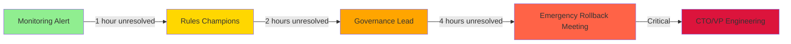

# Alert Threshold Configuration Guide

**Purpose:** Configure monitoring alerts and rollback triggers for VeroField Rules v2.1  
**Created:** 2025-12-05  
**Version:** 1.0.0  
**Owner:** DevOps + Governance Lead  
**Estimated Setup Time:** 2 hours

---

## Overview

This guide provides detailed configuration for monitoring alerts and automatic rollback triggers. **Configure before Phase 1 begins.**

### Alert Categories

1. **🚨 Automatic Rollback Triggers** - Immediate action required
2. **⚠️ Manual Review Required** - Governance lead review within 4 hours
3. **📊 Monitoring Alerts** - Investigation needed, no rollback

---

## Quick Deploy (Minimal Viable Configuration)

**Time to Deploy:** 15-20 minutes  
**What You Get:** Critical alerts only (auto-rollback triggers)  
**When to Use:** Phase 1 kickoff - enables basic monitoring immediately

### Overview

This Quick Deploy section provides the fastest path to operational alerting. It includes only the **most critical alerts** needed for Phase 1. Full configuration (manual review alerts, monitoring alerts) can be added incrementally during Phases 2-3.

**Deployment Strategy:**
- **Phase 1:** Quick Deploy (critical alerts only) - 15-20 minutes
- **Phase 2:** Add manual review alerts - 30 minutes
- **Phase 3:** Add monitoring alerts + dashboard integration - 1 hour

### Step 1: Deploy Prometheus (5 minutes)

**File:** `prometheus/prometheus.yml`

```yaml
global:
  scrape_interval: 30s
  evaluation_interval: 30s

scrape_configs:
  # OPA Performance Metrics
  - job_name: 'opa-performance'
    static_configs:
      - targets: ['localhost:8080']  # [CUSTOMIZE: Update with your OPA metrics endpoint]
    metrics_path: '/metrics'
    scrape_interval: 30s

  # Compliance Metrics (if dashboard deployed)
  - job_name: 'compliance-metrics'
    static_configs:
      - targets: ['localhost:9090']  # [CUSTOMIZE: Update with your compliance API endpoint]
    metrics_path: '/metrics'
    scrape_interval: 30s
```

**Verification:**
```bash
# Check Prometheus is scraping
curl http://localhost:9090/api/v1/targets

# Expected: Both targets show "up" status
```

### Step 2: Deploy Critical Alerts (10 minutes)

**File:** `prometheus/alerts/critical-only.yml`

```yaml
groups:
  - name: critical_rollback_triggers
    interval: 30s
    rules:
      # Auto-Rollback: False Positive Rate >40%
      - alert: HighFalsePositiveRate
        expr: |
          (
            sum(rate(compliance_violations_false_positive_total[24h])) 
            / 
            sum(rate(compliance_violations_total[24h]))
          ) > 0.40
        for: 5m
        labels:
          severity: critical
          action: auto-rollback
        annotations:
          summary: "False positive rate exceeded 40%"
          description: "False positive rate is {{ $value | humanizePercentage }}. Auto-rollback triggered."
          runbook: "docs/operations/rollback-procedures.md#false-positive-rollback"

      # Auto-Rollback: OPA Evaluation Timeout >5s
      - alert: OPAEvaluationTimeout
        expr: |
          histogram_quantile(0.99, 
            rate(opa_evaluation_duration_seconds_bucket[1h])
          ) > 5
        for: 2m
        labels:
          severity: critical
          action: auto-rollback
        annotations:
          summary: "OPA evaluation timeout exceeded 5s"
          description: "P99 evaluation time is {{ $value }}s. Auto-rollback triggered."

      # Auto-Rollback: CI Failure Rate >90%
      - alert: HighCIFailureRate
        expr: |
          (
            sum(rate(ci_workflow_runs_failed_total[1h])) 
            / 
            sum(rate(ci_workflow_runs_total[1h]))
          ) > 0.90
        for: 5m
        labels:
          severity: critical
          action: auto-rollback
        annotations:
          summary: "CI failure rate exceeded 90%"
          description: "CI failure rate is {{ $value | humanizePercentage }}. Auto-rollback triggered."
```

**Load into Prometheus:**
```bash
# Copy alerts file
cp prometheus/alerts/critical-only.yml /etc/prometheus/alerts/

# Reload Prometheus config
curl -X POST http://localhost:9090/-/reload

# Verify alerts loaded
curl http://localhost:9090/api/v1/rules

# Expected: 3 rules in "critical_rollback_triggers" group
```

### Step 3: Configure Slack Notifications (5 minutes)

**File:** `alertmanager/alertmanager-quick.yml`

```yaml
route:
  group_by: ['alertname']
  group_wait: 10s
  group_interval: 10s
  repeat_interval: 12h
  receiver: 'slack-critical'
  routes:
    - match:
        severity: critical
      receiver: 'slack-critical'

receivers:
  - name: 'slack-critical'
    slack_configs:
      - api_url: ${{ secrets.SLACK_WEBHOOK }}  # [CUSTOMIZE: Set SLACK_WEBHOOK secret]
        channel: '#compliance-critical'  # [CUSTOMIZE: Update channel name]
        title: '🚨 CRITICAL: {{ .GroupLabels.alertname }}'
        text: '{{ .CommonAnnotations.description }}'
        send_resolved: true
```

**Deploy Alertmanager:**
```bash
# Copy config
cp alertmanager/alertmanager-quick.yml /etc/alertmanager/alertmanager.yml

# Restart Alertmanager
systemctl restart alertmanager

# Verify Alertmanager is running
curl http://localhost:9093/api/v1/status

# Expected: Status shows "ready"
```

**Test Alert:**
```bash
# Send test alert
curl -X POST http://localhost:9093/api/v1/alerts \
  -H "Content-Type: application/json" \
  -d '{
    "alerts": [{
      "labels": {
        "alertname": "TestCriticalAlert",
        "severity": "critical"
      },
      "annotations": {
        "summary": "Test alert",
        "description": "This is a test"
      }
    }]
  }'

# Verify Slack notification received
# Check #compliance-critical channel
```

### Step 4: Configure GitHub Actions Auto-Rollback (Optional - 5 minutes)

**File:** `.github/workflows/auto-rollback.yml`

```yaml
name: Auto Rollback - Critical Alerts

on:
  repository_dispatch:
    types: [high-false-positive-rate, opa-timeout, high-ci-failure-rate]

jobs:
  rollback:
    runs-on: ubuntu-latest
    steps:
      - uses: actions/checkout@v3
      
      - name: Disable OPA policies
        run: |
          sed -i 's/- name: Run OPA evaluation/# - name: Run OPA evaluation/' .github/workflows/compliance-scan.yml
          git config user.name "GitHub Actions"
          git config user.email "actions@github.com"
          git commit -m "Auto-rollback: Disable OPA policies (triggered by ${{ github.event.action }})"
          git push
      
      - name: Notify team
        uses: slackapi/slack-github-action@v1
        with:
          webhook-url: ${{ secrets.SLACK_WEBHOOK }}
          payload: |
            {
              "text": "🚨 AUTO-ROLLBACK TRIGGERED",
              "blocks": [
                {
                  "type": "section",
                  "text": {
                    "type": "mrkdwn",
                    "text": "*Trigger:* ${{ github.event.action }}\n*Action:* OPA policies disabled\n*Next Steps:* Review violations and refine policies"
                  }
                }
              ]
            }
```

**Setup:**
```bash
# Set Slack webhook secret in GitHub
# Settings → Secrets → Actions → New repository secret
# Name: SLACK_WEBHOOK
# Value: [Your Slack webhook URL]

# Test auto-rollback (dry-run)
gh api repos/OWNER/REPO/dispatches \
  --method POST \
  -f event_type='high-false-positive-rate'
```

### Quick Deploy Verification Checklist

- [ ] Prometheus scraping metrics (both targets "up")
- [ ] 3 critical alerts loaded in Prometheus
- [ ] Alertmanager routing to Slack
- [ ] Test alert received in Slack
- [ ] GitHub Actions workflow created (optional)
- [ ] Auto-rollback workflow tested (optional)

### What's Next?

**Phase 2 (Add Manual Review Alerts):**
- Compliance score drop >15 points
- Tier 1 violations >15/day
- False positive rate >20%
- Override usage >30%

**Phase 3 (Add Monitoring Alerts):**
- Compliance score drop >5 points
- OPA evaluation time >200ms
- Tier 1 violations >5/day
- False positive rate >10%

**Full Configuration:**
- See sections below for complete alert configuration
- Add Grafana dashboard integration
- Add PagerDuty for critical alerts
- Add email notifications

---

## 🚨 Automatic Rollback Triggers

**Action:** Immediate automatic rollback without human intervention  
**Response Time:** <5 minutes  
**Owner:** Automated system + DevOps on-call

### Configuration

#### 1. False Positive Rate >40%

**Threshold:** `false_positive_rate > 0.40`  
**Measurement:** `(false_positives / total_violations) * 100`  
**Window:** Last 24 hours  
**Action:** Disable all OPA policies in CI

**Prometheus Alert:**
```yaml
- alert: HighFalsePositiveRate
  expr: |
    (
      sum(rate(compliance_violations_false_positive_total[24h])) 
      / 
      sum(rate(compliance_violations_total[24h]))
    ) > 0.40
  for: 5m
  labels:
    severity: critical
    action: auto-rollback
  annotations:
    summary: "False positive rate exceeded 40%"
    description: "False positive rate is {{ $value | humanizePercentage }}. Auto-rollback triggered."
    runbook: "docs/operations/rollback-procedures.md#false-positive-rollback"
```

**GitHub Actions Workflow:**
```yaml
# .github/workflows/auto-rollback.yml
name: Auto Rollback - False Positive Rate

on:
  repository_dispatch:
    types: [high-false-positive-rate]

jobs:
  rollback:
    runs-on: ubuntu-latest
    steps:
      - name: Disable OPA policies
        run: |
          # Comment out OPA evaluation in compliance-scan.yml
          sed -i 's/- name: Run OPA evaluation/# - name: Run OPA evaluation/' .github/workflows/compliance-scan.yml
          git commit -m "Auto-rollback: Disable OPA policies (false positive rate >40%)"
          git push
      
      - name: Notify team
        uses: slackapi/slack-github-action@v1
        with:
          webhook-url: ${{ secrets.SLACK_WEBHOOK }}
          payload: |
            {
              "text": "🚨 AUTO-ROLLBACK: False positive rate exceeded 40%",
              "blocks": [
                {
                  "type": "section",
                  "text": {
                    "type": "mrkdwn",
                    "text": "*False Positive Rate:* {{ $value }}%\n*Action:* OPA policies disabled\n*Next Steps:* Review violations and refine policies"
                  }
                }
              ]
            }
```

#### 2. OPA Evaluation Timeout >5s

**Threshold:** `opa_evaluation_time > 5000ms`  
**Measurement:** Per-policy evaluation time  
**Window:** Last 1 hour  
**Action:** Disable affected policies

**Prometheus Alert:**
```yaml
- alert: OPAEvaluationTimeout
  expr: |
    histogram_quantile(0.99, 
      rate(opa_evaluation_duration_seconds_bucket[1h])
    ) > 5
  for: 2m
  labels:
    severity: critical
    action: auto-rollback
  annotations:
    summary: "OPA evaluation timeout exceeded 5s"
    description: "P99 evaluation time is {{ $value }}s. Auto-rollback triggered."
    runbook: "docs/operations/rollback-procedures.md#opa-timeout-rollback"
```

#### 3. CI Failure Rate >90%

**Threshold:** `ci_failure_rate > 0.90`  
**Measurement:** `(failed_ci_runs / total_ci_runs) * 100`  
**Window:** Last 1 hour  
**Action:** Disable OPA enforcement

**GitHub Actions Status Check:**
```yaml
# .github/workflows/monitor-ci-failures.yml
name: Monitor CI Failures

on:
  workflow_run:
    workflows: ["Compliance Scan"]
    types: [completed]

jobs:
  check-failure-rate:
    runs-on: ubuntu-latest
    steps:
      - name: Calculate failure rate
        id: failure-rate
        run: |
          # Query GitHub API for recent workflow runs
          FAILURES=$(gh api repos/${{ github.repository }}/actions/runs \
            --jq '.workflow_runs | map(select(.conclusion == "failure")) | length')
          TOTAL=$(gh api repos/${{ github.repository }}/actions/runs \
            --jq '.workflow_runs | length')
          RATE=$(echo "scale=2; $FAILURES / $TOTAL" | bc)
          echo "rate=$RATE" >> $GITHUB_OUTPUT
      
      - name: Trigger rollback if needed
        if: steps.failure-rate.outputs.rate > 0.90
        uses: actions/github-script@v6
        with:
          script: |
            github.rest.repos.createDispatchEvent({
              owner: context.repo.owner,
              repo: context.repo.repo,
              event_type: 'high-ci-failure-rate'
            })
```

#### 4. Production Incident Caused by OPA Policy

**Threshold:** Manual trigger (on-call engineer)  
**Measurement:** Production monitoring alerts  
**Action:** Emergency rollback

**Manual Trigger Process:**
1. On-call engineer identifies OPA policy causing production issue
2. Trigger rollback via GitHub Actions dispatch:
   ```bash
   gh api repos/OWNER/REPO/dispatches \
     --method POST \
     -f event_type='production-incident-opa'
   ```
3. Automated rollback executes
4. Team notified via Slack/PagerDuty

---

## ⚠️ Manual Review Required

**Action:** Governance lead review within 4 hours  
**Response Time:** <4 hours  
**Owner:** Governance Lead + Rules Champions

### Configuration

#### 1. Compliance Score Drop >15 Points

**Threshold:** `compliance_score_delta < -15`  
**Measurement:** Score change in last 24 hours  
**Window:** 24 hours  
**Action:** Investigate root cause

**Prometheus Alert:**
```yaml
- alert: ComplianceScoreDrop
  expr: |
    (
      compliance_score{time="now"} 
      - compliance_score{time="24h_ago"}
    ) < -15
  for: 1h
  labels:
    severity: warning
    action: manual-review
    owner: governance-lead
  annotations:
    summary: "Compliance score dropped by {{ $value }} points"
    description: "Score dropped from {{ $labels.previous_score }} to {{ $labels.current_score }}"
    escalation: "Notify governance lead within 1 hour"
```

**Slack Notification:**
```yaml
- name: Notify governance lead
  uses: slackapi/slack-github-action@v1
  with:
    webhook-url: ${{ secrets.SLACK_WEBHOOK }}
    payload: |
      {
        "text": "⚠️ MANUAL REVIEW REQUIRED: Compliance score drop",
        "blocks": [
          {
            "type": "section",
            "text": {
              "type": "mrkdwn",
              "text": "*Score Drop:* {{ $value }} points\n*Previous:* {{ $labels.previous_score }}\n*Current:* {{ $labels.current_score }}\n*Action Required:* Investigate root cause within 4 hours"
            }
          }
        ]
      }
```

#### 2. Tier 1 Violations >15/Day

**Threshold:** `tier1_violations_per_day > 15`  
**Measurement:** Count of Tier 1 violations in last 24 hours  
**Window:** 24 hours  
**Action:** Review policy accuracy

**Prometheus Alert:**
```yaml
- alert: HighTier1Violations
  expr: |
    sum(increase(compliance_violations_total{tier="1"}[24h])) > 15
  for: 1h
  labels:
    severity: warning
    action: manual-review
    owner: rules-champions
  annotations:
    summary: "Tier 1 violations exceeded 15 per day"
    description: "{{ $value }} Tier 1 violations in last 24 hours"
    escalation: "Emergency meeting if >20/day"
```

#### 3. False Positive Rate >20%

**Threshold:** `false_positive_rate > 0.20`  
**Measurement:** `(false_positives / total_violations) * 100`  
**Window:** Last 24 hours  
**Action:** Policy refinement needed

**Prometheus Alert:**
```yaml
- alert: ModerateFalsePositiveRate
  expr: |
    (
      sum(rate(compliance_violations_false_positive_total[24h])) 
      / 
      sum(rate(compliance_violations_total[24h]))
    ) > 0.20
  for: 1h
  labels:
    severity: warning
    action: manual-review
    owner: rules-champions
  annotations:
    summary: "False positive rate exceeded 20%"
    description: "False positive rate is {{ $value | humanizePercentage }}. Policy refinement needed."
```

#### 4. Override Usage >30%

**Threshold:** `override_usage_rate > 0.30`  
**Measurement:** `(overrides / total_violations) * 100`  
**Window:** Last 7 days  
**Action:** Adjust policy thresholds

**Prometheus Alert:**
```yaml
- alert: HighOverrideUsage
  expr: |
    (
      sum(rate(compliance_overrides_total[7d])) 
      / 
      sum(rate(compliance_violations_total[7d]))
    ) > 0.30
  for: 2h
  labels:
    severity: warning
    action: manual-review
    owner: governance-lead
  annotations:
    summary: "Override usage exceeded 30%"
    description: "{{ $value | humanizePercentage }} of violations require overrides. Policy may be too strict."
```

---

## 📊 Monitoring Alerts (Investigation)

**Action:** Investigate, no rollback  
**Response Time:** <24 hours  
**Owner:** Rules Champions

### Configuration

#### 1. Compliance Score Drop >5 Points

**Threshold:** `compliance_score_delta < -5`  
**Measurement:** Score change in last 24 hours  
**Window:** 24 hours  
**Action:** Review trends

**Prometheus Alert:**
```yaml
- alert: ComplianceScoreTrend
  expr: |
    (
      compliance_score{time="now"} 
      - compliance_score{time="24h_ago"}
    ) < -5
  for: 2h
  labels:
    severity: info
    action: investigate
  annotations:
    summary: "Compliance score dropped by {{ $value }} points"
    description: "Monitor trend over next 24 hours"
```

#### 2. OPA Evaluation Time >200ms Average

**Threshold:** `avg(opa_evaluation_time) > 200ms`  
**Measurement:** Average evaluation time  
**Window:** Last 1 hour  
**Action:** Performance review

**Prometheus Alert:**
```yaml
- alert: OPAPerformanceDegradation
  expr: |
    avg(rate(opa_evaluation_duration_seconds[1h])) * 1000 > 200
  for: 30m
  labels:
    severity: info
    action: investigate
  annotations:
    summary: "OPA evaluation time exceeded 200ms average"
    description: "Average time is {{ $value }}ms. Review performance."
```

#### 3. Tier 1 Violations >5/Day

**Threshold:** `tier1_violations_per_day > 5`  
**Measurement:** Count of Tier 1 violations  
**Window:** 24 hours  
**Action:** Review patterns

**Prometheus Alert:**
```yaml
- alert: Tier1ViolationsTrend
  expr: |
    sum(increase(compliance_violations_total{tier="1"}[24h])) > 5
  for: 2h
  labels:
    severity: info
    action: investigate
  annotations:
    summary: "Tier 1 violations exceeded 5 per day"
    description: "{{ $value }} violations. Review patterns."
```

#### 4. False Positive Rate >10%

**Threshold:** `false_positive_rate > 0.10`  
**Measurement:** `(false_positives / total_violations) * 100`  
**Window:** Last 7 days  
**Action:** Track trend

**Prometheus Alert:**
```yaml
- alert: FalsePositiveTrend
  expr: |
    (
      sum(rate(compliance_violations_false_positive_total[7d])) 
      / 
      sum(rate(compliance_violations_total[7d]))
    ) > 0.10
  for: 4h
  labels:
    severity: info
    action: investigate
  annotations:
    summary: "False positive rate exceeded 10%"
    description: "Rate is {{ $value | humanizePercentage }}. Track trend."
```

---

## Escalation Path

**[CUSTOMIZE: Add your organization's escalation contacts]**

#### Visual Escalation Flow



#### Text Escalation Path

### Level 1: Monitoring Alert (Automated)
- **Duration:** Immediate
- **Action:** Logged, no notification
- **Owner:** Automated system

### Level 2: Rules Champions (Within 1 Hour)
- **Duration:** 1 hour
- **Action:** Slack notification
- **Owner:** Rules Champions
- **Contact:** [CUSTOMIZE: Add Slack channel/user]

### Level 3: Governance Lead (Within 2 Hours)
- **Duration:** 2 hours
- **Action:** Email + Slack @mention
- **Owner:** Governance Lead
- **Contact:** [CUSTOMIZE: Add email/Slack]

### Level 4: Emergency Rollback Decision (Within 4 Hours)
- **Duration:** 4 hours
- **Action:** Emergency meeting
- **Owner:** Governance Lead + CTO
- **Contact:** [CUSTOMIZE: Add escalation path]

### Level 5: CTO/VP Engineering (Critical Only)
- **Duration:** Immediate
- **Action:** PagerDuty/Slack emergency
- **Owner:** CTO/VP Engineering
- **Contact:** [CUSTOMIZE: Add emergency contact]

---

## Monitoring Setup

### Prometheus Configuration

**File:** `prometheus/prometheus.yml`

```yaml
scrape_configs:
  - job_name: 'compliance-metrics'
    static_configs:
      - targets: ['compliance-api:8080']
    metrics_path: '/metrics'
    scrape_interval: 30s
    
  - job_name: 'opa-performance'
    static_configs:
      - targets: ['opa-metrics:8080']
    metrics_path: '/metrics'
    scrape_interval: 30s
```

### Grafana Dashboard

**Import Dashboard:** `docs/operations/grafana-compliance-dashboard.json`

**Key Panels:**
1. Compliance Score (gauge)
2. Violations by Tier (bar chart)
3. False Positive Rate (line graph)
4. OPA Evaluation Time (histogram)
5. Override Usage (pie chart)
6. Alert Status (table)

### Alertmanager Configuration

**File:** `alertmanager/alertmanager.yml`

```yaml
route:
  group_by: ['alertname', 'severity']
  group_wait: 10s
  group_interval: 10s
  repeat_interval: 12h
  receiver: 'slack-notifications'
  routes:
    - match:
        severity: critical
      receiver: 'pagerduty-critical'
    - match:
        severity: warning
      receiver: 'slack-warnings'
    - match:
        severity: info
      receiver: 'slack-info'

receivers:
  - name: 'slack-notifications'
    slack_configs:
      - api_url: ${{ secrets.SLACK_WEBHOOK }}
        channel: '#compliance-alerts'
        title: '{{ .GroupLabels.alertname }}'
        text: '{{ .CommonAnnotations.description }}'
  
  - name: 'pagerduty-critical'
    pagerduty_configs:
      - service_key: ${{ secrets.PAGERDUTY_KEY }}
        description: '{{ .CommonAnnotations.summary }}'
  
  - name: 'slack-warnings'
    slack_configs:
      - api_url: ${{ secrets.SLACK_WEBHOOK }}
        channel: '#compliance-warnings'
  
  - name: 'slack-info'
    slack_configs:
      - api_url: ${{ secrets.SLACK_WEBHOOK }}
        channel: '#compliance-info'
```

---

## Testing Alerts

### Test Alert Configuration

```bash
# Test Prometheus alert
curl -X POST http://prometheus:9090/api/v1/alerts \
  -H "Content-Type: application/json" \
  -d '{
    "alerts": [{
      "labels": {
        "alertname": "TestAlert",
        "severity": "warning"
      },
      "annotations": {
        "summary": "Test alert"
      }
    }]
  }'

# Verify Slack notification received
# Verify PagerDuty page (if critical)
# Verify email sent (if configured)
```

### Alert Validation Checklist

- [ ] Prometheus scraping metrics correctly
- [ ] Alert rules evaluate correctly
- [ ] Alertmanager routes alerts correctly
- [ ] Slack notifications received
- [ ] PagerDuty integration works (if critical)
- [ ] Email notifications sent (if configured)
- [ ] Auto-rollback workflows trigger correctly
- [ ] Manual review notifications sent

---

## Maintenance

### Weekly Review

- [ ] Review alert frequency
- [ ] Adjust thresholds if needed
- [ ] Update escalation contacts
- [ ] Test alert delivery
- [ ] Review false positive rate

### Monthly Review

- [ ] Analyze alert trends
- [ ] Optimize alert rules
- [ ] Update runbooks
- [ ] Train team on alert response
- [ ] Review escalation effectiveness

---

## Sign-Off

**Configured By:** ___  
**Date:** ___  
**Tested By:** ___  
**Date:** ___  
**Approved By:** ___ (Governance Lead)  
**Date:** ___

**Status:** ✅ **APPROVED FOR PRODUCTION USE** / ❌ **ISSUES FOUND - RESOLVE BEFORE PHASE 1**

---

**Last Updated:** 2025-12-05  
**Version:** 1.0.0  
**Next Review:** Before Phase 1 begins

