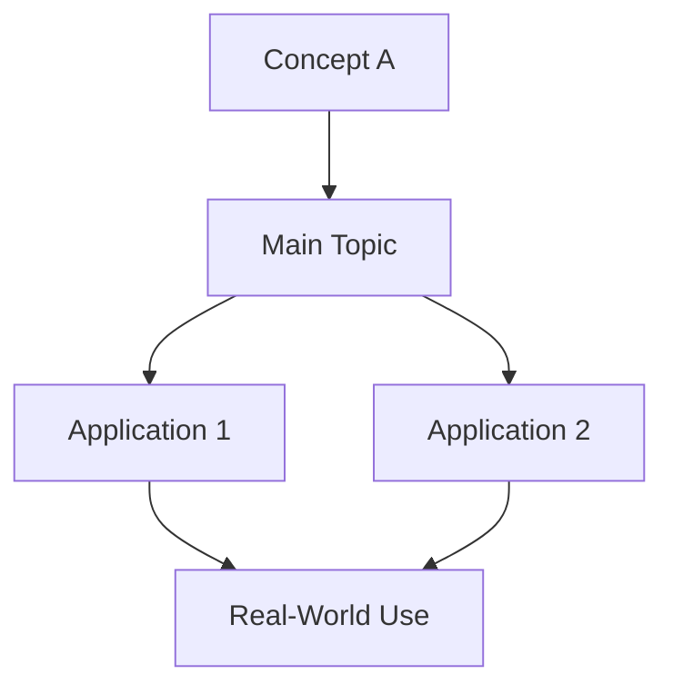

Python Bible Chapter Requirements — Authoritative Specification v2.1
Document Status: Canonical Reference
Last Updated: November 30, 2025
Applies To: All new Python Bible chapters
Authority Level: Mandatory for all contributors

1. File Structure and Naming
1.1 File Location and Naming Convention
Location:
docs/reference/Programming Bibles/bibles/python_bible/chapters/
Naming Pattern:
NN_topic_difficulty.md
Examples:

30_docstrings_advanced.md
31_async_patterns_intermediate.md
32_type_system_expert.md

Numbering:
Sequential integers starting from the next available chapter number.
Difficulty Indicators:

🟢 Beginner — Assumes only basic programming knowledge
🟡 Intermediate — Requires chapters 1–10 and fundamental Python concepts
🟠 Advanced — Demands deep Python knowledge and real-world experience
🔴 Expert — Reserved for language internals, CPython implementation details, and production-scale architecture

File Encoding:
UTF-8 without BOM

1.2 Book Registration (MANDATORY)
Every new chapter must be registered in config/book.yaml.
Format:
yamlparts:
  - name: 'Part Name'
    chapters:
      - chapters/30_new_topic_intermediate.md
Requirements:

Use forward slashes (/) for all paths
Paths are relative to the Python Bible base directory
Place chapters in the appropriate Part section
Maintain alphabetical or logical ordering within each part


2. SSM (Semantic Structural Markup) Tags
2.1 Required SSM Boundaries
Opening Boundary (first line of file):
html<!-- SSM:CHUNK_BOUNDARY id="chXX-start" -->
Closing Boundary (last line of file):
html<!-- SSM:CHUNK_BOUNDARY id="chXX-end" -->
ID Format:
chXX where XX is the zero-padded chapter number (e.g., ch30, ch05)

2.2 Optional SSM Tags
Part Boundary (only when introducing a new Part):
html<!-- SSM:PART id="partX" title="Part Name" -->
Concept Blocks (for advanced semantic markup):
html<!-- SSM:CONCEPT id="concept-name" level="intermediate" prereqs="ch1,ch2" -->
[Concept content]
<!-- /SSM:CONCEPT -->
Usage Guidance:

Part boundaries typically appear only in Chapter 1 or when starting a new major section
Concept blocks are optional and used for enhanced semantic navigation
Never nest SSM tags incorrectly


3. Chapter Header Structure
3.1 Required Header Format
markdown<!-- SSM:CHUNK_BOUNDARY id="chXX-start" -->
📘 CHAPTER XX — CHAPTER TITLE 🟢|🟡|🟠|🔴 Difficulty  
Depth Level: 1–5  
Python Versions Covered: 3.8–3.14+  
Prerequisites: Chapters X–Y | None

> **Quick Answer:**  
> - Concise answer to the most common question about this topic  
> - Second key point if needed  
>
> **Example — Correct Pattern:**  
> ```python
> # ✅ CORRECT: Demonstrates the recommended approach
> def example():
>     """Proper docstring."""
>     return "result"
> ```
>
> **Estimated time:** X–Y hours  
> **When you need this:** Specific use cases or contexts

---
Field Specifications:
FieldFormatExampleRequiredChapter NumberCHAPTER XXCHAPTER 30✅ YesTitleALL CAPSDOCSTRINGS: FORMAL SEMANTICS, STYLES & ENTERPRISE GOVERNANCE✅ YesDifficultyEmoji + text🟠 Advanced✅ YesDepth LevelInteger 1–5Depth Level: 4✅ YesPython VersionsRange3.8–3.14+✅ YesPrerequisitesChapter refs or "None"Chapters 1–5, 12, 18✅ YesQuick AnswerBlockquote sectionSee template🟡 RecommendedEstimated TimeHours range2–3 hours🟡 RecommendedWhen You Need ThisContext descriptionSee template🟡 Recommended

3.2 Quick Answer Section Guidelines
The Quick Answer section provides immediate value to readers who need a fast resolution.
Structure:

Bullet points — 2–4 concise statements answering the core question
Code example — A minimal, correct pattern demonstrating best practice
Time estimate — Realistic time investment for mastering the chapter
Use case — When readers should apply this knowledge

Correct Pattern (from Chapter 30):
markdown> **Quick Answer:**  
> - A docstring is a string literal placed as the first statement in a module, class, or function.  
> - It defines the public contract of your API and is consumed by IDEs, Sphinx, inspect(), doctest, and LLM/RAG systems.  
>
> **Example — Correct Pattern:**  
> ```python
> # ✅ Correct docstring pattern
> def add(x: int, y: int) -> int:
>     """Add two integers and return their sum."""
>     return x + y
> ```  
>
> **Estimated time:** 2–3 hours  
> **When you need this:** Any time you define a public API, library, or maintain internal tooling.
Critical Formatting Notes:

Use two spaces at the end of lines within the blockquote for proper Markdown line breaks
Code blocks within blockquotes must use triple backticks with language tag
The # ✅ marker goes inside the code block as a comment, not as a heading
Label the example with **Example — Correct Pattern:** (note the em dash —)

Anti-Pattern:
markdown> **Quick Answer:**  
> Docstrings are strings that document code.
> 
> # Example
> def add(x, y):
>     return x + y
❌ Why this fails:

No proper code block with triple backticks and language tag
Example lacks the docstring it's supposed to demonstrate
Uses heading syntax (#) instead of code comment
No practical context or time estimate


4. Content Structure — Required Sections
4.0 Overview Section (X.0) — MANDATORY
Format:
# **X.0 Overview** or # **X.0 Why [Topic] Exists**
Content Requirements:

Opening paragraph — 2–4 sentences providing high-level context
Learning outcomes — Bulleted list of what readers will master
Why it matters — Practical justification for learning this topic (bolded)
Chapter roadmap — Brief outline of major sections

Example (from Chapter 30):
markdown# **30.0 Overview**

Docstrings are the foundation of Python documentation and the primary mechanism for describing program behavior, API contracts, and module intent. They are parsed by the Python runtime, type tools, documentation generators, IDEs, and LLM-based assistants.

In this chapter you will learn:

- How docstrings work at the compiler and runtime level  
- The differences between Google, NumPy, and Sphinx/RST styles  
- How to document modules, classes, functions, async functions, and generators  
- Enterprise-level governance for docstring quality and CI enforcement  
- Pitfalls, anti-patterns, war stories, and best practices  

This topic matters because **clean docstrings directly improve maintainability, correctness, API usability, and LLM comprehension.**
Formatting Notes:

Section headings use # with bold text: # **30.0 Overview**
Use two trailing spaces on bullet points for proper line breaks
Bold the "why it matters" statement for emphasis


4.1 Numbered Content Sections — MANDATORY
Hierarchical Format:

# **X.Y Section Title** — Major sections
## **X.Y.Z Subsection Title** — Subsections
### **X.Y.Z.W Sub-subsection Title** — Sub-subsections (use sparingly)

Progression:
Content must flow from fundamental concepts to advanced applications.
Example Hierarchy (from Chapter 30):
markdown# **30.1 Docstrings in Python's Language Model**

## **30.1.1 What Docstrings Are (Formal Definition)**

## **30.1.2 Docstring Lifecycle Diagram**

## **30.1.3 Docstring Styles (Observed Across Industry)**

### **Google-Style (RECOMMENDED)**

### **NumPy-Style**

### **Sphinx/RST Style**
Numbering Rules:

Start at X.0 for Overview
Major sections begin at X.1
Subsections must have a parent section
Never skip numbers (e.g., don't go from 30.1 to 30.3)
All section headings are bolded using **


4.2 Code Examples — MANDATORY
All code examples must be syntactically correct, runnable, and production-quality.
Format:
markdown```python
# ✅ CORRECT: Clear description of what makes this correct
def example_function(param: str) -> str:
    """Proper docstring following style guide."""
    return param.upper()
```
Requirements:
RequirementDetailsLanguage tagAlways use ```python for Python codeSyntax validityCode must run without errors in specified Python versionsType hintsUse for Python 3.8+ when appropriateDocstringsInclude for all functions/classes in examplesCommentsProvide context but avoid stating the obviousVariable namesDescriptive and following PEP 8 conventionsIndentation4 spaces (never tabs)
Good vs. Bad Markers:
Use these consistently to highlight correct and incorrect patterns:
markdown# ✅ CORRECT: Explanation of why this is right
# ✅ Correct: Alternative format (sentence case)
# ❌ INCORRECT: Explanation of what's wrong
# ❌ Do not: Alternative format for anti-patterns
# ⚠️ WARNING: Use for risky but sometimes necessary patterns
Example with Anti-Patterns (from Chapter 30):
markdown## **30.3.1 Anti-Patterns**

❌ **Do not write vague docstrings:**
```python
"""Helper function."""
```

❌ **Do not restate the function name:**
```python
"""Add function."""
```

## **30.3.2 Prefer Correct Patterns**
```python
# ✅ Correct
def parse_int(value: str) -> int:
    """Convert a string to an integer.

    Raises:
        ValueError: If the value cannot be converted.
    """
```

4.3 "Try This" Interactive Elements — RECOMMENDED
Purpose:
Provide hands-on practice immediately after introducing concepts.
Format (from Chapter 30):
markdown## **30.1.5 Try This**

**Try This:**  
Write Google-style docstrings for a class you created earlier in Chapter 12 (Functions).  
Your docstring must include:

1. A 1-line summary
2. Attributes
3. Args/Returns/Raises
4. Realistic usage example
Formatting Notes:

Section heading format: ## **X.Y.Z Try This**
Label with bold: **Try This:** followed by two spaces
Use numbered or bulleted lists for requirements
Keep exercises achievable in 5–15 minutes

Placement:

After major concept explanations
Before moving to the next major topic
When readers need to practice before advancing

Characteristics of Good Exercises:

Specific and actionable
Builds on chapter content
Can be completed in 5–15 minutes
Reinforces key learning outcomes


4.4 Diagrams (Mermaid Format) — RECOMMENDED
Supported Types:

Flowcharts (execution flow, decision trees)
Sequence diagrams (API interactions, async patterns)
Architecture diagrams (system components)
State diagrams (FSM, lifecycle management)

Format:
markdown```mermaid
flowchart LR
    A[Start] --> B{Decision}
    B -->|Yes| C[Action 1]
    B -->|No| D[Action 2]
    C --> E[End]
    D --> E
```
Quality Standards:

Clear labels — Every node must have a descriptive name
Proper styling — Use colors and shapes to indicate different types of nodes
Logical flow — Direction should match natural reading order (LR or TD)
Professional appearance — Avoid cluttered or overly complex diagrams

Example (from Chapter 30):
markdown## **30.1.2 Docstring Lifecycle Diagram**
```mermaid
flowchart LR
    A[Docstring in Source File] --> B[Python Runtime (__doc__)]
    B --> C[inspect.getdoc]
    C --> D[LSP Server / Editor]
    D --> E[IDE Tooltip Docs]
    B --> F[Sphinx / MkDocs Generators]
    B --> G[Doctest Runner]
    B --> H[LLM / RAG Processing Layer]
```

4.5 Pitfalls & Warnings Section — RECOMMENDED
Format:
# **X.Y Pitfalls & Warnings**
Content Requirements:

Anti-patterns — Common mistakes developers make
Explanations — Why these patterns are problematic
Correct alternatives — The right way to handle each case
Security considerations — If applicable to the topic

Structure (from Chapter 30):
markdown# **30.3 Pitfalls & Warnings**

## **30.3.1 Anti-Patterns**

❌ **Do not write vague docstrings:**
```python
"""Helper function."""
```

❌ **Do not restate the function name:**
```python
"""Add function."""
```

❌ **Do not omit exceptions:**  
Missing `Raises:` section reduces reliability.

## **30.3.2 Prefer Correct Patterns**
```python
# ✅ Correct
def parse_int(value: str) -> int:
    """Convert a string to an integer.

    Raises:
        ValueError: If the value cannot be converted.
    """
```

## **30.3.3 Security Warnings**

- **Do not include API keys, tokens, or sensitive details** in docstrings
- **Do not expose internal platform exceptions** in public API documentation
Formatting Notes:

Use ❌ for anti-patterns with bold description
Use bullet points with bold "Do not" statements for warnings
Use ## **X.Y.Z Subsection** format for subsections


4.6 Summary & Key Takeaways — MANDATORY
Format:
# **X.Y Summary & Key Takeaways**
Content:

Bulleted list of 4–8 main points (no numbers)
Reinforcement of learning objectives from Overview
Quick reference suitable for review
No new information — only synthesis

Example (from Chapter 30):
markdown# **30.4 Summary & Key Takeaways**

- Docstrings define **what** your code does—not **how**
- Google-style is the recommended standard
- Always document Args, Returns, Raises, and examples
- Good docstrings greatly improve IDE usability and LLM understanding
- Enterprise projects require coverage enforcement and style consistency
Formatting Notes:

Use simple bullet points (dash -)
Bold key terms for emphasis
Keep each point concise (one line preferred)
Use em dash — not hyphen - for emphasis


4.7 What's Next — CONDITIONAL
Status: Not present in Chapter 30, appears in some other chapters. Include if there are clear follow-up chapters or learning paths.
Format (when used):
# **X.Y What's Next** or # **X.Y Next Steps**
Content:

References to following chapters
Related topics for further study
Learning path recommendations
Optional: External resources (official docs, PEPs, authoritative references)

Example Template:
markdown# **30.5 What's Next**

**Upcoming Chapters:**
- **Chapter 31 — Type Hints & Static Analysis** explores how docstrings integrate with type checkers
- **Chapter 32 — Testing & Doctest** demonstrates executable documentation patterns

**Related Topics:**
- PEP 257 — Docstring Conventions (official specification)
- Sphinx Documentation Generator — Advanced documentation workflows
- Type Stubs & `.pyi` Files — Type-only documentation for compiled modules

5. Code Example Requirements
5.1 Language Tags and Formatting
Supported Language Tags:
LanguageTagUse CasePythonpythonAll Python code examplesYAMLyamlCI/CD configs, book.yaml examplesJSONjsonConfiguration files, API responsesBash/Shellbash or shellCommand-line examplesMermaidmermaidDiagramsRegoregoPolicy-as-code examplesTexttextPlain output, logsDiffdiffBefore/after comparisons
Formatting Standards:

Indentation: 4 spaces for Python (never tabs)
Line length: ≤88 characters (Black formatter standard)
Blank lines: Follow PEP 8 (2 blank lines between top-level definitions)
String quotes: Prefer double quotes " unless single quotes avoid escaping


5.2 Code Example Patterns from Chapter 30
Module-Level Docstrings:
python"""Authentication utilities for login and password validation."""
Class Docstrings:
pythonclass RateLimiter:
    """Token-bucket rate limiter with adjustable burst window.

    Attributes:
        rate: Tokens added per second.
        burst: Extra capacity available during spikes.
    """
Function Docstrings:
pythondef login_user(username: str, password: str) -> bool:
    """Authenticate a user against the credentials database.

    Args:
        username: The user's login name.
        password: Raw password input.

    Returns:
        True if the user is authenticated; otherwise False.

    Raises:
        AuthenticationError: If credentials are invalid.
    """
Async Function Docstrings:
pythonasync def fetch_user(uid: str) -> dict:
    """Fetch a user record asynchronously."""
Generator Docstrings:
pythondef read_lines(path: str):
    """Yield lines lazily from a file."""

5.3 Inline Code Examples
For inline code elements within explanatory text:

Use single backticks: obj.__doc__
Use for function names: inspect.getdoc()
Use for built-in functions: help()
Use for module names: inspect


6. Cross-Referencing Requirements
6.1 Internal References
Chapter References:

Single chapter: Chapter 12
Range: Chapters 1–5 (use en dash –)
Multiple non-contiguous: Chapters 3, 7, and 12
With specific sections: Chapter 12 (Functions) when context is needed

Examples from Chapter 30:
markdownPrerequisites: Chapters 1–5, 12, 18

Write Google-style docstrings for a class you created earlier in Chapter 12 (Functions).
```

---

### 6.2 External References

**PEP References:**
- No URL needed for well-known PEPs
- Format: `PEP 257 — Docstring Conventions`

**Official Documentation:**
- Reference by name when discussing features
- Example: "parsed by the Python runtime"

**Tools and Libraries:**
- Reference by name: `Sphinx`, `inspect()`, `doctest`
- No URLs needed for standard tools

---

## 7. Special Content Elements

### 7.1 Formal Definitions (Advanced Chapters)

**Use Cases:**
- Language specification chapters
- Grammar and parsing topics
- Compiler implementation details

**Format (from Chapter 30):**
```
Formally:

docstring ::= STRING_LITERAL
suite ::= docstring? statement*
Requirements:

Introduce with "Formally:" label
Use EBNF or Python's grammar notation
Include explanatory text before and after
Optional for most chapters, required for language-level topics


7.2 Comparison Tables
Use Cases:

Comparing multiple approaches or tools
Syntax reference tables
Feature matrices

Format:
markdown| Style | Readability | Tooling Support | Use Case |
|-------|-------------|-----------------|----------|
| Google | High | Excellent | General purpose |
| NumPy | Medium | Good | Scientific computing |
| Sphinx | Medium | Excellent | Legacy projects |

7.3 List-Based Content Presentation
Bulleted Lists:

Use for learning outcomes
Use for feature enumeration
Use for summary points
Terminate each item with two spaces for proper line breaks in Markdown

Numbered Lists:

Use for sequential steps
Use for prioritized items
Use for "Try This" exercise requirements

Example from Chapter 30:
markdownIn this chapter you will learn:

- How docstrings work at the compiler and runtime level  
- The differences between Google, NumPy, and Sphinx/RST styles  
- How to document modules, classes, functions, async functions, and generators

8. Non-Python Code Examples
8.1 CI/CD Configuration Examples
YAML (from Chapter 30):
markdown```yaml
- name: Docstring Lint
  run: pydocstyle src/
```
Purpose: Demonstrate CI enforcement and tooling integration

8.2 Policy-as-Code Examples
Rego (from Chapter 30):
markdown```rego
deny[msg] {
  fn := input.functions[_]
  fn.public == true
  not fn.has_docstring
  msg := sprintf("Missing docstring: %s", [fn.name])
}
```
Purpose: Show enterprise governance patterns

8.3 Enterprise Integration Patterns
When to Include:

CI/CD enforcement examples
Policy validation code
Configuration management
Tooling integration

Formatting:

Always use appropriate language tags
Provide context before code blocks
Explain the purpose and integration point


9. Quality Standards & Style Guidelines
9.1 Writing Style
Principles:

Clear and precise — Avoid ambiguity
Professional but approachable — Technical without being academic
Active voice — "Python stores docstrings" vs. "Docstrings are stored"
Present tense — "Python uses" vs. "Python will use"
Technical accuracy — Verify all claims

Tone Observed in Chapter 30:

Authoritative: "Your Python Bible mandates..."
Instructional: "You will learn..."
Direct: "Do not include API keys..."


9.2 Technical Accuracy Requirements
Verification Checklist:

✅ All code examples have been tested in specified Python versions
✅ Claims about language behavior are verified against CPython source or official docs
✅ Version-specific features note the minimum Python version
✅ Deprecated features are marked with warnings
✅ Tool names and references are accurate


9.3 Formatting Conventions
Emphasis:

Use bold for key terms and emphasis
Use code for inline code, function names, module names
Use italics sparingly (not observed in Chapter 30)

Lists:

Two trailing spaces on list items for proper Markdown rendering
Consistent bullet style (dash -)

Headings:

All section headings are bolded: # **X.Y Title**
Use hierarchical structure without skipping levels

Code Comments:

Use # ✅ for correct patterns
Use # ❌ for incorrect patterns
Capitalize and use consistent punctuation


10. Complete Chapter Template
markdown<!-- SSM:CHUNK_BOUNDARY id="ch30-start" -->
📘 CHAPTER 30 — YOUR CHAPTER TITLE 🟡 Intermediate  
Depth Level: 3  
Python Versions Covered: 3.8–3.14+  
Prerequisites: Chapters 1–5, 12

> **Quick Answer:**  
> - Concise answer to the most common question  
> - Second key point demonstrating value  
>
> **Example — Correct Pattern:**  
> ```python
> # ✅ CORRECT: Demonstrates recommended approach
> def example(param: str) -> str:
>     """Proper docstring following style guide."""
>     return param.upper()
> ```  
>
> **Estimated time:** 2–3 hours  
> **When you need this:** Specific use cases and contexts

---

# **30.0 Overview**

[2–4 sentence chapter overview providing high-level context]

In this chapter you will learn:

- Key concept 1  
- Key concept 2  
- Key concept 3  
- Practical applications and real-world patterns  

This topic matters because **[practical justification]**.

---

# **30.1 Main Concept Section**

[Detailed explanation with proper context]

## **30.1.1 Subsection Title**

[Deeper dive into specific aspect]
```python
# ✅ CORRECT: Example demonstrating the concept
def example_function(param: str) -> str:
    """Properly documented example with clear intent."""
    return param.upper()
```

## **30.1.2 Advanced Patterns**

[More sophisticated usage]

## **30.1.3 Try This**

**Try This:**  
[Hands-on exercise for immediate practice]

1. Requirement 1
2. Requirement 2
3. Requirement 3

---

# **30.2 Related Concepts and Integration**

[How this topic connects to other Python features]


---

# **30.3 Pitfalls & Warnings**

## **30.3.1 Anti-Patterns**

❌ **Do not [anti-pattern 1]:**
```python
# ❌ INCORRECT: Explanation of what's wrong
def bad_example():
    pass
```

❌ **Do not [anti-pattern 2]:**
```python
# ❌ INCORRECT: Another common mistake
def another_bad_example():
    pass
```

## **30.3.2 Prefer Correct Patterns**
```python
# ✅ Correct
def good_example(param: str) -> str:
    """Proper implementation with documentation."""
    return param
```

## **30.3.3 Security Warnings**

- **Never** include sensitive data in [relevant area]
- **Always** validate input when [specific scenario]
- **Be cautious** of [specific risk]

---

# **30.4 Summary & Key Takeaways**

- First key point synthesizing chapter content
- Second critical concept to remember
- Third practical takeaway
- Fourth important pattern or principle
- Fifth security or performance consideration

<!-- SSM:CHUNK_BOUNDARY id="ch30-end" -->

11. Quality Assurance Checklist
Before submitting a new chapter, verify:
11.1 Structure

 SSM boundary tags present and correct
 Registered in config/book.yaml
 Header includes all required fields
 Section numbering is sequential and correct
 All headings use bold format: # **X.Y Title**
 Contains Overview (X.0) section
 Contains Summary & Key Takeaways

11.2 Code Quality

 All Python examples are syntactically valid
 Code has been tested in specified Python versions
 Type hints used appropriately
 Docstrings present in all examples
 Good/Bad markers (✅/❌) used correctly
 No hardcoded credentials or secrets

11.3 Content Quality

 Technical accuracy verified
 No contradictions with earlier chapters
 Consistent terminology throughout
 Clear progression from basic to advanced
 "Try This" exercises are actionable (if included)
 Real-world examples are realistic

11.4 Documentation

 Internal cross-references are accurate
 External references are appropriate
 Mermaid diagrams render correctly
 Tables are properly formatted
 Code blocks have language tags
 Two trailing spaces on list items for line breaks

11.5 Formatting

 All section headings are bolded
 Quick Answer blockquote formatted correctly
 Code markers (✅/❌) inside code blocks
 Consistent use of em dash (—) vs hyphen (-)
 Professional, inclusive language


12. Version History
VersionDateChanges1.0InitialFirst draft from observed patterns2.02025-12-05Complete rewrite with professional formatting2.12025-12-05Updated with actual Chapter 30 formatting requirements, corrected heading styles, fixed Quick Answer format, added SSM closing tag requirement

End of Specification
This document is the canonical reference for all Python Bible chapter contributions. Adherence to these standards ensures consistency, quality, and maintainability across the entire Bible.