<!-- SSM:PART id="part1" title="Part I: Foundations" -->
# Part I: Foundations

<!-- SSM:CHUNK_BOUNDARY id="ch01-start" -->
📘 CHAPTER 1 — INTRODUCTION TO PYTHON 🟢 Beginner

## How to Use This Bible

### Learning Paths by Goal

**🎯 "I want to write production Python in 2 weeks"**
1. Chapter 1 (Introduction) → 2 hours
2. Chapter 2 (Syntax) → 4 hours  
3. Chapter 6 (Functions) → 3 hours
4. Chapter 10 (Error Handling) → 2 hours
5. Appendix E (Pitfalls) → 2 hours
6. Chapter 14 (Testing) → 3 hours
**Total: ~16 hours**

**🎯 "I'm optimizing Python performance"**
1. Chapter 3 (Execution Model) → 3 hours
2. Chapter 12 (Performance Engineering) → 5 hours
3. Chapter 17 (Concurrency) → 4 hours
4. Appendix E, Section D.9 (GIL Traps) → 1 hour
**Total: ~13 hours**

**🎯 "I'm building data pipelines"**
1. Chapter 21 (Data Engineering) → 6 hours
2. Chapter 12 (Performance) → 3 hours
3. Chapter 17 (Concurrency) → 4 hours
4. Chapter 22 (Packaging) → 2 hours
**Total: ~15 hours**

Depth Level: 3 (Comprehensive)
Python Versions Covered: 3.8–3.14+

📚 Python Bible Learning Roadmap

```mermaid
flowchart TD
    Start([Start Learning Python]) --> Beginner[Beginner Path<br/>Ch. 1 → Ch. 2 → Ch. 4 → Ch. 5 → Ch. 6 → Ch. 7<br/>Intro, Syntax, Types, Control, Functions, OOP<br/>Focus: Core language, basic data structures, functions]
    
    Beginner --> Intermediate[Intermediate Path<br/>Ch. 8 → Ch. 9 → Ch. 10 → Ch. 11 → Ch. 14<br/>Modules, Stdlib, Errors, Arch, Testing<br/>Focus: Project structure, error handling, testing]
    
    Intermediate --> Advanced[Advanced Path<br/>Ch. 12 → Ch. 13 → Ch. 17 → Ch. 18 → Ch. 20<br/>Perf, Security, Concurrency, Meta, Web<br/>Focus: Performance, security, async, metaprogramming]
    
    Advanced --> Specialist{Choose Specialist Path}
    
    Specialist -->|Systems Programming| Systems[Ch. 27 Internals<br/>→ Ch. 28 Implementations]
    Specialist -->|Backend Development| Backend[Ch. 20 Web<br/>→ Ch. 21 Data<br/>→ Ch. 22 Eng]
    Specialist -->|Performance Engineering| Perf[Ch. 12 Perf<br/>→ Ch. 27 Internals<br/>→ Ch. 28 PyPy]
    Specialist -->|Architecture & Design| Arch[Ch. 11 Arch<br/>→ Ch. 18 Meta<br/>→ Appendix A Patterns]
```



Quick Start: Want code immediately? Jump to Ch. 2.2.3 for your first working example, then return here for context.

1.1 What Python Is (and Is Not)

Python is a high-level, general-purpose programming language emphasizing:

readability

expressiveness

rapid development

huge ecosystem support

interoperability with C, Rust, and other runtimes

batteries-included standard library

dynamic + optionally statically-typed workflow

Python is designed so developers can think about ideas rather than ceremony, making it one of the most effective languages for:

scripting

web backends

data engineering

AI/ML workloads

automation

rapid prototyping

infrastructure tooling

But Python also powers:
operating system components, distributed systems, servers, compilers, and even embedded devices.

1.2 Why Python Matters (2025+)

Python continues to dominate because:

✔ AI & ML ecosystem is unmatched

NumPy, PyTorch, TensorFlow, JAX, Polars, Pandas, etc.

✔ Data engineering & analytics

Polars, Pandas, DuckDB, PySpark, Apache Arrow.

✔ Web frameworks are world-class

FastAPI, Django, Starlette.

✔ High-performance via extensions

Cython

PyO3 / Rust

Numba

GraalPython

CPython 3.11+ specialization

3.13+ tiered JIT

3.14+ free-threading mode

✔ Excellent for automation

Scripting, DevOps, CI/CD, infra-as-code.

✔ Strong typing story

Python 3.10–3.14 introduced:

structural typing

ParamSpec

Self

override

new generic syntax (PEP 695)

broad editor + LSP support

1.3 Python’s Design Philosophy (The Zen of Python)

View it directly:

import this


Key philosophies:

Readability counts.

Simple is better than complex.

Explicit is better than implicit.

There should be one—and preferably only one—obvious way to do it.

If the implementation is hard to explain, it’s a bad idea.

Throughout this book, these principles guide best practices.

1.4 How Python Runs Your Code

Python is:

interpreted (executed by the CPython interpreter)

bytecode compiled (source → bytecode → executed)

dynamically typed (type checks at runtime)

hybrid binding model: early binding for locals (compile-time via LOAD_FAST), late binding for globals and closures (runtime via LOAD_GLOBAL/LOAD_DEREF)

object-oriented (everything is an object)

**Python Execution Pipeline:**

```mermaid
flowchart TD
    Source[Source Code<br/>hello.py] --> Tokenization[1. TOKENIZATION<br/>Tokenizer converts characters → tokens<br/>Example: def → NAME, ( → LPAR, x → NAME]
    
    Tokenization --> Parsing[2. PARSING PEG Parser<br/>Tokens → Abstract Syntax Tree AST<br/>Example: FunctionDef name='greet', args=[...]]
    
    Parsing --> ASTOpt[3. AST OPTIMIZATION<br/>Constant folding, dead code elimination<br/>Example: 2 + 3 → 5 compile-time]
    
    ASTOpt --> Bytecode[4. BYTECODE COMPILATION<br/>AST → Bytecode instructions<br/>Example: LOAD_FAST, CALL_FUNCTION, RETURN_VALUE]
    
    Bytecode --> CodeObj[5. CODE OBJECT CREATION<br/>Bytecode + metadata → code object<br/>Stored in: __pycache__/hello.cpython-313.pyc]
    
    CodeObj --> Execution[6. EXECUTION CPython VM]
    
    Execution --> Tier0[Tier 0: Baseline Interpreter 3.11+<br/>Standard bytecode execution]
    
    Tier0 -->|hot code detected| Tier1[Tier 1: Adaptive Interpreter 3.11+<br/>Specialized opcodes<br/>Type-specific optimizations]
    
    Tier1 -->|very hot code, 3.13+| Tier2[Tier 2: JIT Compiler 3.13+ experimental<br/>Copy-and-patch JIT<br/>Native machine code]
    
    Tier0 --> Runtime[Runtime Execution<br/>Frame objects, stack, namespaces]
    Tier1 --> Runtime
    Tier2 --> Runtime
    
    style Source fill:#e1f5ff
    style Runtime fill:#fff4e1
    style Tier0 fill:#ffe1f5
    style Tier1 fill:#e1ffe1
    style Tier2 fill:#ffe1e1
```

**Core stages:**

- **Tokenization**: Character stream → Token stream
- **Parsing (PEG parser)**: Token stream → AST (Abstract Syntax Tree)
- **AST generation**: Tree structure representing code structure
- **Bytecode compilation**: AST → Bytecode instructions
- **Execution by CPython VM**: Interpreter executes bytecode (or JIT compiles it)
- **Optional JIT tiers (3.13+ experimental)**: Hot code paths compiled to native code

*See Appendix G → G.2.1 for additional details and memory layout diagrams.*

1.5 Python Implementations
1.5.1 CPython (default, reference implementation)

Written in C

Most widely used

Best compatibility

3.11+: huge speed jumps (PEP 659)

3.13+: tiered JIT

3.14+: optional free-threading

1.5.2 PyPy

JIT-compiled Python

Great for long-running, pure-Python workloads

Very fast loops

Sometimes incompatible with CPython C-extensions

1.5.3 MicroPython & CircuitPython

Tiny footprint

Designed for embedded devices

Limited stdlib

1.5.4 Jython, IronPython, GraalPython

Jython → Java ecosystem

IronPython → .NET

GraalPython → Polyglot on GraalVM, extremely fast for some workloads

1.6 When You Should (and Shouldn't) Use Python

1.6.0 Quick Start: Your First Python Program

Before diving into theory, let's write working code:

```python
# hello.py
def greet(name: str) -> str:
    """Return a personalized greeting."""
    return f"Hello, {name}!"

if __name__ == "__main__":
    print(greet("Python"))
    # Output: Hello, Python!
```

Run it:

```bash
python hello.py
# Output: Hello, Python!
```

Try This: Modify the function to accept an optional title parameter.

```python
def greet(name: str, title: str = "") -> str:
    """Return a personalized greeting with optional title."""
    if title:
        return f"Hello, {title} {name}!"
    return f"Hello, {name}!"

print(greet("Smith", "Dr."))
# Output: Hello, Dr. Smith!
```

Now you've written Python code! The rest of this chapter provides context for why Python works this way.

✔ Excellent Use Cases

Data Science & ML

Scripting & automation

API services (FastAPI, Django)

Data engineering pipelines

Prototyping / rapid iteration

Developer tooling

Infrastructure scripting

CLI utilities

Education

❌ Less Ideal

Low-latency systems (C++/Rust preferred)

Real-time embedded control

Extremely high-throughput microservices where GC and interpreter overhead matter

GPU kernels (use Python wrappers but write kernels in CUDA/Numba)

1.7 Setting Up Your Python Environment (2025+)
1.7.1 Choose Your Python Version

Recommended:

Python 3.12 or 3.13
(3.14 optional-runtime for free-threading)

Install via pyenv, asdf, or the official installer.

1.7.2 Create a Virtual Environment
python3 -m venv .venv
source .venv/bin/activate     # Unix
.\.venv\Scripts\activate      # Windows


or modern alternatives:

uv (Rust-based, extremely fast)

rye

pipx for global tool isolation

1.7.3 Install Core Tools
pip install \
    black \
    ruff \
    mypy \
    pytest \
    httpx \
    rich

1.8 A Tour of Python via Examples

This section gives newcomers a taste of the syntax.

1.8.1 Micro Example — Variables & Expressions
name = "Alice"
age = 30
message = f"{name} is {age} years old."
print(message)

1.8.2 Mini Example — Working with Collections
users = [
    {"id": 1, "active": True},
    {"id": 2, "active": False},
]

active_users = [u for u in users if u["active"]]

print(active_users)

1.8.3 Mini Example — Functions & Decorators
from functools import lru_cache

@lru_cache(maxsize=256)
def fib(n: int) -> int:
    if n < 2:
        return n
    return fib(n-1) + fib(n-2)

print(fib(10))

1.8.4 Macro Example — Simple CLI App
#!/usr/bin/env python3
"""
Simple Task Manager CLI
"""

from __future__ import annotations
from pathlib import Path
import json
import sys

TASKS_FILE = Path("tasks.json")


def load_tasks() -> list[str]:
    if TASKS_FILE.exists():
        return json.loads(TASKS_FILE.read_text())
    return []


def save_tasks(tasks: list[str]) -> None:
    TASKS_FILE.write_text(json.dumps(tasks, indent=2))


def main() -> int:
    tasks = load_tasks()

    if len(sys.argv) < 2:
        print("Usage: task add <name> | task list")
        return 1

    command = sys.argv[1]

    if command == "add":
        name = " ".join(sys.argv[2:])
        tasks.append(name)
        save_tasks(tasks)
        print("Added:", name)

    elif command == "list":
        for i, t in enumerate(tasks, start=1):
            print(f"{i}. {t}")

    return 0


if __name__ == "__main__":
    raise SystemExit(main())


Highlights:

pathlib

JSON

sys.argv parsing

Clean project structure

Teaser for Modules (Chapter 8)

1.9 Common Beginner Pitfalls (Preview)

(Some later covered in Appendix D)

1. Mutable default arguments
2. Closing files improperly
3. Misusing is vs ==
4. Modifying lists while iterating
5. Shadowing built-in names
6. Forgetting virtual environments
7. Using Python lists for heavy numerical workloads

Each will have deeper treatment later.

1.10 Python Version Compatibility (3.8 → 3.14)

Python 3.10–3.14 introduced profound enhancements:

structural pattern matching

Self, ParamSpec, TypeVarTuple

TaskGroup (async)

ExceptionGroup

new generic syntax

immortal objects / free-threading groundwork

tiered JIT (3.13)

optional GIL removal (3.14+)

See Appendix E.

1.11 Summary & Key Takeaways

Python is a readable, expressive, versatile language.

CPython is the reference implementation.

Execution = tokenization → AST → bytecode → interpreter.

Everything is an object.

Python is dynamic but now strongly supports optional static typing.

Python 3.11+ brought radical performance gains.

Virtual environments are essential.

You’ve now seen enough to be productive.

1.12 What’s Next

Proceed to Chapter 2 — Syntax & Semantics, where we dive into:

slicing

unpacking

names & binding

string formatting evolution

raw strings

line continuation

This is where Python’s deeper semantics begin to matter.


<!-- SSM:PART id="part2" title="Part II: Language Core" -->
# Part II: Language Core
