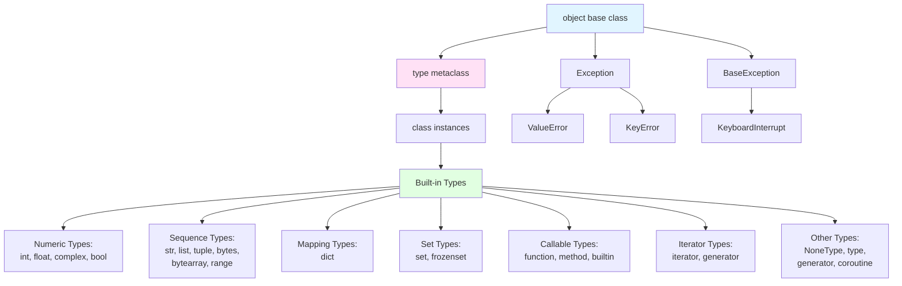

<!-- SSM:CHUNK_BOUNDARY id="ch04-start" -->
📘 CHAPTER 4 — TYPES & TYPE SYSTEM 🟡 Intermediate

Depth Level: 3
Python Versions: 3.8–3.14+

<!-- SSM:CONCEPT id="type-system" level="intermediate" prereqs="syntax,functions" -->
4.0 Overview
<!-- /SSM:CONCEPT -->

Python’s type system is:

Dynamic at runtime

Gradually typed via optional static typing

Nominal for classes

Structural for protocols

Richly extensible through the Data Model

Strongly typed (no silent coercions like JS)

Runtime introspectable

This chapter covers:

Built-in types

Mutability rules

Identity vs equality

Operator semantics

The entire Data Model (dunder methods)

Abstract Base Classes

typing: generics, TypeVar, ParamSpec, Self, TypeAlias, TypedDict, Protocol

Literal types

Type narrowing & guards

Python’s conceptual type lattice

Practical examples for real-world engineering

4.1 Everything Is an Object (Formal Statement)

In Python:

Every value is an object.
Every object has a type.
The type determines the object’s behavior.

Examples:

type(10) is int
type("hello") is str
type([1,2,3]) is list


Even functions and classes are objects:

def f(): pass
class C: pass

type(f)     # function
type(C)     # type

4.2 Built-In Types (Full Inventory)

Python’s built-in types fall into categories:

Scalars:

int

float

complex

bool

Text & Bytes:

str

bytes

bytearray

Collections:

list

tuple

set

frozenset

dict

Special Types:

NoneType

EllipsisType

NotImplementedType

slice

range

Callable Types:

function

method

lambda

generator

coroutine (async)

Custom Types:

user-defined classes

dataclasses

enums

pydantic models

Type-checking helpers:

typing.Any

typing.Union

typing.Optional

typing.TypeAlias

typing.NewType

typing.Self (3.11+)

4.3 Identity, Equality, and Mutability
4.3.1 Identity
a is b


True only if they reference the same object.

4.3.2 Equality
a == b


True if values compare equal.

4.3.3 Mutability Table
Type	Mutable?
int	❌
float	❌
str	❌
tuple	❌ (but may contain mutable values)
bytes	❌
bool	❌
list	✔️
dict	✔️
set	✔️
bytearray	✔️
custom classes (default)	✔️
⚠ Pitfall: Mutable Defaults
def f(x=[]):   # bad
    x.append(1)
    return x


Use:

def f(x=None):
    if x is None:
        x = []

4.4 The Type Hierarchy & Lattice

**Python Type Hierarchy:**



**Type Relationships:**

- All types inherit from `object`
- `type` is the metaclass for all classes (classes are instances of `type`)
- Built-in types are implemented in C (PyObject structures)
- User-defined classes are instances of `type`
- Special types: `NoneType` (singleton), `NotImplementedType`, `EllipsisType`

Python's type model is:

not a single inheritance hierarchy

driven by protocols and behavior

integrated with abstract base classes

supports structural typing via Protocol

The true type system is closer to a behavioral lattice than a classical tree.

4.5 Static Typing with typing

Python supports optional static typing:

def add(a: int, b: int) -> int:
    return a + b


Type check using:

mypy

pyright (recommended)

pylance (VS Code plugin)

pytype

ruff (with type-checking mode coming)

4.5.1 Basic types
x: int = 10
y: str = "hello"
z: list[int] = [1, 2, 3]


(3.9+ syntax allows built-in generics.)

4.5.2 Union Types

Python 3.10+:

def maybe(x: int | None) -> int | None:
    return x


Equivalent to typing.Union[int, None].

4.5.3 Optional
def greet(name: str | None) -> str:
    if name is None:
        return "Hello!"
    return f"Hello, {name}!"


Optional means “value may be None”.

4.5.4 Literal Types
def move(direction: Literal["up", "down"]): ...

4.5.5 Type Aliases (3.10+)
UserId: TypeAlias = int

4.5.6 NewType
UserId = NewType("UserId", int)


Adds semantic distinction.

4.5.7 Generics: TypeVar, ParamSpec, TypeVarTuple

Generics enable reusable code that works with multiple types while maintaining type safety.

**Quick Answer:**
- **TypeVar** creates type variables for generic functions and classes
- **Bounded TypeVars** (`TypeVar("T", bound=Base)`) restrict to specific base types
- **Covariant/Contravariant** TypeVars control subtyping behavior
- **ParamSpec** enables type-safe decorators and higher-order functions
- **TypeVarTuple** (PEP 646) enables variadic generics for tuple-like structures
- **Generic Classes** use `Generic[T]` to create reusable container types

```python
from typing import TypeVar, Generic, ParamSpec, TypeVarTuple

T = TypeVar("T")
P = ParamSpec("P")
Ts = TypeVarTuple("Ts")

def identity(x: T) -> T:
    return x

class Container(Generic[T]):
    def __init__(self, value: T):
        self.value = value
```

**Estimated time:** 2 hours  
**When you need this:** When creating reusable functions/classes that work with multiple types, building type-safe containers, or implementing generic algorithms

4.5.7.1 Basic TypeVar Usage

TypeVar creates a type variable that can represent any type:

```python
from typing import TypeVar

T = TypeVar("T")

def identity(x: T) -> T:
    """Return the input unchanged, preserving type."""
    return x

# Type checker infers specific types
result1: int = identity(42)  # T = int
result2: str = identity("hello")  # T = str
result3: list[int] = identity([1, 2, 3])  # T = list[int]
```

**Multiple TypeVars:**

```python
from typing import TypeVar

T = TypeVar("T")
U = TypeVar("U")

def swap(a: T, b: U) -> tuple[U, T]:
    """Swap two values, preserving their types."""
    return (b, a)

# Type checker tracks both types
result: tuple[str, int] = swap(42, "hello")  # T = int, U = str
```

**Generic Functions with Constraints:**

```python
from typing import TypeVar

T = TypeVar("T", int, float, str)  # T can only be int, float, or str

def process_number(value: T) -> T:
    return value

process_number(42)  # ✅ Valid: int
process_number(3.14)  # ✅ Valid: float
process_number("hello")  # ✅ Valid: str
process_number([1, 2, 3])  # ❌ Type error: list not in allowed types
```

4.5.7.2 Bounded TypeVars

Bounded TypeVars restrict the type variable to a specific base class or protocol:

```python
from typing import TypeVar

class Animal:
    def speak(self) -> str: ...

class Dog(Animal):
    def bark(self) -> str: return "Woof!"

class Cat(Animal):
    def meow(self) -> str: return "Meow!"

# T must be Animal or a subclass
T = TypeVar("T", bound=Animal)

def make_sound(animal: T) -> T:
    animal.speak()  # ✅ Can call Animal methods
    return animal

dog = Dog()
result: Dog = make_sound(dog)  # ✅ Type preserved: Dog
cat = Cat()
result2: Cat = make_sound(cat)  # ✅ Type preserved: Cat
```

**Bounded TypeVars with Protocols:**

```python
from typing import TypeVar, Protocol

class Comparable(Protocol):
    def __lt__(self, other) -> bool: ...
    def __eq__(self, other) -> bool: ...

T = TypeVar("T", bound=Comparable)

def max_value(a: T, b: T) -> T:
    """Return the maximum of two comparable values."""
    return a if a >= b else b  # ✅ Can use comparison operators

max_value(10, 20)  # ✅ int implements Comparable
max_value("a", "z")  # ✅ str implements Comparable
max_value([1, 2], [3, 4])  # ❌ Type error: list doesn't implement Comparable
```

4.5.7.3 Covariant and Contravariant TypeVars

Variance controls how subtyping works with generic types:

**Covariant (`covariant=True`):** Subtypes are preserved (read-only operations)

```python
from typing import TypeVar

class Animal: ...
class Dog(Animal): ...

# Covariant: Container[Dog] is a subtype of Container[Animal]
T_co = TypeVar("T_co", covariant=True)

class Container(Generic[T_co]):
    def get(self) -> T_co: ...

def process_animals(container: Container[Animal]) -> None:
    animal = container.get()
    print(animal)

dog_container: Container[Dog] = Container[Dog]()
process_animals(dog_container)  # ✅ Valid: Container[Dog] <: Container[Animal]
```

**Contravariant (`contravariant=True`):** Subtypes are reversed (write-only operations)

```python
from typing import TypeVar

class Animal: ...
class Dog(Animal): ...

# Contravariant: Handler[Animal] is a subtype of Handler[Dog]
T_contra = TypeVar("T_contra", contravariant=True)

class Handler(Generic[T_contra]):
    def handle(self, value: T_contra) -> None: ...

def use_dog_handler(handler: Handler[Dog]) -> None:
    handler.handle(Dog())

animal_handler: Handler[Animal] = Handler[Animal]()
use_dog_handler(animal_handler)  # ✅ Valid: Handler[Animal] <: Handler[Dog]
```

**Invariant (default):** No subtyping relationship

```python
from typing import TypeVar, Generic

T = TypeVar("T")  # Invariant by default

class Box(Generic[T]):
    def put(self, value: T) -> None: ...
    def get(self) -> T: ...

# Invariant: Box[Dog] is NOT a subtype of Box[Animal]
dog_box: Box[Dog] = Box[Dog]()
animal_box: Box[Animal] = dog_box  # ❌ Type error: not compatible
```

**Variance Rules Summary:**

| Variance | Use Case | Example |
|----------|----------|---------|
| **Covariant** | Read-only containers | `list[T]`, `Iterator[T]` |
| **Contravariant** | Write-only containers | Function parameters, `Callable[[T], None]` |
| **Invariant** | Read-write containers | `dict[K, V]`, `set[T]` |

4.5.7.4 Generic Classes

Generic classes enable reusable container types:

```python
from typing import TypeVar, Generic

T = TypeVar("T")

class Stack(Generic[T]):
    def __init__(self) -> None:
        self._items: list[T] = []
    
    def push(self, item: T) -> None:
        self._items.append(item)
    
    def pop(self) -> T:
        return self._items.pop()
    
    def peek(self) -> T:
        return self._items[-1]

# Type checker enforces type consistency
int_stack: Stack[int] = Stack()
int_stack.push(42)  # ✅ Valid
int_stack.push("hello")  # ❌ Type error: str not assignable to int

str_stack: Stack[str] = Stack()
str_stack.push("hello")  # ✅ Valid
```

**Multiple Type Parameters:**

```python
from typing import TypeVar, Generic

K = TypeVar("K")
V = TypeVar("V")

class Pair(Generic[K, V]):
    def __init__(self, key: K, value: V) -> None:
        self.key = key
        self.value = value
    
    def swap(self) -> "Pair[V, K]":
        return Pair(self.value, self.key)

pair: Pair[str, int] = Pair("age", 30)
swapped: Pair[int, str] = pair.swap()  # ✅ Types swapped correctly
```

**Generic Classes with Inheritance:**

```python
from typing import TypeVar, Generic

T = TypeVar("T")

class Container(Generic[T]):
    def __init__(self, value: T) -> None:
        self.value = value

class ReadOnlyContainer(Container[T]):  # ✅ Inherit generic parameter
    def get(self) -> T:
        return self.value
    
    # Cannot add setter (read-only)

class MutableContainer(Container[T]):
    def set(self, value: T) -> None:
        self.value = value

int_container: ReadOnlyContainer[int] = ReadOnlyContainer(42)
value: int = int_container.get()  # ✅ Type-safe access
```

4.5.7.5 ParamSpec (PEP 612)

ParamSpec enables type-safe decorators and higher-order functions:

```python
from typing import ParamSpec, TypeVar, Callable

P = ParamSpec("P")  # Captures function signature
R = TypeVar("R")  # Return type

def log_calls(func: Callable[P, R]) -> Callable[P, R]:
    """Decorator that logs function calls."""
    def wrapper(*args: P.args, **kwargs: P.kwargs) -> R:
        print(f"Calling {func.__name__}")
        return func(*args, **kwargs)
    return wrapper

@log_calls
def add(a: int, b: int) -> int:
    return a + b

@log_calls
def greet(name: str, title: str = "Mr.") -> str:
    return f"Hello, {title} {name}"

# Type checker preserves original function signatures
result: int = add(1, 2)  # ✅ Type-safe
greeting: str = greet("Alice")  # ✅ Type-safe with default parameter
```

**ParamSpec with Generic Return Types:**

```python
from typing import ParamSpec, TypeVar, Callable

P = ParamSpec("P")
T = TypeVar("T")

def retry(max_attempts: int = 3):
    """Decorator that retries function calls on failure."""
    def decorator(func: Callable[P, T]) -> Callable[P, T]:
        def wrapper(*args: P.args, **kwargs: P.kwargs) -> T:
            for attempt in range(max_attempts):
                try:
                    return func(*args, **kwargs)
                except Exception as e:
                    if attempt == max_attempts - 1:
                        raise
                    print(f"Attempt {attempt + 1} failed, retrying...")
            raise RuntimeError("All retry attempts failed")
        return wrapper
    return decorator

@retry(max_attempts=3)
def fetch_data(url: str) -> dict:
    # Implementation
    return {"data": "value"}

# Type checker preserves function signature
data: dict = fetch_data("https://api.example.com")  # ✅ Type-safe
```

4.5.7.6 TypeVarTuple (PEP 646)

TypeVarTuple enables variadic generics for tuple-like structures:

```python
from typing import TypeVarTuple, Unpack

Ts = TypeVarTuple("Ts")

def zip_arrays(*arrays: *Ts) -> tuple[*Ts]:  # Python 3.11+ syntax
    """Zip multiple arrays, preserving their types."""
    return tuple(zip(*arrays))

# Type checker infers tuple types
result: tuple[tuple[int, str], tuple[int, str]] = zip_arrays(
    [1, 2],
    ["a", "b"]
)
```

**TypeVarTuple with Generic Classes:**

```python
from typing import TypeVarTuple, Generic, Unpack

Ts = TypeVarTuple("Ts")

class Array(Generic[Unpack[Ts]]):  # Python 3.11+ syntax
    def __init__(self, *values: *Ts) -> None:
        self.values = values
    
    def get(self, index: int) -> tuple[*Ts]:
        return self.values

# Type checker infers specific tuple types
arr: Array[int, str, bool] = Array(42, "hello", True)
values: tuple[int, str, bool] = arr.get(0)  # ✅ Type-safe
```

**Note:** TypeVarTuple requires Python 3.11+ and advanced type checker support (pyright, mypy with `--enable-incomplete-features`).

4.5.7.7 Advanced Generic Patterns

**Recursive Generic Types:**

```python
from typing import TypeVar, Generic, Optional

T = TypeVar("T")

class TreeNode(Generic[T]):
    def __init__(
        self,
        value: T,
        left: Optional["TreeNode[T]"] = None,
        right: Optional["TreeNode[T]"] = None
    ) -> None:
        self.value = value
        self.left = left
        self.right = right

# Type-safe tree structure
tree: TreeNode[int] = TreeNode(
    10,
    left=TreeNode(5),
    right=TreeNode(15)
)
```

**Generic Protocols:**

```python
from typing import Protocol, TypeVar

T = TypeVar("T")

class Comparable(Protocol[T]):  # Generic protocol
    def __lt__(self, other: T) -> bool: ...
    def __eq__(self, other: T) -> bool: ...

def max_value(a: T, b: T) -> T:
    """Find maximum of two comparable values."""
    return a if a >= b else b  # Uses comparison operators
```

**Type Constraints with Multiple Bounds:**

```python
from typing import TypeVar, Protocol

class Hashable(Protocol):
    def __hash__(self) -> int: ...

class Comparable(Protocol):
    def __lt__(self, other) -> bool: ...

# T must implement both Hashable and Comparable
T = TypeVar("T", bound=Hashable)  # Note: Python doesn't support multiple bounds directly
# Workaround: Create a combined protocol

class HashableComparable(Protocol):
    def __hash__(self) -> int: ...
    def __lt__(self, other) -> bool: ...

T = TypeVar("T", bound=HashableComparable)
```

4.5.7.8 Generic Pitfalls & Warnings

⚠️ **TypeVar scope matters:**

```python
from typing import TypeVar

# ❌ Wrong: TypeVar defined inside function
def bad_identity(x):
    T = TypeVar("T")  # ❌ TypeVar should be module-level
    return x

# ✅ Correct: TypeVar at module level
T = TypeVar("T")

def good_identity(x: T) -> T:
    return x
```

⚠️ **Generic classes can't be instantiated without type parameters:**

```python
from typing import TypeVar, Generic

T = TypeVar("T")

class Container(Generic[T]):
    def __init__(self, value: T) -> None:
        self.value = value

# ❌ Wrong: Can't use Container without type parameter
container = Container(42)  # Type error: Container is not a concrete type

# ✅ Correct: Specify type parameter
container: Container[int] = Container(42)
# Or use type inference (Python 3.9+)
container = Container[int](42)
```

⚠️ **Variance violations:**

```python
from typing import TypeVar, Generic

T = TypeVar("T")  # Invariant

class Box(Generic[T]):
    def put(self, value: T) -> None: ...
    def get(self) -> T: ...

class Animal: ...
class Dog(Animal): ...

# ❌ Wrong: Invariant types aren't compatible
dog_box: Box[Dog] = Box[Dog]()
animal_box: Box[Animal] = dog_box  # Type error: not compatible

# ✅ Solution: Use covariant TypeVar for read-only containers
T_co = TypeVar("T_co", covariant=True)

class ReadOnlyBox(Generic[T_co]):
    def get(self) -> T_co: ...

readonly_dog_box: ReadOnlyBox[Dog] = ReadOnlyBox[Dog]()
readonly_animal_box: ReadOnlyBox[Animal] = readonly_dog_box  # ✅ Valid
```

4.5.8 Self Type (3.11+)
class Builder:
    def set_x(self, value) -> Self:
        self.x = value
        return self


Supports fluent interfaces.

4.5.9 override Decorator (3.12+)
class Base:
    def f(self): ...

class Child(Base):
    @override
    def f(self): ...


Catches misspelled or incorrect overrides.

4.5.10 TypedDict (Type-Safe Dictionaries)

TypedDict provides type hints for dictionary structures with fixed keys.

**Quick Answer:**
- **TypedDict** enables type-safe dictionary access with fixed key names
- Use `total=False` for optional keys (default: all keys required)
- Use `Required` and `NotRequired` (3.11+) for fine-grained control
- TypedDict supports inheritance and can be used with `@dataclass`-like patterns
- Runtime: TypedDict is just a regular `dict` (no runtime validation)

```python
from typing import TypedDict, Required, NotRequired

class User(TypedDict):
    id: str
    name: str
    email: str

user: User = {
    "id": "1",
    "name": "Alice",
    "email": "alice@example.com"
}

# Type checker enforces key names and types
user["id"]  # ✅ Type: str
user["age"]  # ❌ Type error: 'age' not in User
```

**Estimated time:** 1 hour  
**When you need this:** When working with JSON data, API responses, configuration dictionaries, or any structured dictionary data

4.5.10.1 Basic TypedDict Usage

Define dictionary structure with type hints:

```python
from typing import TypedDict

class Point(TypedDict):
    x: int
    y: int

# Type-safe dictionary creation
point: Point = {"x": 10, "y": 20}

# Type checker validates keys and types
point["x"]  # ✅ Type: int
point["z"]  # ❌ Type error: 'z' not in Point
point["x"] = "10"  # ❌ Type error: str not assignable to int
```

**Runtime Behavior:**
- TypedDict is just a regular `dict` at runtime
- No runtime validation (use `pydantic` or `dataclasses` for that)
- Type checkers (mypy/pyright) enforce types statically

4.5.10.2 Optional Keys with total=False

Use `total=False` to make all keys optional:

```python
from typing import TypedDict

class UserProfile(TypedDict, total=False):
    name: str
    email: str
    age: int

# All keys are optional
profile1: UserProfile = {}  # ✅ Valid
profile2: UserProfile = {"name": "Alice"}  # ✅ Valid
profile3: UserProfile = {"name": "Alice", "email": "alice@example.com"}  # ✅ Valid
```

**Mixed Required and Optional Keys:**

```python
from typing import TypedDict, Required, NotRequired

class User(TypedDict):
    id: str  # Required
    name: str  # Required
    email: NotRequired[str]  # Optional (Python 3.11+)
    age: NotRequired[int]  # Optional

# id and name are required
user1: User = {"id": "1", "name": "Alice"}  # ✅ Valid
user2: User = {"id": "1"}  # ❌ Type error: missing 'name'
user3: User = {"id": "1", "name": "Alice", "email": "alice@example.com"}  # ✅ Valid
```

**Python 3.10 and earlier (use total=False with inheritance):**

```python
from typing import TypedDict

class UserBase(TypedDict):
    id: str
    name: str

class User(UserBase, total=False):
    email: str
    age: int

# id and name required, email and age optional
user: User = {"id": "1", "name": "Alice"}  # ✅ Valid
user_with_email: User = {"id": "1", "name": "Alice", "email": "alice@example.com"}  # ✅ Valid
```

4.5.10.3 TypedDict Inheritance

TypedDict supports inheritance to extend or override dictionary structures:

```python
from typing import TypedDict

class BaseUser(TypedDict):
    id: str
    name: str

class AdminUser(BaseUser):
    permissions: list[str]
    is_superuser: bool

# AdminUser includes all BaseUser keys plus new ones
admin: AdminUser = {
    "id": "1",
    "name": "Admin",
    "permissions": ["read", "write"],
    "is_superuser": True
}

def process_user(user: BaseUser) -> None:
    print(f"User: {user['name']}")

process_user(admin)  # ✅ AdminUser is compatible with BaseUser
```

**Overriding Keys (Python 3.11+):**

```python
from typing import TypedDict, NotRequired

class BaseConfig(TypedDict):
    host: str
    port: int
    timeout: int

class DevConfig(BaseConfig):
    timeout: NotRequired[int]  # Override: make timeout optional
    debug: bool  # Add new required key

# DevConfig requires host, port, debug; timeout is optional
dev: DevConfig = {
    "host": "localhost",
    "port": 8000,
    "debug": True
    # timeout is optional
}
```

4.5.10.4 TypedDict with Generic Types

TypedDict can use generic types for reusable structures:

```python
from typing import TypedDict, TypeVar, Generic

T = TypeVar("T")

class Response(TypedDict, Generic[T]):  # ❌ TypedDict doesn't support Generic directly

# ✅ Workaround: Use type aliases
from typing import TypedDict, TypeVar

T = TypeVar("T")

def create_response(data: T) -> dict[str, T | str]:
    return {"status": "success", "data": data}

# ✅ Better: Use TypedDict with type variables in values
class ApiResponse(TypedDict):
    status: str
    data: dict[str, object]  # Use object or Union types

# ✅ Best: Use separate TypedDict for each response type
class UserResponse(TypedDict):
    status: str
    data: "User"  # Forward reference

class ProductResponse(TypedDict):
    status: str
    data: "Product"  # Forward reference
```

4.5.10.5 TypedDict vs dataclass vs NamedTuple

**Comparison Table:**

| Feature | TypedDict | dataclass | NamedTuple |
|---------|-----------|-----------|------------|
| **Type Checking** | ✅ Static only | ✅ Static + runtime | ✅ Static + runtime |
| **Runtime Validation** | ❌ None | ✅ Optional (with validation libs) | ✅ Type enforcement |
| **Mutable** | ✅ Yes (dict) | ✅ Yes | ❌ No (tuple) |
| **JSON Serialization** | ✅ Native | ⚠️ Requires encoder | ✅ Native |
| **Inheritance** | ✅ Supported | ✅ Supported | ❌ Not supported |
| **Default Values** | ⚠️ Via total=False | ✅ Supported | ✅ Supported |
| **Memory** | Lower overhead | Higher overhead | Lower overhead |

**When to Use Each:**

```python
from typing import TypedDict
from dataclasses import dataclass
from collections import namedtuple

# ✅ TypedDict: JSON/API responses, configuration dicts
class ApiResponse(TypedDict):
    status: str
    data: dict

# ✅ dataclass: Domain models, mutable objects with validation
@dataclass
class User:
    id: str
    name: str
    email: str

# ✅ NamedTuple: Immutable data, simple value objects
UserTuple = namedtuple("UserTuple", ["id", "name", "email"])
```

4.5.10.6 Real-World TypedDict Examples

**API Request/Response Types:**

```python
from typing import TypedDict, NotRequired, Literal

class CreateUserRequest(TypedDict):
    name: str
    email: str
    age: NotRequired[int]

class UserResponse(TypedDict):
    id: str
    name: str
    email: str
    created_at: str

class ErrorResponse(TypedDict):
    error: str
    code: int
    details: NotRequired[dict[str, object]]

def create_user(request: CreateUserRequest) -> UserResponse | ErrorResponse:
    # Validate request
    if not request.get("email"):
        return ErrorResponse(
            error="Email required",
            code=400
        )
    
    # Create user (simplified)
    return UserResponse(
        id="1",
        name=request["name"],
        email=request["email"],
        created_at="2025-11-30T12:00:00Z"
    )
```

**Configuration Management:**

```python
from typing import TypedDict, NotRequired

class DatabaseConfig(TypedDict):
    host: str
    port: int
    database: str
    username: str
    password: str
    ssl: NotRequired[bool]
    timeout: NotRequired[int]

class AppConfig(TypedDict):
    debug: bool
    database: DatabaseConfig
    api_key: str
    log_level: NotRequired[Literal["DEBUG", "INFO", "WARNING", "ERROR"]]

def load_config() -> AppConfig:
    import json
    with open("config.json") as f:
        data = json.load(f)
        return data  # Type checker validates structure
```

**Form Data Validation:**

```python
from typing import TypedDict, NotRequired

class RegistrationForm(TypedDict):
    username: str
    email: str
    password: str
    confirm_password: str
    age: NotRequired[int]
    newsletter: NotRequired[bool]

def validate_form(form: RegistrationForm) -> list[str]:
    errors: list[str] = []
    
    if len(form["username"]) < 3:
        errors.append("Username must be at least 3 characters")
    
    if form["password"] != form["confirm_password"]:
        errors.append("Passwords do not match")
    
    if "age" in form and form["age"] < 18:
        errors.append("Must be 18 or older")
    
    return errors
```

4.5.10.7 TypedDict Pitfalls & Warnings

⚠️ **TypedDict doesn't provide runtime validation:**

```python
from typing import TypedDict

class User(TypedDict):
    age: int

# ❌ Runtime: This works (no validation)
user: User = {"age": "not a number"}  # Runtime: no error!

# ✅ Solution: Use pydantic or manual validation
from pydantic import BaseModel

class UserModel(BaseModel):
    age: int

user = UserModel(age="not a number")  # ✅ Runtime validation error
```

⚠️ **TypedDict keys must be string literals:**

```python
from typing import TypedDict

# ❌ Wrong: Can't use variables as keys
key = "name"
class BadDict(TypedDict):
    key: str  # This creates a key named "key", not the value of key variable

# ✅ Correct: Use literal strings
class GoodDict(TypedDict):
    name: str  # Key is literally "name"
```

⚠️ **TypedDict values can't be mutable defaults:**

```python
from typing import TypedDict

# ❌ Wrong: Mutable default
class BadDict(TypedDict):
    tags: list[str] = []  # ❌ Syntax error: TypedDict doesn't support defaults

# ✅ Correct: Use NotRequired or total=False
class GoodDict(TypedDict, total=False):
    tags: list[str]  # Optional key
```

⚠️ **TypedDict inheritance order matters:**

```python
from typing import TypedDict

class Base(TypedDict):
    x: int

class Child(Base, total=False):  # ✅ Correct: Base first, then total=False
    y: str

# ❌ Wrong: total=False must come after base classes
class BadChild(total=False, Base):  # ❌ Syntax error
    y: str
```

4.5.11 Advanced Type Hints Patterns

Advanced type hints provide additional metadata, constraints, and type checking capabilities.

**Quick Answer:**
- **Annotated** adds metadata to types (validation, constraints, documentation)
- **Final** prevents reassignment of variables, attributes, or methods
- **ClassVar** marks class-level variables (not instance attributes)
- **overload** enables multiple function signatures with different type combinations
- **TypeGuard** creates custom type narrowing functions
- **NewType** creates distinct types from existing types (nominal typing)

```python
from typing import Annotated, Final, ClassVar, overload, TypeGuard, NewType

UserId = NewType("UserId", int)
user_id: UserId = UserId(42)

MAX_SIZE: Final[int] = 100

class Config:
    api_key: ClassVar[str] = "default"
    timeout: Final[int] = 30
```

**Estimated time:** 1.5 hours  
**When you need this:** When you need type metadata, want to prevent reassignment, need multiple function signatures, or want custom type narrowing

4.5.11.1 Annotated (PEP 593)

Annotated allows attaching metadata to types without affecting runtime behavior:

```python
from typing import Annotated

# Add validation metadata
PositiveInt = Annotated[int, "Must be positive"]
Email = Annotated[str, "Must be valid email format"]

def process_user(age: PositiveInt, email: Email) -> None:
    # Type checker sees int and str, but metadata is available
    pass

# Runtime: Annotated[int, ...] is just int
age: PositiveInt = 42  # ✅ Runtime: just an int
```

**Annotated with Validation Libraries:**

```python
from typing import Annotated
from pydantic import Field, validator

# Pydantic uses Annotated for field constraints
class User:
    age: Annotated[int, Field(gt=0, le=120)]  # Greater than 0, less than or equal to 120
    email: Annotated[str, Field(regex=r'^[\w\.-]+@[\w\.-]+\.\w+$')]

user = User(age=25, email="alice@example.com")  # ✅ Validates at runtime
```

**Annotated for Documentation:**

```python
from typing import Annotated

# Add documentation metadata
Seconds = Annotated[float, "Time in seconds"]
Meters = Annotated[float, "Distance in meters"]

def calculate_speed(distance: Meters, time: Seconds) -> Annotated[float, "Speed in m/s"]:
    return distance / time

# Type checker can use metadata for better error messages
speed = calculate_speed(100.0, 10.0)  # ✅ Clear what units are expected
```

4.5.11.2 Final (PEP 591)

Final prevents reassignment of variables, attributes, or methods:

**Final Variables:**

```python
from typing import Final

# Module-level constant
MAX_SIZE: Final[int] = 100
API_URL: Final[str] = "https://api.example.com"

# ❌ Type error: Cannot reassign Final variable
MAX_SIZE = 200  # ❌ Type error

# ✅ Valid: Can use in expressions
if size > MAX_SIZE:
    raise ValueError("Size exceeds maximum")
```

**Final Attributes:**

```python
from typing import Final

class Config:
    # Class-level constant
    VERSION: Final[str] = "1.0.0"
    
    def __init__(self) -> None:
        # Instance-level constant
        self.api_key: Final[str] = "secret-key"
        self.timeout: Final[int] = 30
    
    def update_timeout(self) -> None:
        # ❌ Type error: Cannot reassign Final attribute
        self.timeout = 60  # ❌ Type error
```

**Final Methods (Cannot be overridden):**

```python
from typing import Final

class Base:
    @Final
    def critical_method(self) -> None:
        """This method cannot be overridden."""
        pass

class Child(Base):
    # ❌ Type error: Cannot override Final method
    def critical_method(self) -> None:  # ❌ Type error
        pass
```

**Final Classes (Cannot be subclassed):**

```python
from typing import Final

@Final
class ImmutableConfig:
    """This class cannot be subclassed."""
    pass

# ❌ Type error: Cannot subclass Final class
class ExtendedConfig(ImmutableConfig):  # ❌ Type error
    pass
```

4.5.11.3 ClassVar

ClassVar marks class-level variables that are not instance attributes:

```python
from typing import ClassVar

class Counter:
    # Class variable (shared across all instances)
    count: ClassVar[int] = 0
    
    def __init__(self) -> None:
        # Instance variable
        self.id: int = Counter.count
        Counter.count += 1

# Access via class
print(Counter.count)  # ✅ Valid: 0

# Access via instance (read-only)
counter = Counter()
print(counter.count)  # ✅ Valid: reads from class
counter.count = 10  # ❌ Type error: Cannot assign to ClassVar via instance
```

**ClassVar vs Regular Class Attributes:**

```python
from typing import ClassVar

class Example:
    # ClassVar: Explicitly a class variable
    class_var: ClassVar[int] = 0
    
    # Regular class attribute (can be shadowed by instance attribute)
    regular_attr: int = 0

example = Example()
example.regular_attr = 42  # ✅ Valid: Creates instance attribute
example.class_var = 42  # ❌ Type error: ClassVar cannot be assigned via instance
```

4.5.11.4 overload

overload enables multiple function signatures for different type combinations:

```python
from typing import overload

@overload
def process(value: int) -> str: ...

@overload
def process(value: str) -> int: ...

@overload
def process(value: list[int]) -> list[str]: ...

def process(value: int | str | list[int]) -> str | int | list[str]:
    """Process different types with different return types."""
    if isinstance(value, int):
        return str(value)
    elif isinstance(value, str):
        return len(value)
    elif isinstance(value, list):
        return [str(x) for x in value]
    else:
        raise TypeError(f"Unsupported type: {type(value)}")

# Type checker uses overload signatures
result1: str = process(42)  # ✅ Type: str
result2: int = process("hello")  # ✅ Type: int
result3: list[str] = process([1, 2, 3])  # ✅ Type: list[str]
```

**overload with Optional Parameters:**

```python
from typing import overload

@overload
def create_user(name: str) -> "User": ...

@overload
def create_user(name: str, email: str) -> "User": ...

def create_user(name: str, email: str | None = None) -> "User":
    """Create user with optional email."""
    if email is None:
        return User(name=name)
    return User(name=name, email=email)

# Type checker distinguishes overloads
user1: User = create_user("Alice")  # ✅ Valid
user2: User = create_user("Bob", "bob@example.com")  # ✅ Valid
```

**overload Pitfalls:**

```python
from typing import overload

# ❌ Wrong: Implementation signature must be compatible with all overloads
@overload
def bad_func(x: int) -> str: ...

@overload
def bad_func(x: str) -> int: ...

def bad_func(x: int | str) -> str:  # ❌ Type error: return type doesn't match overload
    return str(x)

# ✅ Correct: Implementation signature covers all overloads
@overload
def good_func(x: int) -> str: ...

@overload
def good_func(x: str) -> int: ...

def good_func(x: int | str) -> str | int:  # ✅ Compatible with all overloads
    if isinstance(x, int):
        return str(x)
    return len(x)
```

4.5.11.5 TypeGuard (PEP 647)

TypeGuard enables custom type narrowing functions:

```python
from typing import TypeGuard

def is_str_list(value: list[object]) -> TypeGuard[list[str]]:
    """Narrow list[object] to list[str] if all items are strings."""
    return all(isinstance(item, str) for item in value)

def process_items(items: list[object]) -> None:
    if is_str_list(items):
        # Type checker knows items is list[str] here
        for item in items:
            print(item.upper())  # ✅ Valid: item is str
    else:
        # Type checker knows items is list[object] here
        for item in items:
            print(str(item))  # ✅ Valid: item is object
```

**TypeGuard with Union Types:**

```python
from typing import TypeGuard, Union

def is_int(value: Union[int, str]) -> TypeGuard[int]:
    """Narrow Union[int, str] to int."""
    return isinstance(value, int)

def process_value(value: int | str) -> None:
    if is_int(value):
        # Type checker knows value is int here
        result: int = value * 2  # ✅ Valid
    else:
        # Type checker knows value is str here
        result: str = value.upper()  # ✅ Valid
```

**TypeGuard vs isinstance:**

```python
from typing import TypeGuard

class Animal: ...
class Dog(Animal): ...

def is_dog_guard(value: Animal) -> TypeGuard[Dog]:
    """Custom type guard for Dog."""
    return isinstance(value, Dog) and hasattr(value, "bark")

def process_animal(animal: Animal) -> None:
    if is_dog_guard(animal):
        # Type checker knows animal is Dog
        animal.bark()  # ✅ Valid: Dog has bark method
    
    # isinstance also narrows types
    if isinstance(animal, Dog):
        animal.bark()  # ✅ Valid: isinstance also narrows
```

4.5.11.6 NewType

NewType creates distinct types from existing types (nominal typing):

```python
from typing import NewType

# Create distinct types
UserId = NewType("UserId", int)
PostId = NewType("PostId", int)

def get_user(user_id: UserId) -> dict:
    return {"id": user_id}

def get_post(post_id: PostId) -> dict:
    return {"id": post_id}

# Type checker prevents mixing types
user_id: UserId = UserId(42)
post_id: PostId = PostId(100)

get_user(user_id)  # ✅ Valid
get_user(post_id)  # ❌ Type error: PostId not assignable to UserId
get_post(user_id)  # ❌ Type error: UserId not assignable to PostId
```

**NewType Runtime Behavior:**

```python
from typing import NewType

UserId = NewType("UserId", int)

# Runtime: NewType is just a function call
user_id: UserId = UserId(42)
print(type(user_id))  # <class 'int'> - Still an int at runtime!
print(user_id == 42)  # True - Can compare with base type

# Type checker: NewType creates distinct type
def process_id(id: UserId) -> None: ...

process_id(42)  # ❌ Type error: int not assignable to UserId
process_id(UserId(42))  # ✅ Valid: Must explicitly convert
```

**NewType with Complex Types:**

```python
from typing import NewType

# NewType works with any type
Email = NewType("Email", str)
Url = NewType("Url", str)
JsonData = NewType("JsonData", dict[str, object])

def send_email(to: Email, subject: str) -> None: ...

def fetch_data(url: Url) -> JsonData: ...

# Type safety prevents mixing similar types
email: Email = Email("alice@example.com")
url: Url = Url("https://api.example.com")

send_email(email, "Hello")  # ✅ Valid
send_email(url, "Hello")  # ❌ Type error: Url not assignable to Email
```

4.5.11.7 Advanced Type Hints Pitfalls & Warnings

⚠️ **Annotated metadata is not validated at runtime:**

```python
from typing import Annotated

PositiveInt = Annotated[int, "Must be positive"]

def process(value: PositiveInt) -> None:
    pass

# ❌ Runtime: No validation, accepts negative numbers
process(-10)  # Runtime: No error!

# ✅ Solution: Use validation library (pydantic, etc.)
from pydantic import Field, BaseModel

class Data(BaseModel):
    value: Annotated[int, Field(gt=0)]  # Runtime validation

data = Data(value=-10)  # ✅ Runtime validation error
```

⚠️ **Final doesn't prevent mutation of mutable objects:**

```python
from typing import Final

# ❌ Wrong: Final list can still be mutated
MY_LIST: Final[list[int]] = [1, 2, 3]
MY_LIST.append(4)  # ✅ Runtime: Works! Final only prevents reassignment

# ✅ Solution: Use tuple or frozen dataclass
MY_TUPLE: Final[tuple[int, ...]] = (1, 2, 3)
# MY_TUPLE.append(4)  # ❌ Runtime error: tuple is immutable
```

⚠️ **overload implementation must match all overloads:**

```python
from typing import overload

@overload
def func(x: int) -> str: ...

@overload
def func(x: str) -> int: ...

# ❌ Wrong: Implementation signature doesn't match overloads
def func(x: int | str) -> str:  # ❌ Type error: return type mismatch
    return str(x)

# ✅ Correct: Implementation covers all overloads
def func(x: int | str) -> str | int:  # ✅ Compatible
    if isinstance(x, int):
        return str(x)
    return len(x)
```

⚠️ **TypeGuard must return bool:**

```python
from typing import TypeGuard

# ❌ Wrong: TypeGuard function must return bool
def bad_guard(value: object) -> TypeGuard[str]:
    return value  # ❌ Type error: must return bool

# ✅ Correct: Return bool
def good_guard(value: object) -> TypeGuard[str]:
    return isinstance(value, str)  # ✅ Returns bool
```

4.6 The Data Model (Dunder Methods)

This is the heart of Python.

Python's entire behavior model is defined through special methods.

Categories:
4.6.1 Object Lifecycle
__new__(cls, ...)
__init__(self, ...)
__del__(self)

4.6.2 Representation
__repr__(self)
__str__(self)
__format__(self, spec)


__repr__ must be unambiguous.
__str__ is user-friendly.

4.6.3 Comparison & Ordering
__eq__, __ne__
__lt__, __le__, __gt__, __ge__

4.6.4 Numeric Operators
__add__, __sub__, __mul__, __truediv__
__floordiv__, __mod__
__pow__, __neg__

4.6.5 Container Protocols
__len__
__getitem__
__setitem__
__delitem__
__contains__
__iter__
__next__


These power:

lists

dicts

sets

custom collections

4.6.6 Callable Objects
__call__(self, *args, **kwargs)


Lets objects behave like functions.

4.6.7 Attribute Access
__getattr__
__setattr__
__delattr__
__getattribute__


Powerful but dangerous.

4.6.8 Context Managers
__enter__
__exit__


Equivalent to:

with obj:
    ...

4.7 Abstract Base Classes (ABCs)

collections.abc defines behavioral categories:

Examples:

Iterable

Iterator

Collection

Sequence

Mapping

MutableMapping

Set

MutableSet

Hashable

Use to define expected interfaces:

from collections.abc import Iterable

def flatten(items: Iterable):
    ...

4.8 Protocols (Structural Typing)

Protocols describe behavior, not inheritance.

**Quick Answer:**
- **Protocols** enable structural typing: if an object has the required methods, it satisfies the protocol
- Use `typing.Protocol` for static type checking (mypy/pyright)
- Use `@typing.runtime_checkable` to enable runtime `isinstance()` checks
- Protocols support inheritance, default implementations, and generic protocols
- Prefer protocols over ABCs when you want structural (duck typing) rather than nominal (inheritance) typing

```python
from typing import Protocol, runtime_checkable

class SupportsClose(Protocol):
    def close(self) -> None: ...

# Any object with .close() qualifies
class File:
    def close(self) -> None: ...

class Socket:
    def close(self) -> None: ...

def cleanup(resource: SupportsClose) -> None:
    resource.close()  # Works with File, Socket, or any .close() object
```

**Estimated time:** 1-2 hours  
**When you need this:** When designing APIs that accept objects based on their behavior (methods) rather than their class hierarchy

4.8.1 Basic Protocol Usage

Protocols define required methods/attributes without requiring inheritance:

```python
from typing import Protocol

class Drawable(Protocol):
    def draw(self) -> None: ...
    def area(self) -> float: ...

class Circle:
    def __init__(self, radius: float):
        self.radius = radius
    
    def draw(self) -> None:
        print(f"Drawing circle with radius {self.radius}")
    
    def area(self) -> float:
        return 3.14159 * self.radius ** 2

class Rectangle:
    def __init__(self, width: float, height: float):
        self.width = width
        self.height = height
    
    def draw(self) -> None:
        print(f"Drawing rectangle {self.width}x{self.height}")
    
    def area(self) -> float:
        return self.width * self.height

def render(shape: Drawable) -> None:
    shape.draw()
    print(f"Area: {shape.area()}")

# Both Circle and Rectangle satisfy Drawable protocol
render(Circle(5.0))      # ✅ Works
render(Rectangle(3, 4))  # ✅ Works
```

**Key Points:**
- No inheritance required: `Circle` and `Rectangle` don't inherit from `Drawable`
- Static type checkers verify protocol conformance
- Runtime: Python doesn't enforce protocols (unless using `@runtime_checkable`)

4.8.2 Runtime-Checkable Protocols

Use `@runtime_checkable` to enable `isinstance()` checks at runtime:

```python
from typing import Protocol, runtime_checkable

@runtime_checkable
class SupportsClose(Protocol):
    def close(self) -> None: ...

class File:
    def close(self) -> None:
        print("File closed")

class Socket:
    def close(self) -> None:
        print("Socket closed")

# Runtime isinstance() check works
file = File()
print(isinstance(file, SupportsClose))  # True

socket = Socket()
print(isinstance(socket, SupportsClose))  # True

# Non-conforming class
class BadResource:
    pass

bad = BadResource()
print(isinstance(bad, SupportsClose))  # False
```

**⚠️ Important:** `@runtime_checkable` only checks for method/attribute *existence*, not their signatures. Type checkers verify signatures.

4.8.3 Protocol Inheritance

Protocols can inherit from other protocols:

```python
from typing import Protocol

class Readable(Protocol):
    def read(self) -> str: ...

class Writable(Protocol):
    def write(self, data: str) -> None: ...

class ReadWrite(Readable, Writable, Protocol):
    """Protocol combining Readable and Writable"""
    pass

class File:
    def read(self) -> str:
        return "file content"
    
    def write(self, data: str) -> None:
        print(f"Writing: {data}")

def process(rw: ReadWrite) -> None:
    content = rw.read()
    rw.write(f"Processed: {content}")

process(File())  # ✅ File satisfies ReadWrite protocol
```

4.8.4 Protocols with Default Implementations

Protocols can include default implementations (Python 3.12+):

```python
from typing import Protocol

class Logger(Protocol):
    def log(self, message: str) -> None: ...
    
    def log_error(self, message: str) -> None:
        """Default implementation"""
        self.log(f"ERROR: {message}")

class ConsoleLogger:
    def log(self, message: str) -> None:
        print(message)
    # log_error uses default from protocol

class FileLogger:
    def log(self, message: str) -> None:
        with open("app.log", "a") as f:
            f.write(message + "\n")
    
    def log_error(self, message: str) -> None:
        """Override default implementation"""
        self.log(f"[ERROR] {message}")

def log_something(logger: Logger) -> None:
    logger.log("Info message")
    logger.log_error("Something went wrong")

log_something(ConsoleLogger())  # ✅ Works
log_something(FileLogger())     # ✅ Works
```

4.8.5 Generic Protocols

Protocols can be generic using `TypeVar`:

```python
from typing import Protocol, TypeVar

T = TypeVar("T")

class Repository(Protocol[T]):
    def get(self, id: str) -> T | None: ...
    def save(self, item: T) -> None: ...
    def delete(self, id: str) -> None: ...

class User:
    def __init__(self, id: str, name: str):
        self.id = id
        self.name = name

class UserRepository:
    def __init__(self):
        self._users: dict[str, User] = {}
    
    def get(self, id: str) -> User | None:
        return self._users.get(id)
    
    def save(self, user: User) -> None:
        self._users[user.id] = user
    
    def delete(self, id: str) -> None:
        self._users.pop(id, None)

def process_user(repo: Repository[User], user_id: str) -> None:
    user = repo.get(user_id)
    if user:
        print(f"Found user: {user.name}")

repo: Repository[User] = UserRepository()
repo.save(User("1", "Alice"))
process_user(repo, "1")  # ✅ Type-safe
```

4.8.6 Protocols vs Abstract Base Classes

**When to use Protocols:**
- ✅ You want structural typing (duck typing with static checks)
- ✅ Objects from different class hierarchies should be compatible
- ✅ You want to avoid inheritance coupling
- ✅ You're designing flexible APIs

**When to use ABCs:**
- ✅ You need runtime `isinstance()` checks (without `@runtime_checkable`)
- ✅ You want to provide default implementations via inheritance
- ✅ You're building a class hierarchy
- ✅ You need `@abstractmethod` enforcement

**Example Comparison:**

```python
from typing import Protocol
from abc import ABC, abstractmethod

# Protocol approach (structural)
class Drawable(Protocol):
    def draw(self) -> None: ...

class Circle:
    def draw(self) -> None: ...

# ABC approach (nominal)
class DrawableABC(ABC):
    @abstractmethod
    def draw(self) -> None: ...

class Rectangle(DrawableABC):
    def draw(self) -> None: ...

# Usage
def render_protocol(shape: Drawable) -> None:
    shape.draw()  # Any object with .draw() works

def render_abc(shape: DrawableABC) -> None:
    shape.draw()  # Only DrawableABC subclasses work

render_protocol(Circle())      # ✅ Works (structural)
render_protocol(Rectangle())    # ✅ Works (Rectangle has .draw())

render_abc(Circle())            # ❌ Type error (Circle not subclass)
render_abc(Rectangle())          # ✅ Works (Rectangle inherits)
```

4.8.7 Advanced Protocol Patterns

**Protocol with Properties:**

```python
from typing import Protocol

class HasName(Protocol):
    @property
    def name(self) -> str: ...
    
    @name.setter
    def name(self, value: str) -> None: ...

class Person:
    def __init__(self, name: str):
        self._name = name
    
    @property
    def name(self) -> str:
        return self._name
    
    @name.setter
    def name(self, value: str) -> None:
        self._name = value

def greet(obj: HasName) -> str:
    return f"Hello, {obj.name}!"

greet(Person("Alice"))  # ✅ Works
```

**Protocol with Class Methods:**

```python
from typing import Protocol

class Factory(Protocol):
    @classmethod
    def create(cls) -> "Factory": ...

class Product:
    @classmethod
    def create(cls) -> "Product":
        return cls()

def make(factory: type[Factory]) -> Factory:
    return factory.create()

make(Product)  # ✅ Works
```

**Protocol with Generic Bounds:**

```python
from typing import Protocol, TypeVar

T = TypeVar("T", bound="Comparable")

class Comparable(Protocol):
    def __lt__(self, other: "Comparable") -> bool: ...
    def __eq__(self, other: object) -> bool: ...

def max_value(a: T, b: T) -> T:
    return a if a >= b else b  # Type checker knows >= exists

class Number:
    def __init__(self, value: int):
        self.value = value
    
    def __lt__(self, other: "Number") -> bool:
        return self.value < other.value
    
    def __eq__(self, other: object) -> bool:
        return isinstance(other, Number) and self.value == other.value
    
    def __ge__(self, other: "Number") -> bool:
        return not self < other

max_value(Number(5), Number(3))  # ✅ Type-safe
```

4.8.8 Real-World Protocol Examples

**Database Connection Protocol:**

```python
from typing import Protocol, TypeVar, Generic
from contextlib import contextmanager

T = TypeVar("T")

class DatabaseConnection(Protocol):
    def execute(self, query: str, params: tuple = ()) -> list[dict]: ...
    def commit(self) -> None: ...
    def rollback(self) -> None: ...
    def close(self) -> None: ...

class PostgreSQLConnection:
    def __init__(self, dsn: str):
        # Initialize connection
        pass
    
    def execute(self, query: str, params: tuple = ()) -> list[dict]:
        # Execute query
        return []
    
    def commit(self) -> None:
        # Commit transaction
        pass
    
    def rollback(self) -> None:
        # Rollback transaction
        pass
    
    def close(self) -> None:
        # Close connection
        pass

class SQLiteConnection:
    # Different implementation, same protocol
    def execute(self, query: str, params: tuple = ()) -> list[dict]:
        return []
    
    def commit(self) -> None:
        pass
    
    def rollback(self) -> None:
        pass
    
    def close(self) -> None:
        pass

@contextmanager
def transaction(db: DatabaseConnection):
    try:
        yield db
        db.commit()
    except Exception:
        db.rollback()
        raise
    finally:
        db.close()

# Works with any DatabaseConnection implementation
with transaction(PostgreSQLConnection("...")) as db:
    db.execute("SELECT * FROM users")

with transaction(SQLiteConnection(":memory:")) as db:
    db.execute("SELECT * FROM users")
```

**HTTP Client Protocol:**

```python
from typing import Protocol
from typing_extensions import TypedDict

class Response(TypedDict):
    status: int
    json: dict

class HTTPClient(Protocol):
    def get(self, url: str, headers: dict[str, str] | None = None) -> Response: ...
    def post(self, url: str, data: dict, headers: dict[str, str] | None = None) -> Response: ...

class RequestsClient:
    def get(self, url: str, headers: dict[str, str] | None = None) -> Response:
        import requests
        resp = requests.get(url, headers=headers or {})
        return {"status": resp.status_code, "json": resp.json()}
    
    def post(self, url: str, data: dict, headers: dict[str, str] | None = None) -> Response:
        import requests
        resp = requests.post(url, json=data, headers=headers or {})
        return {"status": resp.status_code, "json": resp.json()}

class HttpxClient:
    # Different library, same protocol
    async def get(self, url: str, headers: dict[str, str] | None = None) -> Response:
        import httpx
        async with httpx.AsyncClient() as client:
            resp = await client.get(url, headers=headers or {})
            return {"status": resp.status_code, "json": resp.json()}

def fetch_data(client: HTTPClient, url: str) -> dict:
    response = client.get(url)
    return response["json"]

fetch_data(RequestsClient(), "https://api.example.com/data")
```

4.8.9 Protocol Pitfalls & Warnings

⚠️ **Protocol methods must use `...` (ellipsis) for method bodies:**

```python
# ❌ Wrong: Protocol with implementation
class BadProtocol(Protocol):
    def method(self) -> None:
        pass  # ❌ Protocols can't have implementations (unless default)

# ✅ Correct: Use ellipsis
class GoodProtocol(Protocol):
    def method(self) -> None: ...  # ✅ Ellipsis indicates abstract method
```

⚠️ **Protocols don't work with `isinstance()` unless `@runtime_checkable`:**

```python
from typing import Protocol

class Drawable(Protocol):
    def draw(self) -> None: ...

class Circle:
    def draw(self) -> None: ...

circle = Circle()
print(isinstance(circle, Drawable))  # ❌ TypeError: Protocols with non-method members don't support isinstance()

# ✅ Solution: Use @runtime_checkable
from typing import runtime_checkable

@runtime_checkable
class Drawable(Protocol):
    def draw(self) -> None: ...

print(isinstance(circle, Drawable))  # ✅ True
```

⚠️ **Protocols check method existence, not full signature compatibility:**

```python
from typing import Protocol, runtime_checkable

@runtime_checkable
class Handler(Protocol):
    def handle(self, event: str) -> None: ...

class MyHandler:
    def handle(self, event: str, extra: int = 0) -> None:  # Extra parameter
        pass

# Runtime: isinstance() passes (method exists)
print(isinstance(MyHandler(), Handler))  # True

# Static type checker: May warn about signature mismatch
def process(handler: Handler) -> None:
    handler.handle("event")  # Type checker may warn about extra parameter
```

⚠️ **Protocol inheritance requires explicit `Protocol` base:**

```python
# ❌ Wrong: Missing Protocol base
class Readable(Protocol):
    def read(self) -> str: ...

class Writable(Protocol):
    def write(self, data: str) -> None: ...

class ReadWrite(Readable, Writable):  # ❌ Missing Protocol
    pass

# ✅ Correct: Include Protocol in inheritance
class ReadWrite(Readable, Writable, Protocol):
    pass
```

4.9 Type Narrowing & Type Guards

Use isinstance() + match-case.

Example:

def f(x: int | str):
    if isinstance(x, int):
        # narrowed to int
        return x + 1
    else:
        return x.upper()


TypeGuard example:

from typing import TypeGuard

def is_int_list(v: list[object]) -> TypeGuard[list[int]]:
    return all(isinstance(x, int) for x in v)

4.10 Real-World Mini Example — Typed Repository
from typing import Protocol, TypeVar, Generic

T = TypeVar("T")

class Repo(Protocol[T]):
    def add(self, item: T) -> None: ...
    def get_all(self) -> list[T]: ...

class MemoryRepo(Generic[T]):
    def __init__(self):
        self._items: list[T] = []

    def add(self, item: T) -> None:
        self._items.append(item)

    def get_all(self) -> list[T]:
        return list(self._items)

repo: Repo[int] = MemoryRepo()
repo.add(1)
print(repo.get_all())


Demonstrates:

Protocol

Generics

TypeVar

Structural typing

4.11 Macro Example — Fluent Builder with Self + Protocols
from __future__ import annotations
from typing import Self, Protocol

class Buildable(Protocol):
    def build(self) -> dict: ...

class ConfigBuilder:
    def __init__(self):
        self._cfg = {}

    def set(self, key: str, value) -> Self:
        self._cfg[key] = value
        return self

    def build(self) -> dict:
        return dict(self._cfg)

cfg = (
    ConfigBuilder()
    .set("user", "alice")
    .set("debug", True)
    .build()
)

print(cfg)

4.12 Type System Pitfalls

⚠️ List[Any] allows anything
⚠️ Optional[T] ≠ nullable by default
⚠️ dict is not ordered in older Python (<3.7)
⚠️ misuse of Protocol can lead to false positives
⚠️ forgetting deep immutability (tuple with list inside)
⚠️ mixing mutable + immutable types in hash keys

4.13 Summary & Takeaways

### Key Takeaways

- 🎯 **Everything is an object** in Python, each with a type determining its behavior.
- 🎯 Python has a **rich set of built-in types** (numeric, sequence, mapping, set, boolean, None).
- 🎯 Understand **mutability** (lists, dicts are mutable; tuples, strings are immutable) to avoid unexpected side effects.
- 🎯 Differentiate **identity (`is`) from equality (`==`)**. `is` checks if two variables refer to the *exact same object* in memory.
- 🎯 The **Data Model (dunder methods)** allows customizing object behavior for operators, iteration, and more.
- 🎯 **Type hints** (`typing` module, `int | str` syntax) enable static analysis for better code quality, but don't enforce types at runtime.
- 🎯 Use **`typing.Protocol`** for structural typing (duck typing with static checks) and `abc.ABC` for nominal interfaces.
- 🎯 **Generics + TypeVar** enable reusable, typed APIs with Self, ParamSpec, and new generic syntax.

### Self-Check Questions

1. [ ] What is the difference between `a is b` and `a == b`? Provide an example where they differ.
2. [ ] Explain why `my_list = [1, 2, 3]; another_list = my_list; another_list.append(4)` affects `my_list`.
3. [ ] How would you define a custom class that supports the `len()` built-in function?
4. [ ] When would you use `typing.Protocol` instead of `abc.ABC`?
5. [ ] What is the purpose of `__slots__` and when should you consider using it?

### Practice Exercises

1. **Easy:** Create a `dataclass` for a `Point` with `x` and `y` coordinates. Add a method `distance_from_origin`.
2. **Medium:** Implement a custom class `Vector` that supports addition (`+`), subtraction (`-`), and string representation (`str()`).
3. **Hard:** Create a `typing.Protocol` for a `Logger` with a `log(message: str)` method. Then create two concrete implementations: `ConsoleLogger` and `FileLogger`. Write a function that accepts any `Logger` and uses it.

4.14 Coming From Other Languages

This section helps developers from other languages map familiar concepts to Python.

### 4.14.1 Coming From Java/C++

| Concept | Java/C++ Equivalent | Python Difference |
|---------|---------------------|-------------------|
| **Static Typing** | Explicit, compile-time | Optional, runtime dynamic, static analysis tools (mypy) |
| **Primitives** | `int`, `char`, `float` | All are objects (`int` is a class, not primitive) |
| **`null`** | `null` | `None` (singleton object) |
| **Interfaces** | `interface` keyword | `abc.ABC` or `typing.Protocol` (structural typing) |
| **Generics** | `<T>` syntax | `typing.TypeVar`, `list[T]` (Python 3.9+) |
| **Type Coercion** | Implicit (e.g., `int` to `double`) | Explicit (e.g., `int()` to convert) |
| **`final`** | `final` keyword | No direct equivalent; `typing.Final` for type checkers |
| **`enum`** | `enum` keyword | `enum.Enum` class |
| **Overloading** | Method overloading | Not supported; use `*args`, `**kwargs`, or `@overload` for hints |
| **Access Modifiers** | `public`, `private`, `protected` | Convention only: `_private`, `__mangled` |

**Key Mindset Shift:** Python favors "duck typing" - if it walks like a duck and quacks like a duck, it's a duck. Focus on what an object *does*, not what it *is*.

### 4.14.2 Coming From JavaScript

| Concept | JavaScript Equivalent | Python Difference |
|---------|----------------------|-------------------|
| **Dynamic Typing** | `var`, `let`, `const` | Similar, but Python is *strongly* typed (no `1 + "2"`) |
| **`null`/`undefined`** | `null`, `undefined` | `None` (explicit absence of value, only one) |
| **Objects** | `{ key: value }` | `dict` for key-value, `object` for class instances |
| **Arrays** | `[]` | `list` (mutable, dynamic array) |
| **Functions** | First-class functions | Similar, but no `this` keyword (use `self` explicitly) |
| **`==`/`===`** | Loose/Strict equality | `==` for value, `is` for identity (always strict) |
| **Prototypes** | Prototype chain | Class-based inheritance, MRO |
| **Async** | `Promise`, `async/await` | `asyncio`, `async/await` (similar syntax) |
| **Truthy/Falsy** | `0`, `""`, `null`, `undefined` = falsy | `0`, `""`, `None`, `[]`, `{}` = falsy |
| **Destructuring** | `const {a, b} = obj` | `a, b = tuple` (sequence unpacking) |

**Key Mindset Shift:** Python has no implicit type coercion. `1 + "1"` raises `TypeError`, not `"11"`.

4.15 Next Chapter

Proceed to:

👉 Chapter 5 — Control Flow

Where we cover:

if/elif/else

loops

comprehensions

exception handling

context managers

advanced pattern matching

exception chaining

real-world flows in production code
