<!-- SSM:CHUNK_BOUNDARY id="ch06-start" -->
📘 CHAPTER 6 — FUNCTIONS & FUNCTIONAL CONCEPTS 🟢 Beginner

Depth Level: 3
Python Versions: 3.8–3.14+
Prerequisites: Chapters 1–5

6.0 Overview

Functions are the core building block of Python programs.
In Python, functions are:

first-class objects

callable

storable in variables

passable as arguments

returnable as values

dynamically typed

support closures

can act as decorators

can yield (generators)

can be async (coroutines)

This chapter provides a formal and practical understanding of:

Function definitions

Parameter kinds & signatures

Scoping & closures

Iterators & iterable protocol

Generators & coroutines

Decorators (simple → advanced)

functools (lru_cache, partial, singledispatch)

itertools (infinite iterators, combinatorics)

operator module

Recursion patterns

Tail-call limitations

Type annotations for functions

6.1 Function Definitions

Basic syntax:

def greet(name: str) -> str:
    return f"Hello, {name}!"


Functions consist of:

name

parameters

body

return value

optional return annotation

optional docstring (see Chapter 30 for comprehensive docstring conventions)

6.2 Functions Are First-Class Objects

You can:

store them in variables

pass them to other functions

return them

store them in data structures

Example:

def add(a, b): return a + b
def mul(a, b): return a * b

ops = {
    "add": add,
    "mul": mul,
}

print(ops["mul"](3, 4))


This property underpins decorators, callbacks, strategies, and functional patterns.

6.3 Parameter Kinds (The 5 Types)

Python has five categories of parameters.

def f(a, b, /, c, d=4, *args, e, f=6, **kwargs):
    pass

6.3.1 Positional-only (/)

Example:

def add(a, b, /):
    return a + b


Callers must supply positional args:

add(1, 2)   # OK
add(a=1, b=2)  # ❌

6.3.2 Positional-or-keyword (normal)
def f(x, y): ...

6.3.3 Keyword-only (*)
def config(*, debug=False):
    return debug

6.3.4 Variadic positional (*args)
def total(*nums):
    return sum(nums)

6.3.5 Variadic keyword (**kwargs)
def print_info(**data):
    print(data)

6.4 Return Semantics

A function without return returns:

None


Multi-return using tuples:

def pair():
    return (1, 2)


Or unpack:

x, y = pair()

6.5 Scoping Rules (LEGB)

Python resolves names in:

Scope	Example
Local	inside function
Enclosing	outer function
Global	module
Built-in	len, range

**LEGB Rule Visualization:**

```mermaid
flowchart TD
    Start([Function Call: inner]) --> Local[1. LOCAL SCOPE L<br/>def inner:<br/>    x = local ← Check here first<br/>    print x<br/><br/>If found → use it, STOP<br/>If not found → continue to Enclosing]
    
    Local -->|not found| Enclosing[2. ENCLOSING SCOPE E<br/>def outer:<br/>    x = enclosing ← Check here<br/>    def inner:<br/>        print x  # uses enclosing<br/>    return inner<br/><br/>If found → use it, STOP<br/>If not found → continue to Global]
    
    Enclosing -->|not found| Global[3. GLOBAL SCOPE G<br/>x = global ← Module-level<br/><br/>def outer:<br/>    def inner:<br/>        print x  # uses global<br/><br/>If found → use it, STOP<br/>If not found → continue to Built-in]
    
    Global -->|not found| Builtin[4. BUILT-IN SCOPE B<br/>Built-in names len, str, int, etc.<br/><br/>import builtins<br/>print builtins.__dict__<br/><br/>If found → use it<br/>If not found → NameError]
    
    Local -->|found| Stop1[Use Local Value]
    Enclosing -->|found| Stop2[Use Enclosing Value]
    Global -->|found| Stop3[Use Global Value]
    Builtin -->|found| Stop4[Use Built-in Value]
    Builtin -->|not found| Error[NameError]
    
    style Local fill:#e1f5ff
    style Enclosing fill:#ffe1f5
    style Global fill:#e1ffe1
    style Builtin fill:#fff4e1
    style Error fill:#ffe1e1
```



*See Appendix G → G.3.1 for additional examples and edge cases.*

6.5.1 global
count = 0

def inc():
    global count
    count += 1

6.5.2 nonlocal

Captures enclosing variables (not global):

def outer():
    x = 0
    def inner():
        nonlocal x
        x += 1
    inner()
    return x

6.6 Closures

Functions capture free variables from enclosing scopes.

def make_adder(n):
    def adder(x):
        return x + n
    return adder

plus_10 = make_adder(10)
print(plus_10(5))   # 15


❗ Important:

Closures capture references, not copies.

6.7 Iterators & The Iteration Protocol (New Chapter Section)

Python iteration is built on two methods:

__iter__(self) -> iterator
__next__(self) -> next_value

6.7.1 Iterable vs Iterator
Concept	Has	Example
Iterable	__iter__	list, dict, set, str
Iterator	__iter__, __next__	generators, iterators
6.7.2 Creating custom iterators
class Count:
    def __init__(self, start):
        self.value = start

    def __iter__(self):
        return self

    def __next__(self):
        v = self.value
        self.value += 1
        return v

6.7.3 Sentinel iteration
for chunk in iter(lambda: f.read(1024), b""):
    process(chunk)

6.7.4 Infinite iterators

Use itertools:

import itertools
for x in itertools.count(10, 2):
    ...

6.8 Generators & yield

Generators are lightweight, resumable functions.

def countdown(n):
    while n > 0:
        yield n
        n -= 1

6.8.1 yield from for delegation
def chain(a, b):
    yield from a
    yield from b

6.8.2 Why generators matter

memory efficiency

pipelines

async-ready

streaming data

coroutines (before async/await)

6.9 Decorators (Deep Dive) 🟡 Intermediate

> **Quick Answer:** A decorator is a function that wraps another function.
> Use `@decorator` syntax. **Always use `@functools.wraps` to preserve metadata.**
> 
> ```python
> from functools import wraps
> 
> def my_decorator(func):
>     @wraps(func)
>     def wrapper(*args, **kwargs):
>         # before
>         result = func(*args, **kwargs)
>         # after
>         return result
>     return wrapper
> ```

**Prerequisites:** Chapter 6.5 (Closures), Chapter 6.2 (First-class functions)
**Estimated time:** 1-2 hours
**When you need this:** Logging, timing, caching, access control, input validation

Decorators transform callables.

6.9.1 Basic decorator
def log(fn):
    def wrapper(*a, **k):
        print("calling", fn.__name__)
        return fn(*a, **k)
    return wrapper

@log
def greet():
    print("hi")

6.9.2 Decorators with arguments
def tagged(tag):
    def deco(fn):
        def wrapper(*a, **k):
            print(f"[{tag}] calling {fn.__name__}")
            return fn(*a, **k)
        return wrapper
    return deco

@tagged("INFO")
def f(): ...

6.9.3 Using functools.wraps

Preserves metadata:

from functools import wraps

def log(fn):
    @wraps(fn)
    def wrapper(*a, **k):
        ...

6.9.4 Classmethod, Staticmethod, Property
classmethod
class C:
    count = 0

    @classmethod
    def inc(cls):
        cls.count += 1

staticmethod
class C:
    @staticmethod
    def add(a, b):
        return a + b

property
class User:
    def __init__(self, name):
        self._name = name

    @property
    def name(self):
        return self._name

6.10 functools Essentials
6.10.1 partial
from functools import partial

add5 = partial(lambda x, y: x+y, 5)
add5(10)  # 15

6.10.2 lru_cache
@lru_cache(maxsize=256)
def fib(n): ...

6.10.3 singledispatch
from functools import singledispatch

@singledispatch
def handle(x): ...

@handle.register
def _(x: int): ...

@handle.register
def _(x: list): ...

6.11 itertools Essentials
6.11.1 Infinite iterators
itertools.count()
itertools.cycle()

6.11.2 Combinatorics
itertools.permutations()
itertools.combinations()

6.11.3 Chaining
itertools.chain(a, b)

6.11.4 Grouping
itertools.groupby(...)

6.12 operator Module

Used for functional composition & speed.

from operator import itemgetter, attrgetter

sorted(users, key=attrgetter("age"))

6.13 Recursion

Python recursion is limited by call stack:

import sys
sys.getrecursionlimit()


Default ~1000.

6.13.1 Tail-call optimization

Python does not perform TCO.

Never rely on tail recursion.

6.14 Mini Example — Pipeline Generator
def read_lines(path):
    with open(path) as f:
        for line in f:
            yield line.strip()

def filter_errors(lines):
    for line in lines:
        if "ERROR" in line:
            yield line

pipeline = filter_errors(read_lines("app.log"))

for line in pipeline:
    print(line)

6.15 Macro Example — Decorator + Cache + Iterators
from functools import lru_cache, wraps
import itertools

def logged(fn):
    @wraps(fn)
    def wrapper(*a, **k):
        print("calling", fn.__name__)
        return fn(*a, **k)
    return wrapper

@logged
@lru_cache(maxsize=128)
def prime(n: int) -> int:
    # Fisher–Yates prime generator demo
    count = 0
    for x in itertools.count(2):
        if all(x % p for p in range(2, int(x**0.5) + 1)):
            count += 1
            if count == n:
                return x

print(prime(10))   # calls logged
print(prime(10))   # hits cache


Demonstrates:

decorator stacking

caching

infinite iterator

prime computation pipeline

6.16 Pitfalls & Warnings

⚠ Late binding closures
⚠ Forgetting @wraps
⚠ Using recursion for deep loops
⚠ Misusing *args (debug difficulty)
⚠ combining yield with try/finally incorrectly
⚠ forgetting to close resources (use with)
⚠ Non-deterministic iteration order pre-3.7

6.17 Summary & Takeaways

### Key Takeaways

- 🎯 **Functions are first-class objects** in Python - store, pass, return them freely
- 🎯 Use `*args` for variable positional, `**kwargs` for variable keyword arguments
- 🎯 **LEGB rule** governs scope resolution: Local → Enclosing → Global → Built-in
- 🎯 **Closures capture variables by reference**, not value (beware late binding!)
- 🎯 **Always use `@functools.wraps`** in decorators to preserve function metadata
- 🎯 **Generators are lazy iterators** - use `yield` for memory-efficient data streams
- 🎯 `functools` & `itertools` are essential for functional programming patterns

### Self-Check Questions

1. [ ] Can you explain the difference between `*args` and `**kwargs`?
2. [ ] Can you write a decorator that logs function execution time?
3. [ ] Can you explain why mutable default arguments are dangerous?
4. [ ] Can you describe what a closure captures and when it does so?
5. [ ] What's the difference between a generator function and a generator expression?
6. [ ] How does `@functools.lru_cache` work and when would you use it?

### Practice Exercises

1. **Easy:** Write a decorator that prints "Calling {func_name}" before each call and "Finished {func_name}" after
2. **Medium:** Write a memoization decorator from scratch (without using `@lru_cache`)
3. **Medium:** Create a generator that yields the Fibonacci sequence indefinitely
4. **Hard:** Write a decorator that retries failed functions with exponential backoff (max 3 retries)
5. **Hard:** Implement a `@validate_types` decorator that checks function arguments against type hints at runtime

6.18 Next Chapter

Proceed to:

👉 Chapter 7 — Classes & Object-Oriented Programming

This is one of the largest chapters in the entire book and covers:

class construction

inheritance

MRO

data model deep integration

descriptors

metaclasses

dataclasses

attrs

pydantic
