<!-- SSM:CHUNK_BOUNDARY id="ch07-start" -->
📘 CHAPTER 7 — CLASSES & OBJECT-ORIENTED PROGRAMMING 🟡 Intermediate

Depth Level: 3
Python Versions: 3.8–3.14+

> **Quick Answer:**
> - Classes define **blueprint** for objects; instances are **actual objects**
> - Use `@dataclass` for data containers (less boilerplate)
> - Use `@property` for computed attributes with validation
> - Prefer **composition over inheritance**
> 
> ```python
> from dataclasses import dataclass
> 
> @dataclass
> class User:
>     name: str
>     email: str
>     
>     @property
>     def domain(self) -> str:
>         return self.email.split("@")[1]
> ```

**Prerequisites:** Chapters 1-6 (especially functions and closures)
**Estimated time:** 4-6 hours
**When you need this:** Structuring complex applications, data modeling, framework design

7.0 Overview

Python OOP sits on three pillars:

✔ Everything is an object

Classes are objects.
Instances are objects.
Functions, methods, modules: all objects.

✔ OOP is optional

Python supports:

procedural programming

functional programming

hybrid styles

data-centric structural design

protocol-based design

✔ Deep integration with the Data Model

The Data Model (from Chapter 4) determines how:

objects behave

operators resolve

attribute lookup works

iteration works

context managers work

numeric operations work

This chapter provides a complete, rigorous guide to:

class definitions

attributes

methods

self, initialization

inheritance

composition

MRO

super()

special methods (all major categories)

properties & descriptors

dataclasses

attrs

pydantic models

custom metaclasses

use cases in modern Python

7.1 Class Definition Fundamentals
7.1.1 Basic Class
class User:
    pass

**Note:** For comprehensive class docstring conventions (including Attributes, Args, Returns sections), see Chapter 30.

7.1.2 Creating instances
u = User()
print(type(u))

7.1.3 The __init__ initializer
class User:
    def __init__(self, name):
        self.name = name

u = User("Alice")


self is the instance being constructed.

7.1.4 Instance attributes

Stored per object:

class Counter:
    def __init__(self):
        self.value = 0


Backing storage is the instance’s __dict__.

7.1.5 Class attributes

Shared across all instances:

class C:
    count = 0

7.1.6 Methods

Instance method:

class User:
    def __init__(self, name: str):
        self.name = name
    
    def greet(self):
        return f"Hi, I'm {self.name}"

user = User("Alice")
print(user.greet())
# Output: Hi, I'm Alice


Equivalent to:

User.greet(user)  # Python inserts self automatically
# Output: Hi, I'm Alice


Helpful mental model.

Try This: Experiment with method binding:

```python
class Calculator:
    def add(self, a: int, b: int) -> int:
        return a + b

calc = Calculator()
print(calc.add(2, 3))
# Output: 5

# Method is bound to instance
bound_method = calc.add
print(bound_method(4, 5))
# Output: 9

# Unbound method (from class)
unbound_method = Calculator.add
print(unbound_method(calc, 6, 7))
# Output: 13
```

7.2 Class, Instance, and Static Methods
7.2.1 Instance Methods

First parameter is the instance (self).

7.2.2 Class Methods

First parameter is class (cls).

class App:
    version = "1.0"

    @classmethod
    def get_version(cls):
        return cls.version

7.2.3 Static Methods

No automatic self/cls.

class Math:
    @staticmethod
    def add(a, b):
        return a + b

7.3 Object Lifecycle

__new__(cls, ...)

__init__(self, ...)

__del__(self) (rarely use)

__new__ constructs the object;
__init__ initializes it.

Custom __new__ required for immutable types like int, tuple, str.

7.4 Attribute Lookup (Critical Mechanism)

Order of attribute resolution:

instance.__dict__

class __dict__

parent classes

descriptors override all

metaclass if needed

This process is governed by:

__getattribute__

__getattr__

descriptor protocol

Later sections dive deep.

7.5 Inheritance
7.5.1 Single Inheritance
class Animal: ...
class Dog(Animal): ...

7.5.2 Multiple Inheritance
class A: ...
class B: ...
class C(A, B): ...


Python uses C3 linearization for ordering.

7.5.3 Memory Optimization with __slots__

**__slots__** is a powerful memory optimization that restricts instance attributes to a predefined set, eliminating the `__dict__` overhead.

**Without __slots__ (default behavior):**

```python
class Point:
    def __init__(self, x, y):
        self.x = x
        self.y = y

p = Point(1, 2)
# Each instance has __dict__: ~240 bytes overhead
# Can add arbitrary attributes: p.z = 3
```

**With __slots__:**

```python
class Point:
    __slots__ = ("x", "y")
    
    def __init__(self, x, y):
        self.x = x
        self.y = y

p = Point(1, 2)
# No __dict__: ~56 bytes per instance (4-5× memory savings)
# Cannot add arbitrary attributes: p.z = 3  # AttributeError
```

**Memory Savings Example:**

```python
import sys

class RegularPoint:
    def __init__(self, x, y):
        self.x = x
        self.y = y

class SlottedPoint:
    __slots__ = ("x", "y")
    
    def __init__(self, x, y):
        self.x = x
        self.y = y

# Create 1 million instances
regular_points = [RegularPoint(i, i) for i in range(1_000_000)]
slotted_points = [SlottedPoint(i, i) for i in range(1_000_000)]

# Memory usage (approximate)
regular_size = sys.getsizeof(regular_points[0]) * 1_000_000
slotted_size = sys.getsizeof(slotted_points[0]) * 1_000_000

print(f"Regular: ~{regular_size / 1024 / 1024:.1f} MB")
print(f"Slotted: ~{slotted_size / 1024 / 1024:.1f} MB")
print(f"Savings: ~{(1 - slotted_size/regular_size) * 100:.1f}%")

# Typical Results:
# Regular: ~240.0 MB
# Slotted: ~56.0 MB
# Savings: ~76.7%
```

**Key Rules for __slots__:**

1. **Inheritance considerations:**
   ```python
   class Base:
       __slots__ = ("x",)
   
   class Derived(Base):
       __slots__ = ("y",)  # Must include parent slots
   
   # Derived instances have slots: ("x", "y")
   ```

2. **Cannot use with weak references** (unless `__weakref__` is in slots):
   ```python
   class Point:
       __slots__ = ("x", "y", "__weakref__")  # Enable weakrefs
   ```

3. **Cannot add arbitrary attributes:**
   ```python
   p = Point(1, 2)
   p.z = 3  # AttributeError: 'Point' object has no attribute 'z'
   ```

4. **Works with dataclasses (Python 3.10+):**
   ```python
   from dataclasses import dataclass
   
   @dataclass(slots=True)  # Automatically creates __slots__
   class Point:
       x: int
       y: int
   ```

**When to Use __slots__:**

✅ **Use when:**
- Creating many instances (memory-critical)
- Fixed attribute set (no dynamic attributes needed)
- Performance-sensitive code
- Working with data structures (points, vectors, nodes)

❌ **Avoid when:**
- Need dynamic attributes
- Using multiple inheritance with classes that don't have slots
- Need weak references (unless `__weakref__` in slots`)
- Prototyping or frequently changing attribute set

**Performance Benefits:**

- **Memory:** 4-5× reduction in instance size
- **Speed:** Faster attribute access (no dict lookup)
- **Trade-off:** Less flexibility (no dynamic attributes)

**Try This:** Compare memory usage:
```python
import sys
from dataclasses import dataclass

@dataclass
class RegularUser:
    id: int
    name: str

@dataclass(slots=True)
class SlottedUser:
    id: int
    name: str

regular = RegularUser(1, "Alice")
slotted = SlottedUser(1, "Alice")

print(f"Regular: {sys.getsizeof(regular)} bytes")
print(f"Slotted: {sys.getsizeof(slotted)} bytes")
# Typical: Regular ~240 bytes, Slotted ~56 bytes
```

**See also:** Chapter 12 (Performance) for more memory optimization techniques.

7.6 Method Resolution Order (MRO)

Use:

C.__mro__


or:

C.mro()

Example:
class A: ...
class B: ...
class C(A, B): ...


MRO:

C → A → B → object

7.6.1 MRO Resolution Algorithm Visualization

C3 Linearization Algorithm:


Method Lookup Flow:

```mermaid
flowchart TD
    Start[obj.method] --> Step1[1. Check type obj.__mro__<br/>C, A, B, object]
    
    Step1 --> Step2[2. Search in order:<br/>C.__dict__['method']?<br/>A.__dict__['method']?<br/>B.__dict__['method']?<br/>object.__dict__['method']?]
    
    Step2 --> Step3[3. First match wins<br/>stops at first found]
    
    style Start fill:#e1f5ff
    style Step1 fill:#ffe1f5
    style Step2 fill:#e1ffe1
    style Step3 fill:#fff4e1
```

Try This: Explore MRO with multiple inheritance:

```python
class A:
    def method(self):
        return "A"

class B:
    def method(self):
        return "B"

class C(A, B):
    pass

class D(B, A):
    pass

print(C.__mro__)
# Output: (<class '__main__.C'>, <class '__main__.A'>, <class '__main__.B'>, <class 'object'>)

print(D.__mro__)
# Output: (<class '__main__.D'>, <class '__main__.B'>, <class '__main__.A'>, <class 'object'>)

c = C()
print(c.method())
# Output: A (A comes first in C's MRO)

d = D()
print(d.method())
# Output: B (B comes first in D's MRO)
```

**Method Resolution Order (MRO) Visualization:**

```mermaid
graph TD
    Object[object] --> A[A]
    Object --> B[B]
    
    A --> C[C]
    B --> C
    
    C --> D[D]
    C --> E[E]
    
    D --> F[F]
    E --> F
    
    F --> MRO[MRO Calculation for F:<br/>F.__mro__ = F + merge<br/>MRO D: D, C, A, object<br/>MRO E: E, C, B, object<br/>Direct parents: D, E<br/><br/>Step-by-step merge:<br/>1. Take D → keep D<br/>2. Remove D, take E → keep E<br/>3. Take C → keep C<br/>4. Continue: A, B, object<br/><br/>Final MRO: F, D, E, C, A, B, object]
    
    style Object fill:#e1f5ff
    style F fill:#ffe1f5
    style MRO fill:#e1ffe1
```



**Method Lookup Flow:**

```mermaid
flowchart TD
    Start[obj.method] --> Step1[1. Get type obj.__mro__<br/>Example: F, D, E, C, A, B, object]
    
    Step1 --> Step2[2. Search in MRO order left to right]
    
    Step2 --> CheckF[Check F.__dict__['method']?<br/>→ Not found]
    
    CheckF --> CheckD[Check D.__dict__['method']?<br/>→ Not found]
    
    CheckD --> CheckE[Check E.__dict__['method']?<br/>→ Not found]
    
    CheckE --> CheckC[Check C.__dict__['method']?<br/>→ FOUND!]
    
    CheckC --> Step3[3. Return method bound to obj<br/>STOP searching first match wins]
    
    style Start fill:#e1f5ff
    style Step1 fill:#ffe1f5
    style Step2 fill:#e1ffe1
    style CheckC fill:#fff4e1
    style Step3 fill:#ffe1e1
```

**Key Rules:**

- MRO follows C3 linearization algorithm
- Search order: left to right in MRO list
- First match wins (stops searching)
- `super()` uses MRO to find next class in chain
- MRO ensures monotonicity (no cycles, consistent ordering)

*See Appendix G → G.6.2 for additional examples and complex inheritance scenarios.*

7.7 super() (How It Really Works)

super() is not “parent class”.
It is a dynamic MRO-aware forwarder.

Simplified view:

super(CurrentClass, instance)


It returns the next class after CurrentClass in the MRO.

7.7.1 Cooperative multiple inheritance

Correct:

class A:
    def f(self):
        super().f()

class B:
    def f(self):
        super().f()

class C(A, B):
    def f(self):
        super().f()


MRO ensures each gets called once.

7.8 Composition Over Inheritance

Recommended when:

behavior differs

you want a pipeline of responsibilities

you want delegation

you avoid diamond inheritance

Example:

class Engine: ...
class Car:
    def __init__(self):
        self.engine = Engine()


Composition promotes:

testability

smaller interfaces

easier refactoring

7.9 The Data Model (Dunder Methods) in Detail

Extends Chapter 4’s overview — now with deeper examples.

7.9.1 Representation Methods
__repr__
__str__
__format__

Best Practice:
def __repr__(self):
    return f"{self.__class__.__name__}(x={self.x}, y={self.y})"

7.9.2 Numeric Methods

Implement vector arithmetic:

class Vector:
    def __init__(self, x, y):
        self.x, self.y = x, y

    def __add__(self, other):
        return Vector(self.x + other.x, self.y + other.y)

    def __mul__(self, scalar):
        return Vector(self.x * scalar, self.y * scalar)

7.9.3 Comparison Methods
__eq__
__lt__
__le__
...


Support sorting by implementing:

def __lt__(self, other): ...

7.9.4 Container Protocol
__len__
__getitem__
__setitem__
__contains__


Example:

class Bag:
    def __init__(self, items):
        self.items = items

    def __len__(self):
        return len(self.items)

    def __getitem__(self, idx):
        return self.items[idx]

7.9.5 Callable Objects
__call__


Example:

class Adder:
    def __init__(self, n):
        self.n = n

    def __call__(self, x):
        return x + self.n

7.9.6 Attribute Access Protocol
__getattr__

Called when attribute not found.

__getattribute__

Intercepts all attribute lookups.
Dangerous but powerful.

7.9.7 Context Manager Protocol
__enter__
__exit__

7.9.8 Iterator Protocol
__iter__
__next__


Usually implemented via generators.

7.10 Properties & Descriptors

Descriptors are Python’s deepest mechanism.

A descriptor is any object implementing:

__get__
__set__
__delete__


Properties are descriptors:

class User:
    @property
    def name(self): ...

7.11 Dataclasses (Python 3.7+)

Fastest way to create classes with fields.

from dataclasses import dataclass

@dataclass
class Point:
    x: int
    y: int


Features:

auto __init__

auto __repr__

auto comparison methods

default values

frozen=True for immutability

slots=True (Python 3.10+) reduces memory

7.11.1 Post-init processing
@dataclass
class User:
    name: str
    def __post_init__(self):
        self.name = self.name.title()

7.11.2 slots=True
@dataclass(slots=True)
class Point: ...


Improves memory and speed.

7.12 attrs — A More Powerful dataclass Alternative
import attr

@attr.define
class User:
    name: str
    age: int


Benefits:

validators

converters

frozen classes

auto attributes

extensibility

7.13 Pydantic Models (FastAPI Standard)
from pydantic import BaseModel

class User(BaseModel):
    id: int
    name: str


Provides:

validation

immutability

JSON serialization

type enforcement

HTTPS APIs integration

7.14 Metaclasses (Deep Topic)

Metaclasses control:

class creation

attribute injection

validation

interface enforcement

ORM table construction

7.14.1 What is a metaclass?

A class whose instances are classes.

Default metaclass:

type

7.14.2 Custom metaclass
class Meta(type):
    def __new__(cls, name, bases, attrs):
        if "run" not in attrs:
            raise TypeError("need run() method")
        return super().__new__(cls, name, bases, attrs)

class Task(metaclass=Meta):
    def run(self): pass

7.14.3 Common use cases

ORMs (SQLAlchemy)

frameworks (Django models)

interfaces/protocol validation

automatic registration systems

**See also:** Chapter 12.5.1 (Memory Optimization) for __slots__ performance benefits, and Chapter 4 (Type System) for type hints with classes.

7.15 Mini Example — Vector Class
@dataclass
class Vec:
    x: int
    y: int

    def __add__(self, o):
        return Vec(self.x + o.x, self.y + o.y)

v1 = Vec(1, 2)
v2 = Vec(3, 4)
print(v1 + v2)

7.16 Macro Example — Plugin System with Metaclass + Registry
class PluginMeta(type):
    registry = {}

    def __new__(cls, name, bases, attrs):
        new_cls = super().__new__(cls, name, bases, attrs)
        if name != "Plugin":
            cls.registry[name] = new_cls
        return new_cls

class Plugin(metaclass=PluginMeta):
    def run(self): raise NotImplementedError

class Logger(Plugin):
    def run(self):
        print("logging")

class Notifier(Plugin):
    def run(self):
        print("notifying")

for name, cls in PluginMeta.registry.items():
    print(name, "→", cls().run())


Demonstrates:

metaclass

registry

class creation hooks

plugin architecture

7.17 Pitfalls & Warnings

⚠ misunderstanding self
⚠ confusing class vs instance attributes
⚠ overriding __getattribute__ without care
⚠ multiple inheritance diamonds
⚠ descriptor mistakes
⚠ misuse of metaclasses (overkill)
⚠ dataclass mutable default fields
⚠ mismatched type annotations

7.18 Summary & Takeaways

### Key Takeaways

- 🎯 **Everything is an object** — classes, instances, functions, modules
- 🎯 **MRO (Method Resolution Order)** enables safe multiple inheritance
- 🎯 **`super()` is MRO-aware**, not simply "parent class"
- 🎯 **Data Model (dunder methods)** powers operators, iteration, context managers
- 🎯 **`@dataclass` (3.7+)** eliminates boilerplate for data containers
- 🎯 **Prefer composition over inheritance** for flexible designs
- 🎯 **Descriptors** (`@property`, custom) control attribute access
- 🎯 **Metaclasses** are powerful but rarely needed — prefer simpler patterns

### Self-Check Questions

1. [ ] What is the difference between a class attribute and an instance attribute?
2. [ ] Can you explain Python's MRO and why it matters for `super()`?
3. [ ] When would you use `@classmethod` vs `@staticmethod`?
4. [ ] How do you implement a custom context manager using `__enter__` and `__exit__`?
5. [ ] What's the difference between `__new__` and `__init__`?
6. [ ] When should you use `@dataclass` vs a regular class?

### Practice Exercises

1. **Easy:** Create a `BankAccount` class with `deposit`, `withdraw`, and `balance` property
2. **Medium:** Implement a `TimedExecution` context manager that prints how long a block took
3. **Medium:** Create a `Temperature` class that allows setting in Celsius but also has a `fahrenheit` property
4. **Hard:** Build a plugin registry using a metaclass that automatically registers subclasses
5. **Hard:** Implement a descriptor that validates an attribute is always positive

7.19 Next Chapter

Proceed to:

👉 Chapter 8 — Modules, Packages & Project Structure
Where we cover:

modules

packages

namespace packages

import mechanics

reusable package structure

best practices for libraries

pyproject.toml

layout for modern Python projects


<!-- SSM:PART id="part3" title="Part III: Applied Python" -->
# Part III: Applied Python
