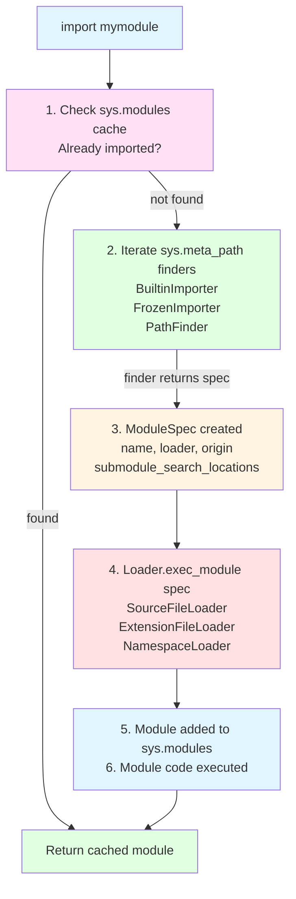

<!-- SSM:CHUNK_BOUNDARY id="ch08-start" -->
📘 CHAPTER 8 — MODULES, PACKAGES & PROJECT STRUCTURE 🟢 Beginner

Depth Level: 3
Python Versions: 3.8–3.14+
Prerequisites: Chapters 1–7

8.0 Overview

Modules and packages provide organizational structure, encapsulation, reusability, and deployment for Python projects.

This chapter explains:

What modules are

How imports work

How Python resolves names

sys.path and import search paths

Namespace packages (PEP 420)

Package layouts

pyproject.toml

Modern build systems

Versioning & distribution

Best practices for structuring real-world applications

We also introduce:

intra-package imports

absolute vs relative imports

top-level vs local imports

import caching

circular import avoidance

packaging libraries

8.1 What Is a Module?

A module is any .py file.

Example project:

app/
  main.py
  utils.py


Inside main.py:

import utils


Everything in utils.py becomes namespaced under utils.

8.2 Import Mechanics (Critical Topic)

8.2.0 Import System Flow Diagram



Try This: Explore the import system interactively:

```python
import sys
import importlib.util

# Check what's in sys.modules
print(f"Modules loaded: {len(sys.modules)}")
# Output: Modules loaded: 150

# Inspect a module's spec
spec = importlib.util.find_spec("json")
print(f"JSON module origin: {spec.origin}")
# Output: JSON module origin: /usr/lib/python3.13/json/__init__.py

# See the meta path finders
print(f"Meta path finders: {len(sys.meta_path)}")
for finder in sys.meta_path:
    print(f"  - {type(finder).__name__}")
# Output: Meta path finders: 3
# Output:   - BuiltinImporter
# Output:   - FrozenImporter
# Output:   - PathFinder
```

Python imports follow this lifecycle:

Check sys.modules (import cache)

Find module on sys.path

Load module (source → bytecode)

Execute module top-to-bottom

Store module in sys.modules

8.2.1 sys.modules

A dict of all already imported modules:

import sys
print(sys.modules["os"])


Importing the same module twice does not re-run it.

8.2.2 sys.path

Python searches for modules in:

import sys
print(sys.path)


Order:

Script directory

PYTHONPATH

Site-packages

Standard library

8.2.3 Import caching

Python stores compiled bytecode in:

__pycache__/


Example:

utils.cpython-312.pyc


This speeds up imports.

8.3 Absolute vs Relative Imports
8.3.1 Absolute Import
from project.module import func

8.3.2 Relative Import

Inside a package:

from .helpers import util
from ..core.base import BaseClass


Relative imports depend on package structure.

8.4 Packages

A package is a directory with Python modules.

Modern Python does not require __init__.py for a namespace package, but does require it for a regular package.

Example:

myapp/
  __init__.py
  models/
    __init__.py
    user.py

8.4.1 Regular packages

Directory + __init__.py.

__init__.py runs on import.

8.4.2 Namespace packages (PEP 420)

Directory without __init__.py.

Used for:

plugin systems

large vendors (Google, AWS)

multi-repo projects

Example:

google/
  cloud/
    storage/
  cloud/
    compute/


These directories merge into one namespace.

8.5 init.py: What It Really Does

__init__.py controls:

package exports

initialization

re-exports

module availability

Example:

# myapp/models/__init__.py
from .user import User
from .invoice import Invoice

__all__ = ["User", "Invoice"]

8.6 Handling Circular Imports

Circular imports occur when:

a imports b
b imports a


Solution strategies:

✔ Move imports inside functions
def use_db():
    from .db import connect

✔ Refactor into common module (common.py)
✔ Use type-check–only imports
from __future__ import annotations


Or:

if typing.TYPE_CHECKING:
    from .models import User

8.7 Project Layout Patterns

Three main patterns.

8.7.1 Flat Script Layout (small scripts)
script.py

8.7.2 Basic Package Layout (small libraries)
myproj/
  myproj/
    __init__.py
    main.py
  pyproject.toml

8.7.3 Professional Application Layout (recommended)
myapp/
  myapp/
    __init__.py
    core/
      __init__.py
      config.py
      logging.py
    api/
      __init__.py
      routes.py
    services/
      __init__.py
      users.py
      payments.py
  tests/
  pyproject.toml
  README.md

8.8 pyproject.toml (PEP 518+)

Modern Python builds use this file.

Example:

[project]
name = "myapp"
version = "0.1.0"
description = "Example project"
dependencies = [
    "requests",
    "pydantic>=2.0",
]

[build-system]
requires = ["setuptools>=61.0"]
build-backend = "setuptools.build_meta"


This replaces:

setup.py

requirements.txt

setup.cfg

MANIFEST.in

8.9 Virtual Environments
8.9.1 venv

Standard tool:

python -m venv .venv
source .venv/bin/activate

8.9.2 pyenv (Python version manager)

Install & switch versions:

pyenv install 3.12.0
pyenv global 3.12.0

8.9.3 pipx

Install isolated CLI tools:

pipx install black

8.10 Packaging & Distribution

Workflow:

write code

write pyproject.toml

build package

publish to PyPI

Build:

python -m build


Upload:

twine upload dist/*

8.11 Import Style Guide & Best Practices
✔ Use absolute imports
✔ Prefer explicit exports via __all__
✔ Do not put top-level code in modules
✔ Keep packages small and focused
✔ Avoid circular imports by design
✔ Group related modules into subpackages
8.12 Mini Example — Utilities Package
myproj/
  utils/
    __init__.py
    math.py
    strings.py
  main.py


Use:

from utils.math import add
from utils.strings import slugify

8.13 Macro Example — Production-Ready Package
myservice/
  myservice/
    __init__.py
    config.py
    http/
      __init__.py
      client.py
    db/
      __init__.py
      models.py
      repository.py
  scripts/
    seed_db.py
  tests/
  pyproject.toml


Main entrypoint:

# myservice/__main__.py
from .http.client import HttpClient
from .config import load_config

def main():
    config = load_config()
    client = HttpClient(config.api_url)
    print(client.get_status())

if __name__ == "__main__":
    main()


Run:

python -m myservice

8.14 Pitfalls & Warnings

⚠ Circular imports
⚠ Name shadowing (json.py shadowing stdlib json)
⚠ Multiple namespace packages conflicting
⚠ Accidental re-execution via relative paths
⚠ Adding directories to sys.path (avoid)
⚠ Having both src/ and root code (use src layout)

8.15 Summary & Takeaways

Modules are single Python files

Packages are module directories

Namespace packages allow multi-repo organization

Imports follow sys.modules → sys.path → file loading

pyproject.toml is the modern packaging standard

Recommended project layout improves maintainability

Proper import strategy prevents circular dependencies

8.16 Next Chapter

Proceed to:

👉 Chapter 9 — Standard Library Essentials
Covers:

os, sys, pathlib

collections, heapq, bisect

re (regex)

json, csv, configparser

datetime, zoneinfo

subprocess

logging
