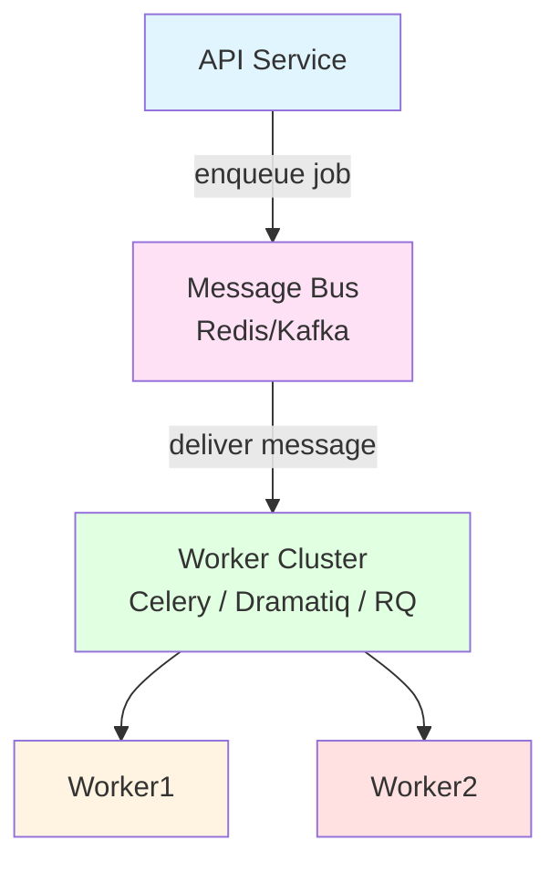

<!-- SSM:CHUNK_BOUNDARY id="ch25-start" -->
📘 CHAPTER 25 — SCHEDULING, BACKGROUND JOBS & TASK QUEUES 🟡 Intermediate

Depth Level: 3
Python Versions: 3.8 → 3.14+
Prerequisites: Chapters 1–23

24.0 Overview

Modern Python systems rarely run only synchronous API calls. Most production workloads require:

long-running tasks

background jobs

asynchronous work scheduling

retry mechanisms

distributing tasks across workers

cron-like recurring jobs

workflow orchestration

This chapter covers:

Local Background Tasks (FastAPI, Django)

In-Process Scheduling (APScheduler)

Distributed Task Queues:

Celery

RQ

Dramatiq

Streaming & Consumption:

Kafka

Redis Streams

Workflow Orchestration:

Airflow

Prefect

Dagster

Advanced Patterns:

exponential backoff

job deduplication

idempotency keys

distributed locking

rate limiting

event-driven pipelines

24.1 The Spectrum of Task Execution Models
flowchart LR
    A[In-Request Execution] --> B[Background Task in App Process]
    B --> C[Local Scheduler]
    C --> D[Distributed Task Queue]
    D --> E[Streaming Consumer]
    E --> F[Workflow Orchestrator]

Each step adds:

scalability

reliability

observability

complexity

24.2 Background Tasks (FastAPI, Django)

Best for quick, non-critical tasks:

send email

audit logging

caching

lightweight post-processing

24.2.1 FastAPI Background Tasks
from fastapi import BackgroundTasks

async def send_email(to):
    ...

@app.post("/register")
async def register(user: User, bg: BackgroundTasks):
    bg.add_task(send_email, user.email)
    return {"status": "queued"}

Limitations:

runs in API process

crashes if server restarts

not scalable

no retries

24.3 APScheduler — Local Cron & Interval Jobs

Useful for:

periodic cleanup

refreshing tokens

small scheduled tasks

internal cron

Install:

pip install apscheduler

24.3.1 Interval Job
from apscheduler.schedulers.asyncio import AsyncIOScheduler

scheduler = AsyncIOScheduler()

@scheduler.scheduled_job("interval", seconds=30)
async def cleanup():
    print("cleaning...")

scheduler.start()

24.3.2 Cron Job
@scheduler.scheduled_job("cron", hour=3, minute=0)
async def nightly():
    ...

Limitations:

in-process

not distributed

not robust for large workloads

24.4 Distributed Task Queues

These handle reliable, scalable, asynchronous work.

Comparison:

Feature	Celery	RQ	Dramatiq
Broker	Redis/RabbitMQ	Redis	Redis/RabbitMQ
Retries	Yes	Basic	Yes
Scheduling	Yes	External	Yes
Performance	High	Moderate	Very High
Code ergonomics	Complex	Simple	Simple & modern

Celery is still the enterprise standard.

24.5 Celery — The King of Python Task Queues

Install:

pip install celery

24.5.1 Directory Structure
project/
  celery.py
  tasks.py

24.5.2 celery.py
from celery import Celery

app = Celery(
    "project",
    broker="redis://localhost:6379/0",
    backend="redis://localhost:6379/1"
)

24.5.3 tasks.py
from project.celery import app

@app.task
def add(x, y):
    return x + y

24.5.4 Executing Tasks
add.delay(1, 2)

24.5.5 Retries
@app.task(bind=True, max_retries=5)
def process(self, item_id):
    try:
        ...
    except Exception as e:
        raise self.retry(exc=e, countdown=60)

24.6 Dramatiq — Modern, Fast Alternative

Install:

pip install dramatiq

24.6.1 Example
import dramatiq

@dramatiq.actor
def process(order_id):
    ...

Background workers:

dramatiq project.tasks

24.7 RQ — Redis Queue

Simple and effective for:

web apps

job dashboards

small distributed queues

Example:

import rq
from redis import Redis

queue = rq.Queue(connection=Redis())

def job(x):
    return x * 2

queue.enqueue(job, 5)

24.8 Task Scheduling & Distributed Cron

Options:

Celery beat

APScheduler with distributed executors

Kubernetes CronJobs

Airflow

Prefect

24.9 Kubernetes CronJobs

Example:

apiVersion: batch/v1
kind: CronJob
metadata:
  name: cleanup
spec:
  schedule: "0 * * * *"
  jobTemplate:
    spec:
      template:
        spec:
          containers:
          - name: worker
            image: myapp:latest
            args: ["python", "scripts/cleanup.py"]
          restartPolicy: OnFailure

24.10 Advanced Task Patterns
24.10.1 Exponential Backoff
def backoff(n):
    return min(60, 2 ** n)

24.10.2 Idempotency Keys
if redis.exists(f"job:{idempotency_key}"):
    return  # already processed

24.10.3 Job Deduplication

Use hashing:

job_id = hashlib.sha256(payload).hexdigest()

24.10.4 Distributed Locks

Using Redis:

with redis.lock("job:123", timeout=30):
    process()

24.10.5 Exactly-Once Processing (Hard)

Not possible with:

RabbitMQ (at-most-once, at-least-once)

Redis

Possible strategies:

idempotent handlers

database constraints

deduplication tables

24.11 Streaming Consumers

Used for:

logs

metrics

real-time ETL

high-throughput events

24.11.1 Kafka Consumer (confluent-kafka)
from confluent_kafka import Consumer

c = Consumer({
    "bootstrap.servers": "localhost",
    "group.id": "mygroup",
})
c.subscribe(["events"])

while True:
    msg = c.poll(1.0)

24.12 Workflow Orchestration Systems

These manage complex workflows, DAGs, retries, and schedules.

24.12.1 Airflow

Best for:

ETL

batch processing

DAG orchestration

DAG Example
from airflow import DAG
from airflow.operators.python import PythonOperator

with DAG("example", schedule="@daily") as dag:
    t1 = PythonOperator(
        task_id="task1",
        python_callable=lambda: print("Hello")
    )

24.12.2 Prefect

Easier, cloud-native alternative.

from prefect import flow, task

@task
def extract():
    ...

@flow
def pipeline():
    extract()

24.12.3 Dagster

Great for data engineering pipelines.

24.13 Observability for Task Queues

Metrics to collect:

job execution time

job failure count

queue length

retries

worker health

throughput

Use Prometheus:

JOB_DURATION.observe(duration)

24.14 Anti-Patterns

⚠ running long jobs inside the API process
⚠ using APScheduler for distributed scheduling
⚠ using Celery without retry or timeout
⚠ running workers without concurrency limits
⚠ storing large payloads in Redis
⚠ forgetting idempotency
⚠ missing metrics on workers
⚠ mixing sync and async workers
⚠ not monitoring queue length

24.15 Macro Example — Distributed Task Architecture

24.16 Summary & Takeaways

Background tasks should not handle heavy workloads

APScheduler is great for local cron jobs

Celery and Dramatiq are the enterprise standards

Task queues must be idempotent

Distributed cron should be done in Kubernetes or Airflow

Streaming is essential for event-driven systems

Workflow orchestrators handle complex DAGs

Observability is mandatory: logs, metrics, traces

Avoid anti-patterns like long-running sync tasks in APIs

24.17 Next Chapter

Proceed to:

👉 Chapter 26 — Deployment Architectures & Production Topologies

Including:

monolith vs microservices

serverless vs containerized

message-driven architecture

load balancing

zero-downtime deployments

blue/green & canary releases

global scale patterns

service meshes

API gateways

caching layers

high-availability design
