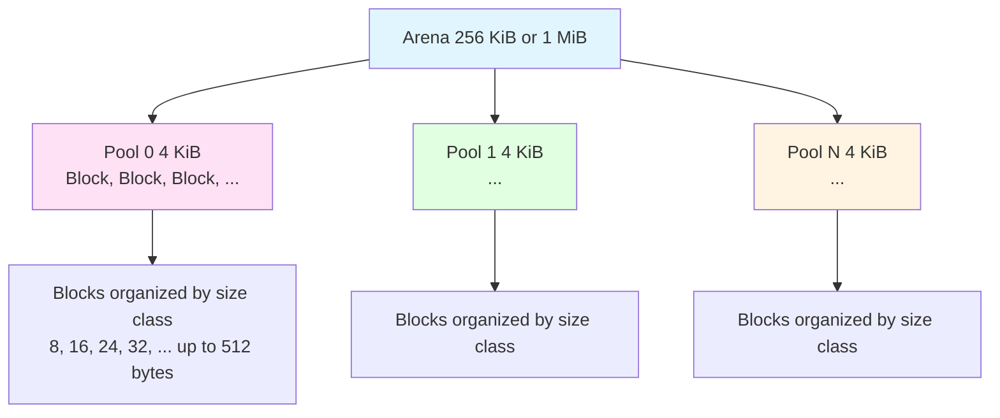

<!-- SSM:CHUNK_BOUNDARY id="ch28-start" -->
📘 CHAPTER 28 — CPython INTERNALS & MEMORY ARCHITECTURE 🔴 Advanced

Depth Level: 4
Python Versions: 3.8 → 3.14+ (emphasis on 3.11–3.14)
Prerequisites: Chapters 1–26, C programming familiarity highly recommended

28.0 Overview

This chapter explains:

how CPython stores objects

how memory management works

how reference counting is implemented

how garbage collection handles ref cycles

how the PyObject header is structured

how lists, dicts, sets, tuples, strings are implemented

how the interpreter loop works

how CPython compiles Python code to bytecode

how the new JIT compiler (3.13+) works

how the GIL is implemented

how function calls work internally

how coroutines and generators map to C structures

how exceptions propagate in native code

This is the deepest reveal of “how Python really works.”

28.1 CPython as a C Program

CPython is essentially:

a C library

an interpreter

a runtime environment

a memory manager

a garbage collector

a virtual machine

a bytecode engine

a JIT compiler (3.13+)

The executable python simply embeds the CPython runtime.

28.2 The PyObject Structure

Every Python object begins with a PyObject header:

typedef struct _object {
    Py_ssize_t ob_refcnt;
    PyTypeObject *ob_type;
} PyObject;


Two universal fields:

1. ob_refcnt — reference count

Controls object lifetime.

2. ob_type — pointer to type object

Stores:

method table

slots

numeric operations

memory layout

attribute lookup functions

28.3 Objects With Value Fields

Most built-in types have extended structs:

Example: integers (PyLongObject)

typedef struct {
    PyObject ob_base;
    Py_ssize_t ob_size;   // number of digits
    digit ob_digit[1];    // variable-length array
} PyLongObject;


Strings, lists, dicts, sets… all have specialized layouts.

28.4 Memory Allocation in CPython

CPython uses a layered memory allocator:

flowchart TD
    A[CPython Code] --> B[PyObject Arena Allocator]
    B --> C[obmalloc - object allocator]
    C --> D[malloc - system allocator]

Key components:

obmalloc — optimized allocator for small Python objects

arenas — large chunks subdivided into "pools"

pools — collections of fixed-size blocks

blocks — used to store PyObjects

28.4.1 obmalloc Architecture: Arenas, Pools, Blocks

Memory Allocation Hierarchy:



Size Classes: Blocks are organized by size (8, 16, 24, 32, ... up to 512 bytes)

Arenas: 256 KiB (32-bit) or 1 MiB (64-bit) chunks

Pools: 4 KiB pages within arenas

Blocks: Actual allocation units, size-classed

28.4.2 obmalloc Tuning Knobs

Environment variables for debugging and tuning:

```bash
# Enable obmalloc statistics
PYTHONMALLOCSTATS=1 python script.py
# Output: Detailed allocation statistics

# Use debug allocator (slower, but detects errors)
PYTHONMALLOC=debug python script.py

# Disable obmalloc (use system malloc directly)
PYTHONMALLOC=malloc python script.py
```

Memory profiling with obmalloc:

```python
import sys

# Check if obmalloc is active
if hasattr(sys, 'getallocatedblocks'):
    blocks = sys.getallocatedblocks()
    print(f"Allocated blocks: {blocks}")
    # Output: Allocated blocks: 12345
```

Fragmentation behavior: Long-lived objects can cause memory bloat even when freed, due to pool fragmentation. Consider using object pools for frequently allocated/deallocated objects.

Benefits:

speed

locality

reduced fragmentation

28.5 Reference Counting

CPython uses immediate reference counting:

ob_refcnt++
ob_refcnt--
if ob_refcnt == 0:
    free object

Why?

deterministic destruction

predictable memory use

simple GC model

Downsides:

overhead for increment/decrement

poor multi-thread scaling (GIL partly needed)

cannot collect cycles alone

28.6 Cycle Detection (Generational GC)

Ref cycles require tracing GC:

Generation 0

Generation 1

Generation 2

Objects survive promotions across generations.

GC algorithm:

Identify containers (Py_TPFLAGS_HAVE_GC)

Build graph

Find unreachable cycles

Free the cycle

Generation thresholds control when GC triggers.

28.7 The GIL (Global Interpreter Lock)

The GIL ensures only one thread executes Python bytecode at a time.

Why?

CPython not thread-safe

refcount operations are not atomic

simplifies interpreter engine

Thread switching occurs:

every N bytecode instructions

on I/O operations

on explicit time.sleep()

on waiting for locks

on releasing/acquiring GIL manually in C extensions

28.8 Python 3.13 Free-Threading Mode

Python 3.13 introduces optional free-threading, removing the GIL.

Mechanisms:

atomic refcount operations

thread-safe object access

lock-free specialized data structures

new memory fences

Performance cost:

~10–15% overhead

JIT helps reclaim performance

not yet fully stable for all workloads

28.9 Interpreter Architecture

CPython execution pipeline:

flowchart TD
    A[Source Code] --> B[Tokenizer/Lexer]
    B --> C[Parser → AST]
    C --> D[Bytecode Compiler]
    D --> E[Optimizer]
    E --> F[Code Object]
    F --> G[Interpreter Loop]

28.10 Tokenizer & Parser
Tokenizer:

Transforms characters → tokens
Example tokens:

NAME

NUMBER

STRING

INDENT / DEDENT

operators

Parser:

Based on PEG parser (Python 3.9+).

Produces an AST (Abstract Syntax Tree).

28.11 Bytecode Compiler

AST → Control Flow → Bytecode

Steps:

build symbol table

allocate locals & cells

compile expressions

compile statements

optimize constants

produce code object

Example:
x = a + b


Bytecode:

LOAD_NAME a
LOAD_NAME b
BINARY_ADD
STORE_NAME x

28.12 Code Objects

Python stores executable code in PyCodeObject:

typedef struct {
    PyObject_HEAD
    int co_argcount;
    int co_kwonlyargcount;
    int co_nlocals;
    PyObject *co_consts;
    PyObject *co_names;
    PyObject *co_varnames;
    PyObject *co_code;  // bytecode sequence
} PyCodeObject;


Every function has:

code object

globals

defaults

closure cells

28.13 Frame Objects

A PyFrameObject represents a call frame:

f_locals
f_globals
f_builtins
f_stack
f_code
f_back


Frames represent the call stack.

28.14 The Evaluation Loop (Bytecode Interpreter)

Core loop implemented in ceval.c.

Pseudocode:

for (;;) {
    opcode = *ip++;
    switch(opcode) {
        case LOAD_FAST:
            push(fastlocals[index]);
            break;
        case CALL:
            build stack frame;
            call function;
            break;
        case RETURN_VALUE:
            return top-of-stack;
    }
}

28.15 Python 3.11+ (Adaptive Interpreter)

Introduces:

Specialized bytecode

Inline caches

Adaptive tiers

How it works:

Interpreter runs normally

It measures runtime behavior

It specializes opcodes (e.g., BINARY_ADD → BINARY_ADD_INT)

Writes inline caches into bytecode stream

Future executions become faster

28.16 Python 3.13 JIT Compiler (Tier 2 Execution)

Python 3.13 adds baseline JIT (tier 2):

Architecture:

flowchart TD
    A[Tier 0: Interpreter] --> B[Tier 1: Adaptive Interpreter]
    B --> C[Tier 2: JIT Compiler]
    C --> D[Native Machine Code]


The JIT:

compiles hot bytecode traces

optimizes function calls

eliminates redundant type checks

inlines small functions

supports free-threading

Results:

⚠️ Real-world benchmarks: The 3.13 experimental JIT typically shows 5–15% speedups on the standard pyperformance suite. Certain micro-benchmarks and hot loops can see larger gains (20–50%), but I/O-bound and extension-heavy workloads often see little change.

Caveats:

JIT warmup time affects short-running scripts

Benefits are workload-dependent (numeric/control-flow heavy code benefits most)

Enable with: PYTHON_JIT=1 python script.py

Benchmark your specific workload; don't assume universal speedups.

28.17 Object Implementations
28.17.1 Lists

Lists are dynamic arrays:

allocated >= size


Growth strategy:

roughly 1.125× expansion

amortized O(1) append

Memory layout:

PyObject** ob_item
Py_ssize_t allocated
Py_ssize_t size

28.17.2 Dictionaries

Dicts use compact hash tables:

split-table design (3.6+)

insertion-ordered

Operations:

O(1) average lookup

open addressing

perturb-based probing

Memory layout:

ma_keys
ma_values
ma_used
ma_version

28.17.3 Strings (Unicode)

Python uses flexible string representation:

Latin-1 (1 byte per char)

UCS-2 (2 bytes)

UCS-4 (4 bytes)

Automatic selection based on content.

28.17.4 Tuples

Immutable fixed-size arrays.

Allocated in a single block.

28.17.5 Sets

Hash table with open addressing.

28.17.6 Generators

Struct contains:

frame pointer

instruction pointer

yield value

stack

28.18 Exception Handling Internals

Exception propagation is implemented by:

setting thread’s exception state

unwinding frame chain

checking handler tables

Exception state struct:

PyObject *exc_type;
PyObject *exc_value;
PyObject *exc_traceback;

28.19 C API Model

The Python C API exposes:

creating objects

manipulating dictionaries/lists

writing custom types

releasing/acquiring GIL

embedding Python in C

Example:

PyObject* result = PyLong_FromLong(123);

28.20 Extension Modules

Common patterns:

CPython C API

Cython

cffi

pybind11

These bypass Python-level overhead.

28.21 Summary & Takeaways

every Python object is a C struct

Python uses reference counting + generational GC

the GIL exists because CPython's memory model is not thread-safe

Python’s bytecode engine is a stack-based VM

3.11 introduced adaptive interpreter optimizations

3.13+ introduces a real JIT compiler

lists/dicts/strings have highly optimized memory layouts

exceptions use stack unwinding

C API enables native extension modules

Understanding CPython internals is essential for:

performance engineering

debugging deep issues

writing fast extensions

reasoning about concurrency

optimizing memory-heavy code
