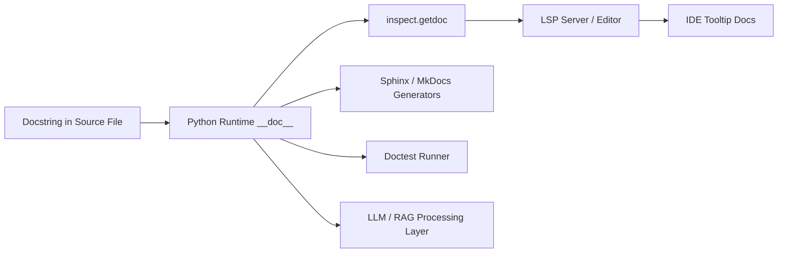

<!-- SSM:CHUNK_BOUNDARY id="ch30-start" -->
📘 CHAPTER 30 — DOCSTRINGS: FORMAL SEMANTICS, STYLES & ENTERPRISE GOVERNANCE 🟠 Advanced

Depth Level: 4
Python Versions: 3.8–3.14+
Prerequisites: Chapters 1–5, 12, 18

> **Quick Answer:**  
> - A docstring is a string literal placed as the first statement in a module, class, or function.  
> - It defines the public contract of your API and is consumed by IDEs, Sphinx, inspect(), doctest, and LLM/RAG systems.  
>
> **Example — Correct Pattern:**  
> ```python
> # ✅ Correct docstring pattern
> def add(x: int, y: int) -> int:
>     """Add two integers and return their sum."""
>     return x + y
> ```  
>
> **Estimated time:** 2–3 hours  
> **When you need this:** Any time you define a public API, library, or maintain internal tooling.

---

# **30.0 Overview**

Docstrings are the foundation of Python documentation and the primary mechanism for describing program behavior, API contracts, and module intent. They are parsed by the Python runtime, type tools, documentation generators, IDEs, and LLM-based assistants.

In this chapter you will learn:

- How docstrings work at the compiler and runtime level  
- The differences between Google, NumPy, and Sphinx/RST styles  
- How to document modules, classes, functions, async functions, and generators  
- Enterprise-level governance for docstring quality and CI enforcement  
- Pitfalls, anti-patterns, war stories, and best practices  

This topic matters because **clean docstrings directly improve maintainability, correctness, API usability, and LLM comprehension.**

---

# **30.1 Docstrings in Python's Language Model**

## **30.1.1 What Docstrings Are (Formal Definition)**

A docstring is a **string literal** in the first statement of a module, class, or function.  
Python stores it on the object's `__doc__` attribute.

Formally:

```
docstring ::= STRING_LITERAL
suite ::= docstring? statement*
```

Python exposes docstrings via:

- `obj.__doc__`  
- `inspect.getdoc()`  
- `help()`  

```python
# ✅ CORRECT: Basic docstring example
def greet(name: str) -> str:
    """Return a greeting message for the given name."""
    return f"Hello, {name}!"

# Access the docstring
print(greet.__doc__)  # Returns: "Return a greeting message for the given name."
```

---

## **30.1.2 Docstring Lifecycle Diagram**



This diagram illustrates how docstrings flow from source code through Python's runtime into various documentation and tooling systems. When you write a docstring, it becomes immediately available to multiple consumers without any additional processing.

---

## **30.1.3 Docstring Styles (Observed Across Industry)**

### **Google-Style (RECOMMENDED)**

Readable, modern, compatible with Sphinx (via napoleon):

```python
# ✅ CORRECT: Google-style docstring
def scale(x: float, factor: float) -> float:
    """Scale a numeric value by a given factor.

    Args:
        x: Input value.
        factor: The number to multiply by.

    Returns:
        The scaled result.
    """
    return x * factor
```

### **NumPy-Style**

Common in scientific fields:

```python
# ✅ CORRECT: NumPy-style docstring
def scale(x, factor):
    """
    Scale a numeric value.

    Parameters
    ----------
    x : float
        Input value to be scaled.
    factor : float
        Scaling factor to apply.

    Returns
    -------
    float
        The scaled result.
    """
    return x * factor
```

### **Sphinx/RST Style**

Traditional reStructuredText format:

```python
# ✅ CORRECT: Sphinx/RST style docstring
def scale(x, factor):
    """
    Scale a numeric value.

    :param x: Input value.
    :type x: float
    :param factor: Scale factor.
    :type factor: float
    :returns: Scaled result.
    :rtype: float
    """
    return x * factor
```

**Style Selection Guidelines:**

- **Google-style** — Default choice for modern Python projects  
- **NumPy-style** — Scientific computing, data analysis, numerical libraries  
- **Sphinx/RST** — Legacy codebases, existing projects with established conventions  

---

## **30.1.4 Documenting All Python Constructs**

### **Modules**

```python
# ✅ CORRECT: Module-level docstring
"""Authentication utilities for login and password validation.

This module provides core authentication functionality including
user credential validation, session management, and token generation.
"""

import hashlib
import secrets
```

### **Classes**

```python
# ✅ CORRECT: Class docstring with attributes
class RateLimiter:
    """Token-bucket rate limiter with adjustable burst window.

    Attributes:
        rate: Tokens added per second.
        burst: Extra capacity available during spikes.
        tokens: Current token count.
    """

    def __init__(self, rate: float, burst: int):
        """Initialize the rate limiter.

        Args:
            rate: Tokens per second.
            burst: Maximum burst capacity.
        """
        self.rate = rate
        self.burst = burst
        self.tokens = burst
```

### **Functions / Methods**

```python
# ✅ CORRECT: Function with comprehensive docstring
def login_user(username: str, password: str) -> bool:
    """Authenticate a user against the credentials database.

    Args:
        username: The user's login name.
        password: Raw password input.

    Returns:
        True if the user is authenticated; otherwise False.

    Raises:
        AuthenticationError: If credentials are invalid.
        DatabaseError: If the database is unavailable.
    """
    # Implementation here
    pass
```

### **Async Functions**

```python
# ✅ CORRECT: Async function docstring
async def fetch_user(uid: str) -> dict:
    """Fetch a user record asynchronously from the database.

    Args:
        uid: Unique user identifier.

    Returns:
        Dictionary containing user data with keys: id, name, email.

    Raises:
        UserNotFoundError: If the user does not exist.
    """
    # Implementation here
    pass
```

### **Generators**

```python
# ✅ CORRECT: Generator docstring
def read_lines(path: str):
    """Yield lines lazily from a file.

    Args:
        path: Path to the text file.

    Yields:
        str: Each line from the file with trailing whitespace stripped.

    Raises:
        FileNotFoundError: If the file does not exist.
        PermissionError: If the file cannot be read.
    """
    with open(path) as f:
        for line in f:
            yield line.rstrip()
```

### **Properties**

```python
# ✅ CORRECT: Property docstring
class User:
    """User account representation."""

    def __init__(self, first: str, last: str):
        self._first = first
        self._last = last

    @property
    def full_name(self) -> str:
        """Return the user's full name.

        Returns:
            Concatenated first and last name separated by a space.
        """
        return f"{self._first} {self._last}"
```

---

## **30.1.5 Try This**

**Try This:**  
Write Google-style docstrings for a class you created earlier in Chapter 7 (Classes & OOP).  
Your docstring must include:

1. A 1-line summary  
2. Attributes section  
3. Args/Returns/Raises sections for methods  
4. Realistic usage example in the class docstring  

Verify your docstrings by running:
```python
print(YourClass.__doc__)
print(YourClass.method.__doc__)
```

---

# **30.2 Enterprise Documentation Governance**

## **30.2.1 Style Requirements**

Your Python Bible mandates **Google-style docstrings** for standard development.  
NumPy style is permitted only for numerical modules where the scientific community expects it.

**Rationale:**

- Google-style has excellent IDE support  
- Sphinx/napoleon provides seamless integration  
- Most readable for junior developers  
- Consistent with modern Python ecosystem standards  

---

## **30.2.2 Docstring Coverage Rules**

All public-facing objects must have docstrings:

- Public modules  
- Public classes  
- Public functions/methods  
- Public module-level constants (when semantically complex)  

**Minimum acceptable coverage in CI: 95%**

Private objects (prefixed with `_`) are exempt but should still be documented when their behavior is non-trivial.

```python
# ✅ CORRECT: Public function with docstring
def process_payment(amount: float, currency: str) -> bool:
    """Process a payment transaction."""
    return _validate_and_charge(amount, currency)

# ✅ CORRECT: Private function can skip docstring for simple cases
def _validate_and_charge(amount: float, currency: str) -> bool:
    # Implementation
    return True
```

---

## **30.2.3 CI Enforcement**

### **Using pydocstyle**

```yaml
# ✅ CORRECT: GitHub Actions workflow for docstring linting
- name: Docstring Lint
  run: |
    pip install pydocstyle
    pydocstyle src/
```

### **Configuration**

```ini
# .pydocstyle.ini
[pydocstyle]
convention = google
add-ignore = D100,D104
match-dir = (?!tests)[^\.].*
```

### **Using interrogate for Coverage**

```yaml
# ✅ CORRECT: Docstring coverage enforcement
- name: Check Docstring Coverage
  run: |
    pip install interrogate
    interrogate src/ --fail-under 95 --verbose
```

---

## **30.2.4 Optional Policy Integration**

For organizations using Policy-as-Code frameworks:

```rego
# ✅ CORRECT: OPA policy for docstring enforcement
package python.docstrings

deny[msg] {
  fn := input.functions[_]
  fn.public == true
  not fn.has_docstring
  msg := sprintf("Missing docstring: %s", [fn.name])
}

deny[msg] {
  cls := input.classes[_]
  cls.public == true
  not cls.has_docstring
  msg := sprintf("Missing class docstring: %s", [cls.name])
}
```

---

# **30.3 Advanced Docstring Patterns**

## **30.3.1 Documenting Complex Return Types**

```python
# ✅ CORRECT: Detailed return type documentation
def parse_config(path: str) -> dict[str, Any]:
    """Parse a YAML configuration file.

    Args:
        path: Path to the YAML configuration file.

    Returns:
        Dictionary containing parsed configuration with structure:
        {
            "database": {
                "host": str,
                "port": int,
                "credentials": dict
            },
            "logging": {
                "level": str,
                "handlers": list[str]
            }
        }

    Raises:
        FileNotFoundError: If the configuration file does not exist.
        YAMLError: If the file contains invalid YAML syntax.
    """
    pass
```

---

## **30.3.2 Documenting Type Variables and Generics**

```python
# ✅ CORRECT: Generic function with type variable documentation
from typing import TypeVar, Callable

T = TypeVar('T')

def retry(func: Callable[[], T], max_attempts: int = 3) -> T:
    """Retry a function until it succeeds or max attempts is reached.

    Type Parameters:
        T: The return type of the function being retried.

    Args:
        func: Zero-argument callable to retry.
        max_attempts: Maximum number of retry attempts.

    Returns:
        The result of the successful function call.

    Raises:
        MaxRetriesExceeded: If all retry attempts fail.
    """
    pass
```

---

## **30.3.3 Documenting Context Managers**

```python
# ✅ CORRECT: Context manager documentation
from contextlib import contextmanager

@contextmanager
def database_transaction():
    """Context manager for database transactions with automatic rollback.

    Yields:
        Database connection with an open transaction.

    Examples:
        >>> with database_transaction() as conn:
        ...     conn.execute("INSERT INTO users VALUES (?, ?)", ("alice", 30))
        ...     # Transaction commits on successful exit

        >>> with database_transaction() as conn:
        ...     conn.execute("INSERT INTO users VALUES (?, ?)", ("bob", 25))
        ...     raise ValueError("Oops")
        ...     # Transaction rolls back on exception
    """
    pass
```

---

## **30.3.4 Documenting Decorators**

```python
# ✅ CORRECT: Decorator documentation
from functools import wraps
from typing import Callable, TypeVar, ParamSpec

P = ParamSpec('P')
T = TypeVar('T')

def memoize(func: Callable[P, T]) -> Callable[P, T]:
    """Decorator that caches function results based on arguments.

    Args:
        func: Function to memoize. Must have hashable arguments.

    Returns:
        Wrapped function with caching behavior.

    Examples:
        >>> @memoize
        ... def fibonacci(n: int) -> int:
        ...     if n < 2:
        ...         return n
        ...     return fibonacci(n-1) + fibonacci(n-2)
    """
    cache = {}
    
    @wraps(func)
    def wrapper(*args: P.args, **kwargs: P.kwargs) -> T:
        key = (args, tuple(sorted(kwargs.items())))
        if key not in cache:
            cache[key] = func(*args, **kwargs)
        return cache[key]
    
    return wrapper
```

---

# **30.4 Pitfalls & Warnings**

## **30.4.1 Anti-Patterns**

❌ **Do not write vague docstrings:**

```python
# ❌ INCORRECT: Provides no useful information
def process_data(data):
    """Process data."""
    pass
```

❌ **Do not restate the function name:**

```python
# ❌ INCORRECT: Just repeats what the name already says
def add(x, y):
    """Add function."""
    return x + y
```

❌ **Do not omit exceptions:**

```python
# ❌ INCORRECT: Missing Raises section
def parse_int(value: str) -> int:
    """Convert a string to an integer."""
    return int(value)  # Can raise ValueError!
```

❌ **Do not include implementation details:**

```python
# ❌ INCORRECT: Describes how instead of what
def authenticate(user: str, pwd: str) -> bool:
    """Check password by computing SHA256 hash and comparing with database.
    
    Uses the hashlib library to compute the hash, then queries the users
    table in PostgreSQL using SQLAlchemy ORM.
    """
    pass
```

---

## **30.4.2 Prefer Correct Patterns**

```python
# ✅ CORRECT: Clear, complete, focused on contract
def parse_int(value: str) -> int:
    """Convert a string to an integer.

    Args:
        value: String representation of an integer.

    Returns:
        The integer value.

    Raises:
        ValueError: If the string cannot be converted to an integer.
    """
    return int(value)
```

```python
# ✅ CORRECT: Describes behavior, not implementation
def authenticate(user: str, pwd: str) -> bool:
    """Verify user credentials against stored credentials.

    Args:
        user: Username to authenticate.
        pwd: Password to verify.

    Returns:
        True if credentials are valid; False otherwise.

    Raises:
        DatabaseError: If credential verification fails due to database issues.
    """
    pass
```

---

## **30.4.3 Security Warnings**

**Never include sensitive information in docstrings:**

- ❌ API keys, tokens, or credentials  
- ❌ Internal server names or infrastructure details  
- ❌ Security algorithms or salt values  
- ❌ Database schemas with security implications  

**Do not expose internal exceptions in public API docstrings:**

```python
# ❌ INCORRECT: Exposes internal implementation details
def fetch_user(uid: str) -> dict:
    """Fetch user from database.
    
    Raises:
        psycopg2.OperationalError: If PostgreSQL connection fails.
        redis.ConnectionError: If Redis cache is unavailable.
    """
    pass

# ✅ CORRECT: Public API uses abstracted exceptions
def fetch_user(uid: str) -> dict:
    """Fetch user from database.
    
    Raises:
        DatabaseError: If user data cannot be retrieved.
        UserNotFoundError: If the user does not exist.
    """
    pass
```

---

## **30.4.4 Common Pitfalls**

**Outdated Docstrings:**

When you refactor code, update docstrings immediately. Stale documentation is worse than no documentation.

```python
# ❌ INCORRECT: Docstring doesn't match signature
def process_order(order_id: str, priority: bool = False) -> dict:
    """Process an order.
    
    Args:
        order_id: Order identifier.
        expedite: Whether to expedite shipping.  # ❌ Wrong parameter name!
    """
    pass
```

**Over-Documentation:**

Don't document the obvious:

```python
# ❌ INCORRECT: States the obvious
def get_name(self) -> str:
    """Get the name.
    
    Returns:
        str: The name.
    """
    return self._name

# ✅ CORRECT: Adds value
def get_name(self) -> str:
    """Return the user's display name.
    
    Returns:
        Full name if available; otherwise username.
    """
    return self._full_name or self._username
```

---

# **30.5 Integration with Development Tools**

## **30.5.1 IDE Integration**

Modern IDEs parse docstrings to provide:

- Inline documentation tooltips  
- Parameter hints during function calls  
- Quick documentation popups  
- Signature help  

**Example: VSCode with Pylance**

When you hover over a function call, VSCode displays the docstring in a tooltip, parsed and formatted for readability.

---

## **30.5.2 Sphinx Documentation Generation**

```python
# ✅ CORRECT: Sphinx-compatible docstring
def calculate_tax(amount: float, rate: float) -> float:
    """Calculate tax on a given amount.

    Args:
        amount: Pre-tax amount in dollars.
        rate: Tax rate as a decimal (e.g., 0.08 for 8%).

    Returns:
        Tax amount in dollars.

    Examples:
        >>> calculate_tax(100.0, 0.08)
        8.0
        >>> calculate_tax(50.0, 0.10)
        5.0
    """
    return amount * rate
```

**Sphinx Configuration:**

```python
# conf.py
extensions = [
    'sphinx.ext.autodoc',
    'sphinx.ext.napoleon',  # Enables Google/NumPy style parsing
    'sphinx.ext.doctest',
]

napoleon_google_docstring = True
napoleon_numpy_docstring = False
```

---

## **30.5.3 Doctest Integration**

```python
# ✅ CORRECT: Doctest examples in docstring
def factorial(n: int) -> int:
    """Calculate factorial of n.

    Args:
        n: Non-negative integer.

    Returns:
        Factorial of n.

    Raises:
        ValueError: If n is negative.

    Examples:
        >>> factorial(0)
        1
        >>> factorial(5)
        120
        >>> factorial(-1)
        Traceback (most recent call last):
            ...
        ValueError: n must be non-negative
    """
    if n < 0:
        raise ValueError("n must be non-negative")
    if n == 0:
        return 1
    return n * factorial(n - 1)
```

**Running Doctests:**

```bash
# Run doctests for a single file
python -m doctest mymodule.py -v

# Run doctests across project
python -m pytest --doctest-modules
```

---

## **30.5.4 Type Checker Integration**

Type checkers like mypy can validate that docstrings match type hints:

```python
# ✅ CORRECT: Docstring consistent with type hints
def divide(x: float, y: float) -> float:
    """Divide x by y.

    Args:
        x: Numerator.
        y: Denominator.

    Returns:
        Result of division.

    Raises:
        ZeroDivisionError: If y is zero.
    """
    if y == 0:
        raise ZeroDivisionError("Cannot divide by zero")
    return x / y
```

---

# **30.6 Summary & Key Takeaways**

- Docstrings define **what** your code does—not **how**  
- Google-style is the recommended standard for modern Python projects  
- Always document Args, Returns, Raises, and provide examples where helpful  
- Good docstrings greatly improve IDE usability and LLM understanding  
- Enterprise projects require coverage enforcement and style consistency  
- Keep docstrings synchronized with code during refactoring  
- Never include sensitive information in docstrings  
- Use doctest examples to create executable documentation  

<!-- SSM:CHUNK_BOUNDARY id="ch30-end" -->