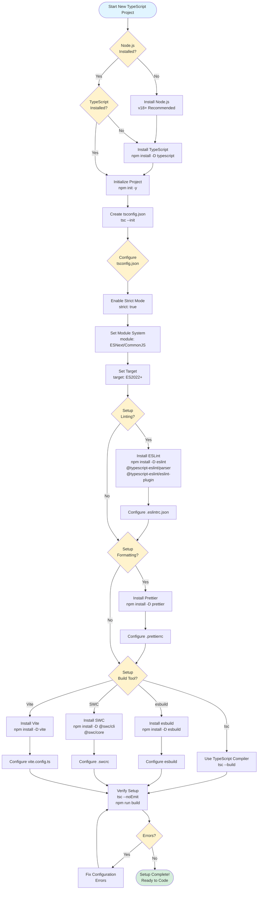

<!-- SSM:CHUNK_BOUNDARY id="ch2-start" -->
📘 CHAPTER 2 — LANGUAGE SYNTAX & SEMANTICS 🟢 Beginner

### 2.1 Lexical Structure

TypeScript uses the same lexical structure as JavaScript:

- **Identifiers**: Letters, digits, underscores, dollar signs (must start with letter/underscore/$)
- **Keywords**: Reserved words like `class`, `interface`, `type`, `extends`
- **Literals**: String, numeric, boolean, null, undefined, template literals
- **Operators**: Arithmetic, logical, comparison, assignment operators
- **Punctuation**: Braces, brackets, parentheses, semicolons, commas

#### 2.1.1 Operator Precedence Table

Operators are evaluated in order of precedence (higher precedence first):

| Precedence | Operator Type | Operators | Associativity |
|------------|---------------|-----------|---------------|
| 21 | Grouping | `()` | N/A |
| 20 | Member Access | `.` `[]` | Left-to-right |
| 20 | Function Call | `()` | Left-to-right |
| 20 | Optional Chaining | `?.` | Left-to-right |
| 19 | Postfix Increment/Decrement | `++` `--` | N/A |
| 18 | Logical NOT | `!` | Right-to-left |
| 18 | Bitwise NOT | `~` | Right-to-left |
| 18 | Unary Plus/Minus | `+` `-` | Right-to-left |
| 18 | Prefix Increment/Decrement | `++` `--` | Right-to-left |
| 18 | typeof | `typeof` | Right-to-left |
| 18 | void | `void` | Right-to-left |
| 18 | delete | `delete` | Right-to-left |
| 17 | Exponentiation | `**` | Right-to-left |
| 16 | Multiplication/Division/Remainder | `*` `/` `%` | Left-to-right |
| 15 | Addition/Subtraction | `+` `-` | Left-to-right |
| 14 | Bitwise Shift | `<<` `>>` `>>>` | Left-to-right |
| 13 | Relational | `<` `>` `<=` `>=` `in` `instanceof` | Left-to-right |
| 12 | Equality | `==` `!=` `===` `!==` | Left-to-right |
| 11 | Bitwise AND | `&` | Left-to-right |
| 10 | Bitwise XOR | `^` | Left-to-right |
| 9 | Bitwise OR | `\|` | Left-to-right |
| 8 | Logical AND | `&&` | Left-to-right |
| 7 | Logical OR | `\|\|` | Left-to-right |
| 6 | Nullish Coalescing | `??` | Left-to-right |
| 5 | Conditional | `? :` | Right-to-left |
| 4 | Assignment | `=` `+=` `-=` `*=` `/=` `%=` `**=` `<<=` `>>=` `>>>=` `&=` `^=` `\|=` `\|\|=` `??=` | Right-to-left |
| 3 | Comma | `,` | Left-to-right |

Example:

```typescript
// Precedence matters
let result = 2 + 3 * 4; // 14 (not 20) - multiplication has higher precedence
let result2 = (2 + 3) * 4; // 20 - parentheses override precedence

// Logical operators
let value = a || b && c; // Evaluates as: a || (b && c)
let value2 = a && b || c; // Evaluates as: (a && b) || c
```

### 2.2 Type Annotations

Type annotations specify the type of a variable, parameter, or return value:

Example:

```typescript
// Variable annotation
let count: number = 42;

// Function parameter and return annotation
function add(a: number, b: number): number {
  return a + b;
}

// Array annotation
let items: string[] = ["hello", "world"];

// Object annotation
let point: { x: number; y: number } = { x: 0, y: 0 };
```

### 2.3 Type Inference

TypeScript can infer types automatically when types are obvious:

Example:

```typescript
// Type inferred as number
let count = 42;

// Type inferred as string[]
let items = ["hello", "world"];

// Type inferred as (a: number, b: number) => number
function add(a: number, b: number) {
  return a + b;
}
```

### 2.4 Interfaces

**Interface**: A named contract that describes the shape of an object:

Example:

```typescript
interface Point {
  x: number;
  y: number;
}

let point: Point = { x: 0, y: 0 };
```

### 2.5 Type Aliases

**Type alias**: A name for a type, created with the `type` keyword:

Example:

```typescript
type ID = string | number;
type Point = { x: number; y: number };
```

### 2.6 Classes

Classes define blueprints for objects with properties and methods:

Example:

```typescript
class Point {
  x: number;
  y: number;

  constructor(x: number, y: number) {
    this.x = x;
    this.y = y;
  }

  distance(): number {
    return Math.sqrt(this.x ** 2 + this.y ** 2);
  }
}
```

### 2.7 Generics

**Generics**: Type parameters that make code reusable across different types:

Example:

```typescript
function identity<T>(arg: T): T {
  return arg;
}

let output = identity<string>("hello");
```

### 2.8 Installation & Environment Setup

This section covers everything needed to get started with TypeScript development.

#### 2.8.1 Official Installation Methods

TypeScript can be installed via several package managers:

**npm (Node Package Manager):**

```bash
# Global installation
npm install -g typescript

# Local installation (recommended)
npm install --save-dev typescript

# Verify installation
tsc --version
```

**yarn:**

```bash
# Global installation
yarn global add typescript

# Local installation (recommended)
yarn add -D typescript

# Verify installation
yarn tsc --version
```

**pnpm:**

```bash
# Global installation
pnpm add -g typescript

# Local installation (recommended)
pnpm add -D typescript

# Verify installation
pnpm tsc --version
```

**Standalone Installer:**

- Download from [TypeScript releases](https://github.com/microsoft/TypeScript/releases)
- Extract and add to PATH
- Useful for CI/CD environments without Node.js

**Recommended:** Use local installation per project to ensure version consistency across team members.

#### 2.8.1.1 Environment Setup Flowchart

The following flowchart illustrates the typical TypeScript project environment setup process:



**Quick Setup Checklist:**

1. ✅ **Node.js** (v18+ recommended)
2. ✅ **TypeScript** (`npm install -D typescript`)
3. ✅ **tsconfig.json** (`tsc --init`, then configure)
4. ✅ **ESLint** (optional but recommended)
5. ✅ **Prettier** (optional but recommended)
6. ✅ **Build Tool** (tsc, esbuild, SWC, or Vite)
7. ✅ **Verify** (`tsc --noEmit` should pass)

**Common Configuration Patterns:**

```typescript
// tsconfig.json - Recommended starter config
{
  "compilerOptions": {
    "target": "ES2022",
    "module": "ESNext",
    "lib": ["ES2022"],
    "strict": true,
    "esModuleInterop": true,
    "skipLibCheck": true,
    "forceConsistentCasingInFileNames": true,
    "moduleResolution": "bundler", // or "node16"/"nodenext"
    "resolveJsonModule": true,
    "isolatedModules": true,
    "noEmit": true // For bundler-based projects
  },
  "include": ["src/**/*"],
  "exclude": ["node_modules", "dist"]
}
```

#### 2.8.2 OS-Specific Setup

**Windows:**

1. Install Node.js from [nodejs.org](https://nodejs.org/)
2. Open PowerShell or Command Prompt
3. Install TypeScript: `npm install -g typescript`
4. Verify: `tsc --version`

**macOS:**

1. Install Node.js via Homebrew: `brew install node`
2. Install TypeScript: `npm install -g typescript`
3. Verify: `tsc --version`

**Linux (Ubuntu/Debian):**

```bash
# Install Node.js
curl -fsSL https://deb.nodesource.com/setup_20.x | sudo -E bash -
sudo apt-get install -y nodejs

# Install TypeScript
sudo npm install -g typescript

# Verify
tsc --version
```

**Linux (Fedora/RHEL):**

```bash
# Install Node.js
sudo dnf install nodejs npm

# Install TypeScript
sudo npm install -g typescript

# Verify
tsc --version
```

#### 2.8.3 Editor/IDE Setup

**Visual Studio Code (Recommended):**

1. Install VS Code from [code.visualstudio.com](https://code.visualstudio.com/)
2. TypeScript support is built-in
3. Recommended extensions:
   - ESLint (for linting)
   - Prettier (for formatting)
   - Error Lens (inline error display)
   - TypeScript Importer (auto-imports)

**WebStorm:**

1. Install WebStorm from JetBrains
2. TypeScript support is built-in
3. Configure TypeScript version in Settings → Languages & Frameworks → TypeScript

**Neovim/Vim:**

1. Install plugins:
   - `nvim-treesitter/nvim-treesitter` (syntax highlighting)
   - `neovim/nvim-lspconfig` (LSP support)
   - `typescript-language-server` (TypeScript LSP)

2. Configure LSP:

```lua
require('lspconfig').tsserver.setup({
  on_attach = on_attach,
  capabilities = capabilities,
})
```

**Sublime Text:**

1. Install Package Control
2. Install TypeScript package
3. Configure build system for TypeScript

**Atom:**

1. Install `atom-typescript` package
2. TypeScript support with IntelliSense

#### 2.8.4 Formatting & Linting

**Prettier (Code Formatter):**

Installation:

```bash
npm install --save-dev prettier
```

Configuration (`.prettierrc`):

```json
{
  "semi": true,
  "trailingComma": "es5",
  "singleQuote": false,
  "printWidth": 80,
  "tabWidth": 2
}
```

**ESLint (Linter):**

Installation:

```bash
npm install --save-dev eslint @typescript-eslint/parser @typescript-eslint/eslint-plugin
```

Configuration (`.eslintrc.json`):

```json
{
  "parser": "@typescript-eslint/parser",
  "extends": [
    "eslint:recommended",
    "plugin:@typescript-eslint/recommended"
  ],
  "rules": {
    "@typescript-eslint/no-explicit-any": "error",
    "@typescript-eslint/explicit-function-return-type": "warn"
  }
}
```

**dprint (Fast Formatter):**

Installation:

```bash
npm install -g @dprint/dprint
```

Configuration (`.dprintrc.json`):

```json
{
  "typescript": {
    "semiColons": "always",
    "quoteStyle": "preferDouble",
    "lineWidth": 80
  }
}
```

#### 2.8.5 Debugger & REPL

**ts-node (TypeScript REPL):**

Installation:

```bash
npm install -g ts-node
```

Usage:

```bash
# Run TypeScript file directly
ts-node script.ts

# Start REPL
ts-node
```

**tsx (Fast TypeScript Execution):**

Installation:

```bash
npm install -g tsx
```

Usage:

```bash
# Run TypeScript file
tsx script.ts

# Watch mode
tsx watch script.ts
```

**Debugging in VS Code:**

1. Create `.vscode/launch.json`:

```json
{
  "version": "0.2.0",
  "configurations": [
    {
      "type": "node",
      "request": "launch",
      "name": "Debug TypeScript",
      "runtimeExecutable": "ts-node",
      "args": ["${file}"],
      "sourceMaps": true
    }
  ]
}
```

2. Set breakpoints in TypeScript files
3. Press F5 to start debugging

**Debugging with Source Maps:**

Ensure `tsconfig.json` has:

```json
{
  "compilerOptions": {
    "sourceMap": true
  }
}
```

#### 2.8.6 Project Scaffolding

**Manual Setup:**

1. Create project directory:

```bash
mkdir my-project
cd my-project
```

2. Initialize npm:

```bash
npm init -y
```

3. Install TypeScript:

```bash
npm install --save-dev typescript
```

4. Create `tsconfig.json`:

```bash
npx tsc --init
```

5. Create source directory:

```bash
mkdir src
```

**Create React App (with TypeScript):**

```bash
npx create-react-app my-app --template typescript
```

**Next.js (with TypeScript):**

```bash
npx create-next-app@latest my-app --typescript
```

**Vite (with TypeScript):**

```bash
npm create vite@latest my-app -- --template vanilla-ts
```

**NestJS (with TypeScript):**

```bash
npm i -g @nestjs/cli
nest new my-project
```

**Manual Project Structure:**

```
my-project/
├── src/
│   ├── index.ts
│   └── utils/
├── dist/          # Compiled output
├── tsconfig.json
├── package.json
└── README.md
```

**tsconfig.json Template:**

```json
{
  "compilerOptions": {
    "target": "ES2022",
    "module": "ESNext",
    "lib": ["ES2022"],
    "outDir": "./dist",
    "rootDir": "./src",
    "strict": true,
    "esModuleInterop": true,
    "skipLibCheck": true,
    "forceConsistentCasingInFileNames": true,
    "moduleResolution": "bundler",
    "resolveJsonModule": true
  },
  "include": ["src/**/*"],
  "exclude": ["node_modules", "dist"]
}
```

### 2.9 Evaluation Strategy

TypeScript (and JavaScript) uses **strict evaluation** (also called eager evaluation):

#### 2.9.1 Strict Evaluation

**Strict evaluation**: Expressions are evaluated immediately when encountered.

Example:

```typescript
function add(a: number, b: number): number {
  return a + b;
}

// Arguments are evaluated before function call
let result = add(2 + 3, 4 * 5); // 2+3=5, 4*5=20, then add(5, 20)=25
```

#### 2.9.2 Short-Circuit Evaluation

Logical operators (`&&`, `||`, `??`) use short-circuit evaluation:

Example:

```typescript
// && stops at first falsy value
let value = false && expensiveFunction(); // expensiveFunction() never called

// || stops at first truthy value
let value2 = true || expensiveFunction(); // expensiveFunction() never called

// ?? stops at first non-null/undefined value
let value3 = "default" ?? expensiveFunction(); // expensiveFunction() never called
```

#### 2.9.3 Lazy Evaluation Patterns

While TypeScript uses strict evaluation, you can create lazy evaluation patterns:

Example:

```typescript
// Lazy function evaluation
function lazy<T>(fn: () => T): () => T {
  let cached: T | undefined;
  return () => {
    if (cached === undefined) {
      cached = fn();
    }
    return cached;
  };
}

const expensive = lazy(() => {
  console.log("Computing...");
  return 42;
});

// Function only called when invoked
const result = expensive(); // "Computing..." printed, returns 42
const result2 = expensive(); // No print, returns cached 42
```

#### 2.9.4 Evaluation Order

Expressions are evaluated left-to-right:

Example:

```typescript
let a = 1;
let b = a++ + ++a; // a++ returns 1 (a becomes 2), ++a returns 3 (a becomes 3), result is 4
// a is now 3
```

### 2.10 Variables & Binding Rules

Understanding how variables are bound, scoped, and resolved is crucial for TypeScript development.

#### 2.10.1 Name Resolution

**Name resolution**: The process of determining which variable a name refers to.

**Lexical Scoping**: TypeScript uses lexical (static) scoping:

- Variables are resolved based on where they are defined in the source code
- Inner scopes can access outer scope variables
- Outer scopes cannot access inner scope variables

Example:

```typescript
let global = "global";

function outer() {
  let outerVar = "outer";
  
  function inner() {
    let innerVar = "inner";
    console.log(global);    // ✅ Can access global
    console.log(outerVar);  // ✅ Can access outer
    console.log(innerVar);  // ✅ Can access inner
  }
  
  inner();
  console.log(global);    // ✅ Can access global
  console.log(outerVar);  // ✅ Can access outer
  // console.log(innerVar); // ❌ Error: innerVar is not defined
}

outer();
```

**Scope Chain**: When resolving a variable, JavaScript/TypeScript searches up the scope chain:

1. Current function scope
2. Outer function scope
3. Global scope
4. If not found: ReferenceError

#### 2.10.2 Hoisting

**Hoisting**: Variable and function declarations are moved to the top of their scope.

**var Hoisting:**

Example:

```typescript
console.log(x); // undefined (not ReferenceError)
var x = 5;
console.log(x); // 5

// Equivalent to:
var x;           // Declaration hoisted
console.log(x);  // undefined
x = 5;           // Assignment stays in place
console.log(x);  // 5
```

**let/const Hoisting (Temporal Dead Zone):**

`let` and `const` are hoisted but cannot be accessed before declaration:

Example:

```typescript
// console.log(y); // ❌ ReferenceError: Cannot access 'y' before initialization
let y = 5;
console.log(y); // 5

// Temporal Dead Zone: y exists but cannot be accessed
```

**Function Hoisting:**

Function declarations are fully hoisted:

Example:

```typescript
foo(); // ✅ Works: "Hello"

function foo() {
  console.log("Hello");
}

// Function expressions are NOT hoisted
// bar(); // ❌ TypeError: bar is not a function
const bar = function() {
  console.log("World");
};
```

#### 2.10.3 Shadowing

**Variable shadowing**: An inner scope variable with the same name as an outer scope variable.

Example:

```typescript
let x = "outer";

function test() {
  let x = "inner";  // Shadows outer x
  console.log(x);   // "inner"
}

test();
console.log(x);     // "outer" (outer x unchanged)
```

**Best Practice**: Avoid shadowing when possible. Use descriptive names to prevent confusion.

#### 2.10.4 Closures & Captures

**Closure**: A function that captures variables from its outer scope.

Example:

```typescript
function createCounter() {
  let count = 0;  // Captured variable
  
  return function() {
    count++;      // Accesses captured variable
    return count;
  };
}

const counter = createCounter();
console.log(counter()); // 1
console.log(counter()); // 2
console.log(counter()); // 3
```

**Captured Variables**: Variables referenced in a closure are "captured" and persist even after the outer function returns.

**Common Pitfall - Loop Closures:**

Example:

```typescript
// ❌ BAD: All functions reference the same i
for (var i = 0; i < 3; i++) {
  setTimeout(() => console.log(i), 100); // Prints: 3, 3, 3
}

// ✅ GOOD: Each function captures its own i
for (let i = 0; i < 3; i++) {
  setTimeout(() => console.log(i), 100); // Prints: 0, 1, 2
}
```

#### 2.10.5 References vs Values

**JavaScript's Call-by-Sharing Model:**

JavaScript/TypeScript uses **"call-by-sharing"** (also called "call-by-object-reference"):
- Primitive values are copied (by value)
- Object references are copied (by reference to the same object)
- Reassigning a variable doesn't affect other references
- Modifying object properties affects all references

**Primitive Types (By Value):**

Primitives (string, number, boolean, null, undefined, symbol, bigint) are passed by value:

Example:

```typescript
let a = 5;
let b = a;  // b gets a copy of the value
b = 10;
console.log(a); // 5 (unchanged)
console.log(b); // 10
```

**Object Types (By Reference - Call-by-Sharing):**

Objects (including arrays, functions) use call-by-sharing:

Example:

```typescript
let obj1 = { x: 5 };
let obj2 = obj1;  // obj2 references the same object
obj2.x = 10;
console.log(obj1.x); // 10 (changed!)

// Reassigning doesn't affect original
obj2 = { x: 20 };
console.log(obj1.x); // 10 (unchanged - obj2 now points to different object)
console.log(obj2.x); // 20
```

**Key Distinction:**
- **Call-by-value** (primitives): Copy the value
- **Call-by-reference** (objects): Copy the reference, but both point to the same object
- **Call-by-sharing** (JavaScript's model): References are copied, but reassignment doesn't affect the original reference

// To create a copy:
let obj3 = { ...obj1 }; // Shallow copy
obj3.x = 20;
console.log(obj1.x); // 10 (unchanged)
console.log(obj3.x); // 20
```

**Shallow vs Deep Copy:**

Example:

```typescript
// Shallow copy
let original = { a: 1, nested: { b: 2 } };
let shallow = { ...original };
shallow.nested.b = 3;
console.log(original.nested.b); // 3 (changed!)

// Deep copy
let deep = JSON.parse(JSON.stringify(original));
deep.nested.b = 4;
console.log(original.nested.b); // 3 (unchanged)
```

#### 2.10.6 Lifetime Rules

**Variable Lifetime**: How long a variable exists in memory.

**Automatic Garbage Collection:**

JavaScript/TypeScript uses automatic garbage collection:

- Variables are garbage collected when no longer referenced
- No manual memory management needed
- Garbage collector runs periodically

**Memory Management:**

Example:

```typescript
function createLargeObject() {
  const large = new Array(1000000).fill(0);
  return large;
}

let obj = createLargeObject();
// obj holds reference to large array

obj = null;  // Reference cleared, array can be garbage collected
```

**Memory Leaks to Avoid:**

1. **Global variables**: Never garbage collected
2. **Event listeners**: Remove when done
3. **Closures holding large objects**: Be careful with captured variables
4. **Circular references**: Can prevent garbage collection

Example:

```typescript
// ❌ BAD: Global variable (never garbage collected)
window.myData = new Array(1000000).fill(0);

// ✅ GOOD: Local variable (garbage collected when out of scope)
function processData() {
  const data = new Array(1000000).fill(0);
  // ... use data
  // data is garbage collected when function returns
}
```

---


<!-- SSM:CHUNK_BOUNDARY id="ch2-end" -->
