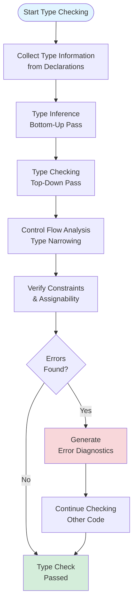
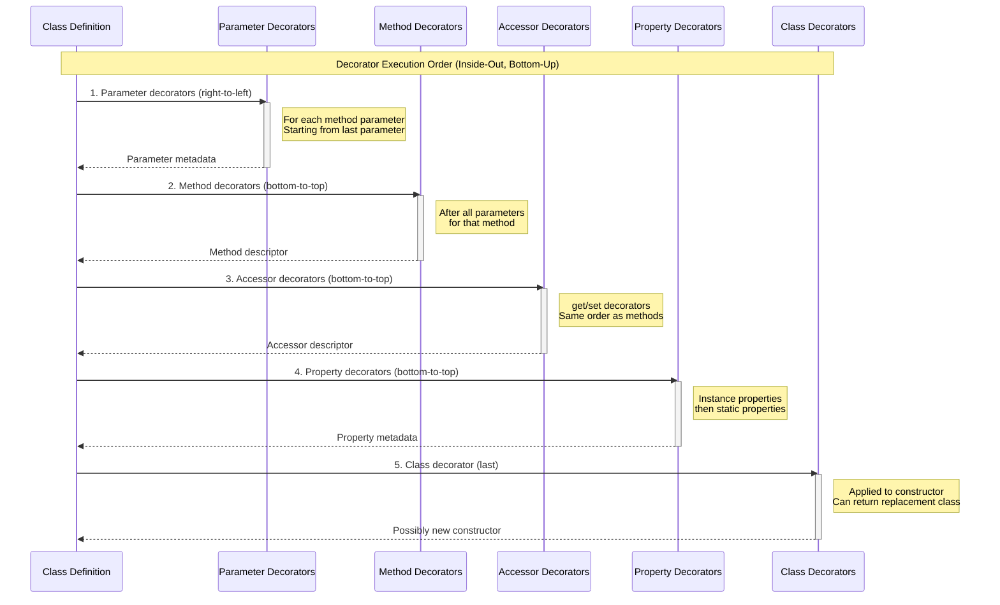
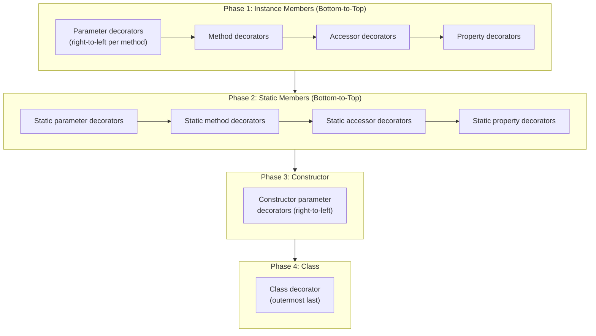
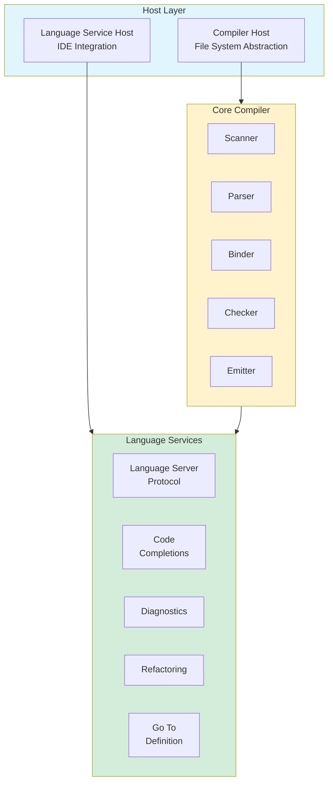

<!-- SSM:CHUNK_BOUNDARY id="ch3-start" -->
📘 CHAPTER 3 — CORE EXECUTION MODEL 🟢 Beginner

This chapter provides a comprehensive understanding of how TypeScript code is processed, from source text to executable JavaScript. Understanding the execution model is essential for debugging, optimizing, and extending TypeScript.

### 3.1 Compilation Pipeline

TypeScript compilation follows a multi-phase pipeline that transforms source code into JavaScript:


#### 3.1.1 Scanner (Lexical Analysis)

**Scanner**: The first phase that converts source text into a stream of tokens.

The scanner performs:
- **Tokenization**: Breaking source into meaningful units (keywords, identifiers, operators, literals)
- **Whitespace handling**: Tracking significant whitespace for ASI (Automatic Semicolon Insertion)
- **Comment preservation**: Optionally preserving comments for documentation extraction
- **Template literal processing**: Handling backtick strings with embedded expressions

```typescript
// Example: How the scanner tokenizes this code
const message: string = "Hello, TypeScript!";

// Token stream:
// [const] [message] [:] [string] [=] ["Hello, TypeScript!"] [;]
// Keyword Identifier Colon Keyword Equals StringLiteral Semicolon
```

#### 3.1.2 Parser (Syntactic Analysis)

**Parser**: Converts the token stream into an Abstract Syntax Tree (AST).

The parser:
- **Builds tree structure**: Creates hierarchical representation of code
- **Validates syntax**: Ensures code follows TypeScript grammar rules
- **Handles error recovery**: Continues parsing after syntax errors
- **Preserves source positions**: Tracks line/column for error messages

```typescript
// AST representation of: const x: number = 42;
// VariableStatement
//   └── VariableDeclarationList (const)
//       └── VariableDeclaration
//           ├── Identifier (x)
//           ├── TypeAnnotation
//           │   └── NumberKeyword
//           └── NumericLiteral (42)
```

#### 3.1.3 Binder (Symbol Resolution)

**Binder**: Creates symbol tables and resolves references between declarations and usages.

The binder performs:
- **Symbol table creation**: Maps identifiers to their declarations
- **Scope analysis**: Determines variable visibility and lifetime
- **Flow container setup**: Prepares for control flow analysis
- **Declaration merging**: Combines multiple declarations of the same symbol

```typescript
// Binder creates symbol table entries
interface User {        // Symbol: User (InterfaceDeclaration)
  name: string;         // Symbol: name (PropertySignature)
}

interface User {        // Same symbol - declaration merging
  age: number;          // Symbol: age (PropertySignature)
}

function greet(user: User) {  // Symbol: greet (FunctionDeclaration)
  console.log(user.name);      // user references parameter symbol
}                              // name references User.name symbol
```

#### 3.1.4 Checker (Type Checking)

**Checker**: The largest and most complex phase, performing semantic analysis and type checking.

See Section 3.2 for detailed coverage of the type checking process.

#### 3.1.5 Transformer (AST Modification)

**Transformer**: Modifies the AST before code generation.

Transformers handle:
- **TypeScript syntax removal**: Stripping type annotations, interfaces, type aliases
- **Downleveling**: Converting modern syntax to older ECMAScript targets
- **Decorator compilation**: Transforming decorators to runtime code
- **JSX transformation**: Converting JSX to function calls
- **Module transformation**: Converting ES modules to CommonJS/AMD/etc.

```typescript
// Before transformation (TypeScript):
const greet = (name: string): string => `Hello, ${name}!`;

// After transformation (JavaScript ES5 target):
var greet = function (name) { return "Hello, " + name + "!"; };
```

#### 3.1.6 Emitter (Code Generation)

**Emitter**: Generates output files from the transformed AST.

The emitter produces:
- **JavaScript files (.js)**: Executable code with types erased
- **Declaration files (.d.ts)**: Type information for consumers
- **Source maps (.js.map)**: Debugging mappings to original source
- **Declaration maps (.d.ts.map)**: Mappings for "Go to Definition"

### 3.2 Type Checking Process

The type checker is the heart of TypeScript, implementing a sophisticated bidirectional type inference algorithm.

#### 3.2.1 Type Checking Algorithm Overview



#### 3.2.2 Type Inference

**Type Inference**: The process of automatically determining types from context.

TypeScript uses bidirectional type inference:

- **Bottom-up inference**: Determines expression types from their components
- **Top-down inference (contextual typing)**: Uses expected type to inform expression types

```typescript
// Bottom-up inference: type determined from value
const x = 42;           // x: number (inferred from literal)
const arr = [1, 2, 3];  // arr: number[] (inferred from elements)

// Top-down inference: context provides expected type
const handler: (e: MouseEvent) => void = (e) => {
  // e is typed as MouseEvent due to contextual typing
  console.log(e.clientX);
};

// Bidirectional inference combined
const users = [{ name: "Alice" }].map(u => u.name.toUpperCase());
// u is inferred from array element type, result is string[]
```

#### 3.2.3 Type Compatibility (Assignability)

**Assignability**: The rules determining when one type can be assigned to another.

TypeScript uses structural typing with specific rules:

```typescript
interface Named {
  name: string;
}

interface Person {
  name: string;
  age: number;
}

// Assignable: Person has all properties of Named (and more)
const person: Person = { name: "Alice", age: 30 };
const named: Named = person; // ✅ OK - Person is assignable to Named

// Not assignable: Named lacks 'age' property
const named2: Named = { name: "Bob" };
const person2: Person = named2; // ❌ Error - Named missing 'age'
```

#### 3.2.4 Type Narrowing

**Type Narrowing**: Reducing a type to a more specific type based on control flow.

The checker tracks type state through branches:

```typescript
function process(value: string | number | null) {
  // value: string | number | null
  
  if (value === null) {
    // value: null (narrowed by equality check)
    return;
  }
  
  // value: string | number (null eliminated)
  
  if (typeof value === "string") {
    // value: string (narrowed by typeof)
    console.log(value.toUpperCase());
  } else {
    // value: number (string eliminated)
    console.log(value.toFixed(2));
  }
}
```

#### 3.2.5 Error Reporting

The type checker generates detailed diagnostics with:

- **Error code**: Unique identifier (e.g., TS2322)
- **Message**: Human-readable explanation
- **Location**: File, line, column, and span
- **Related information**: Additional context and suggestions

```typescript
// Error example with detailed diagnostic
const x: string = 42;
// Error TS2322: Type 'number' is not assignable to type 'string'.
//   at line 1, column 7-8
```

### 3.3 Runtime Behavior

Understanding how TypeScript relates to JavaScript runtime behavior is crucial.

#### 3.3.1 Type Erasure

**Type Erasure**: All TypeScript-specific syntax is removed during compilation.

```typescript
// TypeScript source
interface User {
  name: string;
  age: number;
}

function greet(user: User): string {
  return `Hello, ${user.name}!`;
}

const alice: User = { name: "Alice", age: 30 };
console.log(greet(alice));
```

```javascript
// Compiled JavaScript (types erased)
function greet(user) {
  return `Hello, ${user.name}!`;
}

const alice = { name: "Alice", age: 30 };
console.log(greet(alice));
```

**What gets erased:**
- Type annotations (`: string`, `: number`, `: User`)
- Interface declarations
- Type alias declarations
- Generic type parameters
- Type assertions (in most cases)
- `as const` assertions (only affects type, not value)

**What remains:**
- All JavaScript code
- Enum values (compiled to objects)
- Decorators (compiled to function calls)
- Parameter properties (compiled to assignments)
- Class fields (compiled to assignments)

#### 3.3.2 Enum Compilation

Enums are one of the few TypeScript features with runtime representation:

```typescript
// TypeScript enum
enum Color {
  Red,
  Green,
  Blue
}

// Compiled JavaScript
var Color;
(function (Color) {
  Color[Color["Red"] = 0] = "Red";
  Color[Color["Green"] = 1] = "Green";
  Color[Color["Blue"] = 2] = "Blue";
})(Color || (Color = {}));

// Const enums are fully erased
const enum Direction {
  Up,
  Down,
  Left,
  Right
}

// Usage: const d = Direction.Up;
// Compiles to: const d = 0; (value inlined)
```

#### 3.3.3 Class Field Initialization Order

Understanding initialization order is crucial for avoiding runtime errors:

```typescript
class Example {
  // 1. Static field initializers (in order)
  static staticField = "static";
  
  // 2. Instance field initializers (in order)
  instanceField = "instance";
  derivedField = this.compute(); // Can access 'this'
  
  constructor() {
    // 3. Constructor body executes
    console.log(this.instanceField); // "instance"
  }
  
  compute() {
    return "computed";
  }
}

// With inheritance:
class Derived extends Example {
  derivedField = "derived"; // Runs AFTER super() call
  
  constructor() {
    // super() must be first
    super(); // Base class field initializers run here
    // Then derived field initializers run
    // Then rest of constructor
  }
}
```

#### 3.3.4 Decorator Execution Order

Decorators execute in a specific, well-defined order. Understanding this order is crucial for proper decorator composition.

**Decorator Execution Timeline:**



**Complete Execution Order:**



**Example with Full Execution Order:**

```typescript
function log(name: string) {
  return function(target: any, key?: string, desc?: any) {
    console.log(`${name} executed`);
  };
}

@log("class")
class Example {
  @log("property")
  prop: string = "";
  
  @log("static-property")
  static staticProp: string = "";
  
  constructor(@log("constructor-param") param: string) {}
  
  @log("method")
  method(@log("param-1") a: string, @log("param-2") b: number) {}
  
  @log("accessor")
  get value() { return this.prop; }
  
  @log("static-method")
  static staticMethod(@log("static-param") x: string) {}
}

// Execution order:
// 1. param-2 executed       (rightmost param first)
// 2. param-1 executed       (then next param)
// 3. method executed        (then the method itself)
// 4. accessor executed      (then accessor)
// 5. property executed      (then instance property)
// 6. static-param executed  (static member params)
// 7. static-method executed (static method)
// 8. static-property executed (static property)
// 9. constructor-param executed (constructor params)
// 10. class executed        (finally, the class)
```

> **Quick Answer:** Decorator execution order: Parameter → Method → Accessor → Property → Class. Within each category: right-to-left for parameters, bottom-to-top for members, instance before static.

**Multiple Decorators on Same Target:**

When multiple decorators are applied to the same target, they evaluate top-to-bottom but execute bottom-to-top (like function composition):

```typescript
@f  // Evaluated 1st, executed 2nd
@g  // Evaluated 2nd, executed 1st
class Example {}

// Equivalent to: f(g(Example))
```

### 3.4 Compiler Architecture

The TypeScript compiler (`tsc`) is a sophisticated application with well-defined modules.

#### 3.4.1 Architecture Overview



#### 3.4.2 Key Compiler Components

**Program**: The root compilation unit containing all source files and their dependencies.

```typescript
import * as ts from "typescript";

// Create a program (compiler entry point)
const program = ts.createProgram({
  rootNames: ["./src/index.ts"],
  options: {
    target: ts.ScriptTarget.ES2020,
    module: ts.ModuleKind.ESNext,
    strict: true,
  },
});

// Access compiler services
const checker = program.getTypeChecker();
const sourceFiles = program.getSourceFiles();
```

**TypeChecker**: The semantic analyzer providing type information.

```typescript
// Get type information for any node
const sourceFile = program.getSourceFile("./src/index.ts")!;
const typeChecker = program.getTypeChecker();

// Find a specific symbol and get its type
ts.forEachChild(sourceFile, function visit(node) {
  if (ts.isVariableDeclaration(node) && node.name.getText() === "myVar") {
    const type = typeChecker.getTypeAtLocation(node);
    console.log(typeChecker.typeToString(type));
  }
  ts.forEachChild(node, visit);
});
```

### 3.5 Type Erasure Deep Dive

#### 3.5.1 What Is Preserved vs Erased

| TypeScript Feature | Runtime Behavior |
|-------------------|------------------|
| Type annotations | ❌ Erased |
| Interfaces | ❌ Erased |
| Type aliases | ❌ Erased |
| Generic parameters | ❌ Erased |
| Type assertions | ❌ Erased |
| Enums | ✅ Preserved (as objects) |
| Const enums | ❌ Inlined and erased |
| Classes | ✅ Preserved (as constructor functions) |
| Decorators | ✅ Preserved (as function calls) |
| Parameter properties | ✅ Preserved (as assignments) |
| Namespace (with values) | ✅ Preserved (as IIFEs) |
| Namespace (types only) | ❌ Erased |

#### 3.5.2 Implications for Runtime Type Checking

Since types are erased, runtime type checking requires alternative approaches:

```typescript
// ❌ This doesn't work at runtime
function isUser(value: unknown): value is User {
  return value instanceof User; // User is an interface, not a class!
}

// ✅ Runtime type checking with type guards
interface User {
  name: string;
  age: number;
}

function isUser(value: unknown): value is User {
  return (
    typeof value === "object" &&
    value !== null &&
    "name" in value &&
    "age" in value &&
    typeof (value as User).name === "string" &&
    typeof (value as User).age === "number"
  );
}

// ✅ Runtime validation with Zod
import { z } from "zod";

const UserSchema = z.object({
  name: z.string(),
  age: z.number(),
});

type User = z.infer<typeof UserSchema>;

function validateUser(value: unknown): User {
  return UserSchema.parse(value); // Throws if invalid
}
```

### 3.6 Memory Model

TypeScript follows JavaScript's memory model with some additional considerations for type system behavior.

#### 3.6.1 Value vs Reference Semantics

```typescript
// Primitive types: value semantics (copied)
let a = 42;
let b = a;
b = 100;
console.log(a); // 42 (unchanged)

// Object types: reference semantics (shared)
const obj1 = { x: 1 };
const obj2 = obj1;
obj2.x = 100;
console.log(obj1.x); // 100 (changed!)

// Arrays also use reference semantics
const arr1 = [1, 2, 3];
const arr2 = arr1;
arr2.push(4);
console.log(arr1); // [1, 2, 3, 4]
```

#### 3.6.2 Type System Memory Implications

The type system has its own memory considerations during compilation:

```typescript
// Deep recursive types can cause memory issues
type DeepNested<T, Depth extends number> = Depth extends 0
  ? T
  : { value: DeepNested<T, MinusOne<Depth>> };

// Excessive type instantiation can exhaust memory
type HugeUnion = /* 10,000+ union members */;
type Mapped = { [K in HugeUnion]: K };

// Best practice: Limit recursion depth
type MaxDepth = 10;
type SafeDeepNested<T, Depth extends number = MaxDepth> =
  Depth extends 0
    ? T
    : { value: SafeDeepNested<T, MinusOne<Depth>> };
```

#### 3.6.3 Garbage Collection Considerations

TypeScript code compiles to JavaScript, which uses automatic garbage collection:

```typescript
// Closures can prevent garbage collection
function createLeak() {
  const largeData = new Array(1000000).fill(0);
  
  // This closure keeps largeData alive
  return function() {
    console.log(largeData.length);
  };
}

const leakyFn = createLeak(); // largeData cannot be GC'd

// Better: Only capture what you need
function createNoLeak() {
  const largeData = new Array(1000000).fill(0);
  const length = largeData.length; // Capture only the length
  
  return function() {
    console.log(length);
  };
}
```

---

<!-- SSM:PART id="part2" title="Part II: LANGUAGE CONCEPTS" -->
# PART II — LANGUAGE CONCEPTS


<!-- SSM:CHUNK_BOUNDARY id="ch3-end" -->
