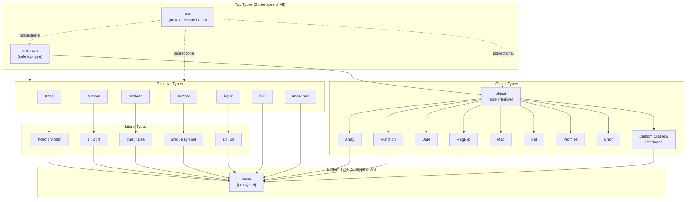

<!-- SSM:CHUNK_BOUNDARY id="ch4-start" -->
📘 CHAPTER 4 — TYPES & TYPE SYSTEM 🟡 Intermediate

This chapter provides a comprehensive reference of all TypeScript types, constructs, and utilities. Content is organized from the Phase sections in the source materials.

### 4.0 Type System Overview

TypeScript's type system is a **structural type system** with a well-defined hierarchy of types. Understanding this hierarchy is essential for mastering type compatibility, inference, and narrowing.

#### 4.0.1 Type Hierarchy Diagram

The following diagram shows TypeScript's complete type hierarchy from top type (`unknown`) to bottom type (`never`):



**Key Concepts:**

- **`unknown`**: Top type (supertype of all). Safe because it requires narrowing before use.
- **`any`**: Escape hatch that bypasses type checking. Has bidirectional assignability with all types.
- **`object`**: All non-primitive types (objects, arrays, functions, classes).
- **Primitive Types**: Value types (`string`, `number`, `boolean`, `symbol`, `bigint`, `null`, `undefined`).
- **Literal Types**: Specific values within primitives (e.g., `"hello"`, `42`, `true`).
- **`never`**: Bottom type (subtype of all). Represents impossible values.

**Assignability Rules:**

1. Every type is assignable to `unknown`
2. Only `never` is assignable to `never`
3. `any` is assignable to/from everything (unsafe)
4. Subtypes are assignable to supertypes (covariance)
5. Literal types are subtypes of their corresponding primitive types

See Chapter 37 (Type Theory) for formal type compatibility rules.

### 4.1 Primitive Types

Primitive types are the basic building blocks in TypeScript, corresponding to JavaScript's primitives.

#### 4.1.1 Basic Primitives

| Type | Description | Syntax/Example |
|------|-------------|---------------|
| `boolean` | Logical true/false | `true` or `false` |
| `number` | Floating-point numbers | `42` or `3.14` |
| `string` | Textual data | `"hello"` or `'world'` |
| `bigint` | Arbitrary-precision integers | `100n` or `BigInt(100)` |
| `symbol` | Unique identifiers | `Symbol('id')` |
| `null` | Intentional absence | `null` (only assignable when `strictNullChecks: false`) |
| `undefined` | Uninitialized value | `undefined` |

#### 4.1.2 Literal Types

Literal types represent exact values:

Example:

```typescript
// String literal
type Direction = "up" | "down" | "left" | "right";

// Numeric literal
type Answer = 42;

// Boolean literal
type IsTrue = true;

// BigInt literal
type LargeNumber = 100n;
```

**`as const`**: Forces object/array literals to be readonly literal types:

Example:

```typescript
const config = {
  apiUrl: "https://api.example.com",
  timeout: 5000,
} as const;

// Type: { readonly apiUrl: "https://api.example.com"; readonly timeout: 5000; }
```

#### 4.1.3 Special Types

| Type | Description | Syntax/Example |
|------|-------------|---------------|
| `any` | Opt-out of type checking | `let x: any` |
| `unknown` | Safe any — must be narrowed | `let x: unknown` |
| `void` | No return value | `() => void` |
| `never` | Value that never occurs (⊥ bottom type) | `() => never` |

**`any`**: Disables type checking. **Never use in production code.**

**Production Failure: The `any` Outage**

In a production system, a developer used `any` to bypass type checking in an API response handler. The handler assumed a specific structure, but when the API changed its response format, the code silently failed. The bug went undetected until production, where it caused a 3-hour outage affecting 10,000+ users. The fix required replacing all `any` with `unknown` and proper type guards.

**Lesson**: Never use `any` in production code. Always use `unknown` with proper type narrowing.

**`unknown`**: Safer alternative to `any`. Requires type narrowing before use:

Example:

```typescript
function process(value: unknown) {
  if (typeof value === "string") {
    // value is narrowed to string here
    console.log(value.toUpperCase());
  }
}
```

**`void`**: Represents absence of a return value:

Example:

```typescript
function log(message: string): void {
  console.log(message);
}
```

**`never`**: Represents values that never occur:

Example:

```typescript
function throwError(): never {
  throw new Error("Always throws");
}
```

### 4.2 Type Operations

Type operations allow you to query, combine, and transform types.

#### 4.2.1 Query Operators

| Operator | Description | Syntax/Example |
|----------|-------------|----------------|
| `typeof` | Type from value | `typeof "hello"` → `string` |
| `keyof` | Keys union | `keyof Point` → `"x" \| "y"` |
| Indexed Access | Property type | `Point["x"]` → `number` |

Example:

```typescript
type Point = { x: number; y: number };

// typeof: Get type from value
const point = { x: 0, y: 0 };
type PointType = typeof point; // { x: number; y: number }

// keyof: Get union of keys
type PointKeys = keyof Point; // "x" | "y"

// Indexed access: Get property type
type XType = Point["x"]; // number
```

#### 4.2.2 Combination Operators

| Operator | Description | Syntax/Example |
|----------|-------------|----------------|
| Union (`\|`) | Either type | `string \| number` |
| Intersection (`&`) | Both types | `Type1 & Type2` |

Example:

```typescript
// Union: value can be either type
type ID = string | number;

// Intersection: value must satisfy all types
type Named = { name: string };
type Aged = { age: number };
type Person = Named & Aged; // { name: string; age: number }
```

#### 4.2.3 Advanced Constructs

| Construct | Description | Syntax/Example |
|-----------|-------------|----------------|
| Generics | Parameterized types | `Array<T>` |
| Conditional Types | Type-level if/else | `T extends U ? X : Y` |
| `infer` | Extract in conditional | `T extends Array<infer E> ? E : never` |
| Mapped Types | Transform properties | `{ [P in keyof T]: T[P] }` |
| Template Literal Types | String patterns | `` `https://${string}` `` |
| `satisfies` | Check without widening | `value satisfies Type` |

Example:

```typescript
// Generics
function identity<T>(arg: T): T {
  return arg;
}

// Conditional types
// ⚠️ CRITICAL: Always wrap in tuple to prevent distribution
type SafeNonNullable<T> = [T] extends [null | undefined] ? never : T; // ✅ Correct
type UnsafeNonNullable<T> = T extends null | undefined ? never : T; // ❌ Wrong: distributes over unions

// infer
type ElementType<T> = T extends Array<infer E> ? E : never;

// Mapped types
type Readonly<T> = { readonly [P in keyof T]: T[P] };

// Template literal types
// ⚠️ WARNING: Only unbounded template literals can explode the compiler
type Route = `/${string}`; // ❌ Unbounded: Can cause compiler to freeze
type BoundedRoute = `/api/${"users" | "posts"}`; // ✅ Bounded: Safe

// ✅ Safe patterns for template literals:
// 1. Bounded with union of known values
type KnownRoutes = "home" | "about" | "contact";
type SafeRoute = `/${KnownRoutes}`; // "/home" | "/about" | "/contact"

// 2. Branded strings (recommended for unbounded paths)
type SafeRoute2 = string & { __path: never };

// 3. Constrained template literals
type ApiRoute<T extends string> = `/api/${T}`;
type UserRoute = ApiRoute<"users" | "posts">; // "/api/users" | "/api/posts"

// satisfies
const config = {
  apiUrl: "https://api.example.com",
  timeout: 5000,
} satisfies { apiUrl: string; timeout: number };
```

#### 4.2.4 Type Variance

**Variance**: How subtyping relationships are preserved or reversed when types are used in different contexts.

**Covariance**: Subtypes are preserved in the same direction.

Example:

```typescript
// Arrays are covariant in TypeScript (but mutable arrays should be invariant)
type Animal = { name: string };
type Dog = Animal & { breed: string };

let animals: Animal[] = [];
let dogs: Dog[] = [];

animals = dogs; // ✅ Covariant: Dog[] is assignable to Animal[]
// But this is unsafe if array is mutated!
```

**Contravariance**: Subtypes are reversed.

Example:

```typescript
// Function parameters are contravariant
type AnimalHandler = (animal: Animal) => void;
type DogHandler = (dog: Dog) => void;

// DogHandler is NOT assignable to AnimalHandler
// let handler: AnimalHandler = (dog: Dog) => {}; // ❌ Error

// AnimalHandler IS assignable to DogHandler
let dogHandler: DogHandler = (animal: Animal) => {}; // ✅ Contravariant
```

**Invariance**: Subtypes are not allowed.

Example:

```typescript
// Mutable arrays should be invariant (but TypeScript allows covariance)
// This is a known TypeScript limitation
let animals: Animal[] = [];
let dogs: Dog[] = [];

animals = dogs; // TypeScript allows this (covariant)
animals.push({ name: "Cat" }); // Runtime error: Cat is not a Dog!
```

**Bivariance**: Both directions allowed (legacy behavior).

**Note**: The `strictFunctionTypes` compiler option (introduced in TypeScript 2.6+) fixes bivariance issues for **function-type properties only**, making them contravariant. However, **method parameters remain bivariant** for backward compatibility with existing codebases. This is a partial fix, not a complete solution.

**Important Clarification: Method vs Function Property Variance**

The bivariance behavior applies to **method shorthand syntax**, not function property syntax:

**Method Shorthand (Bivariant):**
```typescript
interface Animal {
  makeSound(): void; // Bivariant (can accept narrower or wider types)
}

interface Dog extends Animal {
  makeSound(): void; // Can be assigned to Animal (bivariant)
}

// ✅ CORRECT: Methods are bivariant regardless of strictFunctionTypes
let animal: Animal = { makeSound() {} } as Dog; // Allowed
```

**Function Property (Contravariant with `strictFunctionTypes`):**
```typescript
interface AnimalWithFunc {
  makeSound: () => void; // Contravariant under strictFunctionTypes
}

interface DogWithFunc extends Animal {
  makeSound: () => void; // Contravariant behavior
}

// ⚠️ With strictFunctionTypes: Function properties are contravariant (safer)
// ❌ Error: DogWithFunc is NOT assignable to AnimalWithFunc (contravariant)
```

**Why This Matters:**
- **Method shorthand**: `strictFunctionTypes` doesn't affect it (bivariant for backward compatibility)
- **Function property**: `strictFunctionTypes` makes it contravariant (safer, prevents unsound assignments)
- **Recommendation**: Use function property syntax when you want stricter type checking

Example:

```typescript
// Method parameters in TypeScript use bivariance (legacy)
interface Comparer {
  compare(a: Animal, b: Animal): number; // Method shorthand - bivariant
}

let dogComparer: Comparer = {
  compare(a: Dog, b: Dog): number {
    // TypeScript allows this (bivariant)
    return 0;
  }
};

// Function property with strictFunctionTypes (contravariant)
interface ComparerFunc {
  compare: (a: Animal, b: Animal) => number; // Function property - contravariant
}

// With strictFunctionTypes: true
// let dogComparerFunc: ComparerFunc = {
//   compare: (a: Dog, b: Dog) => 0 // ❌ Error: contravariant
// };
```

**Variance Rules Summary:**

| Context | Variance | Rule |
|---------|----------|------|
| Function return types | Covariant | `SubType → SuperType` is assignable |
| Function parameters | Contravariant | `SuperType → SubType` is assignable |
| Readonly arrays | Covariant | Safe (immutable) |
| Mutable arrays | Should be invariant | TypeScript allows covariance (unsafe) |
| Readonly properties | Covariant | Safe |
| Mutable properties | Invariant | Must match exactly |

#### 4.2.5 Higher-Kinded Types

**Higher-Kinded Types (HKT)**: Types that take other types as parameters (type constructors).

**TypeScript Limitation**: TypeScript does not have native support for higher-kinded types.

**Workaround Pattern**: Use type-level programming to simulate HKTs:

Example:

```typescript
// Simulate HKT with a "kind" pattern
interface Kind<F, A> {
  // F is the type constructor, A is the type parameter
}

// Example: Functor simulation
interface Functor<F> {
  map<A, B>(fa: Kind<F, A>, f: (a: A) => B): Kind<F, B>;
}

// Usage is complex and not idiomatic TypeScript
// Most TypeScript code avoids HKTs
```

**Alternative**: Use concrete types instead of HKTs:

Example:

```typescript
// Instead of HKT, use concrete types
interface ArrayFunctor {
  map<A, B>(arr: A[], f: (a: A) => B): B[];
}

// Or use type aliases
type MapArray<A, B> = (arr: A[], f: (a: A) => B) => B[];
```

**Note**: Higher-kinded types are primarily useful in functional programming languages (Haskell, Scala). TypeScript's type system is powerful enough for most use cases without HKTs.

### 4.3 Built-in Utility Types

TypeScript provides 20+ built-in utility types for common transformations.

#### 4.3.1 Property Modifiers

| Utility | Description | Example |
|---------|-------------|---------|
| `Partial<T>` | All properties optional | `Partial<Point>` → `{ x?: number; y?: number }` |
| `Required<T>` | All properties required | `Required<{x?: number}>` → `{ x: number }` |
| `Readonly<T>` | All properties readonly | `Readonly<Point>` → `{ readonly x: number; readonly y: number }` |

**Production Failure: Shallow Partial in User Profiles**

AI-refactored profile updater used `Partial<User>` for nested addresses, allowing partial objects like `{ address: { city: 'NY' } }` (missing street). Production saved incomplete data, breaking searches. Custom `DeepPartial<T>` fixed it.

**Lesson**: Specify "deep" to AIs—they default shallow. `Partial<T>` only makes top-level properties optional, not nested ones.

**Fix**: Use deep partial for nested updates:

```typescript
// ❌ Wrong: Shallow partial
type UpdateUser = Partial<User>; // address.city is still required

// ✅ Correct: Deep partial
type DeepPartial<T> = T extends object
  ? { [P in keyof T]?: DeepPartial<T[P]> }
  : T;
type UpdateUser = DeepPartial<User>; // address.city is optional
```

#### 4.3.2 Object Construction

| Utility | Description | Example |
|---------|-------------|---------|
| `Record<K, T>` | Keys K with values T | `Record<"a" \| "b", number>` → `{ a: number; b: number }` |
| `Pick<T, K>` | Select keys | `Pick<Point, "x">` → `{ x: number }` |
| `Omit<T, K>` | Exclude keys | `Omit<Point, "x">` → `{ y: number }` |

#### 4.3.3 Union Operations

| Utility | Description | Example |
|---------|-------------|---------|
| `Exclude<T, U>` | Remove U from T | `Exclude<"a" \| "b", "a">` → `"b"` |
| `Extract<T, U>` | Keep U from T | `Extract<string \| number, string>` → `string` |
| `NonNullable<T>` | Remove null/undefined | `NonNullable<string \| null>` → `string` |

#### 4.3.4 Function-Related

| Utility | Description | Example |
|---------|-------------|---------|
| `Parameters<F>` | Parameter tuple | `Parameters<(a: string) => void>` → `[string]` |
| `ConstructorParameters<C>` | Constructor params | `ConstructorParameters<typeof Date>` → `[string?]` |
| `ReturnType<F>` | Return type | `ReturnType<() => string>` → `string` |
| `InstanceType<C>` | Instance type | `InstanceType<typeof Date>` → `Date` |
| `ThisParameterType<F>` | Extract this type | `ThisParameterType<(this: Date) => void>` → `Date` |
| `OmitThisParameter<F>` | Remove this | `OmitThisParameter<(this: Date) => void>` → `() => void` |
| `ThisType<T>` | Contextual this | Used in object literals with methods |
| `NoInfer<T>` | Block inference | Prevents inference in that position |

#### 4.3.5 Promise-Related

| Utility | Description | Example |
|---------|-------------|---------|
| `Awaited<T>` | Recursive unwrap | `Awaited<Promise<Promise<string>>>` → `string` |

#### 4.3.6 String Manipulation

| Utility | Description | Example |
|---------|-------------|---------|
| `Uppercase<S>` | All uppercase | `Uppercase<"hello">` → `"HELLO"` |
| `Lowercase<S>` | All lowercase | `Lowercase<"HELLO">` → `"hello"` |
| `Capitalize<S>` | First uppercase | `Capitalize<"hello">` → `"Hello"` |
| `Uncapitalize<S>` | First lowercase | `Uncapitalize<"Hello">` → `"hello"` |

### 4.4 TypeScript 5.5-5.9 Features

**TypeScript 5.5 (Released 2024):**
- Inferred type predicates
- Disallowed `null` and `undefined` in `in` operator checks
- Performance improvements

**Inferred Type Predicates Example:**

```typescript
// TypeScript 5.5+: Type predicate inferred from return
function isString(x: unknown) {
  return typeof x === "string"; // Inferred as: x is string
}

// Before 5.5: Required explicit annotation
function isString(x: unknown): x is string {
  return typeof x === "string";
}
```

**TypeScript 5.6 (Released 2024):**
- Stricter nullish checks
- Improved path rewriting
- Better error messages

**TypeScript 5.7 (Released 2024):**
- Enhanced type inference
- Improved module resolution
- Performance optimizations

**TypeScript 5.8 (Released 2024):**
- Continued performance improvements
- Better type inference for complex patterns
- Enhanced tooling support

**TypeScript 5.9 (Released 2025):**

TypeScript 5.9 focuses on performance, developer experience, and enhanced type inference:

**1. Module Evaluation Improvements:**

```typescript
// import defer - Defer module evaluation until needed
import defer { heavyModule } from "./heavy-module";

// Module is not evaluated until actually used
function useModule() {
  return heavyModule.process(); // Evaluation happens here
}
```

**2. Enhanced DOM API Type Descriptions:**

TypeScript 5.9 includes improved JSDoc comments and type descriptions for DOM APIs:

```typescript
// Better autocomplete and documentation for DOM APIs
const canvas = document.createElement("canvas");
const ctx = canvas.getContext("2d"); // Enhanced type hints
```

**3. Improved Type Inference for Complex Patterns:**

```typescript
// Better inference for complex generic patterns
function process<T extends Record<string, unknown>>(
  data: T,
  transform: <K extends keyof T>(key: K, value: T[K]) => T[K]
): T {
  return Object.fromEntries(
    Object.entries(data).map(([key, value]) => [
      key,
      transform(key as keyof T, value as T[keyof T])
    ])
  ) as T;
}

// TypeScript 5.9+ infers types more accurately in complex scenarios
const result = process(
  { name: "John", age: 30 },
  (key, value) => key === "name" ? value.toUpperCase() : value
);
// result: { name: string; age: number } (better inference)
```

**4. Performance Optimizations:**

- Faster type checking for large codebases
- Improved incremental compilation
- Better memory usage for type checking
- Optimized project references

**5. Enhanced Error Messages:**

```typescript
// More helpful error messages with context
function example<T>(value: T): T {
  return value;
}

// TypeScript 5.9+ provides better error context
example<string>(123); 
// Error: Argument of type 'number' is not assignable to parameter of type 'string'.
//        Type 'number' is not assignable to type 'string'.
//        Context: Function 'example' expects type 'string' but received 'number'.
```

**Isolated Declarations Impact (TypeScript 5.5+):**

Isolated declarations enable faster build tools by generating declaration files that don't depend on other declaration files:

```json
{
  "compilerOptions": {
    "declaration": true,
    "isolatedModules": true,
    "moduleResolution": "bundler"
  }
}
```

**Benefits:**
- Faster build tools (esbuild, SWC can use isolated declarations)
- Better incremental builds
- Reduced dependency on full type checking for declaration generation

**TypeScript 5.10+ (Future/Planned):**

Based on TypeScript roadmap and community feedback, expected features include:

**1. Continued Performance Improvements:**
- Further optimization of type checking algorithms
- Better caching strategies
- Reduced memory footprint

**2. Enhanced Type Inference:**
- Better inference for async/await patterns
- Improved generic constraint inference
- Enhanced pattern matching support

**3. Better Error Messages:**
- More contextual error information
- Suggested fixes for common errors
- Better error message formatting

**4. Potential Breaking Changes in TS 6.0:**
- Stricter type checking by default
- Removal of deprecated features
- Improved module resolution defaults

**5. Experimental Features (May Land in 5.10+):**
- Enhanced decorator support
- Better template literal type inference
- Improved recursive type handling

**Migration Guide for TypeScript 5.9+:**

```bash
# Update TypeScript
npm install --save-dev typescript@latest

# Update tsconfig.json for new defaults
{
  "compilerOptions": {
    "target": "ES2022", // Recommended minimum
    "module": "ESNext", // Or "Node16"/"NodeNext" for Node.js
    "moduleResolution": "bundler", // Or "node16"/"nodenext"
    "strict": true, // Always recommended
    "isolatedModules": true, // Required for some bundlers
    "declaration": true, // For library authors
    "skipLibCheck": true // Faster builds
  }
}
```

**Breaking Changes to Watch For:**

1. **Stricter Null Checks**: Some code may require explicit null handling
2. **Module Resolution**: New resolution strategies may affect imports
3. **Type Inference**: More accurate inference may reveal existing type errors

**Note**: As of November 2025, no new core utility types have been added since TypeScript 5.4 (`NoInfer<T>`). The focus has been on performance, inference improvements, and DOM API coverage. Future versions may introduce new utility types based on community needs.

### See Also {#chapter-4-see-also}

- **Chapter 5: Control Flow Analysis** — How TypeScript narrows types based on control flow
- **Chapter 26: Type System Internals** — Internal representation of types in the compiler
- **Chapter 34: Type Theory** — Formal foundations of the type system
- **Appendix C: Patterns Catalog** — Common type patterns and implementations
- **Appendix E: Glossary** — Type system terminology

---


<!-- SSM:CHUNK_BOUNDARY id="ch4-end" -->
