<!-- SSM:CHUNK_BOUNDARY id="ch5-start" -->
📘 CHAPTER 5 — CONTROL FLOW ANALYSIS 🟡 Intermediate

TypeScript's Control Flow Analysis (CFA) tracks how types change as code executes. This enables automatic type narrowing without explicit casts.

### 5.0 Control Flow Analysis Overview

The following diagram illustrates how TypeScript analyzes control flow to narrow types:

```mermaid
flowchart TD
    subgraph Entry["Function Entry"]
        Param["Parameter: x: string | number | null"]
    end
    
    subgraph NullCheck["Null Check"]
        Param --> Check1{x === null?}
        Check1 -->|Yes| NullBranch["x: null<br/>Early return"]
        Check1 -->|No| AfterNull["x: string | number<br/>(null eliminated)"]
    end
    
    subgraph TypeofCheck["typeof Narrowing"]
        AfterNull --> Check2{typeof x === 'string'?}
        Check2 -->|Yes| StringBranch["x: string"]
        Check2 -->|No| NumberBranch["x: number<br/>(string eliminated)"]
    end
    
    subgraph Operations["Safe Operations"]
        StringBranch --> StringOps["x.toUpperCase() ✅<br/>x.toLowerCase() ✅<br/>x.length ✅"]
        NumberBranch --> NumberOps["x.toFixed() ✅<br/>x.toPrecision() ✅<br/>Math.round(x) ✅"]
    end
    
    subgraph ControlFlowGraph["Control Flow Graph (CFG)"]
        direction TB
        Node1["Entry Node<br/>x: string | number | null"]
        Node2["Condition Node<br/>x === null"]
        Node3["True Branch<br/>x: null"]
        Node4["False Branch<br/>x: string | number"]
        Node5["Condition Node<br/>typeof x === 'string'"]
        Node6["True Branch<br/>x: string"]
        Node7["False Branch<br/>x: number"]
        Node8["Exit Node"]
        
        Node1 --> Node2
        Node2 -->|true| Node3
        Node2 -->|false| Node4
        Node3 --> Node8
        Node4 --> Node5
        Node5 -->|true| Node6
        Node5 -->|false| Node7
        Node6 --> Node8
        Node7 --> Node8
    end
```



**Type Narrowing Triggers:**

| Trigger | Narrows | Example |
|---------|---------|---------|
| `typeof x === "string"` | Primitive types | `string`, `number`, `boolean`, etc. |
| `x instanceof Class` | Class instances | `Date`, `Error`, custom classes |
| `"prop" in obj` | Property existence | Discriminated unions |
| `x === value` | Literal types | `null`, `undefined`, constants |
| `Array.isArray(x)` | Array types | `T[]` |
| Custom type guard | Any type | `x is SomeType` |
| Assertion function | Any type | `asserts x is SomeType` |

**CFA Key Concepts:**

1. **Flow-sensitive typing**: Type depends on position in code
2. **Narrowing**: Reducing union types based on conditions
3. **Widening**: Restoring original type after scope exits
4. **Reachability**: Dead code detection after `never` expressions
5. **Exhaustiveness**: Ensuring all union cases are handled

> **Quick Answer:** TypeScript automatically narrows types after `if`, `switch`, type guards, and assertion functions. Use `typeof` for primitives, `instanceof` for classes, and custom type guards for complex types.

See also: Section 5.3 (Discriminated Unions), Section 5.4 (Exhaustiveness Checking), Chapter 34 (Type Theory)

### 5.1 Type Narrowing

**Type narrowing**: The process by which TypeScript reduces a type to a more specific type based on control flow.

Example:

```typescript
function process(value: string | number) {
  if (typeof value === "string") {
    // value is narrowed to string here
    console.log(value.toUpperCase());
  } else {
    // value is narrowed to number here
    console.log(value.toFixed(2));
  }
}
```

### 5.2 Type Guards

Type guards are expressions that narrow types:

- **`typeof` guard**: Narrows to primitive types
- **`instanceof` guard**: Narrows to class types
- **`in` guard**: Checks property existence
- **Custom type predicate**: User-defined narrowing function

Example:

```typescript
function isString(x: unknown): x is string {
  return typeof x === "string";
}

function process(value: unknown) {
  if (isString(value)) {
    // value is narrowed to string
    console.log(value.toUpperCase());
  }
}
```

**Type Predicates with Assertions (TS 3.7+):**

The `asserts` keyword creates assertion functions that narrow types and throw if the assertion fails:

```typescript
// Missing: asserts keyword
function assertIsString(value: unknown): asserts value is string {
  if (typeof value !== "string") {
    throw new Error("Not a string");
  }
  // After this point, TypeScript knows value is string
}

function process(value: unknown) {
  assertIsString(value); // Throws if not string
  // value is narrowed to string here (no if check needed)
  console.log(value.toUpperCase());
}

// Assertion without type predicate (TS 3.7+)
function assert(condition: unknown): asserts condition {
  if (!condition) {
    throw new Error("Assertion failed");
  }
}

function processNumber(value: unknown) {
  assert(typeof value === "number");
  // value is narrowed to number
  return value * 2;
}
```

**When to Use `asserts`:**
- Input validation that throws on failure
- Precondition checks
- Defensive programming patterns
- API boundary validation

### 5.3 Discriminated Unions

**Discriminated union**: A union type with a common property (discriminant) used for narrowing:

Example:

```typescript
type Shape =
  | { kind: "circle"; radius: number }
  | { kind: "square"; side: number };

function area(shape: Shape): number {
  if (shape.kind === "circle") {
    // shape is narrowed to circle
    return Math.PI * shape.radius ** 2;
  } else {
    // shape is narrowed to square
    return shape.side ** 2;
  }
}
```

**Production Failure: Phantom Shape Renderer**

An AI refactored a game engine's collision system using discriminated unions `{ kind: 'circle' | 'rect'; radius?: number; width?: number }`. It "narrowed" with `if (obj.kind === 'circle') return obj.radius * 2;`, ignoring that rect shapes lack radius. Production renders crashed on mixed shapes, costing a day of hotfixes. The fix: Use `as const` discriminants and exhaustive switch with `never` checks.

**Lesson**: Force exhaustive switches with `never`—they skip runtime safety.

### 5.4 Exhaustive Checking

Use `never` to ensure all cases are handled:

Example:

```typescript
function area(shape: Shape): number {
  switch (shape.kind) {
    case "circle":
      return Math.PI * shape.radius ** 2;
    case "square":
      return shape.side ** 2;
    default:
      const _exhaustive: never = shape;
      throw new Error(`Unhandled shape: ${_exhaustive}`);
  }
}
```

### 5.5 Pattern Matching Alternatives

**Note**: TypeScript does not have native pattern matching (like Rust, Swift, or Haskell). However, you can achieve similar functionality using:

#### 5.5.1 Discriminated Unions

Discriminated unions provide type-safe pattern matching:

Example:

```typescript
type Result<T, E> =
  | { success: true; data: T }
  | { success: false; error: E };

function handleResult<T, E>(result: Result<T, E>): void {
  if (result.success) {
    // Pattern matched: result is { success: true; data: T }
    console.log(result.data);
  } else {
    // Pattern matched: result is { success: false; error: E }
    console.error(result.error);
  }
}
```

#### 5.5.2 Type Guards

Type guards enable pattern matching on types:

Example:

```typescript
type Animal = Dog | Cat | Bird;

function handleAnimal(animal: Animal): string {
  if (isDog(animal)) {
    return `Dog: ${animal.breed}`;
  } else if (isCat(animal)) {
    return `Cat: ${animal.color}`;
  } else {
    return `Bird: ${animal.species}`;
  }
}
```

#### 5.5.3 Switch Statements

Switch statements with exhaustive checking provide pattern matching:

Example:

```typescript
type Status = "pending" | "processing" | "completed" | "failed";

function handleStatus(status: Status): string {
  switch (status) {
    case "pending":
      return "Waiting...";
    case "processing":
      return "In progress...";
    case "completed":
      return "Done!";
    case "failed":
      return "Error occurred";
    default:
      const _exhaustive: never = status;
      throw new Error(`Unhandled status: ${_exhaustive}`);
  }
}
```

**Exhaustive Checking with `switch(true)` Pattern:**

For complex conditions that don't fit simple discriminated unions, use `switch(true)`:

```typescript
type Result<T, E> = 
  | { success: true; value: T }
  | { success: false; error: E };

// Pattern not shown: switch(true) for complex conditions
function handle<T, E>(result: Result<T, E>): T {
  switch(true) {
    case result.success && result.value !== null:
      return result.value;
    case !result.success:
      throw result.error;
    default:
      const _exhaustive: never = result;
      throw new Error(`Unhandled result: ${_exhaustive}`);
  }
}

// Alternative: More readable with if-else
function handleAlt<T, E>(result: Result<T, E>): T {
  if (result.success && result.value !== null) {
    return result.value;
  } else if (!result.success) {
    throw result.error;
  } else {
    const _exhaustive: never = result;
    throw new Error(`Unhandled result: ${_exhaustive}`);
  }
}
```

**When to Use `switch(true)`:**
- Complex conditions that can't be expressed as simple equality checks
- Multiple conditions that need to be evaluated
- Pattern matching on computed values
- Guard clauses with complex logic

**Future**: TypeScript may add pattern matching syntax in future versions (proposal stage).

### See Also {#chapter-5-see-also}

- **Chapter 4: Types & Type System** — Foundation of type narrowing
- **Chapter 7: Classes & OOP** — Control flow in class hierarchies
- **Chapter 10: Error Handling** — Control flow for error management
- **Appendix H: Diagrams** — Control Flow Analysis diagram

---


<!-- SSM:CHUNK_BOUNDARY id="ch5-end" -->
