<!-- SSM:CHUNK_BOUNDARY id="ch8-start" -->
📘 CHAPTER 8 — MODULES & PACKAGES 🟡 Intermediate

### 8.1 Module System

TypeScript supports ES modules and CommonJS:

Example:

```typescript
// ES modules (recommended)
export function add(a: number, b: number): number {
  return a + b;
}

import { add } from "./math";
```

#### 8.1.1 Module Resolution Algorithm

TypeScript uses different module resolution strategies depending on configuration. The following diagram illustrates the complete resolution process:

```mermaid
flowchart TD
    subgraph Input["Import Statement"]
        ImportStmt["import { X } from 'specifier'"]
    end
    
    subgraph Classification["Step 1: Classify Import"]
        ImportStmt --> IsRelative{Starts with<br/>'.' or '..'?}
        IsRelative -->|Yes| RelativeImport["Relative Import<br/>./module or ../module"]
        IsRelative -->|No| IsPathMapped{Matches<br/>paths config?}
        IsPathMapped -->|Yes| PathMapped["Path Mapped Import<br/>@/utils → src/utils"]
        IsPathMapped -->|No| PackageImport["Package Import<br/>lodash, react"]
    end
    
    subgraph RelativeResolution["Step 2a: Relative Resolution"]
        RelativeImport --> ResolveRelative["Resolve relative to<br/>importing file"]
        ResolveRelative --> TryExactMatch{Exact file<br/>match?}
        TryExactMatch -->|Yes| FoundExact["✅ Return file"]
        TryExactMatch -->|No| TryExtensions{Try extensions<br/>.ts .tsx .d.ts}
        TryExtensions -->|Found| FoundExt["✅ Return file"]
        TryExtensions -->|No| TryIndex{Try directory<br/>index files}
        TryIndex -->|Found| FoundIndex["✅ Return index"]
        TryIndex -->|No| RelativeFail["❌ Module not found"]
    end
    
    subgraph PathResolution["Step 2b: Path Mapping"]
        PathMapped --> ApplyPathMapping["Apply path mapping<br/>from tsconfig.json"]
        ApplyPathMapping --> TryMappedPaths["Try each mapped<br/>path in order"]
        TryMappedPaths --> MappedFound{File found?}
        MappedFound -->|Yes| FoundMapped["✅ Return file"]
        MappedFound -->|No| FallbackPackage["Fallback to<br/>package resolution"]
    end
    
    subgraph PackageResolution["Step 2c: Package Resolution"]
        PackageImport --> WalkNodeModules["Walk up directory tree<br/>checking node_modules"]
        FallbackPackage --> WalkNodeModules
        WalkNodeModules --> FoundPackage{Package<br/>found?}
        FoundPackage -->|No| NextNodeModules{More parent<br/>directories?}
        NextNodeModules -->|Yes| WalkNodeModules
        NextNodeModules -->|No| PackageFail["❌ Cannot find module"]
        
        FoundPackage -->|Yes| CheckExports{Has exports<br/>field?}
        CheckExports -->|Yes| ResolveExports["Resolve via exports<br/>field mapping"]
        CheckExports -->|No| CheckTypes{Has types/<br/>typings field?}
        CheckTypes -->|Yes| ResolveTypes["Use types field"]
        CheckTypes -->|No| CheckMain{Has main<br/>field?}
        CheckMain -->|Yes| ResolveMain["Use main field<br/>+ look for .d.ts"]
        CheckMain -->|No| TryPackageIndex["Try package<br/>index.d.ts"]
        
        ResolveExports --> FoundPackageFile["✅ Return file"]
        ResolveTypes --> FoundPackageFile
        ResolveMain --> FoundPackageFile
        TryPackageIndex --> FoundPackageFile
    end
    
    subgraph Result["Resolution Result"]
        FoundExact --> Success["Module Resolved<br/>Return file path"]
        FoundExt --> Success
        FoundIndex --> Success
        FoundMapped --> Success
        FoundPackageFile --> Success
        RelativeFail --> Failure["Error: Cannot find<br/>module 'specifier'"]
        PackageFail --> Failure
    end
```



**Resolution Strategies by `moduleResolution` Setting:**

| Strategy | Best For | Supports `exports` | Node.js Style | Bundler Compatible |
|----------|----------|-------------------|---------------|-------------------|
| `node` | Node.js (CJS) | ⚠️ Partial | ✅ Yes | ⚠️ Partial |
| `node16`/`nodenext` | Node.js (ESM) | ✅ Yes | ✅ Yes | ✅ Yes |
| `bundler` | Webpack/Vite | ✅ Yes | ⚠️ Partial | ✅ Yes |
| `classic` | Legacy only | ❌ No | ❌ No | ❌ No |

> **Quick Answer:** Use `"moduleResolution": "bundler"` for frontend apps with Vite/webpack, or `"node16"` for Node.js backend apps.

**Node.js Resolution (`moduleResolution: "node"`):**

The Node.js resolution algorithm searches for modules in this order:

1. **Relative imports** (`./` or `../`):
   - Resolves relative to importing file
   - Checks for `.ts`, `.tsx`, `.d.ts` files
   - Checks for `index.ts`, `index.tsx`, `index.d.ts` in directories

2. **Absolute imports** (from `node_modules`):
   - Searches `node_modules` directories up the directory tree
   - Checks `package.json` for `main`, `types`, `exports` fields
   - Falls back to `index.js` or `index.d.ts`

3. **Path mapping** (`paths` in `tsconfig.json`):
   - Maps import paths to actual file locations
   - Used with `baseUrl` option

Example `tsconfig.json`:

```json
{
  "compilerOptions": {
    "baseUrl": ".",
    "paths": {
      "@/*": ["src/*"],
      "@utils/*": ["src/utils/*"]
    }
  }
}
```

**Bundler Resolution (`moduleResolution: "bundler"`):**

For modern bundlers (webpack, Vite, esbuild):

- Supports both ES modules and CommonJS
- Respects `exports` field in `package.json`
- Supports conditional exports
- More flexible than Node.js resolution

**Classic Resolution (`moduleResolution: "classic"`):**

TypeScript's original resolution (deprecated):

- Only searches for `.ts` and `.d.ts` files
- Does not use `node_modules`
- Legacy behavior, not recommended

#### 8.1.2 Module Resolution Details

**File Extensions:**

TypeScript resolves modules in this order:

1. Exact match: `./file.ts`
2. With extension: `./file.ts`, `./file.tsx`
3. Without extension: `./file` (checks `.ts`, `.tsx`, `.d.ts`)
4. Directory: `./dir` (checks `dir/index.ts`, `dir/index.tsx`, `dir/index.d.ts`)

**package.json Fields:**

TypeScript checks these fields in order:

1. `exports` (modern, recommended)
2. `types` or `typings`
3. `main`

Example `package.json`:

```json
{
  "name": "my-package",
  "main": "./dist/index.js",
  "types": "./dist/index.d.ts",
  "exports": {
    ".": {
      "types": "./dist/index.d.ts",
      "default": "./dist/index.js"
    },
    "./utils": {
      "types": "./dist/utils.d.ts",
      "default": "./dist/utils.js"
    }
  }
}
```

**baseUrl and paths:**

`baseUrl`: Base directory for non-relative module names.

`paths`: Map import paths to file locations.

Example:

```json
{
  "compilerOptions": {
    "baseUrl": "src",
    "paths": {
      "@components/*": ["components/*"],
      "@utils/*": ["utils/*"],
      "@types": ["types/index.ts"]
    }
  }
}
```

Usage:

```typescript
import { Button } from "@components/ui/Button";
import { formatDate } from "@utils/date";
import type { User } from "@types";
```

**Resolution Order:**

1. Check `paths` mapping
2. Check `baseUrl` + import path
3. Check `node_modules` (Node.js resolution)
4. Error if not found

### 8.2 Namespaces

Namespaces organize code into logical groups:

Example:

```typescript
namespace Geometry {
  export class Point {
    x: number;
    y: number;
  }
}

const point = new Geometry.Point();
```

**Note**: Prefer ES modules over namespaces in modern code.

### 8.3 Declaration Merging

Interfaces and namespaces can be merged:

Example:

```typescript
interface User {
  name: string;
}

interface User {
  age: number;
}

// Merged: { name: string; age: number }
```

**Production Failure: Lodash Augmentation in Monorepo**

An AI refactored lodash imports with augmentation (`interface LoDashStatic { custom: Fn }`), but omitted `export=`, causing global pollution. Production tests failed across packages. Team used type aliases instead.

**Lesson**: AIs ignore module boundaries—test in isolation. Use type aliases for third-party library extensions.

### 8.4 Type-Only Imports/Exports

Import/export types without runtime code:

Example:

```typescript
import type { User } from "./types";
export type { User };
```

### 8.5 Import Attributes (TypeScript 5.3+)

**Import Attributes**: Specify import behavior with `with` clause.

**JSON Imports:**

```typescript
// ✅ TypeScript 5.3+: Import JSON with type attribute
import data from "./data.json" with { type: "json" };

// Type: data is inferred as unknown (use validation)
import { z } from "zod";
const ConfigSchema = z.object({ apiUrl: z.string() });
const config = ConfigSchema.parse(data);

// ❌ Deprecated: import assert (TypeScript 4.5-5.2)
import dataOld from "./data.json" assert { type: "json" }; // Deprecated
```

**CSS Imports:**

```typescript
// Import CSS as text
import styles from "./styles.css" with { type: "text" };
// Type: string

// Import CSS as CSS module
import stylesModule from "./styles.module.css" with { type: "css" };
// Type: Record<string, string> (class names)
```

**WebAssembly Imports:**

```typescript
// Import WASM module
import wasmModule from "./module.wasm" with { type: "wasm" };
// Type: WebAssembly.Module
```

**Type Safety with Import Attributes:**

```typescript
// TypeScript validates import attributes
import jsonData from "./config.json" with { type: "json" };
// ✅ Valid: JSON import

import invalid from "./script.ts" with { type: "json" };
// ❌ Error: Type mismatch
```

---


<!-- SSM:CHUNK_BOUNDARY id="ch8-end" -->
