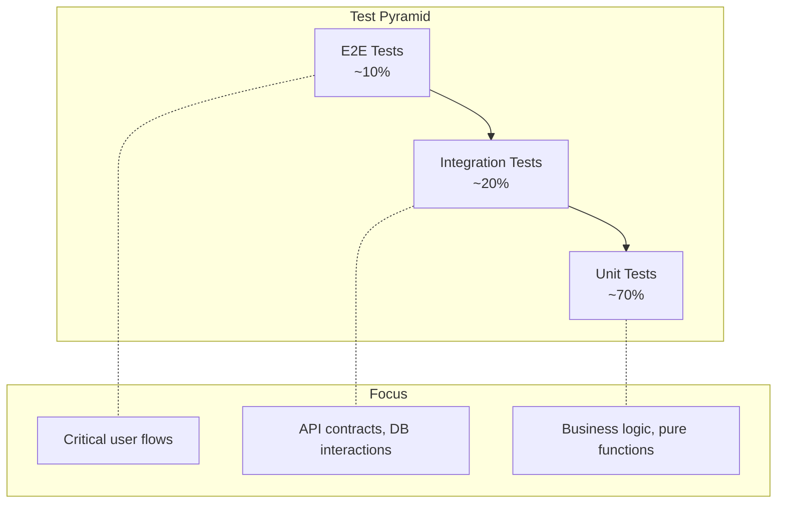

<!-- SSM:CHUNK_BOUNDARY id="ch14-start" -->
📘 CHAPTER 14 — TESTING 🔴 Advanced

TypeScript testing requires a combination of **compile-time type verification** and **runtime behavior testing**.

> **Quick Answer:** Use Vitest for new projects (faster, native ESM support), Jest for established projects. Always test both types (compile-time) and behavior (runtime).

### 14.1 Type Testing

Test that types work as expected:

Example:

```typescript
// Type-level test
type Expect<T extends true> = T;
type IsEqual<A, B> = A extends B ? (B extends A ? true : false) : false;

type Test1 = Expect<IsEqual<string, string>>; // true
type Test2 = Expect<IsEqual<string, number>>; // false (error)
```

#### 14.1.1 Advanced Type Testing with expect-type

```typescript
import { expectTypeOf } from "expect-type";

// ✅ Pattern: Type-level assertions
expectTypeOf<string>().toMatchTypeOf<string>();
expectTypeOf<"hello">().toMatchTypeOf<string>();
expectTypeOf<string>().not.toMatchTypeOf<number>();

// Test function signatures
declare function fetchUser(id: string): Promise<User>;

expectTypeOf(fetchUser).parameter(0).toBeString();
expectTypeOf(fetchUser).returns.resolves.toMatchTypeOf<User>();

// Test object shapes
interface User {
  id: string;
  name: string;
  email?: string;
}

expectTypeOf<User>().toHaveProperty("id");
expectTypeOf<User>().toHaveProperty("email").toBeNullable();
```

#### 14.1.2 Type Testing with tsd

```typescript
// file: index.test-d.ts
import { expectType, expectError, expectAssignable } from "tsd";
import { createUser, User } from "./index";

// Test return types
expectType<User>(createUser({ name: "John" }));

// Test that certain inputs are rejected
expectError(createUser({ name: 123 }));

// Test assignability
expectAssignable<{ name: string }>(createUser({ name: "John" }));
```

### 14.2 Unit Testing with Jest

#### 14.2.1 Jest Configuration for TypeScript

```typescript
// jest.config.ts
import type { Config } from "jest";

const config: Config = {
  preset: "ts-jest",
  testEnvironment: "node",
  roots: ["<rootDir>/src"],
  testMatch: ["**/*.test.ts", "**/*.spec.ts"],
  moduleNameMapper: {
    "^@/(.*)$": "<rootDir>/src/$1",
  },
  collectCoverageFrom: [
    "src/**/*.ts",
    "!src/**/*.d.ts",
    "!src/**/*.test.ts",
  ],
  coverageThreshold: {
    global: {
      branches: 80,
      functions: 80,
      lines: 80,
      statements: 80,
    },
  },
};

export default config;
```

#### 14.2.2 Type-Safe Test Patterns

```typescript
import { describe, it, expect, beforeEach, jest } from "@jest/globals";

// ✅ Pattern: Type-safe service testing
interface UserRepository {
  findById(id: string): Promise<User | null>;
  save(user: User): Promise<User>;
}

class UserService {
  constructor(private repo: UserRepository) {}

  async getUser(id: string): Promise<User> {
    const user = await this.repo.findById(id);
    if (!user) throw new Error("User not found");
    return user;
  }
}

describe("UserService", () => {
  let service: UserService;
  let mockRepo: jest.Mocked<UserRepository>;

  beforeEach(() => {
    // Type-safe mock creation
    mockRepo = {
      findById: jest.fn<UserRepository["findById"]>(),
      save: jest.fn<UserRepository["save"]>(),
    };
    service = new UserService(mockRepo);
  });

  it("should return user when found", async () => {
    const expectedUser: User = { id: "1", name: "John", email: "john@example.com" };
    mockRepo.findById.mockResolvedValue(expectedUser);

    const result = await service.getUser("1");

    expect(result).toEqual(expectedUser);
    expect(mockRepo.findById).toHaveBeenCalledWith("1");
  });

  it("should throw when user not found", async () => {
    mockRepo.findById.mockResolvedValue(null);

    await expect(service.getUser("1")).rejects.toThrow("User not found");
  });
});
```

### 14.3 Unit Testing with Vitest

Vitest offers faster execution and native ESM support.

#### 14.3.1 Vitest Configuration

```typescript
// vitest.config.ts
import { defineConfig } from "vitest/config";
import { resolve } from "path";

export default defineConfig({
  test: {
    globals: true,
    environment: "node",
    include: ["src/**/*.{test,spec}.ts"],
    coverage: {
      provider: "v8",
      reporter: ["text", "html", "lcov"],
      exclude: ["**/*.d.ts", "**/*.test.ts", "node_modules"],
    },
    typecheck: {
      enabled: true,
      include: ["src/**/*.test-d.ts"],
    },
  },
  resolve: {
    alias: {
      "@": resolve(__dirname, "src"),
    },
  },
});
```

#### 14.3.2 Vitest Test Patterns

```typescript
import { describe, it, expect, vi, beforeEach } from "vitest";

// ✅ Pattern: Vitest mocking
describe("UserService", () => {
  const mockRepo = {
    findById: vi.fn<[string], Promise<User | null>>(),
    save: vi.fn<[User], Promise<User>>(),
  };

  beforeEach(() => {
    vi.clearAllMocks();
  });

  it("should call repository with correct id", async () => {
    const user: User = { id: "1", name: "John", email: "john@example.com" };
    mockRepo.findById.mockResolvedValueOnce(user);

    const service = new UserService(mockRepo);
    await service.getUser("1");

    expect(mockRepo.findById).toHaveBeenCalledOnce();
    expect(mockRepo.findById).toHaveBeenCalledWith("1");
  });
});

// ✅ Pattern: Snapshot testing with types
it("should serialize user correctly", () => {
  const user: User = { id: "1", name: "John", email: "john@example.com" };
  expect(user).toMatchInlineSnapshot(`
    {
      "email": "john@example.com",
      "id": "1",
      "name": "John",
    }
  `);
});
```

### 14.4 Mocking Strategies

#### 14.4.1 Type-Safe Mock Factories

```typescript
// ✅ Pattern: Factory functions for consistent mocks
function createMockUser(overrides: Partial<User> = {}): User {
  return {
    id: "test-id",
    name: "Test User",
    email: "test@example.com",
    createdAt: new Date("2024-01-01"),
    ...overrides,
  };
}

function createMockUserRepository(): jest.Mocked<UserRepository> {
  return {
    findById: jest.fn(),
    findAll: jest.fn(),
    save: jest.fn(),
    delete: jest.fn(),
  };
}

// Usage in tests
it("should update user email", async () => {
  const user = createMockUser({ name: "Custom Name" });
  const repo = createMockUserRepository();
  repo.findById.mockResolvedValue(user);
  // ...
});
```

#### 14.4.2 Module Mocking

```typescript
// ✅ Pattern: Mock external modules
vi.mock("@/lib/email", () => ({
  sendEmail: vi.fn().mockResolvedValue({ sent: true }),
}));

// ✅ Pattern: Partial module mocking
vi.mock("@/lib/utils", async () => {
  const actual = await vi.importActual<typeof import("@/lib/utils")>("@/lib/utils");
  return {
    ...actual,
    generateId: vi.fn().mockReturnValue("mock-id"),
  };
});

// ✅ Pattern: Mock Date/time
beforeEach(() => {
  vi.useFakeTimers();
  vi.setSystemTime(new Date("2024-01-15T10:00:00Z"));
});

afterEach(() => {
  vi.useRealTimers();
});
```

### 14.5 Integration Testing

#### 14.5.1 API Integration Tests

```typescript
import { describe, it, expect, beforeAll, afterAll } from "vitest";
import supertest from "supertest";
import { createApp } from "@/app";
import { createTestDatabase, cleanupTestDatabase } from "@/test/helpers";

describe("User API", () => {
  let app: ReturnType<typeof createApp>;
  let request: supertest.SuperTest<supertest.Test>;

  beforeAll(async () => {
    await createTestDatabase();
    app = createApp();
    request = supertest(app);
  });

  afterAll(async () => {
    await cleanupTestDatabase();
  });

  describe("POST /users", () => {
    it("should create a user", async () => {
      const response = await request
        .post("/users")
        .send({ name: "John", email: "john@example.com" })
        .expect(201);

      expect(response.body).toMatchObject({
        id: expect.any(String),
        name: "John",
        email: "john@example.com",
      });
    });

    it("should validate input", async () => {
      const response = await request
        .post("/users")
        .send({ name: "" })
        .expect(400);

      expect(response.body.errors).toContainEqual(
        expect.objectContaining({ field: "email" })
      );
    });
  });
});
```

#### 14.5.2 Database Integration Tests

```typescript
import { describe, it, expect, beforeEach } from "vitest";
import { PrismaClient } from "@prisma/client";

// ✅ Pattern: Test database isolation
describe("UserRepository", () => {
  const prisma = new PrismaClient();
  
  beforeEach(async () => {
    // Clean up before each test
    await prisma.$transaction([
      prisma.user.deleteMany(),
      prisma.profile.deleteMany(),
    ]);
  });

  it("should create user with profile", async () => {
    const user = await prisma.user.create({
      data: {
        email: "test@example.com",
        name: "Test User",
        profile: {
          create: { bio: "Test bio" },
        },
      },
      include: { profile: true },
    });

    expect(user.profile).toMatchObject({ bio: "Test bio" });
  });
});
```

### 14.6 E2E Testing with Playwright

```typescript
// tests/e2e/login.spec.ts
import { test, expect, type Page } from "@playwright/test";

// ✅ Pattern: Page Object Model
class LoginPage {
  constructor(private page: Page) {}

  async navigate() {
    await this.page.goto("/login");
  }

  async login(email: string, password: string) {
    await this.page.getByLabel("Email").fill(email);
    await this.page.getByLabel("Password").fill(password);
    await this.page.getByRole("button", { name: "Sign in" }).click();
  }

  async getErrorMessage() {
    return this.page.getByRole("alert").textContent();
  }
}

test.describe("Login", () => {
  test("should login successfully", async ({ page }) => {
    const loginPage = new LoginPage(page);
    await loginPage.navigate();
    await loginPage.login("user@example.com", "password123");
    
    await expect(page).toHaveURL("/dashboard");
    await expect(page.getByRole("heading")).toContainText("Welcome");
  });

  test("should show error for invalid credentials", async ({ page }) => {
    const loginPage = new LoginPage(page);
    await loginPage.navigate();
    await loginPage.login("user@example.com", "wrong");
    
    await expect(loginPage.getErrorMessage()).resolves.toContain("Invalid");
  });
});
```

### 14.7 Test Architecture Patterns



#### 14.7.1 Test Organization

```
src/
├── user/
│   ├── user.service.ts
│   ├── user.service.test.ts      # Unit tests
│   ├── user.repository.ts
│   └── user.repository.test.ts   # Unit tests
├── __tests__/
│   └── integration/
│       └── user.api.test.ts      # Integration tests
└── e2e/
    └── user-flow.spec.ts          # E2E tests
```

#### 14.7.2 Test Utilities

```typescript
// test/helpers.ts
import { vi } from "vitest";

// ✅ Pattern: Test utilities
export function createAsyncMock<T>(value: T) {
  return vi.fn().mockResolvedValue(value);
}

export function createThrowingMock(error: Error) {
  return vi.fn().mockRejectedValue(error);
}

export async function expectToThrowAsync<T extends Error>(
  fn: () => Promise<unknown>,
  errorType: new (...args: unknown[]) => T
) {
  try {
    await fn();
    expect.fail("Expected function to throw");
  } catch (error) {
    expect(error).toBeInstanceOf(errorType);
  }
}

// ✅ Pattern: Custom matchers
expect.extend({
  toBeValidEmail(received: string) {
    const emailRegex = /^[^\s@]+@[^\s@]+\.[^\s@]+$/;
    const pass = emailRegex.test(received);
    return {
      pass,
      message: () => `expected ${received} ${pass ? "not " : ""}to be valid email`,
    };
  },
});

declare module "vitest" {
  interface Assertion {
    toBeValidEmail(): void;
  }
}
```

### 14.8 Property-Based Testing

**Property-Based Testing**: Generate random inputs and verify properties.

**fast-check**: Property-based testing library for TypeScript.

Example:

```typescript
import fc from "fast-check";

// Property: Addition is commutative
fc.assert(
  fc.property(fc.integer(), fc.integer(), (a, b) => {
    return a + b === b + a;
  })
);

// Property: Array length after filter
fc.assert(
  fc.property(fc.array(fc.integer()), (arr) => {
    const filtered = arr.filter((x) => x > 0);
    return filtered.length <= arr.length;
  })
);

// Property: String concatenation
fc.assert(
  fc.property(fc.string(), fc.string(), (a, b) => {
    const result = a + b;
    return result.length === a.length + b.length;
  })
);
```

**Arbitraries**: Custom generators for complex types.

Example:

```typescript
import fc from "fast-check";

// Custom arbitrary for User type
const userArbitrary = fc.record({
  id: fc.uuid(),
  name: fc.string({ minLength: 1, maxLength: 50 }),
  email: fc.emailAddress(),
  age: fc.integer({ min: 0, max: 120 }),
});

// Test property with custom type
fc.assert(
  fc.property(userArbitrary, (user) => {
    return user.age >= 0 && user.age <= 120;
  })
);
```

**Shrinking**: Automatically find minimal failing cases.

Example:

```typescript
fc.assert(
  fc.property(fc.array(fc.integer()), (arr) => {
    // This will fail, and fast-check will shrink to minimal case
    return arr.every((x) => x > 0);
  })
);
// Shrinks to: [-1] (minimal failing case)
```

### 14.9 Mutation Testing

**Mutation Testing**: Test test quality by introducing bugs.

**Stryker**: Mutation testing framework for TypeScript.

Example:

```typescript
// Original code
function add(a: number, b: number): number {
  return a + b;
}

// Mutations (automatically generated):
// 1. return a - b; (arithmetic operator mutation)
// 2. return a * b; (arithmetic operator mutation)
// 3. return a; (statement deletion)
// 4. return b; (statement deletion)

// Tests
describe("add", () => {
  it("should add two numbers", () => {
    expect(add(2, 3)).toBe(5);
  });
});

// Mutation score: 75% (3 out of 4 mutations killed)
```

**Mutation Operators:**

- **Arithmetic**: `+` → `-`, `*`, `/`
- **Relational**: `>` → `<`, `>=`, `<=`
- **Logical**: `&&` → `||`, `!`
- **Conditional**: `if (x)` → `if (!x)`, `if (true)`, `if (false)`
- **Statement**: Delete statements, replace with `return`

**Configuration:**

```json
{
  "mutator": {
    "excludedMutations": ["StringLiteral", "BooleanLiteral"]
  },
  "testRunner": "jest",
  "coverageAnalysis": "perTest"
}
```

### 14.10 Fuzzing

**Fuzzing**: Generate random inputs to find bugs.

**jsfuzz**: Fuzzing library for JavaScript/TypeScript.

Example:

```typescript
import { fuzz } from "jsfuzz";

// Fuzz a function with random inputs
fuzz(
  (data: Buffer) => {
    // Function to fuzz
    const str = data.toString("utf-8");
    JSON.parse(str); // May throw on invalid JSON
  },
  {
    maxTime: 60, // Run for 60 seconds
    maxIterations: 10000, // Or 10,000 iterations
  }
);
```

**Custom Fuzzers:**

Example:

```typescript
import { fuzz, Fuzzer } from "jsfuzz";

// Custom fuzzer for specific type
const jsonFuzzer: Fuzzer = {
  generate(): Buffer {
    // Generate random JSON-like strings
    const randomJson = `{"key": "${Math.random()}"}`;
    return Buffer.from(randomJson);
  },
};

fuzz(
  (data: Buffer) => {
    JSON.parse(data.toString());
  },
  {
    fuzzer: jsonFuzzer,
  }
);
```

**AFL (American Fuzzy Lop) Integration:**

Example:

```typescript
// Compile TypeScript to JavaScript
// Use AFL to fuzz the compiled JavaScript

// AFL command:
// afl-fuzz -i input_dir -o output_dir node program.js @@
```

**Coverage-Guided Fuzzing:**

- Track code coverage
- Prefer inputs that explore new paths
- More effective than random fuzzing

### See Also {#chapter-14-see-also}

- **Chapter 13: Security** — Security testing requirements
- **Chapter 15: Tooling** — Testing tools configuration
- **Chapter 32: Static Analysis** — Static testing approaches
- **Appendix B: Tooling** — Testing tool references

---


<!-- SSM:CHUNK_BOUNDARY id="ch14-end" -->
