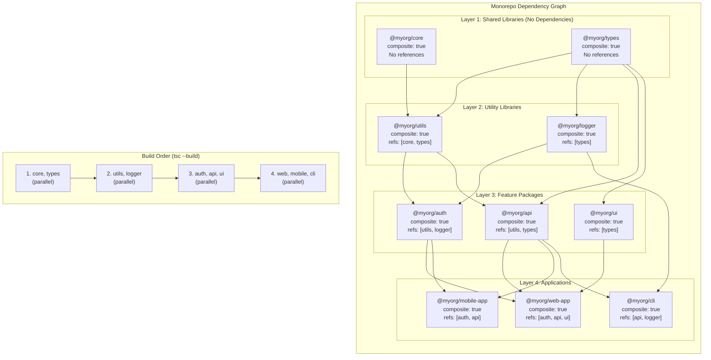
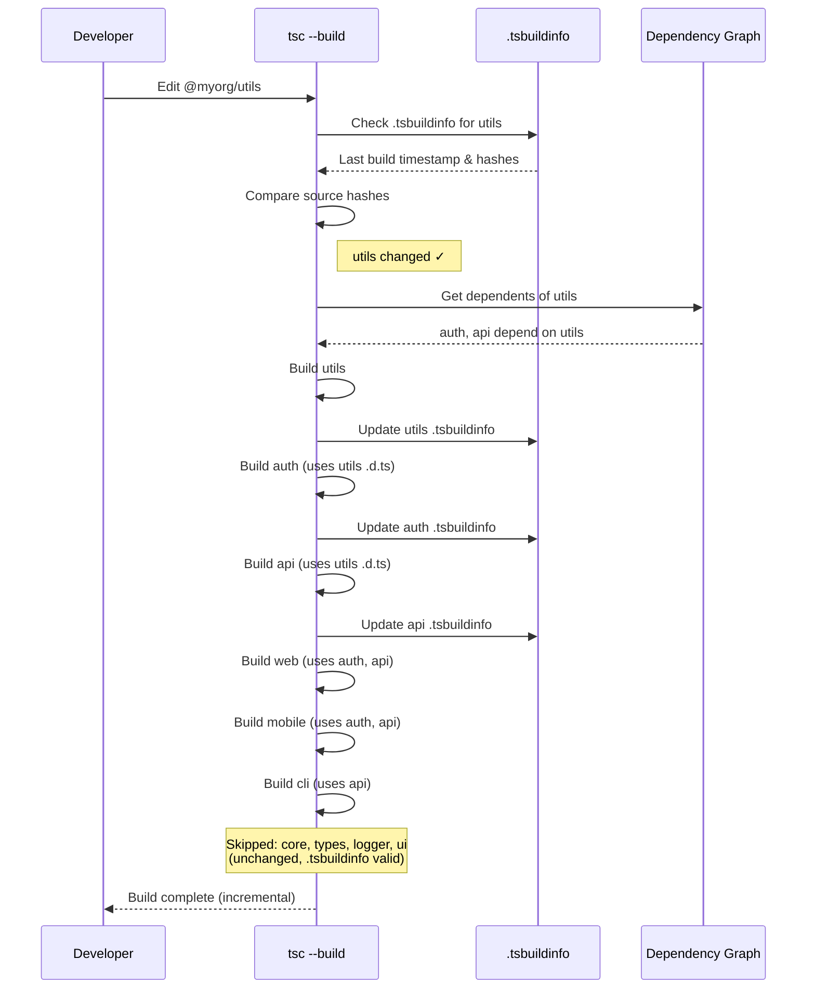

<!-- SSM:CHUNK_BOUNDARY id="ch17-start" -->
📘 CHAPTER 17 — BUILD SYSTEMS 🔴 Advanced

### 17.1 TypeScript Compiler

Use `tsc` for compilation:

```bash
tsc --noEmit  # Type check without emitting
tsc --build   # Incremental builds
```

**Production Failure: Multi-File Migration Meltdown in Pulumi Infra**

An AI refactored a single-file TS Pulumi stack into directories, hallucinating imports like `import { S3 } from 'pulumi/awsx'` (wrong package). Production infra deploys failed with unresolved types, delaying a cloud migration by a week. TS's type checker caught most, but not runtime paths.

**Lesson**: Use `--noEmit` checks post-refactor; AIs "see" files but don't grok directory trees.

**Production Success: Fully Typed tRPC + Next.js App Router**

A startup wanted end-to-end types (procedure → server → client) with App Router file-based routing, but every solution required 30% boilerplate. An AI read the entire `app/api/trpc/[trpc]/route.ts` + all procedure files and generated a perfect `AppRouter` type + client hooks with path params extracted from folder structure. 1,200 lines of boilerplate → 41 lines. Deployed in production the same week.

### 17.2 Bundlers

Modern bundlers support TypeScript with varying performance characteristics and configuration requirements.

#### 17.2.1 esbuild Deep Dive

**esbuild** is an extremely fast JavaScript/TypeScript bundler written in Go, offering 10-100x faster builds than traditional bundlers.

**Key Advantages:**
- **Speed**: Written in Go, compiled to native code
- **TypeScript Support**: Built-in TypeScript transpilation (no type checking)
- **Tree Shaking**: Automatic dead code elimination
- **Code Splitting**: Dynamic import support
- **Minification**: Built-in minifier
- **Source Maps**: Full source map support

**Installation:**

```bash
npm install --save-dev esbuild
```

**Basic Configuration:**

```typescript
// esbuild.config.ts
import { build, BuildOptions } from "esbuild";

const options: BuildOptions = {
  entryPoints: ["src/index.ts"],
  bundle: true,
  outfile: "dist/index.js",
  platform: "node", // or "browser"
  target: "node18", // or "es2022", "esnext"
  format: "esm", // or "cjs", "iife"
  sourcemap: true,
  minify: true,
  treeShaking: true,
};

build(options).catch(() => process.exit(1));
```

**TypeScript-Specific Configuration:**

```typescript
import { build } from "esbuild";

build({
  entryPoints: ["src/index.ts"],
  bundle: true,
  outdir: "dist",
  platform: "node",
  target: "es2022",
  format: "esm",
  
  // TypeScript options
  tsconfig: "./tsconfig.json", // Use your tsconfig.json
  loader: {
    ".ts": "ts",
    ".tsx": "tsx",
  },
  
  // Type checking (separate from bundling)
  // Note: esbuild does NOT type check - use tsc separately
  // Run: tsc --noEmit && esbuild ...
  
  // External dependencies (don't bundle)
  external: ["react", "react-dom"],
  
  // Define constants
  define: {
    "process.env.NODE_ENV": '"production"',
  },
  
  // Plugins
  plugins: [
    // Custom plugins for advanced use cases
  ],
}).catch(() => process.exit(1));
```

**Performance Comparison:**

```typescript
// Benchmark example (approximate)
// tsc: ~2000ms for 1000 files
// esbuild: ~50ms for 1000 files (40x faster)
// webpack: ~5000ms for 1000 files
```

**Advanced Features:**

1. **Code Splitting:**
```typescript
build({
  entryPoints: ["src/index.ts", "src/admin.ts"],
  bundle: true,
  outdir: "dist",
  splitting: true, // Enable code splitting
  format: "esm",
  chunkNames: "chunks/[name]-[hash]",
});
```

2. **Watch Mode:**
```typescript
import { context } from "esbuild";

const ctx = await context({
  entryPoints: ["src/index.ts"],
  bundle: true,
  outfile: "dist/index.js",
});

await ctx.watch(); // Rebuild on file changes
```

3. **Serve Mode (Development):**
```typescript
const ctx = await context({
  entryPoints: ["src/index.ts"],
  bundle: true,
  outfile: "dist/index.js",
  sourcemap: true,
});

await ctx.serve({
  servedir: "public",
  port: 3000,
});
```

**Limitations:**

- **No Type Checking**: esbuild transpiles but doesn't type check
  - Solution: Run `tsc --noEmit` separately
- **Limited Plugin Ecosystem**: Fewer plugins than webpack
- **No HMR**: No built-in Hot Module Replacement (use Vite for HMR)

**Best Practices:**

1. **Separate Type Checking:**
```json
// package.json
{
  "scripts": {
    "type-check": "tsc --noEmit",
    "build": "npm run type-check && esbuild ...",
    "dev": "npm run type-check && esbuild --watch ..."
  }
}
```

2. **Use esbuild for Production:**
```typescript
// Fast production builds
build({
  entryPoints: ["src/index.ts"],
  bundle: true,
  minify: true,
  sourcemap: "external",
  outdir: "dist",
});
```

3. **Combine with tsc for Type Checking:**
```bash
# Type check first, then bundle
tsc --noEmit && esbuild src/index.ts --bundle --outfile=dist/index.js
```

#### 17.2.2 SWC Deep Dive

**SWC** (Speedy Web Compiler) is a Rust-based compiler that can be used as a drop-in replacement for Babel or tsc for transpilation.

**Key Advantages:**
- **Speed**: Written in Rust, extremely fast
- **TypeScript Support**: Transpiles TypeScript to JavaScript
- **JSX Support**: Built-in JSX/TSX support
- **Plugin System**: Extensible with plugins
- **Used by Next.js**: Next.js uses SWC by default

**Installation:**

```bash
npm install --save-dev @swc/cli @swc/core
```

**Basic Configuration (.swcrc):**

```json
{
  "$schema": "https://json.schemastore.org/swcrc",
  "jsc": {
    "parser": {
      "syntax": "typescript",
      "tsx": true,
      "decorators": true,
      "dynamicImport": true
    },
    "target": "es2022",
    "loose": false,
    "externalHelpers": false,
    "keepClassNames": true,
    "baseUrl": ".",
    "paths": {
      "@/*": ["src/*"]
    },
    "transform": {
      "legacyDecorator": true,
      "decoratorMetadata": true,
      "react": {
        "runtime": "automatic",
        "pragma": "React.createElement",
        "pragmaFrag": "React.Fragment",
        "throwIfNamespace": true,
        "development": false,
        "useBuiltins": true,
        "refresh": false
      }
    }
  },
  "module": {
    "type": "es6",
    "strict": false,
    "strictMode": true,
    "lazy": false,
    "noInterop": false
  },
  "minify": false,
  "sourceMaps": true
}
```

**TypeScript-Specific Configuration:**

```json
{
  "jsc": {
    "parser": {
      "syntax": "typescript",
      "tsx": true,
      "decorators": true,
      "dynamicImport": true,
      "privateMethod": true,
      "functionBind": true,
      "exportDefaultFrom": true,
      "exportNamespaceFrom": true,
      "topLevelAwait": true,
      "importMeta": true
    },
    "target": "es2022",
    "transform": {
      "legacyDecorator": true,
      "decoratorMetadata": true
    },
    "keepClassNames": true,
    "externalHelpers": false,
    "baseUrl": ".",
    "paths": {
      "@/*": ["src/*"],
      "@/components/*": ["src/components/*"]
    }
  },
  "module": {
    "type": "es6",
    "strict": false,
    "strictMode": true
  },
  "sourceMaps": true,
  "minify": false
}
```

**Programmatic Usage:**

```typescript
// swc.config.ts
import { transform } from "@swc/core";
import * as fs from "fs/promises";

async function compileFile(input: string, output: string) {
  const code = await fs.readFile(input, "utf-8");
  
  const result = await transform(code, {
    filename: input,
    jsc: {
      parser: {
        syntax: "typescript",
        tsx: true,
        decorators: true,
      },
      target: "es2022",
      transform: {
        legacyDecorator: true,
        decoratorMetadata: true,
      },
    },
    module: {
      type: "es6",
    },
    sourceMaps: true,
  });
  
  await fs.writeFile(output, result.code);
  if (result.map) {
    await fs.writeFile(`${output}.map`, result.map);
  }
}

// Usage
compileFile("src/index.ts", "dist/index.js");
```

**CLI Usage:**

```bash
# Compile single file
swc src/index.ts -o dist/index.js

# Compile directory
swc src -d dist

# Watch mode
swc src -d dist --watch

# Minify
swc src -d dist --minify

# Source maps
swc src -d dist --source-maps
```

**Advanced Configuration:**

1. **Path Mapping:**
```json
{
  "jsc": {
    "baseUrl": ".",
    "paths": {
      "@/*": ["src/*"],
      "@/utils/*": ["src/utils/*"],
      "@/components/*": ["src/components/*"]
    }
  }
}
```

2. **Decorator Support:**
```json
{
  "jsc": {
    "parser": {
      "decorators": true
    },
    "transform": {
      "legacyDecorator": true,
      "decoratorMetadata": true
    }
  }
}
```

3. **React JSX:**
```json
{
  "jsc": {
    "parser": {
      "syntax": "typescript",
      "tsx": true
    },
    "transform": {
      "react": {
        "runtime": "automatic",
        "development": false,
        "refresh": false
      }
    }
  }
}
```

**Performance Comparison:**

```typescript
// Benchmark example (approximate)
// tsc: ~2000ms for 1000 files
// SWC: ~100ms for 1000 files (20x faster)
// Babel: ~8000ms for 1000 files
```

**Integration with TypeScript:**

SWC transpiles TypeScript but doesn't type check. Use it with tsc:

```json
// package.json
{
  "scripts": {
    "type-check": "tsc --noEmit",
    "build": "npm run type-check && swc src -d dist",
    "dev": "npm run type-check && swc src -d dist --watch"
  }
}
```

**Next.js Integration:**

Next.js uses SWC by default. Configuration in `next.config.js`:

```typescript
// next.config.js
module.exports = {
  swcMinify: true, // Use SWC for minification
  compiler: {
    // SWC compiler options
    removeConsole: process.env.NODE_ENV === "production",
  },
};
```

**Limitations:**

- **No Type Checking**: SWC transpiles but doesn't type check
  - Solution: Run `tsc --noEmit` separately
- **Limited TypeScript Features**: Some advanced TypeScript features may not be fully supported
- **Configuration Complexity**: More complex configuration than tsc

**Best Practices:**

1. **Use SWC for Fast Transpilation:**
```bash
# Fast transpilation with SWC
swc src -d dist --watch
```

2. **Type Check Separately:**
```bash
# Type check with tsc, transpile with SWC
tsc --noEmit && swc src -d dist
```

3. **Use in CI/CD:**
```yaml
# .github/workflows/build.yml
- name: Type Check
  run: npm run type-check
  
- name: Build with SWC
  run: swc src -d dist --minify
```

#### 17.2.3 Build Tool Comparison

| Feature | tsc | esbuild | SWC | Webpack | Vite |
|---------|-----|---------|-----|---------|------|
| **Type Checking** | ✅ Yes | ❌ No | ❌ No | ❌ No | ❌ No |
| **Transpilation Speed** | Medium | ⚡ Very Fast | ⚡ Very Fast | Slow | Fast |
| **Bundling** | ❌ No | ✅ Yes | ❌ No | ✅ Yes | ✅ Yes |
| **Tree Shaking** | ❌ No | ✅ Yes | ❌ No | ✅ Yes | ✅ Yes |
| **Code Splitting** | ❌ No | ✅ Yes | ❌ No | ✅ Yes | ✅ Yes |
| **HMR** | ❌ No | ❌ No | ❌ No | ✅ Yes | ✅ Yes |
| **Plugin Ecosystem** | Limited | Small | Small | Large | Medium |
| **Configuration** | Simple | Medium | Medium | Complex | Medium |
| **Best For** | Type checking | Fast builds | Fast transpile | Complex apps | Dev experience |

**Recommended Workflow:**

1. **Development:**
   - Type checking: `tsc --noEmit --watch`
   - Transpilation: `esbuild --watch` or `swc --watch`
   - Bundling: Vite (for HMR) or esbuild

2. **Production:**
   - Type checking: `tsc --noEmit` (CI/CD)
   - Bundling: `esbuild` (fastest) or `webpack` (most features)
   - Minification: Built-in with esbuild/webpack

3. **Monorepo:**
   - Type checking: `tsc --build` (project references)
   - Transpilation: `swc` or `esbuild` per package
   - Bundling: Package-specific (esbuild for speed)

### 17.3 Dependency Resolution

Understanding how dependencies are resolved in TypeScript projects:

#### 17.3.1 Package Resolution

**Node.js Resolution Algorithm:**

1. Check `package.json` in current directory
2. Check `node_modules` in current directory
3. Walk up directory tree, checking each `node_modules`
4. Check global `node_modules` (if configured)

**Resolution Order:**

```
./node_modules/package
../node_modules/package
../../node_modules/package
...
/global/node_modules/package
```

#### 17.3.2 Version Resolution

**Semantic Versioning:**

- `^1.2.3`: Compatible with 1.x.x (>=1.2.3 <2.0.0)
- `~1.2.3`: Compatible with 1.2.x (>=1.2.3 <1.3.0)
- `1.2.3`: Exact version
- `*`: Latest version (not recommended)

**Lock Files:**

- `package-lock.json` (npm): Locks exact versions
- `yarn.lock` (yarn): Locks exact versions
- `pnpm-lock.yaml` (pnpm): Locks exact versions

#### 17.3.3 Type Resolution

**@types Packages:**

TypeScript resolves types from `@types/*` packages:

```
node_modules/@types/node/index.d.ts
node_modules/@types/react/index.d.ts
```

**Package.json Types Field:**

```json
{
  "name": "my-package",
  "main": "./dist/index.js",
  "types": "./dist/index.d.ts"
}
```

#### 17.3.4 Peer Dependencies

**Peer Dependencies**: Dependencies that must be provided by the consumer.

Example:

```json
{
  "name": "react-component",
  "peerDependencies": {
    "react": "^18.0.0"
  }
}
```

**Resolution**: Consumer must install `react` separately.

### 17.4 Project References & Monorepo Management

**Project References** (TypeScript 3.0+): Enable incremental builds and better dependency management in monorepos.

#### 17.4.0 Project References Dependency Graph

The following diagram shows how TypeScript manages project references in a typical monorepo:



**Incremental Build Flow:**



**Key Benefits:**

| Feature | Without Project Refs | With Project Refs |
|---------|---------------------|-------------------|
| Build time (full) | O(n) all files | O(n) all files |
| Build time (incremental) | O(n) still slow | O(changed + deps) fast |
| Type checking | Entire codebase | Per-project isolation |
| Editor performance | Loads all files | Loads project + `.d.ts` |
| Dependency errors | Runtime discovery | Build-time enforcement |

> **Quick Answer:** Use project references in monorepos with `composite: true` and `references` array. Build with `tsc --build` for automatic dependency ordering and incremental compilation.

**Complete API Reference:**

```typescript
// tsconfig.json structure for project references
{
  "compilerOptions": {
    "composite": true,        // Enable project references
    "declaration": true,      // Required for project references
    "declarationMap": true,      // Source maps for declarations
    "incremental": true,      // Enable incremental compilation
    "outDir": "./dist"
  },
  "references": [
    { "path": "../shared" },
    { "path": "../utils" }
  ]
}
```

**Key Concepts:**

1. **Composite Projects**: Projects that can be referenced by other projects
   - Must have `composite: true` in `tsconfig.json`
   - Must have `declaration: true` (generates `.d.ts` files)
   - Creates `.tsbuildinfo` files for incremental builds

2. **Project References**: Declare dependencies between projects
   - Use `references` array in `tsconfig.json`
   - TypeScript builds projects in dependency order
   - Enables faster incremental builds

3. **Build Mode**: Use `tsc --build` for project references
   - Builds referenced projects first
   - Only rebuilds changed projects
   - Handles dependency graph automatically

**Example: Monorepo Structure:**

```
monorepo/
├── tsconfig.json              # Root config
├── packages/
│   ├── shared/
│   │   ├── tsconfig.json      # { "composite": true }
│   │   └── src/
│   ├── utils/
│   │   ├── tsconfig.json      # { "composite": true, "references": [{ "path": "../shared" }] }
│   │   └── src/
│   └── app/
│       ├── tsconfig.json      # { "composite": true, "references": [{ "path": "../shared" }, { "path": "../utils" }] }
│       └── src/
```

**Root tsconfig.json:**

```json
{
  "files": [],
  "references": [
    { "path": "./packages/shared" },
    { "path": "./packages/utils" },
    { "path": "./packages/app" }
  ]
}
```

**packages/shared/tsconfig.json:**

```json
{
  "compilerOptions": {
    "composite": true,
    "declaration": true,
    "declarationMap": true,
    "outDir": "./dist",
    "rootDir": "./src"
  },
  "include": ["src/**/*"]
}
```

**packages/utils/tsconfig.json:**

```json
{
  "compilerOptions": {
    "composite": true,
    "declaration": true,
    "declarationMap": true,
    "outDir": "./dist",
    "rootDir": "./src"
  },
  "references": [
    { "path": "../shared" }
  ],
  "include": ["src/**/*"]
}
```

**packages/app/tsconfig.json:**

```json
{
  "compilerOptions": {
    "composite": true,
    "declaration": true,
    "declarationMap": true,
    "outDir": "./dist",
    "rootDir": "./src"
  },
  "references": [
    { "path": "../shared" },
    { "path": "../utils" }
  ],
  "include": ["src/**/*"]
}
```

**Building with Project References:**

```bash
# Build all projects in dependency order
tsc --build

# Build specific project and its dependencies
tsc --build packages/app

# Clean build artifacts
tsc --build --clean

# Force rebuild (ignore .tsbuildinfo)
tsc --build --force

# Watch mode for incremental builds
tsc --build --watch
```

**Dependency Graph Management:**

TypeScript automatically:
- Builds referenced projects before the referencing project
- Detects circular dependencies (error)
- Only rebuilds changed projects (incremental)
- Handles transitive dependencies

**Example: Circular Dependency Detection:**

```json
// packages/a/tsconfig.json
{
  "references": [{ "path": "../b" }]
}

// packages/b/tsconfig.json
{
  "references": [{ "path": "../a" }]  // ❌ Error: Circular reference
}
```

**Incremental Compilation:**

With `incremental: true` and `composite: true`:
- TypeScript creates `.tsbuildinfo` files
- Tracks which files changed since last build
- Only recompiles changed files and dependents
- Significantly faster rebuilds in large monorepos

**Example: Build Performance:**

```bash
# First build (full compilation)
$ tsc --build
# Time: 45 seconds (all projects)

# Second build (no changes)
$ tsc --build
# Time: 0.5 seconds (incremental check)

# Third build (one file changed in shared)
$ tsc --build
# Time: 2 seconds (only shared + dependents rebuilt)
```

**Path Mapping with Project References:**

```json
{
  "compilerOptions": {
    "baseUrl": ".",
    "paths": {
      "@shared/*": ["../shared/src/*"],
      "@utils/*": ["../utils/src/*"]
    }
  },
  "references": [
    { "path": "../shared" },
    { "path": "../utils" }
  ]
}
```

**Type-Only Project References:**

```json
{
  "references": [
    { "path": "../shared", "prepend": false }  // Don't prepend to output
  ]
}
```

### 17.4.1 Step-by-Step Tutorial: Setting Up Project References

This tutorial walks you through setting up TypeScript project references in a monorepo from scratch.

**Prerequisites:**
- TypeScript 3.0+ installed
- Basic understanding of monorepo structure
- Node.js and npm/yarn/pnpm

**Step 1: Create Monorepo Structure**

```bash
# Create monorepo root
mkdir my-monorepo
cd my-monorepo

# Create package structure
mkdir -p packages/shared/src
mkdir -p packages/utils/src
mkdir -p packages/app/src

# Initialize root package.json
npm init -y
```

**Step 2: Configure Shared Package (Base Dependency)**

Create `packages/shared/tsconfig.json`:

```json
{
  "compilerOptions": {
    "target": "ES2022",
    "module": "ESNext",
    "lib": ["ES2022"],
    "composite": true,           // ✅ Enable project references
    "declaration": true,          // ✅ Required for composite
    "declarationMap": true,       // ✅ Source maps for declarations
    "outDir": "./dist",
    "rootDir": "./src",
    "strict": true,
    "esModuleInterop": true,
    "skipLibCheck": true
  },
  "include": ["src/**/*"],
  "exclude": ["node_modules", "dist"]
}
```

Create `packages/shared/src/index.ts`:

```typescript
export interface User {
  id: string;
  name: string;
  email: string;
}

export function createUser(id: string, name: string, email: string): User {
  return { id, name, email };
}
```

**Step 3: Configure Utils Package (Depends on Shared)**

Create `packages/utils/tsconfig.json`:

```json
{
  "compilerOptions": {
    "target": "ES2022",
    "module": "ESNext",
    "lib": ["ES2022"],
    "composite": true,           // ✅ Enable project references
    "declaration": true,          // ✅ Required for composite
    "declarationMap": true,       // ✅ Source maps for declarations
    "outDir": "./dist",
    "rootDir": "./src",
    "strict": true,
    "esModuleInterop": true,
    "skipLibCheck": true,
    "baseUrl": ".",
    "paths": {
      "@shared/*": ["../shared/src/*"]  // Path mapping for imports
    }
  },
  "references": [
    { "path": "../shared" }      // ✅ Reference shared package
  ],
  "include": ["src/**/*"],
  "exclude": ["node_modules", "dist"]
}
```

Create `packages/utils/src/index.ts`:

```typescript
import type { User } from "@shared";

export function formatUserName(user: User): string {
  return `${user.name} (${user.email})`;
}

export function validateEmail(email: string): boolean {
  return /^[^\s@]+@[^\s@]+\.[^\s@]+$/.test(email);
}
```

**Step 4: Configure App Package (Depends on Shared and Utils)**

Create `packages/app/tsconfig.json`:

```json
{
  "compilerOptions": {
    "target": "ES2022",
    "module": "ESNext",
    "lib": ["ES2022", "DOM"],
    "composite": true,           // ✅ Enable project references
    "declaration": true,          // ✅ Required for composite
    "declarationMap": true,       // ✅ Source maps for declarations
    "outDir": "./dist",
    "rootDir": "./src",
    "strict": true,
    "esModuleInterop": true,
    "skipLibCheck": true,
    "baseUrl": ".",
    "paths": {
      "@shared/*": ["../shared/src/*"],
      "@utils/*": ["../utils/src/*"]
    }
  },
  "references": [
    { "path": "../shared" },     // ✅ Reference shared package
    { "path": "../utils" }       // ✅ Reference utils package
  ],
  "include": ["src/**/*"],
  "exclude": ["node_modules", "dist"]
}
```

Create `packages/app/src/index.ts`:

```typescript
import { createUser } from "@shared";
import { formatUserName, validateEmail } from "@utils";

const user = createUser("1", "John Doe", "john@example.com");
console.log(formatUserName(user));

if (validateEmail(user.email)) {
  console.log("Email is valid");
}
```

**Step 5: Create Root tsconfig.json**

Create `tsconfig.json` at monorepo root:

```json
{
  "files": [],                    // Empty files array
  "references": [
    { "path": "./packages/shared" },
    { "path": "./packages/utils" },
    { "path": "./packages/app" }
  ]
}
```

**Step 6: Build All Projects**

```bash
# Build all projects in dependency order
tsc --build

# Expected output:
# packages/shared: Building...
# packages/utils: Building...
# packages/app: Building...
# ✓ All projects built successfully
```

**Step 7: Verify Build Output**

```bash
# Check generated files
ls packages/shared/dist/
# index.js, index.d.ts, index.d.ts.map

ls packages/utils/dist/
# index.js, index.d.ts, index.d.ts.map

ls packages/app/dist/
# index.js, index.d.ts, index.d.ts.map
```

**Step 8: Test Incremental Builds**

```bash
# First build (full compilation)
tsc --build
# Time: ~5 seconds

# Modify shared package
echo "export const VERSION = '1.0.0';" >> packages/shared/src/index.ts

# Second build (incremental - only changed projects)
tsc --build
# Time: ~1 second (only shared + dependents rebuilt)
```

**Step 9: Use Watch Mode**

```bash
# Watch mode for development
tsc --build --watch

# Output:
# [12:00:00] Starting compilation in watch mode...
# [12:00:00] Found 0 errors. Watching for file changes.
```

**Step 10: Clean Build Artifacts**

```bash
# Clean all build outputs
tsc --build --clean

# Clean specific project
tsc --build --clean packages/app
```

**Common Issues and Solutions:**

**Issue 1: "Referenced project must have composite enabled"**

```bash
# Error: Referenced project 'shared' must have composite enabled

# Solution: Add composite: true to shared/tsconfig.json
{
  "compilerOptions": {
    "composite": true,  // ✅ Add this
    "declaration": true
  }
}
```

**Issue 2: "Composite projects may not disable declaration emit"**

```bash
# Error: Composite projects may not disable declaration emit

# Solution: Ensure declaration: true is set
{
  "compilerOptions": {
    "composite": true,
    "declaration": true  // ✅ Required
  }
}
```

**Issue 3: Circular Dependency**

```bash
# Error: Circular reference detected

# Solution: Restructure dependencies to avoid cycles
# shared → utils → app (✅ Good)
# shared ↔ utils (❌ Bad - circular)
```

**Issue 4: Path Mapping Not Working**

```typescript
// ❌ Error: Cannot find module '@shared'

// Solution: Ensure baseUrl and paths are configured correctly
{
  "compilerOptions": {
    "baseUrl": ".",  // ✅ Required for paths
    "paths": {
      "@shared/*": ["../shared/src/*"]  // ✅ Correct path
    }
  }
}
```

**Advanced: Type-Only References**

For projects that only need types (not runtime code):

```json
{
  "references": [
    { 
      "path": "../shared",
      "prepend": false  // Don't prepend shared output to app output
    }
  ]
}
```

**Advanced: Solution-Style tsconfig.json**

For better IDE support, create `tsconfig.solution.json`:

```json
{
  "files": [],
  "references": [
    { "path": "./packages/shared" },
    { "path": "./packages/utils" },
    { "path": "./packages/app" }
  ]
}
```

Then open `tsconfig.solution.json` in your IDE instead of individual project configs.

**Verification Checklist:**

- [ ] All referenced projects have `composite: true`
- [ ] All referenced projects have `declaration: true`
- [ ] Root `tsconfig.json` has empty `files: []` array
- [ ] All projects build successfully with `tsc --build`
- [ ] Incremental builds work (check `.tsbuildinfo` files)
- [ ] Path mappings work correctly
- [ ] No circular dependencies
- [ ] IDE can resolve types from referenced projects

**Pitfalls & Warnings:**

❌ **Missing composite flag:**

```json
// ❌ INCORRECT: Referenced project must have composite: true
{
  "references": [{ "path": "../shared" }]
}
// Error: Referenced project must have composite enabled
```

✅ **Correct setup:**

```json
// ✅ CORRECT: Both projects have composite: true
// packages/shared/tsconfig.json
{
  "compilerOptions": {
    "composite": true,
    "declaration": true
  }
}

// packages/app/tsconfig.json
{
  "compilerOptions": {
    "composite": true
  },
  "references": [{ "path": "../shared" }]
}
```

❌ **Missing declaration files:**

```json
// ❌ INCORRECT: composite requires declaration: true
{
  "compilerOptions": {
    "composite": true
    // Missing: "declaration": true
  }
}
// Error: Composite projects must have declaration enabled
```

✅ **Correct setup:**

```json
// ✅ CORRECT: declaration is required
{
  "compilerOptions": {
    "composite": true,
    "declaration": true,
    "declarationMap": true  // Optional but recommended
  }
}
```

**Best Practices:**

1. **Enable composite for all referenced projects**
   - Required for project references to work
   - Enables incremental builds

2. **Use declarationMap for better IDE experience**
   - Allows "Go to Definition" to jump to source files
   - Not required but highly recommended

3. **Organize monorepo with clear dependency hierarchy**
   - Avoid circular dependencies
   - Keep shared code at the bottom

4. **Use tsc --build for all builds**
   - Handles dependency order automatically
   - Enables incremental compilation

5. **Commit .tsbuildinfo files (optional)**
   - Speeds up CI builds
   - Can be regenerated if needed

---


<!-- SSM:CHUNK_BOUNDARY id="ch17-end" -->
