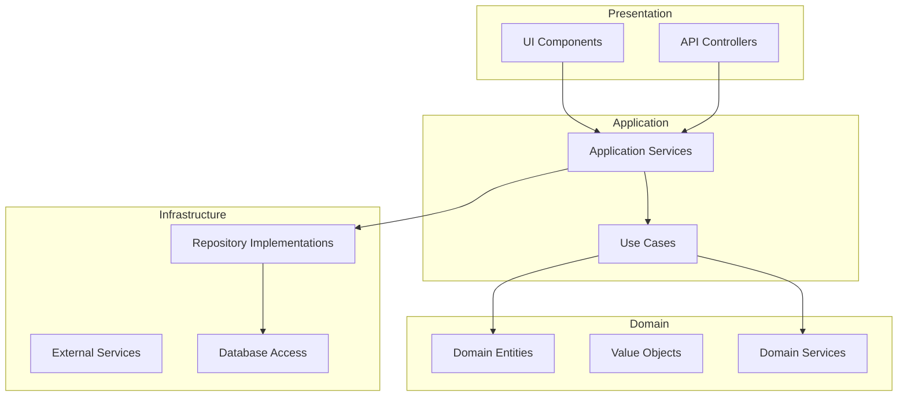

<!-- SSM:CHUNK_BOUNDARY id="ch24-start" -->
📘 CHAPTER 24 — ARCHITECTURE PATTERNS 🔴 Advanced

TypeScript's type system enables **compile-time verification** of architectural patterns.

> **Quick Answer:** Use interfaces for ports, branded types for IDs, and dependency injection for testability. TypeScript catches architectural violations at compile time.

### 24.1 Layered Architecture



#### 21.1.1 Layer Types and Boundaries

```typescript
// ✅ Pattern: Layer-specific types
// Domain Layer - Pure business types
interface User {
  readonly id: UserId;
  readonly email: Email;
  readonly name: string;
  readonly createdAt: Date;
}

// Application Layer - DTOs
interface CreateUserDto {
  email: string;
  name: string;
}

interface UserResponseDto {
  id: string;
  email: string;
  name: string;
  createdAt: string;
}

// Presentation Layer - API types
interface CreateUserRequest {
  body: CreateUserDto;
}

interface CreateUserResponse {
  data: UserResponseDto;
}

// ✅ Pattern: Mappers between layers
class UserMapper {
  static toResponseDto(user: User): UserResponseDto {
    return {
      id: user.id.value,
      email: user.email.value,
      name: user.name,
      createdAt: user.createdAt.toISOString(),
    };
  }
}
```

### 24.2 Dependency Injection

#### 21.2.1 Manual Dependency Injection

```typescript
// ✅ Pattern: Interface-based DI
interface UserRepository {
  findById(id: UserId): Promise<User | null>;
  save(user: User): Promise<User>;
  delete(id: UserId): Promise<void>;
}

interface EmailService {
  send(to: Email, subject: string, body: string): Promise<void>;
}

// Service depends on interfaces, not implementations
class UserService {
  constructor(
    private readonly userRepo: UserRepository,
    private readonly emailService: EmailService
  ) {}

  async createUser(dto: CreateUserDto): Promise<User> {
    const user = User.create(dto.email, dto.name);
    const saved = await this.userRepo.save(user);
    
    await this.emailService.send(
      saved.email,
      "Welcome!",
      `Hello ${saved.name}`
    );
    
    return saved;
  }
}

// ✅ Pattern: Composition root
function createServices(config: AppConfig) {
  // Infrastructure implementations
  const db = new PrismaClient();
  const userRepo = new PrismaUserRepository(db);
  const emailService = new SendGridEmailService(config.sendgridApiKey);
  
  // Application services
  const userService = new UserService(userRepo, emailService);
  
  return { userService };
}
```

#### 21.2.2 DI Container with TSyringe

```typescript
import { container, injectable, inject } from "tsyringe";

// ✅ Pattern: Token-based injection
const TOKENS = {
  UserRepository: Symbol("UserRepository"),
  EmailService: Symbol("EmailService"),
} as const;

@injectable()
class UserService {
  constructor(
    @inject(TOKENS.UserRepository) private userRepo: UserRepository,
    @inject(TOKENS.EmailService) private emailService: EmailService
  ) {}
}

// Registration
container.register<UserRepository>(TOKENS.UserRepository, {
  useClass: PrismaUserRepository,
});
container.register<EmailService>(TOKENS.EmailService, {
  useClass: SendGridEmailService,
});

// Resolution
const userService = container.resolve(UserService);
```

#### 21.2.3 NestJS Dependency Injection

```typescript
import { Injectable, Inject } from "@nestjs/common";

// ✅ Pattern: NestJS module-based DI
@Injectable()
class UserService {
  constructor(
    @Inject("USER_REPOSITORY") private userRepo: UserRepository,
    private emailService: EmailService  // Auto-injection by type
  ) {}
}

@Module({
  providers: [
    UserService,
    EmailService,
    {
      provide: "USER_REPOSITORY",
      useClass: PrismaUserRepository,
    },
  ],
  exports: [UserService],
})
class UserModule {}
```

### 24.3 Repository Pattern

```typescript
// ✅ Pattern: Generic repository interface
interface Repository<T, ID> {
  findById(id: ID): Promise<T | null>;
  findAll(): Promise<T[]>;
  save(entity: T): Promise<T>;
  delete(id: ID): Promise<void>;
}

// Specific repository with domain methods
interface UserRepository extends Repository<User, UserId> {
  findByEmail(email: Email): Promise<User | null>;
  findByTenant(tenantId: TenantId): Promise<User[]>;
}

// ✅ Pattern: Specification pattern for queries
interface Specification<T> {
  isSatisfiedBy(entity: T): boolean;
  toSql(): { where: string; params: unknown[] };
}

class ActiveUserSpec implements Specification<User> {
  isSatisfiedBy(user: User): boolean {
    return user.status === "active";
  }
  
  toSql() {
    return { where: "status = ?", params: ["active"] };
  }
}

// Repository with specifications
interface SpecificationRepository<T, ID> extends Repository<T, ID> {
  findBySpec(spec: Specification<T>): Promise<T[]>;
}
```

### 24.4 Hexagonal Architecture (Ports & Adapters)

```typescript
// ✅ Pattern: Port (interface)
interface PaymentPort {
  processPayment(amount: Money, method: PaymentMethod): Promise<PaymentResult>;
  refund(paymentId: PaymentId, amount?: Money): Promise<RefundResult>;
}

// ✅ Pattern: Adapter (implementation)
class StripePaymentAdapter implements PaymentPort {
  constructor(private stripe: Stripe) {}
  
  async processPayment(amount: Money, method: PaymentMethod): Promise<PaymentResult> {
    const intent = await this.stripe.paymentIntents.create({
      amount: amount.cents,
      currency: amount.currency,
      payment_method: method.id,
    });
    
    return {
      id: PaymentId.create(intent.id),
      status: intent.status === "succeeded" ? "success" : "pending",
    };
  }
  
  async refund(paymentId: PaymentId, amount?: Money): Promise<RefundResult> {
    const refund = await this.stripe.refunds.create({
      payment_intent: paymentId.value,
      amount: amount?.cents,
    });
    
    return { id: RefundId.create(refund.id), status: "success" };
  }
}

// ✅ Pattern: Domain uses ports, not adapters
class OrderService {
  constructor(private paymentPort: PaymentPort) {}
  
  async checkout(order: Order): Promise<CheckoutResult> {
    const result = await this.paymentPort.processPayment(
      order.total,
      order.paymentMethod
    );
    // Domain logic...
    return { orderId: order.id, paymentStatus: result.status };
  }
}
```

### 24.5 CQRS (Command Query Responsibility Segregation)

```typescript
// ✅ Pattern: Type-safe commands
interface Command<TResult = void> {
  readonly _type: string;
}

interface CreateOrderCommand extends Command<Order> {
  readonly _type: "CreateOrder";
  readonly customerId: CustomerId;
  readonly items: OrderItemDto[];
}

// ✅ Pattern: Type-safe queries
interface Query<TResult> {
  readonly _type: string;
}

interface GetOrderByIdQuery extends Query<OrderReadModel | null> {
  readonly _type: "GetOrderById";
  readonly orderId: OrderId;
}

// ✅ Pattern: Command handler
interface CommandHandler<TCommand extends Command<TResult>, TResult> {
  execute(command: TCommand): Promise<TResult>;
}

class CreateOrderHandler implements CommandHandler<CreateOrderCommand, Order> {
  constructor(
    private orderRepo: OrderRepository,
    private eventBus: EventBus
  ) {}
  
  async execute(command: CreateOrderCommand): Promise<Order> {
    const order = Order.create(command.customerId, command.items);
    await this.orderRepo.save(order);
    await this.eventBus.publish(new OrderCreatedEvent(order));
    return order;
  }
}

// ✅ Pattern: Query handler
interface QueryHandler<TQuery extends Query<TResult>, TResult> {
  execute(query: TQuery): Promise<TResult>;
}

class GetOrderByIdHandler implements QueryHandler<GetOrderByIdQuery, OrderReadModel | null> {
  constructor(private readDb: ReadDatabase) {}
  
  async execute(query: GetOrderByIdQuery): Promise<OrderReadModel | null> {
    return this.readDb.orders.findById(query.orderId.value);
  }
}

// ✅ Pattern: Mediator for dispatching
class Mediator {
  private handlers = new Map<string, CommandHandler<any, any> | QueryHandler<any, any>>();
  
  register<T extends Command<R> | Query<R>, R>(
    type: T["_type"],
    handler: T extends Command<R> ? CommandHandler<T, R> : QueryHandler<T, R>
  ) {
    this.handlers.set(type, handler);
  }
  
  async send<R>(commandOrQuery: Command<R> | Query<R>): Promise<R> {
    const handler = this.handlers.get(commandOrQuery._type);
    if (!handler) throw new Error(`No handler for ${commandOrQuery._type}`);
    return handler.execute(commandOrQuery as any);
  }
}
```

### 24.6 Event-Driven Architecture

```typescript
// ✅ Pattern: Type-safe domain events
interface DomainEvent<T extends string = string> {
  readonly eventType: T;
  readonly occurredAt: Date;
  readonly aggregateId: string;
  readonly payload: unknown;
}

interface OrderCreatedEvent extends DomainEvent<"OrderCreated"> {
  readonly payload: {
    orderId: string;
    customerId: string;
    items: Array<{ productId: string; quantity: number }>;
    total: number;
  };
}

interface OrderShippedEvent extends DomainEvent<"OrderShipped"> {
  readonly payload: {
    orderId: string;
    trackingNumber: string;
    carrier: string;
  };
}

// ✅ Pattern: Type-safe event map
type EventMap = {
  OrderCreated: OrderCreatedEvent;
  OrderShipped: OrderShippedEvent;
};

// ✅ Pattern: Type-safe event bus
class TypedEventBus<E extends Record<string, DomainEvent>> {
  private handlers = new Map<keyof E, Set<(event: E[keyof E]) => Promise<void>>>();
  
  on<K extends keyof E>(
    eventType: K,
    handler: (event: E[K]) => Promise<void>
  ): void {
    const existing = this.handlers.get(eventType) ?? new Set();
    existing.add(handler as any);
    this.handlers.set(eventType, existing);
  }
  
  async emit<K extends keyof E>(event: E[K]): Promise<void> {
    const handlers = this.handlers.get(event.eventType as K);
    if (handlers) {
      await Promise.all([...handlers].map(h => h(event)));
    }
  }
}

// Usage
const eventBus = new TypedEventBus<EventMap>();

eventBus.on("OrderCreated", async (event) => {
  // event is typed as OrderCreatedEvent
  console.log(`Order ${event.payload.orderId} created`);
});
```

### 24.7 SOLID Principles in TypeScript

#### 21.7.1 Single Responsibility

```typescript
// ❌ Anti-pattern: Multiple responsibilities
class UserService {
  createUser() { /* ... */ }
  sendEmail() { /* ... */ }
  generateReport() { /* ... */ }
}

// ✅ Pattern: Single responsibility
class UserService {
  constructor(
    private userRepo: UserRepository,
    private emailService: EmailService
  ) {}
  
  async createUser(dto: CreateUserDto): Promise<User> {
    const user = await this.userRepo.save(User.create(dto));
    await this.emailService.sendWelcome(user.email);
    return user;
  }
}
```

#### 21.7.2 Open/Closed Principle

```typescript
// ✅ Pattern: Open for extension, closed for modification
interface PricingStrategy {
  calculatePrice(basePrice: number, quantity: number): number;
}

class StandardPricing implements PricingStrategy {
  calculatePrice(basePrice: number, quantity: number): number {
    return basePrice * quantity;
  }
}

class BulkDiscountPricing implements PricingStrategy {
  calculatePrice(basePrice: number, quantity: number): number {
    const discount = quantity >= 10 ? 0.1 : 0;
    return basePrice * quantity * (1 - discount);
  }
}

class Order {
  constructor(private pricingStrategy: PricingStrategy) {}
  
  calculateTotal(items: OrderItem[]): number {
    return items.reduce(
      (total, item) => total + this.pricingStrategy.calculatePrice(item.price, item.quantity),
      0
    );
  }
}
```

#### 21.7.3 Liskov Substitution

```typescript
// ✅ Pattern: Subtypes must be substitutable
interface Bird {
  move(): void;
}

class FlyingBird implements Bird {
  move(): void { this.fly(); }
  private fly(): void { console.log("Flying"); }
}

class Penguin implements Bird {
  move(): void { this.walk(); }
  private walk(): void { console.log("Walking"); }
}

// Any Bird can be used interchangeably
function moveBird(bird: Bird): void {
  bird.move(); // Works for both FlyingBird and Penguin
}
```

#### 21.7.4 Interface Segregation

```typescript
// ❌ Anti-pattern: Fat interface
interface CrudOperations<T> {
  create(entity: T): Promise<T>;
  read(id: string): Promise<T>;
  update(id: string, entity: T): Promise<T>;
  delete(id: string): Promise<void>;
}

// ✅ Pattern: Segregated interfaces
interface Readable<T> {
  findById(id: string): Promise<T | null>;
}

interface Writable<T> {
  save(entity: T): Promise<T>;
}

interface Deletable {
  delete(id: string): Promise<void>;
}

// Combine as needed
interface UserRepository extends Readable<User>, Writable<User>, Deletable {}
interface AuditLogRepository extends Readable<AuditLog>, Writable<AuditLog> {}
// AuditLog is append-only, no Deletable
```

#### 21.7.5 Dependency Inversion

```typescript
// ❌ Anti-pattern: High-level depends on low-level
class OrderService {
  private mysql = new MySQLDatabase();  // Direct dependency
  
  async createOrder(order: Order) {
    await this.mysql.insert("orders", order);
  }
}

// ✅ Pattern: Both depend on abstraction
interface Database {
  insert(table: string, data: Record<string, unknown>): Promise<void>;
}

class OrderService {
  constructor(private db: Database) {}  // Depends on abstraction
  
  async createOrder(order: Order) {
    await this.db.insert("orders", order);
  }
}

// Implementation depends on abstraction
class MySQLDatabase implements Database {
  async insert(table: string, data: Record<string, unknown>): Promise<void> {
    // MySQL-specific implementation
  }
}
```

See also: Chapter 13 (Security), Chapter 22 (Observability), Chapter 26 (Type System Internals)

---


<!-- SSM:CHUNK_BOUNDARY id="ch24-end" -->
