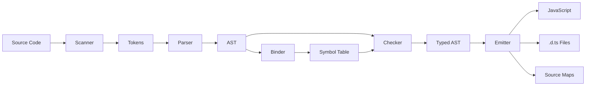

<!-- SSM:CHUNK_BOUNDARY id="ch30-start" -->
📘 CHAPTER 30 — COMPILER PIPELINE 🔴 Advanced

The TypeScript compiler transforms source code through multiple phases.

> **Quick Answer:** Scanner → Parser → Binder → Checker → Emitter. The Compiler API lets you hook into each phase for custom tooling.



### 30.1 Scanner (Lexer)

The scanner converts source text into tokens:

```typescript
import ts from "typescript";

// ✅ Using the scanner directly
const scanner = ts.createScanner(
  ts.ScriptTarget.Latest,
  /* skipTrivia */ true
);

scanner.setText("const x: number = 42;");

const tokens: { kind: string; text: string }[] = [];
while (scanner.scan() !== ts.SyntaxKind.EndOfFileToken) {
  tokens.push({
    kind: ts.SyntaxKind[scanner.getToken()],
    text: scanner.getTokenText(),
  });
}

console.log(tokens);
// [
//   { kind: "ConstKeyword", text: "const" },
//   { kind: "Identifier", text: "x" },
//   { kind: "ColonToken", text: ":" },
//   { kind: "NumberKeyword", text: "number" },
//   { kind: "EqualsToken", text: "=" },
//   { kind: "NumericLiteral", text: "42" },
//   { kind: "SemicolonToken", text: ";" }
// ]
```

### 30.2 Parser

The parser builds an Abstract Syntax Tree (AST):

```typescript
import ts from "typescript";

// ✅ Parse source code to AST
const sourceCode = `
  interface User {
    id: string;
    name: string;
  }
  
  function greet(user: User): string {
    return "Hello, " + user.name;
  }
`;

const sourceFile = ts.createSourceFile(
  "example.ts",
  sourceCode,
  ts.ScriptTarget.Latest,
  /* setParentNodes */ true
);

// ✅ Traverse the AST
function visit(node: ts.Node, depth = 0) {
  const indent = "  ".repeat(depth);
  console.log(`${indent}${ts.SyntaxKind[node.kind]}`);
  ts.forEachChild(node, child => visit(child, depth + 1));
}

visit(sourceFile);

// ✅ Find specific nodes
function findFunctions(node: ts.Node): ts.FunctionDeclaration[] {
  const functions: ts.FunctionDeclaration[] = [];
  
  function visit(node: ts.Node) {
    if (ts.isFunctionDeclaration(node)) {
      functions.push(node);
    }
    ts.forEachChild(node, visit);
  }
  
  visit(node);
  return functions;
}

const functions = findFunctions(sourceFile);
console.log(functions.map(f => f.name?.getText())); // ["greet"]
```

### 30.3 Binder

The binder creates symbols and establishes scope:

```typescript
import ts from "typescript";

// ✅ Understanding symbol tables
const program = ts.createProgram(["example.ts"], {
  target: ts.ScriptTarget.Latest,
  module: ts.ModuleKind.ESNext,
});

const checker = program.getTypeChecker();
const sourceFile = program.getSourceFile("example.ts")!;

// ✅ Get symbol for a node
function getNodeSymbol(node: ts.Node): ts.Symbol | undefined {
  if (ts.isIdentifier(node)) {
    return checker.getSymbolAtLocation(node);
  }
  return undefined;
}

// ✅ Symbol flags indicate what the symbol represents
function describeSymbol(symbol: ts.Symbol): string {
  const flags = symbol.getFlags();
  const parts: string[] = [];
  
  if (flags & ts.SymbolFlags.Variable) parts.push("Variable");
  if (flags & ts.SymbolFlags.Function) parts.push("Function");
  if (flags & ts.SymbolFlags.Class) parts.push("Class");
  if (flags & ts.SymbolFlags.Interface) parts.push("Interface");
  if (flags & ts.SymbolFlags.TypeAlias) parts.push("TypeAlias");
  if (flags & ts.SymbolFlags.Property) parts.push("Property");
  if (flags & ts.SymbolFlags.Method) parts.push("Method");
  
  return parts.join(", ");
}
```

### 30.4 Checker (Type Checker)

The checker performs type analysis:

```typescript
import ts from "typescript";

// ✅ Get type information
function analyzeTypes(sourceFile: ts.SourceFile, checker: ts.TypeChecker) {
  function visit(node: ts.Node) {
    if (ts.isVariableDeclaration(node) && node.name) {
      const type = checker.getTypeAtLocation(node);
      const typeString = checker.typeToString(type);
      console.log(`${node.name.getText()}: ${typeString}`);
    }
    ts.forEachChild(node, visit);
  }
  visit(sourceFile);
}

// ✅ Check for specific type properties
function isNullableType(type: ts.Type): boolean {
  return (
    (type.getFlags() & ts.TypeFlags.Null) !== 0 ||
    (type.getFlags() & ts.TypeFlags.Undefined) !== 0
  );
}

// ✅ Get call signatures
function getFunctionSignature(
  checker: ts.TypeChecker,
  node: ts.FunctionDeclaration
): string {
  const signature = checker.getSignatureFromDeclaration(node);
  if (signature) {
    const params = signature.getParameters().map(p => {
      const type = checker.getTypeOfSymbolAtLocation(p, node);
      return `${p.getName()}: ${checker.typeToString(type)}`;
    });
    const returnType = checker.typeToString(signature.getReturnType());
    return `(${params.join(", ")}) => ${returnType}`;
  }
  return "unknown";
}
```

### 30.5 Emitter

The emitter generates output:

```typescript
import ts from "typescript";

// ✅ Custom transformer example
const addLoggingTransformer: ts.TransformerFactory<ts.SourceFile> = (context) => {
  return (sourceFile) => {
    function visit(node: ts.Node): ts.Node {
      // Add console.log at the start of each function
      if (ts.isFunctionDeclaration(node) && node.body) {
        const logStatement = ts.factory.createExpressionStatement(
          ts.factory.createCallExpression(
            ts.factory.createPropertyAccessExpression(
              ts.factory.createIdentifier("console"),
              "log"
            ),
            undefined,
            [ts.factory.createStringLiteral(`Entering ${node.name?.getText() ?? "anonymous"}`)]
          )
        );
        
        const newBody = ts.factory.createBlock([
          logStatement,
          ...node.body.statements,
        ], true);
        
        return ts.factory.updateFunctionDeclaration(
          node,
          node.modifiers,
          node.asteriskToken,
          node.name,
          node.typeParameters,
          node.parameters,
          node.type,
          newBody
        );
      }
      return ts.visitEachChild(node, visit, context);
    }
    return ts.visitNode(sourceFile, visit) as ts.SourceFile;
  };
};

// ✅ Apply transformer
const result = ts.transpileModule(sourceCode, {
  compilerOptions: { target: ts.ScriptTarget.ESNext },
  transformers: { before: [addLoggingTransformer] },
});
```

### 30.6 Compiler API Usage

```typescript
import ts from "typescript";

// ✅ Create a program programmatically
function compile(fileNames: string[], options: ts.CompilerOptions): void {
  const program = ts.createProgram(fileNames, options);
  const emitResult = program.emit();
  
  // Get diagnostics
  const allDiagnostics = ts
    .getPreEmitDiagnostics(program)
    .concat(emitResult.diagnostics);
  
  allDiagnostics.forEach(diagnostic => {
    if (diagnostic.file) {
      const { line, character } = ts.getLineAndCharacterOfPosition(
        diagnostic.file,
        diagnostic.start!
      );
      const message = ts.flattenDiagnosticMessageText(
        diagnostic.messageText,
        "\n"
      );
      console.log(
        `${diagnostic.file.fileName} (${line + 1},${character + 1}): ${message}`
      );
    } else {
      console.log(
        ts.flattenDiagnosticMessageText(diagnostic.messageText, "\n")
      );
    }
  });
  
  const exitCode = emitResult.emitSkipped ? 1 : 0;
  console.log(`Process exiting with code '${exitCode}'.`);
}

// ✅ Watch mode
function watch(configPath: string) {
  const host = ts.createWatchCompilerHost(
    configPath,
    {},
    ts.sys,
    ts.createSemanticDiagnosticsBuilderProgram,
    (diagnostic) => {
      console.error("Error:", diagnostic.messageText);
    },
    (diagnostic) => {
      console.log("Status:", diagnostic.messageText);
    }
  );
  
  ts.createWatchProgram(host);
}
```

### 30.7 Language Service

For IDE-like features:

```typescript
import ts from "typescript";

// ✅ Create language service
function createLanguageService(
  fileNames: string[],
  options: ts.CompilerOptions
): ts.LanguageService {
  const files: Map<string, { version: number; content: string }> = new Map();
  
  // Initialize files
  for (const fileName of fileNames) {
    files.set(fileName, {
      version: 0,
      content: ts.sys.readFile(fileName) ?? "",
    });
  }
  
  const servicesHost: ts.LanguageServiceHost = {
    getScriptFileNames: () => fileNames,
    getScriptVersion: (fileName) =>
      files.get(fileName)?.version.toString() ?? "0",
    getScriptSnapshot: (fileName) => {
      const file = files.get(fileName);
      if (file) {
        return ts.ScriptSnapshot.fromString(file.content);
      }
      return undefined;
    },
    getCurrentDirectory: () => process.cwd(),
    getCompilationSettings: () => options,
    getDefaultLibFileName: (options) => ts.getDefaultLibFilePath(options),
    fileExists: ts.sys.fileExists,
    readFile: ts.sys.readFile,
    readDirectory: ts.sys.readDirectory,
    directoryExists: ts.sys.directoryExists,
  };
  
  return ts.createLanguageService(servicesHost, ts.createDocumentRegistry());
}

// ✅ Use language service features
const languageService = createLanguageService(["example.ts"], {});

// Get completions
const completions = languageService.getCompletionsAtPosition(
  "example.ts",
  42, // cursor position
  {}
);

// Get quick info (hover)
const quickInfo = languageService.getQuickInfoAtPosition("example.ts", 42);

// Get definitions (go to definition)
const definitions = languageService.getDefinitionAtPosition("example.ts", 42);

// Get references
const references = languageService.getReferencesAtPosition("example.ts", 42);
```

### 30.8 TypeScript Native (Preview)

**TypeScript Native**: Native reimplementation of the TypeScript compiler for improved performance.

**Status**: Preview (as of 2025)

**Features:**
- Maintains semantic compatibility with reference implementation
- Significantly faster compilation times
- Lower memory usage
- Better parallelization

**Usage:**

```bash
# Install TypeScript Native (when available)
npm install typescript-native

# Use native compiler
tsc-native --build
```

**Benefits:**
- Faster type checking in large codebases
- Reduced CI/CD build times
- Better IDE responsiveness
- Lower resource consumption

**Limitations:**
- Preview status (may have edge cases)
- Some advanced features may not be fully supported
- Check TypeScript release notes for compatibility

**Migration:**

TypeScript Native is designed to be a drop-in replacement for the reference TypeScript compiler. Most projects should work without changes, but verify in your specific environment.

### See Also {#chapter-27-see-also}

- **Chapter 26: Type System Internals** — Type checking implementation
- **Chapter 28: Runtime Engines** — Execution environments
- **Chapter 30: AST Manipulation** — Working with compiler AST
- **Chapter 35: Compiler Extensions** — Extending the compiler
- **Appendix A: Compiler Flags** — Compiler configuration
- **Appendix H: Diagrams** — Compilation pipeline diagram

---


<!-- SSM:CHUNK_BOUNDARY id="ch30-end" -->
