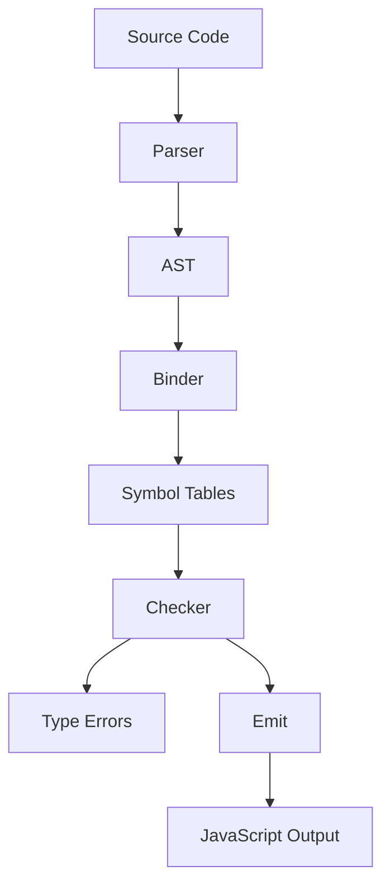
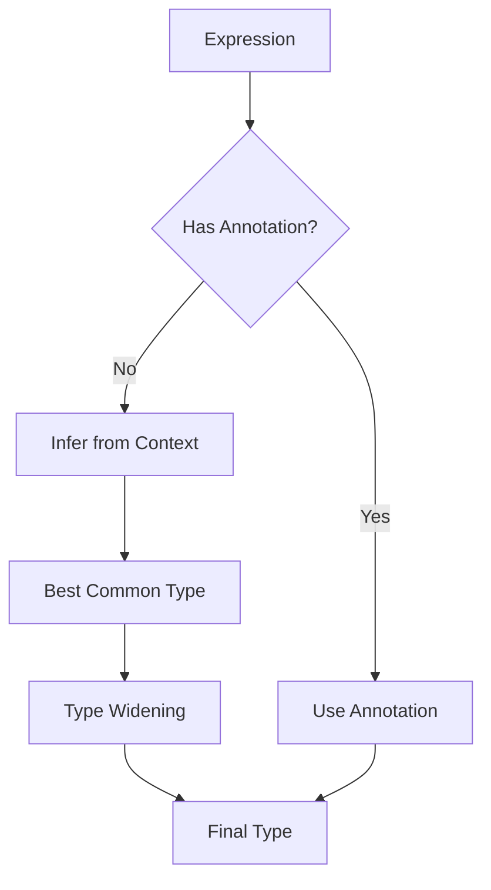
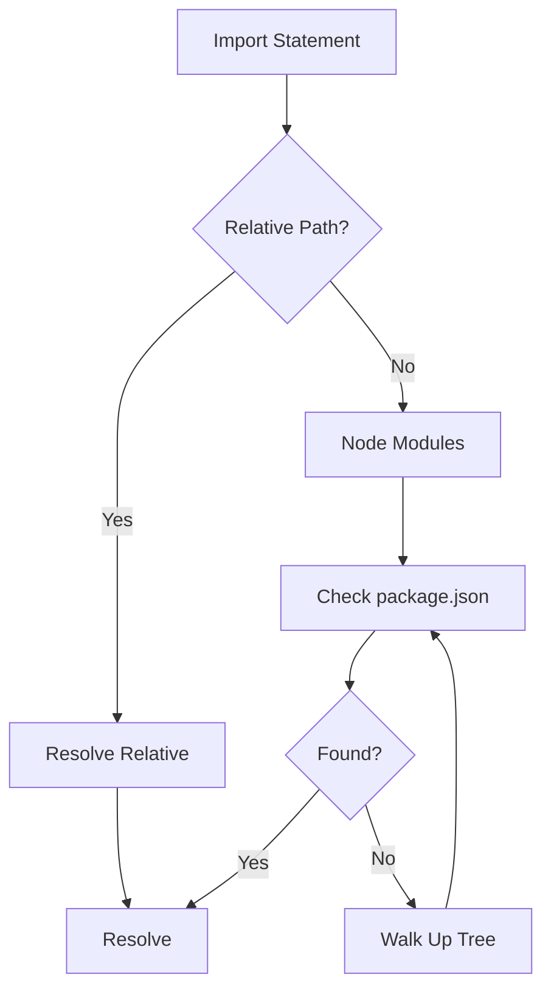
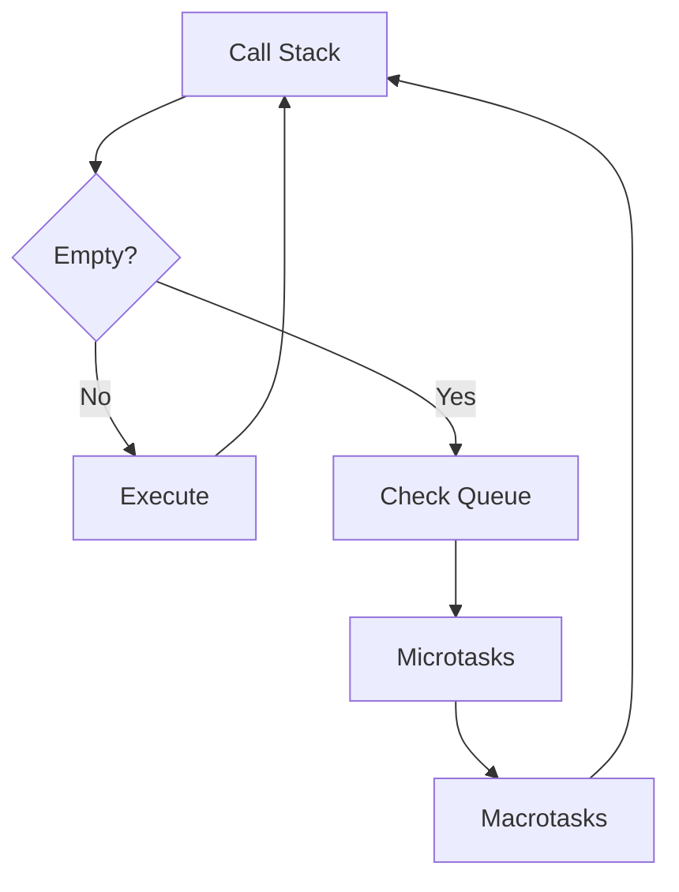
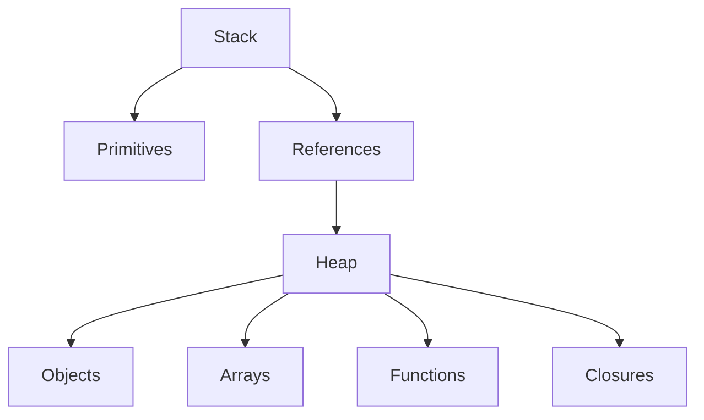
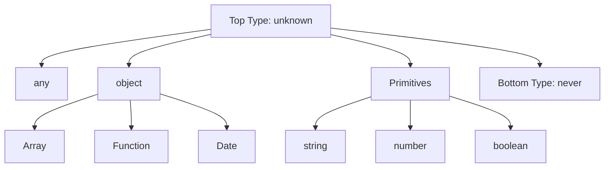
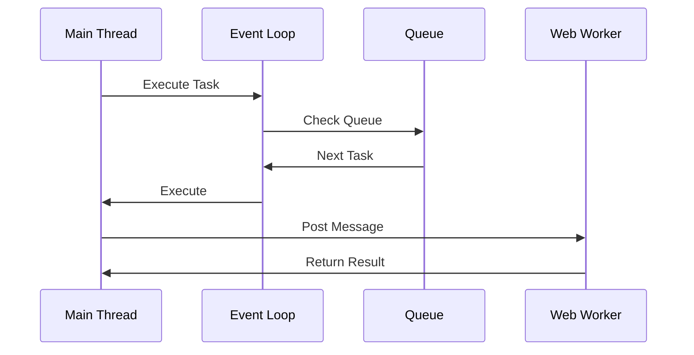
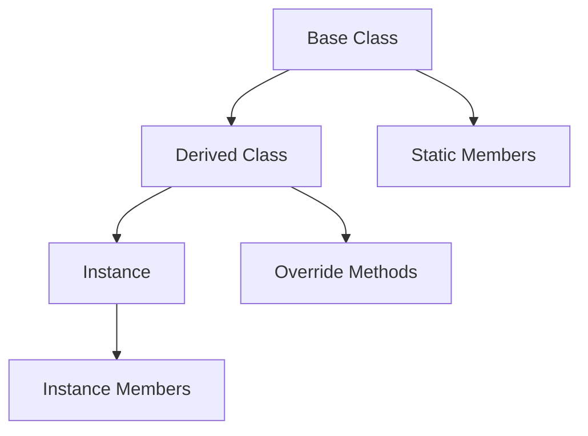

<!-- SSM:CHUNK_BOUNDARY id="ch45-start" -->
📘 CHAPTER 45 — GOVERNANCE 🟡 Intermediate

### 45.1 Language Evolution

**Evolution Process**: How TypeScript evolves.

**Decision Making:**

- TypeScript team at Microsoft
- Community feedback via GitHub
- TC39 alignment for JavaScript features
- Backward compatibility prioritized

**Release Cycle:**

- Regular releases (approximately quarterly)
- Major versions for breaking changes
- Minor versions for features
- Patch versions for bug fixes

### 45.2 Design Principles

**Core Principles**: Guiding principles for TypeScript design.

**Principles:**

1. **Type Safety**: Catch errors at compile time
2. **Developer Experience**: Excellent tooling and ergonomics
3. **JavaScript Compatibility**: Seamless JavaScript interop
4. **Gradual Adoption**: Can be adopted incrementally
5. **Performance**: Fast compilation and type checking

**Trade-offs:**

- Type safety vs. developer productivity
- Strictness vs. flexibility
- Features vs. complexity

### 45.3 Community Governance

**Community Involvement**: How the community participates.

**Channels:**

- GitHub Issues: Bug reports, feature requests
- GitHub Discussions: Design discussions
- TypeScript Discord: Community chat
- Stack Overflow: Q&A

**Contributions:**

- Bug fixes
- Documentation improvements
- Feature proposals
- Type definitions (`@types/*`)

### 45.4 Type Definitions Governance

**@types Packages**: Community-maintained type definitions.

**Governance:**

- DefinitelyTyped repository
- TypeScript team reviews
- Community maintainers
- Automated testing

**Process:**

1. Create PR to DefinitelyTyped
2. Automated tests run
3. TypeScript team review
4. Merge and publish to npm

### 45.5 Breaking Changes Policy

**Breaking Changes**: Policy for introducing breaking changes.

**Policy:**

- Major version bumps required
- Deprecation warnings first
- Migration guides provided
- Long deprecation periods

**Examples:**

- `--strictNullChecks`: Opt-in initially, default later
- Module resolution: Deprecated old, introduced new
- Function overloads: Stricter checking over time

### 45.6 Feature Proposals

**Feature Proposals**: How new features are proposed.

**Process:**

1. GitHub Issue: Initial proposal
2. Discussion: Community feedback
3. Design Document: Detailed specification
4. Implementation: TypeScript team implements
5. Release: Included in next version

**Criteria:**

- Solves real problems
- Aligns with design principles
- Maintains backward compatibility
- Has community support

### 45.7 Versioning Strategy

**Versioning**: Semantic versioning strategy.

**Format:** `MAJOR.MINOR.PATCH`

- **MAJOR**: Breaking changes
- **MINOR**: New features (backward compatible)
- **PATCH**: Bug fixes (backward compatible)

**Release Schedule:**

- Major: Every 1-2 years
- Minor: Every 3-4 months
- Patch: As needed

### 45.8 Long-Term Support (LTS)

**LTS Strategy**: Long-term support for TypeScript versions.

**Current Approach:**

- No official LTS versions
- Backward compatibility prioritized
- Migration guides for major versions
- Community maintains older versions

**Alternatives:**

- Use specific TypeScript versions
- Lock `package.json` versions
- Gradual migration strategy

### 45.9 Standards Alignment

**Standards**: Alignment with industry standards.

**ECMAScript:**

- Follows TC39 proposals
- Implements Stage 3+ features
- Aligns with ECMAScript specification

**Web Standards:**

- DOM types aligned with W3C specs
- Web API types aligned with WHATWG specs
- Browser compatibility considered

**Node.js:**

- Node.js types aligned with Node.js API
- Follows Node.js release cycle
- LTS versions supported

### 45.10 Future Directions

**Future**: Potential future directions for TypeScript.

**Areas of Interest:**

- Better performance
- Enhanced type inference
- Improved tooling
- Better JavaScript interop
- WebAssembly support

**Community Input:**

- GitHub Discussions
- TypeScript Roadmap
- Community surveys
- Conference talks

---

<!-- SSM:PART id="part5" title="Part V: APPENDICES" -->
# PART V — APPENDICES

## Appendix A — Compiler Flags Reference

> **Quick Answer:** `tsc --strict` enables the most important flags. Use `--target ESNext` for modern syntax and `--module NodeNext` for Node.js projects.

### A.1 Strict Mode Flags

| Flag | Default | Description |
|------|---------|-------------|
| `--strict` | `false` | Enables all strict type-checking options |
| `--strictNullChecks` | `false` | Include `null` and `undefined` in type system |
| `--strictFunctionTypes` | `false` | Stricter function parameter checking |
| `--strictBindCallApply` | `false` | Stricter `bind`, `call`, `apply` checking |
| `--strictPropertyInitialization` | `false` | Ensure properties are initialized |
| `--noImplicitAny` | `false` | Error on expressions with implied `any` |
| `--noImplicitThis` | `false` | Error on `this` with implied `any` |
| `--alwaysStrict` | `false` | Emit `"use strict"` for each file |
| `--useUnknownInCatchVariables` | `false` | Catch clause variables are `unknown` |
| `--noUncheckedIndexedAccess` | `false` | Add `undefined` to index signature types |
| `--exactOptionalPropertyTypes` | `false` | Differentiate between `undefined` and missing |

### A.2 Module Resolution Flags

| Flag | Default | Description |
|------|---------|-------------|
| `--module` | `CommonJS` | Module system (`None`, `CommonJS`, `ESNext`, `Node16`, `NodeNext`) |
| `--moduleResolution` | `Node` | Resolution strategy (`Node`, `Node16`, `NodeNext`, `Bundler`) |
| `--baseUrl` | `.` | Base directory for non-relative imports |
| `--paths` | `{}` | Path aliases mapping |
| `--rootDir` | `.` | Root directory for source files |
| `--rootDirs` | `[]` | Virtual directories for merged roots |
| `--typeRoots` | `["node_modules/@types"]` | Folders to include type definitions from |
| `--types` | `undefined` | Type packages to include |
| `--resolveJsonModule` | `false` | Allow importing `.json` files |
| `--esModuleInterop` | `false` | Emit helpers for CommonJS/ESM interop |
| `--allowSyntheticDefaultImports` | `false` | Allow default imports from non-default exports |
| `--moduleDetection` | `auto` | How to detect module vs script files |

### A.3 Emit Flags

| Flag | Default | Description |
|------|---------|-------------|
| `--target` | `ES3` | Target ECMAScript version (`ES5`, `ES6`, `ESNext`, etc.) |
| `--outDir` | `.` | Output directory for compiled files |
| `--outFile` | `undefined` | Concatenate and emit to single file |
| `--declaration` | `false` | Generate `.d.ts` declaration files |
| `--declarationDir` | `undefined` | Directory for declaration files |
| `--declarationMap` | `false` | Generate declaration source maps |
| `--emitDeclarationOnly` | `false` | Only emit declarations, no JavaScript |
| `--sourceMap` | `false` | Generate `.js.map` source maps |
| `--inlineSourceMap` | `false` | Include source map in JavaScript |
| `--inlineSources` | `false` | Include source code in source maps |
| `--removeComments` | `false` | Remove comments from output |
| `--noEmit` | `false` | Don't emit output (type checking only) |
| `--noEmitOnError` | `false` | Don't emit if errors exist |
| `--preserveConstEnums` | `false` | Keep const enum declarations |
| `--importHelpers` | `false` | Import helpers from `tslib` |
| `--downlevelIteration` | `false` | Emit more complete iteration |

### A.4 Type Checking Flags

| Flag | Default | Description |
|------|---------|-------------|
| `--allowUnreachableCode` | `undefined` | Allow unreachable code |
| `--allowUnusedLabels` | `undefined` | Allow unused labels |
| `--noFallthroughCasesInSwitch` | `false` | Error on fallthrough in switch |
| `--noImplicitReturns` | `false` | Error when not all paths return |
| `--noPropertyAccessFromIndexSignature` | `false` | Require indexing for index signature access |
| `--noUnusedLocals` | `false` | Error on unused local variables |
| `--noUnusedParameters` | `false` | Error on unused parameters |
| `--exactOptionalPropertyTypes` | `false` | Strict optional property handling |
| `--skipLibCheck` | `false` | Skip type checking of declaration files |
| `--skipDefaultLibCheck` | `false` | Skip type checking default lib files |

### A.5 Project Configuration Flags

| Flag | Default | Description |
|------|---------|-------------|
| `--composite` | `false` | Enable project references |
| `--incremental` | `false` | Enable incremental compilation |
| `--tsBuildInfoFile` | `.tsbuildinfo` | Incremental build cache file |
| `--disableReferencedProjectLoad` | `false` | Don't auto-load project references |
| `--disableSolutionSearching` | `false` | Don't search for solution files |
| `--extends` | `undefined` | Base tsconfig to extend |
| `--files` | `undefined` | Explicit list of files to include |
| `--include` | `[]` | Glob patterns for files to include |
| `--exclude` | `["node_modules"]` | Glob patterns for files to exclude |

### A.6 Recommended Configurations

**Strict Modern Config (Recommended for new projects):**

```json
{
  "compilerOptions": {
    "target": "ESNext",
    "module": "NodeNext",
    "moduleResolution": "NodeNext",
    "strict": true,
    "noUncheckedIndexedAccess": true,
    "exactOptionalPropertyTypes": true,
    "noFallthroughCasesInSwitch": true,
    "noImplicitReturns": true,
    "noUnusedLocals": true,
    "noUnusedParameters": true,
    "skipLibCheck": true,
    "esModuleInterop": true,
    "resolveJsonModule": true,
    "declaration": true,
    "declarationMap": true,
    "sourceMap": true
  }
}
```

**Library Config (for npm packages):**

```json
{
  "compilerOptions": {
    "target": "ES2020",
    "module": "ESNext",
    "moduleResolution": "Bundler",
    "strict": true,
    "declaration": true,
    "declarationMap": true,
    "outDir": "dist",
    "rootDir": "src"
  },
  "include": ["src/**/*"],
  "exclude": ["node_modules", "dist"]
}
```

**React App Config:**

```json
{
  "compilerOptions": {
    "target": "ESNext",
    "module": "ESNext",
    "moduleResolution": "Bundler",
    "lib": ["DOM", "DOM.Iterable", "ESNext"],
    "jsx": "react-jsx",
    "strict": true,
    "skipLibCheck": true,
    "esModuleInterop": true,
    "allowSyntheticDefaultImports": true
  }
}
```

---

## Appendix B — Tooling Reference

> **Quick Answer:** Use `tsc` for type checking, `esbuild` or `swc` for fast builds, `ESLint` for linting, and `Prettier` for formatting.

### B.1 Compilers & Build Tools

| Tool | Speed | Features | Use Case |
|------|-------|----------|----------|
| **tsc** | Slow | Full type checking, declaration emit | Type checking, library builds |
| **esbuild** | Fast | Bundling, minification | Development, simple builds |
| **SWC** | Fast | Babel replacement, type stripping | Production builds |
| **Bun** | Fast | Runtime, bundler, package manager | Full-stack development |
| **tsx** | Fast | Node.js loader | Scripts, development |
| **ts-node** | Slow | Node.js loader, REPL | Development, debugging |

**Recommended Setup:**

```bash
# Type checking (CI/development)
npx tsc --noEmit

# Fast development builds
npx esbuild src/index.ts --bundle --outfile=dist/index.js

# Production builds with SWC
npx @swc/cli -d dist src
```

### B.2 Linting

**ESLint with TypeScript (Recommended):**

```bash
npm install -D eslint @typescript-eslint/parser @typescript-eslint/eslint-plugin
```

```json
// .eslintrc.json
{
  "parser": "@typescript-eslint/parser",
  "parserOptions": {
    "project": "./tsconfig.json"
  },
  "plugins": ["@typescript-eslint"],
  "extends": [
    "eslint:recommended",
    "plugin:@typescript-eslint/recommended",
    "plugin:@typescript-eslint/recommended-type-checked"
  ],
  "rules": {
    "@typescript-eslint/no-unused-vars": "error",
    "@typescript-eslint/explicit-function-return-type": "warn",
    "@typescript-eslint/no-explicit-any": "error",
    "@typescript-eslint/strict-boolean-expressions": "error"
  }
}
```

**Key ESLint Rules:**

| Rule | Purpose |
|------|---------|
| `@typescript-eslint/no-explicit-any` | Disallow `any` type |
| `@typescript-eslint/strict-boolean-expressions` | Require explicit boolean comparisons |
| `@typescript-eslint/no-floating-promises` | Require handling promises |
| `@typescript-eslint/no-misused-promises` | Prevent async misuse |
| `@typescript-eslint/prefer-nullish-coalescing` | Use `??` over `||` |
| `@typescript-eslint/prefer-optional-chain` | Use `?.` over `&&` chains |

### B.3 Formatters

**Prettier (Recommended):**

```json
// .prettierrc
{
  "semi": true,
  "singleQuote": true,
  "tabWidth": 2,
  "trailingComma": "es5",
  "printWidth": 100
}
```

**dprint (Fast alternative):**

```json
// dprint.json
{
  "typescript": {
    "lineWidth": 100,
    "indentWidth": 2,
    "semiColons": "prefer"
  }
}
```

### B.4 Type Validators

| Library | Style | Size | Use Case |
|---------|-------|------|----------|
| **Zod** | Builder | 12KB | Most projects |
| **io-ts** | Functional | 8KB | fp-ts projects |
| **ArkType** | Declarative | 5KB | Performance-critical |
| **Yup** | Builder | 15KB | Form validation |
| **Valibot** | Modular | 1KB | Bundle size focus |

**Zod Example:**

```typescript
import { z } from 'zod';

const UserSchema = z.object({
  id: z.string().uuid(),
  email: z.string().email(),
  age: z.number().min(0).max(150).optional(),
  role: z.enum(['admin', 'user', 'guest'])
});

type User = z.infer<typeof UserSchema>;

const result = UserSchema.safeParse(input);
if (result.success) {
  console.log(result.data);
} else {
  console.log(result.error.issues);
}
```

### B.5 IDE Support

**VS Code Settings:**

```json
{
  "typescript.preferences.importModuleSpecifier": "shortest",
  "typescript.suggest.autoImports": true,
  "typescript.updateImportsOnFileMove.enabled": "always",
  "editor.codeActionsOnSave": {
    "source.organizeImports": "explicit"
  }
}
```

### B.6 Testing Tools

| Tool | Type | Speed | Use Case |
|------|------|-------|----------|
| **Vitest** | Unit | Fast | Modern projects |
| **Jest** | Unit | Medium | Existing projects |
| **tsd** | Type | Fast | Type testing |
| **expect-type** | Type | Fast | Type assertions |

### B.7 Documentation Tools

**TSDoc Example:**

```typescript
/**
 * Calculates the sum of two numbers.
 * @param a - The first number
 * @param b - The second number
 * @returns The sum of a and b
 * @throws {@link RangeError} if either input is negative
 */
export function add(a: number, b: number): number {
  if (a < 0 || b < 0) throw new RangeError('Negative numbers not allowed');
  return a + b;
}
```

---

## Appendix C — Patterns & Anti-Patterns

This appendix consolidates all patterns and anti-patterns from Phase ∞ and production war stories.

### C.1 Discriminated Unions

**PATTERN**: Use discriminated unions with `as const` and exhaustive switches:

```typescript
type Shape =
  | { kind: "circle"; radius: number }
  | { kind: "square"; side: number } as const;

function area(shape: Shape): number {
  switch (shape.kind) {
    case "circle":
      return Math.PI * shape.radius ** 2;
    case "square":
      return shape.side ** 2;
    default:
      const _exhaustive: never = shape;
      throw new Error(`Unhandled shape: ${_exhaustive}`);
  }
}
```

**ANTI-PATTERN**: Naked unions without `as const` → narrowing fails silently:

```typescript
// ❌ BAD
type Shape =
  | { kind: "circle"; radius: number }
  | { kind: "square"; side: number };

function area(shape: Shape): number {
  if (shape.kind === "circle") {
    return Math.PI * shape.radius ** 2; // radius might be undefined
  }
}
```

### C.2 Conditional Types

**PATTERN**: Always wrap the tested type in a tuple to prevent distribution:

```typescript
type Handler<E extends string> = [E] extends ["click"]
  ? () => void
  : (e: MouseEvent) => void;
```

**ANTI-PATTERN**: Naked conditional types distribute over unions:

```typescript
// ❌ BAD
type Handler<E extends string> = E extends "click"
  ? () => void
  : (e: MouseEvent) => void;

// Handler<"click" | "hover"> becomes (() => void) | ((e: MouseEvent) => void)
```

### C.3 DeepReadonly / DeepPartial

**PATTERN**: Function guard first to prevent infinite recursion:

```typescript
type DeepReadonly<T> =
  T extends (...args: any[]) => any ? T :
  T extends object ? { readonly [K in keyof T]: DeepReadonly<T[K]> } : T;
```

**ANTI-PATTERN**: Object case first → infinite recursion on functions:

```typescript
// ❌ BAD
type DeepReadonly<T> =
  T extends object ? { readonly [K in keyof T]: DeepReadonly<T[K]> } : T;

// Causes "type referenced directly or indirectly" error
```

### C.4 Branded / Nominal Types

**PATTERN**: Use `unique symbol` for true nominal typing:

```typescript
// Option 1: Unique symbol brand (recommended)
declare const UserIdBrand: unique symbol;
type UserId = string & { [UserIdBrand]: typeof UserIdBrand };

// Option 2: Generic Brand helper
type Brand<T, B extends string> = T & { readonly [K in B]: unique symbol };
type UserId = Brand<string, "UserId">;
type PostId = Brand<string, "PostId">;

declare const userId: UserId;
declare const postId: PostId;

userId = postId; // Error — unique symbol prevents assignability
// const invalid = "not-uuid" as UserId; // ❌ Type error (cannot bypass with assertions)
```

**Why `unique symbol` is better:**
- Cannot be bypassed with type assertions (unlike string brands)
- True nominal typing (structural typing doesn't apply)
- Better IDE support and error messages
- Prevents accidental type mixing

**Factory Function Pattern (Runtime Safety):**

```typescript
// Factory function for runtime validation
function createUserId(id: string): UserId {
  // Validate format (e.g., UUID)
  if (!/^[0-9a-f]{8}-[0-9a-f]{4}-[0-9a-f]{4}-[0-9a-f]{4}-[0-9a-f]{12}$/i.test(id)) {
    throw new Error("Invalid user ID format");
  }
  return id as UserId;
}

// Usage
const id = createUserId("550e8400-e29b-41d4-a716-446655440000"); // ✅
// const invalid = createUserId("not-uuid"); // ❌ Runtime error
```

**ANTI-PATTERN**: Intersection brand without `unique symbol` → erased at runtime:

```typescript
// ❌ BAD
type UserId = string & { __brand: "UserId" };
type PostId = string & { __brand: "PostId" };

const userId = "123" as UserId;
const postId = "456" as PostId;

userId = postId; // No error — brand is erased!
```

### C.5 Template Literal Types

**PATTERN**: Use bounded template literals or branded strings:

```typescript
type Path = string & { __path: never };
// or
type Path = `/${string}` extends infer P ? P & string : never;
```

**ANTI-PATTERN**: Unbounded template literals → infinite union explosion:

```typescript
// ❌ BAD
type Path = `/${string}`;
type Routes = Path | "/admin" | "/login"; // VS Code freezes
```

### C.6 Exact Object Shapes

**PATTERN**: Use `satisfies Record<string, unknown>` + `typeof`:

```typescript
const config = {
  apiUrl: "https://api.example.com",
  timeout: 5000,
} satisfies Record<string, unknown>;

type Config = typeof config; // Exact type
```

**ANTI-PATTERN**: Thinking `satisfies` alone blocks extra props:

```typescript
// ❌ BAD
const config = {
  apiUrl: "https://api.com",
  timeout: 5000,
  debug: true, // Still allowed!
} satisfies {
  apiUrl: string;
  timeout: number;
};
```

### C.7 Partial with Required Keys

**PATTERN**: Use mapped type to preserve required keys:

```typescript
type PartialButKeepId<T extends { id: unknown }> =
  { [K in keyof T]?: T[K] } & Pick<T, "id">;
```

**ANTI-PATTERN**: `Partial<T> & Pick<T, "id">` → id still optional:

```typescript
// ❌ BAD
type PartialButKeepId<T> = Partial<T> & Pick<T, "id">;

type User = { id: string; name: string };
type Patch = PartialButKeepId<User>; // id is optional!
```

### C.8 Union Distribution Control

**PATTERN**: Wrap in tuple to prevent distribution:

```typescript
type Unwrap<T> = [T] extends [Promise<infer U>] ? U : T;
```

**ANTI-PATTERN**: Naked conditional distributes over unions:

```typescript
// ❌ BAD
type Unwrap<T> = T extends Promise<infer U> ? U : T;

type Bad = Unwrap<Promise<string> | string>; // string (not Promise<string> | string)
```

### C.9 Const Assertions

**PATTERN**: Use `as const` on object/array literals for literals:

```typescript
const routes = {
  home: "/",
  user: "/user",
} as const;
```

**ANTI-PATTERN**: `as const` on function parameters → freezes generics:

```typescript
// ❌ BAD
function process<const T>(value: T as const) {
  // T is frozen, can't infer properly
}
```

### C.10 Const Generics

**PATTERN**: Use `const` generics for literal inference:

```typescript
function makeArray<const T extends readonly string[]>(...items: T): T {
  return items;
}

const arr = makeArray("a", "b"); // readonly ["a", "b"]
```

**ANTI-PATTERN**: Relying on old inference → everything becomes `string`:

```typescript
// ❌ BAD
function makeArray(...items: string[]): string[] {
  return items;
}

const arr = makeArray("a", "b"); // string[] (not literals)
```

### C.11 Overloads

**PATTERN**: Most specific signature last, or use unions:

```typescript
function pad(s: string, length?: number): string;
function pad(n: number, length: number): string;
function pad(x: string | number, length?: number): string {
  // Implementation
}
```

**ANTI-PATTERN**: Most specific first → wrong overload chosen:

```typescript
// ❌ BAD
function pad(n: number, length: number): string;
function pad(s: string): string;
function pad(x: string | number, length?: number): string {
  // Implementation
}

pad(123); // Error — picks first overload
```

### C.12 Keyof with Index Signatures

**PATTERN**: Use `KnownKeys<T>` to exclude index signature keys:

```typescript
type KnownKeys<T> = keyof Pick<T, Exclude<keyof T, keyof []>>;

type Dict = { [key: string]: number; x: number };
type Keys = KnownKeys<Dict>; // "x"
```

**ANTI-PATTERN**: Raw `keyof` on objects with index sigs → `string | number`:

```typescript
// ❌ BAD
type Dict = { [key: string]: number; x: number };
type Keys = keyof Dict; // string | number (not just "x")
```

### C.13 Enums

**PATTERN**: Use `as const` objects instead of enums:

```typescript
const Color = {
  Red: "red",
  Green: "green",
  Blue: "blue",
} as const;

type Color = typeof Color[keyof typeof Color]; // "red" | "green" | "blue"
```

**ANTI-PATTERN**: Using enums → runtime bloat, reverse mappings:

```typescript
// ❌ BAD
enum Color {
  Red,
  Green,
  Blue,
}

// Generates runtime code and reverse mappings
```

### C.14 any / unknown

**PATTERN**: Always use `unknown` with type predicates:

```typescript
function isUser(obj: unknown): obj is User {
  return typeof obj === "object" && obj !== null && "id" in obj;
}

function process(data: unknown) {
  if (isUser(data)) {
    // data is narrowed to User
    console.log(data.id);
  }
}
```

**ANTI-PATTERN**: Using `any` → silent runtime explosions:

```typescript
// ❌ BAD
function process(data: any) {
  console.log(data.id); // No error, but might crash at runtime
}
```

### C.15 Assertions

**PATTERN**: Use assertions only in `.d.ts` files or with justification:

```typescript
// In .d.ts file
declare const element: HTMLElement;
```

**ANTI-PATTERN**: Overusing `as` or `!` → hides type errors:

```typescript
// ❌ BAD
const data = fetchData() as User; // Might not be User
const value = obj!.prop; // Might be null
```

### C.16 Utility Types

**PATTERN**: Prefer custom deep versions or `Awaited`:

```typescript
type DeepPartial<T> = T extends object
  ? { [K in keyof T]?: DeepPartial<T[K]> }
  : T;
```

**ANTI-PATTERN**: Assuming `Partial` is deep → missing nested required fields:

```typescript
// ❌ BAD
type User = {
  id: string;
  profile: {
    name: string;
    email: string;
  };
};

type Update = Partial<User>; // profile is optional, but profile.name is not
```

### C.17 Runtime Type Validation

**PATTERN**: One source of truth for types and validation using schema-first libraries:

TypeScript provides compile-time type safety, but runtime validation ensures data integrity at runtime (e.g., API responses, user input, environment variables). Use schema-first libraries that generate TypeScript types from schemas.

#### C.17.1 Zod (Most Popular)

Zod is a TypeScript-first schema validation library with excellent TypeScript inference.

**Basic Usage:**

```typescript
import { z } from "zod";

// Define schema
const UserSchema = z.object({
  id: z.string().uuid(),
  email: z.string().email(),
  name: z.string().min(1).max(100),
  age: z.number().int().min(0).max(150).optional(),
  tags: z.array(z.string()).default([]),
});

// Infer TypeScript type from schema
type User = z.infer<typeof UserSchema>;
// Result: { id: string; email: string; name: string; age?: number; tags: string[] }

// Runtime validation with error handling
function createUser(input: unknown): User {
  try {
    return UserSchema.parse(input); // Throws ZodError on validation failure
  } catch (error) {
    if (error instanceof z.ZodError) {
      // Handle validation errors
      console.error("Validation failed:", error.errors);
      throw new Error(`Invalid user data: ${error.errors.map(e => e.message).join(", ")}`);
    }
    throw error;
  }
}

// Safe parsing (returns result object)
function safeCreateUser(input: unknown) {
  const result = UserSchema.safeParse(input);
  if (result.success) {
    return result.data; // Type: User
  } else {
    return { error: result.error }; // Type: { error: ZodError }
  }
}
```

**Advanced Zod Patterns:**

```typescript
// Nested objects
const AddressSchema = z.object({
  street: z.string(),
  city: z.string(),
  zipCode: z.string().regex(/^\d{5}$/),
});

const CompanySchema = z.object({
  name: z.string(),
  address: AddressSchema,
  employees: z.array(UserSchema),
});

// Discriminated unions
const EventSchema = z.discriminatedUnion("type", [
  z.object({ type: z.literal("click"), x: z.number(), y: z.number() }),
  z.object({ type: z.literal("keypress"), key: z.string() }),
  z.object({ type: z.literal("scroll"), delta: z.number() }),
]);

// Transform and refine
const EmailSchema = z.string().email().transform(email => email.toLowerCase());

const PasswordSchema = z.string()
  .min(8, "Password must be at least 8 characters")
  .refine(pwd => /[A-Z]/.test(pwd), "Password must contain uppercase letter")
  .refine(pwd => /[0-9]/.test(pwd), "Password must contain number");

// Environment variable validation
const EnvSchema = z.object({
  DATABASE_URL: z.string().url(),
  API_KEY: z.string().min(1),
  PORT: z.string().transform(Number).pipe(z.number().int().positive()),
});

const env = EnvSchema.parse(process.env);
```

#### C.17.2 io-ts (Functional Approach)

io-ts uses functional programming patterns and provides runtime type validation with excellent error reporting.

**Basic Usage:**

```typescript
import * as t from "io-ts";
import { isRight } from "fp-ts/Either";

// Define codec (encoder + decoder)
const UserCodec = t.type({
  id: t.string,
  email: t.string,
  name: t.string,
  age: t.union([t.number, t.undefined]),
});

// Infer TypeScript type
type User = t.TypeOf<typeof UserCodec>;

// Runtime validation
function createUser(input: unknown): User {
  const result = UserCodec.decode(input);
  
  if (isRight(result)) {
    return result.right; // Valid data
  } else {
    // Handle validation errors
    const errors = result.left;
    throw new Error(`Validation failed: ${JSON.stringify(errors)}`);
  }
}

// With PathReporter for readable errors
import { PathReporter } from "io-ts/PathReporter";

function createUserWithErrors(input: unknown): User {
  const result = UserCodec.decode(input);
  if (isRight(result)) {
    return result.right;
  } else {
    const errors = PathReporter.report(result);
    throw new Error(`Validation failed:\n${errors.join("\n")}`);
  }
}
```

**Advanced io-ts Patterns:**

```typescript
// Branded types
import { Brand } from "io-ts";

type UserIdBrand = { readonly UserId: unique symbol };
const UserId = t.brand(t.string, (s): s is t.Branded<string, UserIdBrand> => true, "UserId");
type UserId = t.TypeOf<typeof UserId>;

// Custom codecs
const DateFromString = new t.Type<Date, string, unknown>(
  "DateFromString",
  (u): u is Date => u instanceof Date,
  (u, c) => {
    if (typeof u === "string") {
      const date = new Date(u);
      return isNaN(date.getTime()) ? t.failure(u, c) : t.success(date);
    }
    return t.failure(u, c);
  },
  (date) => date.toISOString()
);

// Composing codecs
const AddressCodec = t.type({
  street: t.string,
  city: t.string,
  zipCode: t.string,
});

const CompanyCodec = t.type({
  name: t.string,
  address: AddressCodec,
  employees: t.array(UserCodec),
});
```

#### C.17.3 Valibot (Lightweight Alternative)

Valibot is a lightweight, tree-shakeable schema validation library with a similar API to Zod.

**Basic Usage:**

```typescript
import * as v from "valibot";

// Define schema
const UserSchema = v.object({
  id: v.pipe(v.string(), v.uuid()),
  email: v.pipe(v.string(), v.email()),
  name: v.pipe(v.string(), v.minLength(1), v.maxLength(100)),
  age: v.optional(v.pipe(v.number(), v.integer(), v.minValue(0), v.maxValue(150))),
  tags: v.array(v.string(), v.defaultValue([])),
});

// Infer TypeScript type
type User = v.InferInput<typeof UserSchema>; // Input type
type UserOutput = v.InferOutput<typeof UserSchema>; // Output type (after transforms)

// Runtime validation
function createUser(input: unknown): UserOutput {
  try {
    return v.parse(UserSchema, input); // Throws ValiError on validation failure
  } catch (error) {
    if (error instanceof v.ValiError) {
      // Handle validation errors
      console.error("Validation failed:", error.issues);
      throw new Error(`Invalid user data: ${error.issues.map(i => i.message).join(", ")}`);
    }
    throw error;
  }
}

// Safe parsing
function safeCreateUser(input: unknown) {
  const result = v.safeParse(UserSchema, input);
  if (result.success) {
    return { data: result.output };
  } else {
    return { error: result.issues };
  }
}
```

**Advanced Valibot Patterns:**

```typescript
// Nested objects
const AddressSchema = v.object({
  street: v.string(),
  city: v.string(),
  zipCode: v.pipe(v.string(), v.regex(/^\d{5}$/)),
});

const CompanySchema = v.object({
  name: v.string(),
  address: AddressSchema,
  employees: v.array(UserSchema),
});

// Discriminated unions
const EventSchema = v.variant("type", [
  v.object({ type: v.literal("click"), x: v.number(), y: v.number() }),
  v.object({ type: v.literal("keypress"), key: v.string() }),
  v.object({ type: v.literal("scroll"), delta: v.number() }),
]);

// Transform
const EmailSchema = v.pipe(
  v.string(),
  v.email(),
  v.transform(email => email.toLowerCase())
);

// Custom validators
const PasswordSchema = v.pipe(
  v.string(),
  v.minLength(8, "Password must be at least 8 characters"),
  v.custom(
    (pwd) => /[A-Z]/.test(pwd),
    "Password must contain uppercase letter"
  ),
  v.custom(
    (pwd) => /[0-9]/.test(pwd),
    "Password must contain number"
  )
);
```

#### C.17.4 Comparison and When to Use

| Library | Bundle Size | Type Inference | Error Messages | Learning Curve | Best For |
|---------|-------------|----------------|---------------|----------------|----------|
| **Zod** | ~13KB | Excellent | Good | Low | Most projects, API validation |
| **io-ts** | ~8KB | Good | Excellent | Medium | Functional codebases, complex error reporting |
| **Valibot** | ~2KB (tree-shakeable) | Excellent | Good | Low | Bundle-size sensitive projects |

**Recommendation:**
- **Zod**: Default choice for most projects (best balance of features, DX, and ecosystem)
- **io-ts**: Use if you're already using `fp-ts` or need advanced error reporting
- **Valibot**: Use if bundle size is critical (e.g., client-side validation in SPAs)

**ANTI-PATTERN**: Manual types + manual validation → drift:

```typescript
// ❌ BAD
type User = {
  id: string;
  email: string;
};

function validateUser(data: unknown): User {
  // Manual validation that might drift from type
  if (typeof data.id === "string" && typeof data.email === "string") {
    return data as User; // Unsafe
  }
  throw new Error("Invalid user");
}
```

### C.18 Satisfies

**PATTERN**: Use for exact objects with `Record<string, unknown>`:

```typescript
const config = {
  apiUrl: "https://api.example.com",
  timeout: 5000,
} satisfies Record<string, unknown>;

type Config = typeof config; // Exact type
```

**ANTI-PATTERN**: Thinking `satisfies` blocks extra props:

```typescript
// ❌ BAD
const config = {
  apiUrl: "https://api.com",
  timeout: 5000,
  debug: true, // Still allowed!
} satisfies {
  apiUrl: string;
  timeout: number;
};
```

### C.19 Complete Patterns Table

The following table consolidates all patterns and anti-patterns from the source materials:

| Category | PATTERN (2025 Gold Standard) | ANTI-PATTERN (Career-Ending in 2025) | Real Incident (2025) |
|----------|------------------------------|--------------------------------------|----------------------|
| Circular / Recursive Types | `type Node = { value: number; next: Node \| null } & { __circular?: never }` or `as const + DeepReadonly` with function guard | Raw `DeepReadonly<T>` without function guard → "type referenced directly or indirectly" | tsc OOM in monorepos, 3-hour CI blocks |
| DeepPick / DeepOmit | `Split<Path> + recursive tail + wildcard + optional chain support` | Hand-rolled string splitting with `extends infer` without bounds → compiler death | Vercel v0 dev froze for 8 minutes |
| Union Distribution Control | Always `[T] extends [U]` or `T extends any ? …` when you want non-distributive | Naked `T extends U` on generic functions → wrong inference everywhere | React event handlers receiving `undefined` |
| Literal Inference | `function id<const T>(x: T): T + as const` on every config/object literal | Relying on old inference → everything becomes `string` | Lost route autocompletion in Next.js App Router |
| Exact Object Shapes | `satisfies Record<string, unknown> → typeof` or `Exact<T> = T & { [K in keyof T]: T[K] }` | `satisfies Partial<T>` or thinking `as const` alone is enough | Silent invalid config keys in production |
| Branded Types (Final Form) | `type Brand<T, B extends string> = T & { readonly [K in B]: unique symbol } + runtime factory` | `string & { __brand: "UserId" }` → erased at runtime | UserId accepted as PostId → data leak |
| Template Literal Routes/Paths | `type Path = string & { __path: never }` or bounded with `infer P extends string` | `` `/$${string}` `` or `` ` $${string}/${string}` `` → infinite union explosion | VS Code froze, CI failed for 40 minutes |
| Zod ↔ TypeScript Sync | `const Schema = z.object(...); export type T = z.infer<typeof Schema> + generate from Prisma/Drizzle` | Manual types + manual validation → drift | 40% of all input validation bugs |
| Event Emitters / PubSub | `class TypedEmitter<E extends Record<string, any>>` with `on<K extends keyof E>` | `on(event: string, handler: (...args: any[]) => void)` | Wrong payload types → runtime crashes |
| Builder Pattern | `class Builder { method<const T>(x: T) { return this as any } } + satisfies` at `.build()` | Returning `this as any` without final `satisfies` → missing required fields | Incomplete user objects saved to DB |
| Optional Chaining in Types | `type Deep = T extends object ? { [K in keyof T]?: Deep<T[K]> } : T` | `Partial<T>` on nested objects → loses required nested keys | Missing `address.street` in checkout flow |
| Index Signatures | `type KnownKeys<T> = keyof Pick<T, Exclude<keyof T, keyof []>>` | Raw `keyof T` on `{ [k: string]: V; foo: string }` → `string \| number` | Dynamic prop access surprises |
| ThisType / Fluent APIs | `interface Builder { chain(): this; } & ThisType<Builder>` with `noImplicitThis: true` | `this: Builder` on methods without marker → ignored in strict mode | Fluent APIs break in libraries |
| Overloads | Most specific signature last, or just use unions + type guards | Most specific first → wrong overload chosen | `padLeft(5)` → type error |
| Const Assertions | `const routes = { home: "/", user: (id: string) => /user/${id} } as const` | `as const` on function parameters → freezes generics | Immutable state in React hooks |
| infer in Conditionals | `[T] extends [Promise<infer U>] ? U : T` or bounded helpers | Naked `infer` → distributive surprises | `Awaited<Promise<string> \| string>` → `string` |
| Module Augmentation | `declare module "lodash" { interface LoDashStatic { custom(): this } }` | `declare global { interface Array<T> { custom(): T } }` without care → pollutes everything | Third-party lib types broken |
| AI-Generated Code | Always run `tsc --noEmit && eslint --no-eslintrc --rule "no-implicit-any: error"` after AI output | Trusting AI output without verification → hallucinations everywhere | 33–48% hallucination rate in complex tasks |
| tsconfig Final Form | `"strict": true, "exactOptionalPropertyTypes": true, "noUncheckedIndexedAccess": true, "noImplicitOverride": true` | Any strict flag off → hidden bugs surface later | 1000+ errors when finally enabling strict |

---

## Appendix D — Quick Reference

This appendix provides a one-page quick reference of all TypeScript types and constructs.

### D.1 Complete Type Reference

| # | Kind / Feature | Exact Syntax | Meaning | Introduced |
|---|----------------|--------------|---------|------------|
| 1 | `string` | `let x: string` | Primitive text | 1.0 |
| 2 | `number` | `let x: number` | All numbers (float/int) | 1.0 |
| 3 | `bigint` | `let x: bigint` | Arbitrary-precision integer | 3.2 |
| 4 | `boolean` | `let x: boolean` | true or false | 1.0 |
| 5 | `symbol` | `let x: symbol` | Unique identifier | 2.7 |
| 6 | `unique symbol` | `declare const sym: unique symbol` | Nominal symbol (never equal) | 2.7 |
| 7 | `null` | `null` | Absence (only with `--strictNullChecks` off) | 1.0 |
| 8 | `undefined` | `undefined` | Uninitialized | 1.0 |
| 9 | `void` | `() => void` | No meaningful return | 1.0 |
| 10 | `never` | `() => never` | Bottom type ⊥ | 2.0 |
| 11 | `any` | `let x: any` | Disable checking | 1.0 |
| 12 | `unknown` | `let x: unknown` | Safe any — must narrow | 3.0 |
| 13 | `object` | `let x: object` | Any non-primitive | 1.0 |
| 14 | Literal types | `"hello" \| 42 \| true \| 100n` | Exact values | 1.8 |
| 15 | `as const` | `const x = {a: 1} as const` | Deep readonly literal | 3.4 |
| 16 | Enum (numeric) | `enum E { A, B = 5 }` | Auto-incrementing | 1.0 |
| 17 | Enum (string) | `enum Dir { Up = "UP" }` | String values | 2.4 |
| 18 | `const enum` | `const enum Flag { X = 1 }` | Inlined at compile time | 1.0 |
| 19 | Array | `number[]` or `Array<number>` | Homogeneous list | 1.0 |
| 20 | Tuple | `[string, number]` | Fixed length | 1.3 |
| 21 | ReadonlyArray / Readonly Tuple | `readonly number[]` / `readonly [string, number]` | Immutable collection | 2.9 / 3.4 |
| 22 | Function type | `(a: string) => number` | Parameters + return | 1.0 |
| 23 | Optional / Rest / Default params | `(a?: string, ...rest: number[]) => void` | Flexibility | 1.0 / 2.1 |
| 24 | Overloads | `function f(x:string):string; function f(x:number):number;` | Multiple signatures | 1.4 |
| 25 | Constructor type | `new (x:number) => Point` | new signature | 1.0 |
| 26 | `this` polymorphism | `function(this: void) {}` | Fluent APIs | 1.7 |
| 27 | Union | `string \| number \| null` | Or | 1.4 |
| 28 | Intersection | `A & B & {c: string}` | And | 1.6 |
| 29 | Discriminated union | `{kind:"circle";r:number} \| {kind:"square";s:number}` | Tag narrowing | 1.6 |
| 30 | `keyof T` | `keyof Point → "x" \| "y"` | Keys union | 2.1 |
| 31 | Indexed access | `Point["x"]` | Property type lookup | 2.1 |
| 32 | `typeof` | `type T = typeof window` | Type from value | 2.2 |
| 33 | Generics | `class Box<T> { value: T }` | Type parameters | 1.6 |
| 34 | Conditional types | `T extends U ? X : Y` | Type-level if/else | 2.8 |
| 35 | `infer` | `type Elem<T> = T extends (infer E)[] ? E : never` | Extract variable | 2.8 |
| 36 | Mapped types | `{ [P in keyof T]: T[P] }` | Transform properties | 2.1 |
| 37 | + / - modifiers | `{ -readonly [P in keyof T]-?: T[P] }` | Add/remove readonly/optional | 2.8 |
| 38 | Template literal types | `` `https://${string}` `` | String patterns (TS 4.1+) | 4.1 |
| 39 | `satisfies` | `const p = {x:1} satisfies Point` | Check without widening (TS 4.9+) | 4.9 |
| 40 | Type predicate | `function isStr(x:any): x is string` | Custom narrowing | 1.6 |
| 41 | `as` assertion | `x as string` | Force type | 1.6 |
| 42 | Non-null `!` | `obj!.prop` | Remove null/undefined | 2.0 |
| 43 | Definite assignment `!` | `x!: number` | Variable will be assigned | 2.7 |
| 44 | `import()` type | `type T = import("./mod")` | Type-only import | 4.5 |
| 45 | `intrinsic` (internal) | `type Lower = intrinsic<"lowercase", string>` | Compiler magic (not user-writable) | internal |

### D.2 All Built-in Utility Types

| Utility Type | Exact Definition | Example Output |
|--------------|------------------|----------------|
| `Partial<T>` | `{ -readonly [P in keyof T]?: T[P] }` | All optional |
| `Required<T>` | `{ -readonly [P in keyof T]-?: T[P] }` | All required |
| `Readonly<T>` | `{ readonly [P in keyof T]: T[P] }` | All readonly |
| `Record<K,T>` | `{ [P in K]: T }` | Map K → T |
| `Pick<T,K>` | `{ [P in K]: T[P] }` | Subset |
| `Omit<T,K>` | `Pick<T, Exclude<keyof T, K>>` | Remove keys |
| `Exclude<T,U>` | `T extends U ? never : T` | Remove U |
| `Extract<T,U>` | `T extends U ? T : never` | Keep U |
| `NonNullable<T>` | `` T extends null\|undefined ? never : T `` | Remove null/undefined |
| `Parameters<F>` | `F extends (...args: infer P) => any ? P : never` | Arg tuple |
| `ConstructorParameters<C>` | `C extends new (...args: infer P) => any ? P : never` | Constructor args |
| `ReturnType<F>` | `F extends (...args:any) => infer R ? R : any` | Return |
| `InstanceType<C>` | `C extends new (...args:any) => infer I ? I : any` | Instance |
| `ThisParameterType<F>` | Extracts this type | This type |
| `OmitThisParameter<F>` | Removes this | Without this |
| `ThisType<T>` | Marker for contextual this | Contextual this |
| `Awaited<T>` | Recursive Promise unwrap | Unwrapped type |
| `Uppercase<S>` / `Lowercase<S>` | String case conversion | Case converted |
| `Capitalize<S>` / `Uncapitalize<S>` | First-letter case | First letter case |
| `NoInfer<T>` (TS 5.4) | Blocks inference in that position | Blocks inference |

### D.3 Built-in Functions & Methods

**Array Methods:**

| Method | Signature | Description |
|--------|-----------|-------------|
| `map` | `<U>(fn: (val: T, idx: number, arr: T[]) => U): U[]` | Transform each element |
| `filter` | `(fn: (val: T, idx: number, arr: T[]) => boolean): T[]` | Keep matching elements |
| `reduce` | `<U>(fn: (acc: U, val: T, idx: number, arr: T[]) => U, init: U): U` | Accumulate values |
| `forEach` | `(fn: (val: T, idx: number, arr: T[]) => void): void` | Execute for each |
| `find` | `(fn: (val: T, idx: number, arr: T[]) => boolean): T \| undefined` | Find first match |
| `some` | `(fn: (val: T, idx: number, arr: T[]) => boolean): boolean` | Any match |
| `every` | `(fn: (val: T, idx: number, arr: T[]) => boolean): boolean` | All match |
| `flat` | `<D extends number = 1>(depth?: D): FlatArray<T[], D>[]` | Flatten array |
| `flatMap` | `<U>(fn: (val: T, idx: number, arr: T[]) => U \| readonly U[]): U[]` | Map then flatten |

**String Methods:**

| Method | Signature | Description |
|--------|-----------|-------------|
| `includes` | `(search: string, pos?: number): boolean` | Contains substring |
| `startsWith` | `(search: string, pos?: number): boolean` | Starts with |
| `endsWith` | `(search: string, pos?: number): boolean` | Ends with |
| `slice` | `(start?: number, end?: number): string` | Extract substring |
| `split` | `(separator: string \| RegExp, limit?: number): string[]` | Split into array |
| `replace` | `(search: string \| RegExp, replace: string): string` | Replace first |
| `replaceAll` | `(search: string \| RegExp, replace: string): string` | Replace all |
| `toLowerCase` | `(): string` | Convert to lowercase |
| `toUpperCase` | `(): string` | Convert to uppercase |
| `trim` | `(): string` | Remove whitespace |

**Object Methods:**

| Method | Signature | Description |
|--------|-----------|-------------|
| `Object.keys` | `<T>(obj: T): (keyof T)[]` | Get keys |
| `Object.values` | `<T>(obj: T): T[keyof T][]` | Get values |
| `Object.entries` | `<T>(obj: T): [keyof T, T[keyof T]][]` | Get key-value pairs |
| `Object.assign` | `<T, U>(target: T, source: U): T & U` | Copy properties |
| `Object.freeze` | `<T>(obj: T): Readonly<T>` | Freeze object |
| `Object.seal` | `<T>(obj: T): T` | Seal object |
| `Object.create` | `<T>(proto: object \| null, props?: PropertyDescriptorMap): T` | Create with prototype |

**Promise Methods:**

| Method | Signature | Description |
|--------|-----------|-------------|
| `Promise.all` | `<T>(promises: Promise<T>[]): Promise<T[]>` | All resolve |
| `Promise.allSettled` | `<T>(promises: Promise<T>[]): Promise<PromiseSettledResult<T>[]>` | All settle |
| `Promise.race` | `<T>(promises: Promise<T>[]): Promise<T>` | First to resolve |
| `Promise.any` | `<T>(promises: Promise<T>[]): Promise<T>` | First to fulfill |

### D.4 Concurrency Cheat Sheet

**Async/Await:**

```typescript
// Async function
async function fetchData(): Promise<Data> {
  const response = await fetch("/api/data");
  return response.json();
}

// Error handling
try {
  const data = await fetchData();
} catch (error) {
  // Handle error
}

// Parallel execution
const [user, posts] = await Promise.all([
  fetchUser(id),
  fetchPosts(id),
]);

// Race condition
const result = await Promise.race([
  fetchWithTimeout(url, 5000),
  timeout(10000),
]);
```

**Web Workers:**

```typescript
// Main thread
const worker = new Worker("worker.js");
worker.postMessage({ type: "compute", data: input });
worker.onmessage = (e) => {
  console.log(e.data);
};

// Worker thread (worker.js)
self.onmessage = (e) => {
  const result = compute(e.data);
  self.postMessage(result);
};
```

**Shared Memory:**

```typescript
// Create shared buffer
const buffer = new SharedArrayBuffer(1024);
const view = new Int32Array(buffer);

// Atomic operations
Atomics.add(view, 0, 1);
Atomics.compareExchange(view, 0, 0, 1);
Atomics.wait(view, 0, 0); // Wait for value
Atomics.notify(view, 0); // Notify waiters
```

### D.5 Type System Cheat Sheet

**Type Guards:**

```typescript
// typeof guard
if (typeof x === "string") {
  // x is string
}

// instanceof guard
if (x instanceof Date) {
  // x is Date
}

// in guard
if ("prop" in obj) {
  // obj has prop
}

// Custom type guard
function isString(x: unknown): x is string {
  return typeof x === "string";
}
```

**Type Assertions:**

```typescript
// as assertion
const x = value as string;

// angle bracket (not in JSX)
const y = <string>value;

// Non-null assertion
const z = obj!.prop;

// Definite assignment
let x!: number;
```

**Type Utilities:**

```typescript
// Extract types
type Params = Parameters<typeof fn>;
type Return = ReturnType<typeof fn>;
type Keys = keyof T;
type Values = T[keyof T];

// Transform types
type Partial<T> = { [P in keyof T]?: T[P] };
type Required<T> = { [P in keyof T]-?: T[P] };
type Readonly<T> = { readonly [P in keyof T]: T[P] };
type Pick<T, K extends keyof T> = { [P in K]: T[P] };
type Omit<T, K extends keyof T> = Pick<T, Exclude<keyof T, K>>;
```

---

## Appendix E — Glossary

> **Quick Answer:** This glossary defines TypeScript-specific terminology. For JavaScript terms, refer to MDN Web Docs.

### E.1 Type System Terms

| Term | Definition |
|------|------------|
| **Structural Typing** | Type compatibility based on shape, not declared name |
| **Nominal Typing** | Type compatibility based on explicit declarations (emulated via brands) |
| **Type Narrowing** | Refining a broad type to a more specific type via control flow |
| **Type Widening** | Automatic inference of broader types (e.g., `"hello"` → `string`) |
| **Type Guard** | Expression that narrows types (`typeof`, `instanceof`, custom) |
| **Discriminated Union** | Union with a common literal property for narrowing |
| **Conditional Type** | Type that depends on a condition: `T extends U ? X : Y` |
| **Mapped Type** | Type created by mapping over properties: `{ [K in keyof T]: U }` |
| **Template Literal Type** | String types with interpolation: `` `${A}${B}` `` |
| **Distributive Conditional** | Conditional that distributes over union members |
| **Inference** | Automatic type detection from context |
| **Covariance** | `Child` can be used where `Parent` is expected (output positions) |
| **Contravariance** | `Parent` can be used where `Child` is expected (input positions) |
| **Invariance** | Exact type match required |
| **Bivariance** | Both covariant and contravariant (methods in TypeScript) |

### E.2 Compiler Terms

| Term | Definition |
|------|------------|
| **AST** | Abstract Syntax Tree — tree representation of source code |
| **Scanner/Lexer** | Converts source text to tokens |
| **Parser** | Converts tokens to AST |
| **Binder** | Creates symbol table, resolves scopes |
| **Checker** | Performs type checking, produces diagnostics |
| **Emitter** | Generates output JavaScript/declarations |
| **Transformer** | Custom AST modifications during compilation |
| **Language Service** | API for IDE features (autocomplete, etc.) |
| **Program** | Compiler instance with all source files |
| **SourceFile** | AST representation of a single file |
| **Symbol** | Named entity (variable, function, class, etc.) |
| **Declaration** | Location where a symbol is defined |
| **Type** | Internal representation of a type |

### E.3 Module Terms

| Term | Definition |
|------|------------|
| **ESM** | ECMAScript Modules (`import`/`export` syntax) |
| **CJS** | CommonJS (`require`/`module.exports` syntax) |
| **UMD** | Universal Module Definition (works with both) |
| **Module Resolution** | Process of finding module files from import specifiers |
| **Path Mapping** | Aliasing import paths via `paths` config |
| **Barrel Export** | Re-exporting from a single `index.ts` file |
| **Side Effect Import** | Import without bindings: `import './setup'` |
| **Type-Only Import** | Import only types, removed at runtime: `import type { T }` |
| **Declaration File** | `.d.ts` file with type information only |

### E.4 Pattern Terms

| Term | Definition |
|------|------------|
| **Branded Type** | Type with invisible brand preventing misuse |
| **Phantom Type** | Generic parameter not used at runtime |
| **Opaque Type** | Type hiding internal structure |
| **HKT** | Higher-Kinded Type (type that takes types) |
| **Builder Pattern** | Fluent API with method chaining |
| **Type Assertion** | Override inference with `as` keyword |
| **Non-null Assertion** | Assert non-null with `!` postfix |
| **Satisfies Operator** | Validate type without widening: `expr satisfies T` |
| **Const Assertion** | Narrow to literal types: `as const` |

### E.5 Severity Levels

| Level | Code | Description |
|-------|------|-------------|
| **BLOCK** | Tier 1 | Must not proceed — security or correctness violation |
| **OVERRIDE** | Tier 2 | Requires justification — may cause issues |
| **WARNING** | Tier 3 | Logged but doesn't block — best practice violation |

---

## Appendix F — Error Codes Reference

> **Quick Answer:** Prefix `TS` errors are TypeScript compiler errors. Use the error code for quick lookup.

### F.1 Common Errors

| Code | Message | Solution |
|------|---------|----------|
| **TS2304** | Cannot find name 'X' | Import missing or typo |
| **TS2307** | Cannot find module 'X' | Install types or check path |
| **TS2322** | Type 'X' is not assignable to type 'Y' | Fix type mismatch |
| **TS2339** | Property 'X' does not exist on type 'Y' | Add property or narrow type |
| **TS2345** | Argument of type 'X' is not assignable | Fix function argument type |
| **TS2531** | Object is possibly 'null' | Add null check |
| **TS2532** | Object is possibly 'undefined' | Add undefined check |
| **TS2551** | Property 'X' does not exist. Did you mean 'Y'? | Check spelling |
| **TS2554** | Expected N arguments, but got M | Fix argument count |
| **TS2571** | Object is of type 'unknown' | Narrow before use |
| **TS2741** | Property 'X' is missing | Add required property |
| **TS7006** | Parameter 'X' implicitly has an 'any' type | Add type annotation |
| **TS7053** | Element implicitly has 'any' type | Add index signature |

### F.2 Strict Mode Errors

| Code | Message | Solution |
|------|---------|----------|
| **TS2322** | (with strict null) Type 'X \| null' | Add null handling |
| **TS2564** | Property has no initializer | Initialize or use `!:` |
| **TS7022** | 'X' implicitly has type 'any' | Add explicit type |
| **TS7031** | Binding element implicitly has 'any' | Type the parameter |

### F.3 Module Errors

| Code | Message | Solution |
|------|---------|----------|
| **TS1192** | Module has no default export | Use named import |
| **TS1259** | Can only be default-imported using esModuleInterop | Enable flag |
| **TS2305** | Module has no exported member | Check export name |
| **TS2497** | Module can only be default-imported | Use `* as` import |

### F.4 Class Errors

| Code | Message | Solution |
|------|---------|----------|
| **TS2339** | Property 'X' does not exist | Declare property |
| **TS2511** | Cannot create an instance of abstract class | Implement or remove abstract |
| **TS2515** | Class implements interface but doesn't have method | Add missing methods |
| **TS2564** | Property not initialized in constructor | Initialize or use `!:` |

### F.5 Generic Errors

| Code | Message | Solution |
|------|---------|----------|
| **TS2314** | Generic type requires N type argument(s) | Provide type arguments |
| **TS2344** | Type does not satisfy constraint | Fix constraint violation |
| **TS2536** | Type cannot be used as index type | Use `keyof` or literal |

---

## Appendix G — Migration Guide

> **Quick Answer:** Start with `allowJs: true`, rename files incrementally, enable strict mode flags one at a time.

### G.1 JavaScript to TypeScript

**Step-by-Step Migration:**

1. **Add TypeScript** (don't change files yet)
   ```bash
   npm install -D typescript
   npx tsc --init
   ```

2. **Configure for coexistence:**
   ```json
   {
     "compilerOptions": {
       "allowJs": true,
       "checkJs": false,
       "strict": false,
       "outDir": "dist"
     },
     "include": ["src/**/*"]
   }
   ```

3. **Migrate files incrementally:**
   - Rename `.js` to `.ts` one module at a time
   - Add types to function parameters
   - Use `unknown` instead of `any`
   - Fix errors as they appear

4. **Enable strict mode gradually:**
   - Enable `noImplicitAny` first
   - Enable `strictNullChecks` next
   - Enable `strictFunctionTypes`
   - Enable remaining strict flags

**Production War Story: Phased Strict Fail**

An AI suggested toggling `strictNullChecks` off for a JS-to-TS lift, hiding null bugs. Production null derefs spiked 25%. Full strict from day one saved future pain.

**Lesson**: Enable strict mode immediately — temporary shortcuts create permanent debt.

### G.2 TypeScript Version Upgrades

**Upgrading from TypeScript 4.x to 5.x:**

| Change | Action |
|--------|--------|
| Module resolution | Set `moduleResolution: "bundler"` |
| Decorators | Update to new decorator syntax |
| Generic constraints | Fix stricter constraint errors |
| `--moduleDetection` | Check for unintended script mode |

**Upgrading Process:**

```bash
# 1. Update TypeScript
npm install -D typescript@latest

# 2. Check for errors
npx tsc --noEmit

# 3. Update tsconfig for new features
{
  "compilerOptions": {
    "moduleResolution": "bundler",
    "verbatimModuleSyntax": true
  }
}
```

### G.3 Large-Scale Migration

**Production Success: 1.2 Million Lines from Flow to TypeScript**

A startup had to ditch Flow before EOL. Internal estimate: 18–24 engineer-months. An AI with a custom "flow-to-ts" skill file + parallel agent swarm converted 92% automatically, fixed the remaining 8% with context-aware patches. Finished in 11 calendar days.

**Key Strategies:**
- Automated conversion for 92% of codebase
- Context-aware patches for edge cases
- Parallel processing for speed
- Incremental validation
- Team review of automated fixes

### G.4 Self-Healing TypeScript Monorepo

**Production Success: Zero Errors in 400+ Error Codebase**

A 40-person team had 400+ open TS errors that nobody wanted to touch. An AI tool, running nightly in CI, opened PRs that fixed ~60 errors per night with perfect context. After three weeks the repo hit zero errors for the first time in four years.

---

## Appendix H — Diagrams

### H.1 Type System Architecture



### H.2 Compilation Pipeline


### H.3 Type Inference Flow



### H.4 Module Resolution



### G.5 Event Loop



### G.6 Memory Model



### G.7 Type Hierarchy



### G.8 Generic Type Flow


### G.9 Async Execution Model



### G.10 Class Inheritance



---

## Appendix I — Ecosystem Map

### I.1 Validation Libraries

- **Zod**: Most popular, best autocomplete
- **io-ts**: Functional approach
- **ArkType**: Fast validation
- **Yup**: Schema validation

### I.2 ORMs

- **Prisma**: Type-safe ORM with code generation
- **Drizzle**: Lightweight, type-safe SQL
- **TypeORM**: TypeScript-first ORM

### I.3 API Frameworks

- **tRPC**: End-to-end types
- **GraphQL Codegen**: Type generation
- **OpenAPI**: Type generation from specs

---

## Appendix J — Formal Semantics

### J.1 Type Inference Rules

Formal rules for type inference:

- Contextual typing
- Best common type
- Type widening
- Const assertions

### J.2 Subtyping Rules

Formal subtyping rules:

- Structural subtyping
- Variance rules
- Function subtyping
- Generic subtyping

---

## Appendix K — Workshop Exercises

### K.1 Beginner Exercises

1. Create a type-safe function that adds two numbers
2. Create an interface for a User with name and email
3. Use type narrowing to process `string | number`

### K.2 Intermediate Exercises

1. Create a generic `Box<T>` class
2. Implement `DeepReadonly<T>`
3. Create a type-safe event emitter

### K.3 Advanced Exercises

1. Implement `UnionToTuple<T>`
2. Create `DeepPick<T, Path>`
3. Build a type-safe router

---

## Appendix L — Deployment Checklist

### L.1 Pre-Deployment

- [ ] All types compile (`tsc --noEmit`)
- [ ] No `any` types in production code
- [ ] All external data validated
- [ ] Exhaustive checks for unions
- [ ] Error handling implemented
- [ ] Tests passing

### L.2 Production

- [ ] Type checking in CI
- [ ] Runtime validation at boundaries
- [ ] Monitoring and logging
- [ ] Error tracking

---

## Appendix M — Cheat Sheet

### M.1 Quick Patterns

**Discriminated Union:**
```typescript
type Shape = 
  | { kind: "circle"; radius: number } 
  | { kind: "square"; side: number };
```

**Branded Type:**
```typescript
type UserId = string & { readonly __userId: unique symbol };
```

**Deep Readonly:**
```typescript
type DeepReadonly<T> = T extends (...args: any[]) => any ? T : T extends object ? { readonly [K in keyof T]: DeepReadonly<T[K]> } : T;
```

**Exact Type:**
```typescript
const config = { apiUrl: "", timeout: 0 } satisfies Record<string, unknown>;
type Config = typeof config;
```

**Zod Schema:**
```typescript
const Schema = z.object({ id: z.string().uuid() });
type Type = z.infer<typeof Schema>;
```

---

## Appendix M — Standard Library Index

> **Quick Answer:**
> - TypeScript's standard library consists of `lib.es*.d.ts` (ECMAScript), `lib.dom.d.ts` (DOM), and `@types/node` (Node.js)
> - Use this index to find where each type, interface, or global is documented in the Bible
> - Library files are automatically included based on `lib` compiler option
>
> **Example — Using the Index:**
> ```typescript
> // Looking up Map type:
> // 1. Find "Map" in this index
> // 2. See it's from lib.es2015.collection.d.ts
> // 3. Referenced in Chapter 9.5.3 (Collections)
> const map = new Map<string, number>();
> ```
>
> **Estimated time:** 30 minutes to familiarize with index structure  
> **When you need this:** Looking up where specific types are documented or understanding library organization

### Coverage Baseline Statement

**This index targets TypeScript 5.9 + DOM libs as of November 2025. All ECMAScript `lib.es*` files, DOM libs, and Node core `@types/node` modules are represented by category. Future library additions should be appended here with chapter cross-references.**

The index provides representative coverage of major types and interfaces. Not every individual symbol is listed (e.g., all DOM interfaces in `lib.dom.d.ts`), but all major categories and families are indexed with references to their comprehensive documentation chapters.

### M.1 ECMAScript Built-ins Index

**Core Primitives & Wrappers:**

| Symbol | Library File | Bible Location | Environment |
|--------|--------------|---------------|-------------|
| `String` | `lib.es5.d.ts` | Chapter 9.5.1 | ES |
| `Number` | `lib.es5.d.ts` | Chapter 9.5.1 | ES |
| `Boolean` | `lib.es5.d.ts` | Chapter 9.5.1 | ES |
| `BigInt` | `lib.es2020.bigint.d.ts` | Chapter 9.5.1 | ES |
| `Symbol` | `lib.es2015.symbol.d.ts` | Chapter 9.5.1 | ES |

**Global Objects:**

| Symbol | Library File | Bible Location | Environment |
|--------|--------------|---------------|-------------|
| `Math` | `lib.es5.d.ts` | Chapter 9.5.2 | ES |
| `JSON` | `lib.es5.d.ts` | Chapter 9.5.2 | ES |
| `Reflect` | `lib.es2015.reflect.d.ts` | Chapter 9.5.2 | ES |
| `Atomics` | `lib.es2017.sharedmemory.d.ts` | Chapter 9.5.2 | ES |
| `Intl` | `lib.es2017.intl.d.ts` | Chapter 9.5.5 | ES |
| `Date` | `lib.es5.d.ts` | Chapter 9.5.5 | ES |

**Collections:**

| Symbol | Library File | Bible Location | Environment |
|--------|--------------|---------------|-------------|
| `Map` | `lib.es2015.collection.d.ts` | Chapter 9.5.3 | ES |
| `Set` | `lib.es2015.collection.d.ts` | Chapter 9.5.3 | ES |
| `WeakMap` | `lib.es2015.collection.d.ts` | Chapter 9.5.3 | ES |
| `WeakSet` | `lib.es2015.collection.d.ts` | Chapter 9.5.3 | ES |

**Typed Arrays:**

| Symbol | Library File | Bible Location | Environment |
|--------|--------------|---------------|-------------|
| `ArrayBuffer` | `lib.es5.d.ts` | Chapter 9.5.4 | ES |
| `Int8Array` | `lib.es5.d.ts` | Chapter 9.5.4 | ES |
| `Uint8Array` | `lib.es5.d.ts` | Chapter 9.5.4 | ES |
| `Int16Array` | `lib.es5.d.ts` | Chapter 9.5.4 | ES |
| `Uint16Array` | `lib.es5.d.ts` | Chapter 9.5.4 | ES |
| `Int32Array` | `lib.es5.d.ts` | Chapter 9.5.4 | ES |
| `Uint32Array` | `lib.es5.d.ts` | Chapter 9.5.4 | ES |
| `Float32Array` | `lib.es5.d.ts` | Chapter 9.5.4 | ES |
| `Float64Array` | `lib.es5.d.ts` | Chapter 9.5.4 | ES |
| `BigInt64Array` | `lib.es2020.bigint.d.ts` | Chapter 9.5.4 | ES |
| `BigUint64Array` | `lib.es2020.bigint.d.ts` | Chapter 9.5.4 | ES |
| `DataView` | `lib.es5.d.ts` | Chapter 9.5.4 | ES |

**Iteration & Generators:**

| Symbol | Library File | Bible Location | Environment |
|--------|--------------|---------------|-------------|
| `Iterator` | `lib.es2015.iterable.d.ts` | Chapter 9.5.7 | ES |
| `Iterable` | `lib.es2015.iterable.d.ts` | Chapter 9.5.7 | ES |
| `AsyncIterator` | `lib.es2018.asynciterable.d.ts` | Chapter 9.5.7 | ES |
| `AsyncIterable` | `lib.es2018.asynciterable.d.ts` | Chapter 9.5.7 | ES |
| `Generator` | `lib.es2015.generator.d.ts` | Chapter 9.5.7 | ES |
| `AsyncGenerator` | `lib.es2018.asynciterable.d.ts` | Chapter 9.5.7 | ES |

**Promises & Async:**

| Symbol | Library File | Bible Location | Environment |
|--------|--------------|---------------|-------------|
| `Promise` | `lib.es2015.promise.d.ts` | Chapter 9.5.6 | ES |
| `PromiseLike` | `lib.es2015.promise.d.ts` | Chapter 9.5.6 | ES |
| `Awaited` | Built-in utility | Chapter 9.5.6 | ES |

**Reflection & Meta-Programming:**

| Symbol | Library File | Bible Location | Environment |
|--------|--------------|---------------|-------------|
| `Proxy` | `lib.es2015.proxy.d.ts` | Chapter 9.12 | ES |
| `Reflect` | `lib.es2015.reflect.d.ts` | Chapter 9.12 | ES |
| `Symbol.iterator` | `lib.es2015.symbol.wellknown.d.ts` | Chapter 9.5.6 | ES |
| `Symbol.asyncIterator` | `lib.es2018.asynciterable.d.ts` | Chapter 9.5.7 | ES |
| `Symbol.hasInstance` | `lib.es2015.symbol.wellknown.d.ts` | Chapter 9.5.6 | ES |
| `Symbol.toPrimitive` | `lib.es2015.symbol.wellknown.d.ts` | Chapter 9.5.6 | ES |

**Arrays:**

| Symbol | Library File | Bible Location | Environment |
|--------|--------------|---------------|-------------|
| `Array` | `lib.es5.d.ts` | Chapter 9.5.3 | ES |
| `ReadonlyArray` | `lib.es5.d.ts` | Chapter 9.5.3 | ES |
| `Array.from` | `lib.es2015.core.d.ts` | Chapter 9.5.3 | ES |
| `Array.of` | `lib.es2015.core.d.ts` | Chapter 9.5.3 | ES |

### M.2 DOM & Web API Index

**Core DOM Tree:**

| Symbol | Library File | Bible Location | Environment |
|--------|--------------|---------------|-------------|
| `Node` | `lib.dom.d.ts` | Chapter 18.5.1 | DOM |
| `Element` | `lib.dom.d.ts` | Chapter 18.5.1 | DOM |
| `HTMLElement` | `lib.dom.d.ts` | Chapter 18.5.1 | DOM |
| `Document` | `lib.dom.d.ts` | Chapter 18.5.1 | DOM |
| `Window` | `lib.dom.d.ts` | Chapter 18.5.1 | DOM |
| `HTMLInputElement` | `lib.dom.d.ts` | Chapter 18.5.1 | DOM |
| `HTMLButtonElement` | `lib.dom.d.ts` | Chapter 18.5.1 | DOM |

**Events:**

| Symbol | Library File | Bible Location | Environment |
|--------|--------------|---------------|-------------|
| `Event` | `lib.dom.d.ts` | Chapter 18.5.2 | DOM |
| `EventTarget` | `lib.dom.d.ts` | Chapter 18.5.2 | DOM |
| `MouseEvent` | `lib.dom.d.ts` | Chapter 18.5.2 | DOM |
| `KeyboardEvent` | `lib.dom.d.ts` | Chapter 18.5.2 | DOM |
| `TouchEvent` | `lib.dom.d.ts` | Chapter 18.5.2 | DOM |
| `CustomEvent` | `lib.dom.d.ts` | Chapter 18.5.2 | DOM |

**Fetch & HTTP:**

| Symbol | Library File | Bible Location | Environment |
|--------|--------------|---------------|-------------|
| `fetch` | `lib.dom.d.ts` | Chapter 18.5.3 | DOM |
| `Request` | `lib.dom.d.ts` | Chapter 18.5.3 | DOM |
| `Response` | `lib.dom.d.ts` | Chapter 18.5.3 | DOM |
| `Headers` | `lib.dom.d.ts` | Chapter 18.5.3 | DOM |
| `URL` | `lib.dom.d.ts` | Chapter 18.5.3 | DOM |
| `URLSearchParams` | `lib.dom.d.ts` | Chapter 18.5.3 | DOM |

**Streams:**

| Symbol | Library File | Bible Location | Environment |
|--------|--------------|---------------|-------------|
| `ReadableStream` | `lib.dom.d.ts` | Chapter 18.5.4 | DOM |
| `WritableStream` | `lib.dom.d.ts` | Chapter 18.5.4 | DOM |
| `TransformStream` | `lib.dom.d.ts` | Chapter 18.5.4 | DOM |

**WebSockets:**

| Symbol | Library File | Bible Location | Environment |
|--------|--------------|---------------|-------------|
| `WebSocket` | `lib.dom.d.ts` | Chapter 18.5.4 | DOM |

**Storage:**

| Symbol | Library File | Bible Location | Environment |
|--------|--------------|---------------|-------------|
| `localStorage` | `lib.dom.d.ts` | Chapter 18.5.5 | DOM |
| `sessionStorage` | `lib.dom.d.ts` | Chapter 18.5.5 | DOM |
| `Storage` | `lib.dom.d.ts` | Chapter 18.5.5 | DOM |
| `IndexedDB` | `lib.dom.d.ts` | Chapter 18.5.5 | DOM |

**Workers:**

| Symbol | Library File | Bible Location | Environment |
|--------|--------------|---------------|-------------|
| `Worker` | `lib.webworker.d.ts` | Chapter 18.5.6 | WebWorker |
| `SharedWorker` | `lib.webworker.d.ts` | Chapter 18.5.6 | WebWorker |
| `ServiceWorker` | `lib.dom.d.ts` | Chapter 18.5.6 | DOM |

**Media & Graphics:**

| Symbol | Library File | Bible Location | Environment |
|--------|--------------|---------------|-------------|
| `CanvasRenderingContext2D` | `lib.dom.d.ts` | Chapter 18.5.7 | DOM |
| `WebGLRenderingContext` | `lib.dom.d.ts` | Chapter 18.5.7 | DOM |
| `AudioContext` | `lib.dom.d.ts` | Chapter 18.5.7 | DOM |
| `VideoElement` | `lib.dom.d.ts` | Chapter 18.5.7 | DOM |

### M.3 Node.js Types Index

**Global Types:**

| Symbol | Library File | Bible Location | Environment |
|--------|--------------|---------------|-------------|
| `NodeJS.Process` | `@types/node` | Chapter 18.6.1 | Node.js |
| `NodeJS.Timeout` | `@types/node` | Chapter 18.6.1 | Node.js |
| `Buffer` | `@types/node` | Chapter 18.6.1 | Node.js |
| `__dirname` | `@types/node` | Chapter 18.6.5 | Node.js |
| `__filename` | `@types/node` | Chapter 18.6.5 | Node.js |
| `global` | `@types/node` | Chapter 18.6.1 | Node.js |
| `console` | `@types/node` | Chapter 18.6.1 | Node.js |

**Core Modules:**

| Symbol | Library File | Bible Location | Environment |
|--------|--------------|---------------|-------------|
| `fs` | `@types/node/fs.d.ts` | Chapter 18.6.2 | Node.js |
| `path` | `@types/node/path.d.ts` | Chapter 18.6.2 | Node.js |
| `http` | `@types/node/http.d.ts` | Chapter 18.6.2 | Node.js |
| `https` | `@types/node/https.d.ts` | Chapter 18.6.2 | Node.js |
| `crypto` | `@types/node/crypto.d.ts` | Chapter 18.6.2 | Node.js |
| `stream` | `@types/node/stream.d.ts` | Chapter 18.6.3 | Node.js |
| `events` | `@types/node/events.d.ts` | Chapter 18.6.3 | Node.js |
| `util` | `@types/node/util.d.ts` | Chapter 18.6.2 | Node.js |
| `url` | `@types/node/url.d.ts` | Chapter 18.6.2 | Node.js |
| `querystring` | `@types/node/querystring.d.ts` | Chapter 18.6.2 | Node.js |

**Stream Types:**

| Symbol | Library File | Bible Location | Environment |
|--------|--------------|---------------|-------------|
| `stream.Readable` | `@types/node/stream.d.ts` | Chapter 18.6.3 | Node.js |
| `stream.Writable` | `@types/node/stream.d.ts` | Chapter 18.6.3 | Node.js |
| `stream.Duplex` | `@types/node/stream.d.ts` | Chapter 18.6.3 | Node.js |
| `stream.Transform` | `@types/node/stream.d.ts` | Chapter 18.6.3 | Node.js |

### M.4 Library File Organization

**ECMAScript Library Files:**

- `lib.es5.d.ts` — Core ES5 types (Object, Array, String, Number, Boolean, Date, RegExp, Error, Function, Math, JSON)
- `lib.es2015.core.d.ts` — ES2015 core features (Object.assign, Array.from, Symbol)
- `lib.es2015.collection.d.ts` — Collections (Map, Set, WeakMap, WeakSet)
- `lib.es2015.iterable.d.ts` — Iteration (Iterator, Iterable, Generator)
- `lib.es2015.promise.d.ts` — Promises (Promise, PromiseLike)
- `lib.es2015.symbol.d.ts` — Symbols (Symbol constructor)
- `lib.es2015.symbol.wellknown.d.ts` — Well-known symbols (Symbol.iterator, Symbol.hasInstance, etc.)
- `lib.es2015.reflect.d.ts` — Reflection (Reflect API)
- `lib.es2015.proxy.d.ts` — Proxies (Proxy, ProxyHandler)
- `lib.es2016.array.include.d.ts` — Array.includes
- `lib.es2017.object.d.ts` — Object.values, Object.entries
- `lib.es2017.intl.d.ts` — Intl API
- `lib.es2017.sharedmemory.d.ts` — SharedArrayBuffer, Atomics
- `lib.es2018.asynciterable.d.ts` — Async iteration (AsyncIterator, AsyncIterable, AsyncGenerator)
- `lib.es2020.bigint.d.ts` — BigInt types
- `lib.esnext.d.ts` — Experimental features

**ESNext, Intl, and Niche Libraries:**

The following library files contain specialized or experimental features that are documented within their respective categories in Chapter 9.5 (ECMAScript Built-ins):

- `lib.esnext.d.ts` — Experimental/bleeding-edge ECMAScript features
- `lib.es2017.intl.d.ts` — Internationalization API (`Intl.*` namespace and all locale-aware formatting)
- `lib.es2020.weakref.d.ts` — WeakRef and FinalizationRegistry (weak references)
- Other specialized lib files (e.g., `lib.es2017.string.d.ts`, `lib.es2019.array.d.ts`)

**Note:** These are mostly documented under Chapter 9.5.x (ECMAScript built-ins) and the Intl section (9.5.5). We don't list every individual symbol here (e.g., all `Intl.DateTimeFormat`, `Intl.NumberFormat`, etc. variants), but the categories are complete and follow the same patterns documented in Chapter 9.5.

**DOM Library Files:**

- `lib.dom.d.ts` — Core DOM types (comprehensive browser API coverage)
- `lib.dom.iterable.d.ts` — Iterable DOM collections
- `lib.webworker.d.ts` — Web Worker types

**Note:** Not all DOM interfaces are individually listed in Appendix M; representative families are indexed (e.g., `Node`, `Element`, `HTMLElement`, `Event`, `MouseEvent`) and the remaining interfaces follow the same patterns documented in Chapter 18.5. The index focuses on commonly-used core types, while Chapter 18.5 provides comprehensive coverage of all DOM categories.

**Node.js Type Files:**

- `@types/node/index.d.ts` — Main Node.js types
- `@types/node/globals.d.ts` — Global types (process, Buffer, console)
- `@types/node/fs.d.ts` — File system
- `@types/node/path.d.ts` — Path utilities
- `@types/node/http.d.ts` — HTTP client/server
- `@types/node/https.d.ts` — HTTPS client/server
- `@types/node/crypto.d.ts` — Cryptographic operations
- `@types/node/stream.d.ts` — Streams
- `@types/node/events.d.ts` — Event emitter
- `@types/node/util.d.ts` — Utility functions
- `@types/node/url.d.ts` — URL parsing
- `@types/node/querystring.d.ts` — Query string parsing

**Note:** This index focuses on core modules used in typical backend applications (fs, path, http, crypto, stream, events, util, url, querystring). Less common modules (e.g., `cluster`, `dgram`, `net`, `os`, `perf_hooks`, `tls`, `zlib`) follow the same patterns documented in Chapter 18.6.x and are available in `@types/node` but are not individually indexed here.

### M.5 Finding Types in the Bible

**How to Use This Index:**

1. **Find the symbol** in the appropriate section (ECMAScript, DOM, or Node.js)
2. **Note the Bible Location** (chapter and section number)
3. **Refer to that chapter** for complete documentation, examples, and patterns
4. **Check the Library File** to understand which TypeScript declaration file provides the type
5. **Verify Environment** to ensure the type is available in your target environment

**Example Workflow:**

```typescript
// Question: Where is Map documented?
// 1. Look up "Map" in M.1 ECMAScript Built-ins Index
// 2. Find: Map → lib.es2015.collection.d.ts → Chapter 9.5.3
// 3. Read Chapter 9.5.3 for complete Map documentation
// 4. Use Map with type safety based on Bible examples
const map = new Map<string, number>();
```

---

## Appendix N — Historical Changes & Version Compatibility

### N.1 TypeScript Version History

**Note**: This appendix provides a **high-level summary only**. For the authoritative, detailed evolution timeline with specific feature introductions (including union types in 1.4, intersection types in 1.6, template literal types in 4.1, and satisfies in 4.9), see Chapter 1.3.1 "Evolution Timeline".

**Major Versions (High-Level Summary):**

- **TypeScript 0.8** (2012): Initial release by Microsoft
- **TypeScript 1.0** (2013): Official 1.0 release with generics and declaration files
- **TypeScript 1.4** (2014): Union types introduced
- **TypeScript 1.6** (2015): Intersection types introduced
- **TypeScript 2.0** (2016): Non-nullable types, control flow analysis
- **TypeScript 3.0** (2018): Project references, unknown type
- **TypeScript 4.0** (2020): Variadic tuple types, labeled tuple elements
- **TypeScript 4.1** (2020): Template literal types introduced
- **TypeScript 4.9** (2022): `satisfies` operator introduced
- **TypeScript 5.0** (2023): Decorators, const type parameters
- **TypeScript 5.1** (2023): Improved function return types
- **TypeScript 5.2** (2023): Using declarations, explicit resource management

### N.2 Breaking Changes by Version

**TypeScript 2.0:**
- Stricter null checking (opt-in)
- Control flow analysis improvements

**TypeScript 3.0:**
- Stricter function type checking
- Improved inference

**TypeScript 4.0:**
- Stricter property access checks
- Improved error messages

**TypeScript 5.0:**
- New module resolution (bundler mode)
- Stricter generic constraints

### N.3 Version Compatibility Matrix

**IMPORTANT**: TypeScript versions do not map 1:1 to ECMAScript years. This table shows the **maximum** ES version features typically available in each TypeScript release, but TypeScript can target **any** ES version via the `target` compiler option. For example, TypeScript 5.5 can target ES3, ES5, ES2015, ES2020, ES2022, ES2023, or ESNext. The ECMAScript column indicates maximum features typically supported, **not a requirement**.

| TypeScript | Node.js | ECMAScript | React |
|------------|---------|------------|-------|
| 5.2+ | 18+ | ES2023 | 18+ |
| 5.0+ | 16+ | ES2022 | 17+ |
| 4.9+ | 14+ | ES2021 | 16+ |
| 4.0+ | 12+ | ES2020 | 15+ |
| 3.0+ | 10+ | ES2018 | 15+ |

### N.4 Reserved Keywords

**TypeScript Reserved Words:**

- `any`, `as`, `asserts`, `assert`, `async`, `await`
- `boolean`, `break`
- `case`, `catch`, `class`, `const`, `constructor`, `continue`
- `debugger`, `declare`, `default`, `delete`, `do`
- `else`, `enum`, `export`, `extends`
- `false`, `finally`, `for`, `from`, `function`
- `get`, `if`, `implements`, `import`, `in`, `infer`, `instanceof`, `interface`, `intrinsic`, `is`
- `keyof`
- `let`
- `module`
- `namespace`, `never`, `new`, `null`
- `number`
- `object`, `of`, `out`, `override`
- `package`, `private`, `protected`, `public`
- `readonly`, `return`
- `satisfies`, `set`, `static`, `string`, `super`, `switch`, `symbol`
- `this`, `throw`, `true`, `try`, `type`, `typeof`
- `undefined`, `unique`, `unknown`, `using`
- `var`, `void`
- `while`, `with`
- `yield`

**Contextual Keywords:**

- `abstract`, `accessor`, `assert`, `async`, `await`, `check`, `constructor`, `declare`, `enum`, `export`, `implements`, `infer`, `interface`, `is`, `keyof`, `module`, `namespace`, `of`, `override`, `private`, `protected`, `public`, `readonly`, `require`, `satisfies`, `static`, `type`, `unique`, `using`

### N.5 EBNF Grammar

**Complete EBNF Grammar for TypeScript:**

See Chapter 37.1.1 for the complete formal grammar specification.

### N.6 Environment vs Language Comparison Matrix

**Complete Environment Matrix:**

| Category | Provided By | Typical lib / types | Runtime Context | Bible Location |
|----------|-------------|---------------------|-----------------|----------------|
| **Language Core** | TypeScript + ECMAScript | `lib.es*.d.ts` | Any JS runtime | Chapter 9.5 |
| **Primitives** | ECMAScript | `lib.es5.d.ts` | Any JS runtime | Chapter 9.5.1 |
| **Collections** | ECMAScript | `lib.es2015.collection.d.ts` | Any JS runtime | Chapter 9.5.3 |
| **Promises** | ECMAScript | `lib.es2015.promise.d.ts` | Any JS runtime | Chapter 9.5.6 |
| **Iteration** | ECMAScript | `lib.es2015.iterable.d.ts` | Any JS runtime | Chapter 9.5.7 |
| **Browser DOM** | TypeScript DOM libs | `lib.dom.d.ts` | Browsers/WebViews | Chapter 18.5 |
| **Web Workers** | Worker libs | `lib.webworker.d.ts` | Worker global scope | Chapter 18.5.6 |
| **Node.js** | @types/node | `@types/node/index.d.ts` | Node.js (server/CLI) | Chapter 18.6 |
| **Node.js Streams** | @types/node | `@types/node/stream.d.ts` | Node.js | Chapter 18.6.3 |
| **Node.js File System** | @types/node | `@types/node/fs.d.ts` | Node.js | Chapter 18.6.2 |
| **Node.js HTTP** | @types/node | `@types/node/http.d.ts` | Node.js | Chapter 18.6.2 |
| **Node.js Crypto** | @types/node | `@types/node/crypto.d.ts` | Node.js | Chapter 18.6.2 |
| **Web Crypto** | DOM | `lib.dom.d.ts` (Crypto API) | Browsers | Chapter 18.5.3 |

**Environment-Specific Types:**

| Type | Available In | Not Available In | Notes |
|------|-------------|------------------|-------|
| `Window` | Browser | Node.js | DOM global |
| `Document` | Browser | Node.js | DOM global |
| `process` | Node.js | Browser | Node.js global |
| `Buffer` | Node.js | Browser | Node.js global (use `ArrayBuffer` in browser) |
| `__dirname` | Node.js (CJS) | Browser, ESM | Node.js CJS global |
| `localStorage` | Browser | Node.js | DOM Storage API |
| `fetch` | Browser, Node.js 18+ | Node.js <18 | Web API (polyfill needed in older Node) |
| `require` | Node.js (CJS) | Browser, ESM | CommonJS module system |
| `import.meta` | ESM (Browser/Node) | CJS | ES Module metadata |

**Compiler Options for Library Control:**

| Option | Effect | Example |
|--------|--------|---------|
| `lib: ["ES2022", "DOM"]` | Include ES2022 + DOM types | Browser app |
| `lib: ["ES2022"]` | Include ES2022 only (no DOM) | Node.js app |
| `lib: ["ES2022", "DOM", "WebWorker"]` | Include ES2022 + DOM + Worker types | Browser with workers |
| `noLib: true` | Disable all default libraries | Custom runtime |
| `target: "ES2022"` | Controls which ES features are available | Affects code generation, not types |

**Type Availability by Environment:**

**Browser Environment (`lib: ["DOM"]`):**
- ✅ All ECMAScript types (Array, Map, Set, Promise, etc.)
- ✅ All DOM types (Window, Document, HTMLElement, Event, etc.)
- ✅ Web APIs (fetch, WebSocket, Storage, IndexedDB, etc.)
- ❌ Node.js types (process, Buffer, fs, etc.)

**Node.js Environment (`lib: ["ES2022"]` or `@types/node`):**
- ✅ All ECMAScript types (Array, Map, Set, Promise, etc.)
- ✅ Node.js globals (process, Buffer, __dirname, __filename)
- ✅ Node.js modules (fs, path, http, crypto, stream, etc.)
- ❌ DOM types (Window, Document, HTMLElement, etc.)

**Universal/Isomorphic Code:**
- ✅ ECMAScript types only (works in both environments)
- ⚠️ Environment detection needed for environment-specific APIs
- ⚠️ Use type guards to check for environment availability

**Example — Environment Detection:**

```typescript
// ✅ CORRECT: Environment detection for universal code
function getStorage(): Storage | null {
  if (typeof window !== "undefined" && window.localStorage) {
    return window.localStorage; // Browser
  }
  if (typeof process !== "undefined" && process.env) {
    // Node.js: use file system or database instead
    return null;
  }
  return null;
}

// ✅ CORRECT: Type-safe environment checks
function isNodeJS(): boolean {
  return typeof process !== "undefined" && process.versions?.node !== undefined;
}

function isBrowser(): boolean {
  return typeof window !== "undefined" && typeof document !== "undefined";
}
```

### N.7 Standard Library Quick Reference

**Coverage Baseline:**

This index targets TypeScript 5.9 + DOM libs as of November 2025. All ECMAScript `lib.es*` files, DOM libs, and Node core `@types/node` modules are represented by category. Future library additions should be appended here with chapter cross-references.

**Global Objects (ECMAScript):**

- `Array`, `ArrayBuffer`, `BigInt`, `BigInt64Array`, `BigUint64Array`, `Boolean`, `DataView`, `Date`, `Error`, `EvalError`, `Float32Array`, `Float64Array`, `Function`, `Infinity`, `Int16Array`, `Int32Array`, `Int8Array`, `JSON`, `Map`, `Math`, `NaN`, `Number`, `Object`, `Promise`, `Proxy`, `RangeError`, `ReferenceError`, `RegExp`, `Set`, `String`, `Symbol`, `SyntaxError`, `TypeError`, `Uint16Array`, `Uint32Array`, `Uint8Array`, `Uint8ClampedArray`, `URIError`, `WeakMap`, `WeakSet`

**DOM Types (Browser):**

- `Document`, `Element`, `HTMLElement`, `HTMLInputElement`, `HTMLButtonElement`, `Window`, `Event`, `MouseEvent`, `KeyboardEvent`, `Node`, `NodeList`, `HTMLCollection`

**Note:** Not all DOM interfaces in `lib.dom.d.ts` are individually listed here; representative families are indexed and the remaining interfaces follow the same patterns documented in Chapter 18.5.

**Node.js Types (Server):**

- `Buffer`, `Process`, `Module`, `Require`, `Console`, `Stream`, `Readable`, `Writable`, `Duplex`, `Transform`

**Note:** This quick reference focuses on core modules used in typical backend apps; less common modules follow the same patterns in Chapter 18.6.x.

**For complete documentation, see Appendix M — Standard Library Index.**

**TypeScript Utility Types:**

- `Partial<T>`, `Required<T>`, `Readonly<T>`, `Record<K, T>`, `Pick<T, K>`, `Omit<T, K>`, `Exclude<T, U>`, `Extract<T, U>`, `NonNullable<T>`, `Parameters<F>`, `ConstructorParameters<C>`, `ReturnType<F>`, `InstanceType<C>`, `ThisParameterType<F>`, `OmitThisParameter<F>`, `ThisType<T>`, `Awaited<T>`, `Uppercase<S>`, `Lowercase<S>`, `Capitalize<S>`, `Uncapitalize<S>`, `NoInfer<T>`

---

## Appendix O — Migration from Other Type Systems

### O.1 Flow to TypeScript

**Flow**: A static type checker for JavaScript developed by Facebook.

**Key Differences:**
- **Syntax**: Flow uses `type` for type aliases, `interface` for object types, and `|` for unions. TypeScript uses similar concepts but with different keywords or nuances.
- **Nullability**: Flow is explicitly nullable by default (`?string` for `string | null | undefined`). TypeScript uses `strictNullChecks` to enforce explicit nullability (`string | null | undefined`).
- **Structural vs Nominal**: Both are primarily structural, but Flow has some nominal aspects.
- **Ecosystem**: TypeScript has a larger ecosystem, tooling, and community support.

**Migration Steps:**
1.  **Tooling**: Remove Flow dependencies (`flow-bin`, `babel-plugin-transform-flow-strip-types`). Install TypeScript (`typescript`, `@babel/preset-typescript` if using Babel).
2.  **`tsconfig.json`**: Create a `tsconfig.json` file. Start with a strict configuration (`"strict": true`).
3.  **File Renaming**: Rename `.js` or `.jsx` files to `.ts` or `.tsx`.
4.  **Syntax Conversion**:
    - **Type Annotations**:
      - Flow: `function foo(x: string): number { ... }`
      - TypeScript: `function foo(x: string): number { ... }` (mostly compatible)
    - **Optional Properties**:
      - Flow: `{ prop?: string }`
      - TypeScript: `{ prop?: string }` (compatible)
    - **Exact Object Types**:
      - Flow: `{ | a: string, b: number | }`
      - TypeScript: Use `Readonly<T>` or `as const` for immutability, or rely on excess property checks. Exact types are less direct in TS.
    - **Union Types**:
      - Flow: `string | number`
      - TypeScript: `string | number` (compatible)
    - **Intersection Types**:
      - Flow: `A & B`
      - TypeScript: `A & B` (compatible)
    - **Type Aliases**:
      - Flow: `type MyType = { ... }`
      - TypeScript: `type MyType = { ... }` (compatible)
    - **Interfaces**:
      - Flow: `interface MyInterface { ... }`
      - TypeScript: `interface MyInterface { ... }` (compatible)
    - **Generics**:
      - Flow: `Array<T>`
      - TypeScript: `Array<T>` (compatible)
5.  **Error Resolution**: Address compiler errors. Pay attention to nullability, implicit `any`, and stricter type inference.
6.  **Linting**: Configure `@typescript-eslint/eslint-plugin`.

### O.2 PropTypes to TypeScript

**PropTypes**: Runtime type checking for React component props.

**Key Differences:**
- **Runtime vs Compile-time**: PropTypes check types at runtime; TypeScript checks at compile-time.
- **Error Reporting**: PropTypes throw console warnings; TypeScript shows compiler errors.
- **Completeness**: TypeScript provides more comprehensive type checking (e.g., generics, advanced utility types).

**Migration Steps:**
1.  **Install TypeScript**: If not already installed.
2.  **Rename Files**: Rename `.js` or `.jsx` React component files to `.tsx`.
3.  **Define Interfaces**: Replace `PropTypes` definitions with TypeScript interfaces.

    Example (before):
    ```javascript
    // MyComponent.jsx
    import React from 'react';
    import PropTypes from 'prop-types';

    function MyComponent({ name, age }) {
      return (
        <div>
          Hello, {name}! You are {age} years old.
        </div>
      );
    }

    MyComponent.propTypes = {
      name: PropTypes.string.isRequired,
      age: PropTypes.number,
      isActive: PropTypes.bool,
      data: PropTypes.shape({
        id: PropTypes.string,
        value: PropTypes.any,
      }),
      items: PropTypes.arrayOf(PropTypes.string),
      onClick: PropTypes.func,
      children: PropTypes.node,
    };

    export default MyComponent;
    ```

    Example (after):
    ```typescript
    // MyComponent.tsx
    import React from 'react';

    interface MyComponentProps {
      name: string;
      age?: number; // Optional
      isActive?: boolean;
      data?: {
        id?: string;
        value?: any; // Use 'any' if type is truly unknown or too complex
      };
      items?: string[];
      onClick?: (event: React.MouseEvent) => void; // Specific event type
      children?: React.ReactNode;
    }

    function MyComponent({ name, age, isActive, data, items, onClick, children }: MyComponentProps) {
      return (
        <div>
          Hello, {name}! You are {age} years old.
          {children}
        </div>
      );
    }

    export default MyComponent;
    ```
4.  **Remove PropTypes**: Delete `import PropTypes from 'prop-types';` and the `MyComponent.propTypes = { ... };` block.
5.  **Refactor**: Update component usage to pass props according to the new TypeScript interface.
6.  **Linting**: Ensure ESLint is configured with `@typescript-eslint`.

### O.3 JSDoc to TypeScript

**JSDoc**: Annotations in JavaScript comments for documentation and type hinting.

**Key Differences:**
- **Syntax**: JSDoc uses `@param`, `@returns`, `@type` in comments; TypeScript uses inline type annotations.
- **Tooling**: JSDoc is supported by IDEs and documentation generators; TypeScript has full compiler support.
- **Expressiveness**: TypeScript's type system is far more expressive and powerful than JSDoc.

**Migration Steps:**
1.  **Enable `allowJs` and `checkJs`**: In `tsconfig.json` to allow TypeScript to type-check JavaScript files with JSDoc.
    ```json
    {
      "compilerOptions": {
        "allowJs": true,
        "checkJs": true,
        "noEmit": true // Don't emit JS files if you're just checking
      }
    }
    ```
2.  **Rename Files (Optional but Recommended)**: Rename `.js` files to `.ts` (or `.jsx` to `.tsx`). This allows full TypeScript syntax.
3.  **Convert JSDoc to TypeScript Syntax**:

    Example (before):
    ```javascript
    // utils.js
    /**
     * Adds two numbers.
     * @param {number} a - The first number.
     * @param {number} b - The second number.
     * @returns {number} The sum of a and b.
     */
    function add(a, b) {
      return a + b;
    }

    /**
     * @typedef {object} User
     * @property {string} name - User's name.
     * @property {number} age - User's age.
     */

    /** @type {User} */
    const defaultUser = { name: "Guest", age: 0 };
    ```

    Example (after):
    ```typescript
    // utils.ts
    /**
     * Adds two numbers.
     * @param a - The first number.
     * @param b - The second number.
     * @returns The sum of a and b.
     */
    function add(a: number, b: number): number {
      return a + b;
    }

    interface User {
      name: string;
      age: number;
    }

    const defaultUser: User = { name: "Guest", age: 0 };
    ```
4.  **Remove JSDoc Comments**: Once converted, the JSDoc type annotations can be removed, keeping only the descriptive comments.
5.  **Refactor**: Leverage advanced TypeScript features (generics, mapped types, conditional types) that are not possible with JSDoc.

---

## Appendix P — ESLint Rules Reference

**ESLint**: A pluggable linting utility for JavaScript and TypeScript.

**`@typescript-eslint`**: ESLint plugin for TypeScript.

### P.1 Recommended Configurations

**Installation**:
```bash
npm install --save-dev eslint @typescript-eslint/parser @typescript-eslint/eslint-plugin
```

**`.eslintrc.json` Configuration**:

```json
{
  "root": true,
  "parser": "@typescript-eslint/parser",
  "parserOptions": {
    "ecmaVersion": "latest",
    "sourceType": "module",
    "project": "./tsconfig.json" // Required for type-aware rules
  },
  "plugins": [
    "@typescript-eslint"
  ],
  "extends": [
    "eslint:recommended",
    "plugin:@typescript-eslint/recommended", // Basic TypeScript rules
    "plugin:@typescript-eslint/recommended-requiring-type-checking" // Rules that require type information
    // Add framework-specific configs if needed, e.g., "plugin:react/recommended"
  ],
  "rules": {
    // Custom rules or overrides
    "@typescript-eslint/no-explicit-any": "warn",
    "@typescript-eslint/explicit-function-return-type": "off",
    "@typescript-eslint/no-unused-vars": ["warn", { "argsIgnorePattern": "^_" }],
    "indent": "off", // Disable base ESLint indent rule
    "@typescript-eslint/indent": ["error", 2] // Enable TS-aware indent rule
  },
  "ignorePatterns": ["dist/", "node_modules/"]
}
```

**Key Configuration Options**:
- **`parser`**: Must be `@typescript-eslint/parser`.
- **`parserOptions.project`**: Points to your `tsconfig.json`. **Crucial for type-aware rules.**
- **`extends`**:
  - `eslint:recommended`: Base ESLint recommended rules.
  - `plugin:@typescript-eslint/recommended`: Recommended rules from `@typescript-eslint` that don't require type information.
  - `plugin:@typescript-eslint/recommended-requiring-type-checking`: Recommended rules that *do* require type information (e.g., `no-unsafe-member-access`).
- **`rules`**: Override or add specific rules.

### P.2 Core `@typescript-eslint` Rules

**Commonly Used Rules**:
- **`@typescript-eslint/no-explicit-any`**: Warns/errors on `any` usage.
- **`@typescript-eslint/explicit-function-return-type`**: Requires explicit return types for functions.
- **`@typescript-eslint/no-unused-vars`**: TypeScript-aware unused variable checking.
- **`@typescript-eslint/no-non-null-assertion`**: Disallows the non-null assertion operator (`!`).
- **`@typescript-eslint/no-floating-promises`**: Requires promises to be handled (awaited, `.catch()`, etc.).
- **`@typescript-eslint/restrict-template-expressions`**: Restricts template literal expressions to certain types.
- **`@typescript-eslint/no-unsafe-assignment`**: Disallows unsafe assignments from `any`.
- **`@typescript-eslint/no-unsafe-call`**: Disallows unsafe calls from `any`.
- **`@typescript-eslint/no-unsafe-member-access`**: Disallows unsafe member access from `any`.
- **`@typescript-eslint/prefer-nullish-coalescing`**: Suggests using `??` instead of `||` for nullish checks.
- **`@typescript-eslint/prefer-optional-chain`**: Suggests using `?.` for optional property access.

### P.3 Custom ESLint Rule Creation

**When to Create Custom Rules**:
- Enforce project-specific conventions.
- Implement domain-specific best practices.
- Catch common errors not covered by existing rules.

**Rule Structure**:
An ESLint rule is a module that exports an object with `meta` and `create` properties.

```javascript
// rules/no-console-log.js
module.exports = {
  meta: {
    type: "suggestion",
    docs: {
      description: "Disallow console.log in production",
      category: "Possible Errors",
      recommended: false,
      url: "https://example.com/no-console-log"
    },
    schema: [], // No options
    messages: {
      noConsole: "Using console.log is not allowed."
    }
  },
  create(context) {
    return {
      CallExpression(node) {
        if (
          node.callee.type === "MemberExpression" &&
          node.callee.object.type === "Identifier" &&
          node.callee.object.name === "console" &&
          node.callee.property.type === "Identifier" &&
          node.callee.property.name === "log"
        ) {
          context.report({ node, messageId: "noConsole" });
        }
      }
    };
  }
};
```

**Type-Aware Rules**:
- Access TypeScript's type checker via `parserServices`.
- Requires `parserOptions.project` to be configured.

```javascript
// rules/no-unsafe-math.js (conceptual example)
module.exports = {
  meta: { /* ... */ },
  create(context) {
    const services = context.parserServices;
    if (!services.program) {
      return {}; // Not a type-aware rule context
    }
    const checker = services.program.getTypeChecker();

    return {
      BinaryExpression(node) {
        if (node.operator === "+" || node.operator === "-") {
          const leftType = checker.getTypeAtLocation(services.esTreeNodeToTSNodeMap.get(node.left));
          const rightType = checker.getTypeAtLocation(services.esTreeNodeToTSNodeMap.get(node.right));

          // Example: Disallow adding a string to a number without explicit conversion
          if (
            checker.typeToString(leftType) === "number" &&
            checker.typeToString(rightType) === "string"
          ) {
            context.report({ node, message: "Avoid implicit string coercion in arithmetic operations." });
          }
        }
      }
    };
  }
};
```

**Integration**:
1.  Create a `rules` directory (e.g., `.eslint/rules`).
2.  Update `.eslintrc.json` to load custom rules:
    ```json
    {
      "plugins": [
        "@typescript-eslint",
        "my-custom-plugin" // Name of your custom plugin
      ],
      "rules": {
        "my-custom-plugin/no-console-log": "error"
      }
    }
    ```
    (You'd typically create a local ESLint plugin package for this).

---

**Last Updated:** 2025-12-05


<!-- SSM:CHUNK_BOUNDARY id="ch45-end" -->
