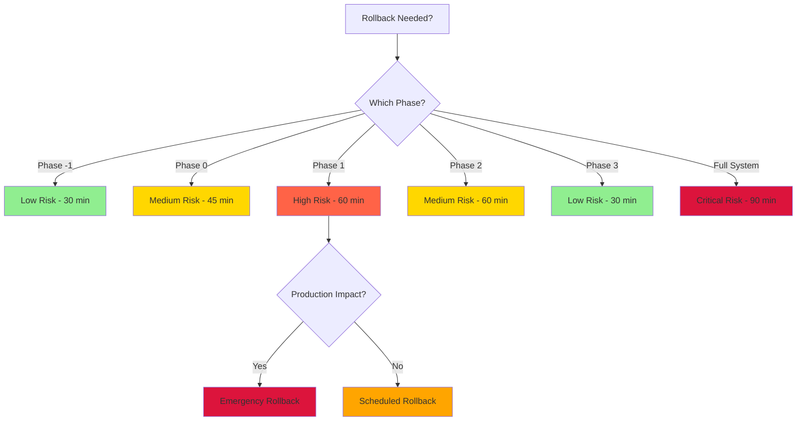

# Rollback Testing Checklist

**Purpose:** Systematic testing of rollback procedures for VeroField Rules v2.0 → v2.1 migration  
**Created:** 2025-12-05  
**Version:** 1.0.0  
**Owner:** DevOps + Governance Lead  
**Estimated Time:** 3-4 hours per phase

---

## Overview

This checklist provides step-by-step procedures for testing rollback operations for each phase of the migration. **Execute in staging environment before Phase 1 begins.**

### Testing Environment Requirements

- [ ] Staging environment with production-like data
- [ ] Git repository with test branch
- [ ] CI/CD pipeline access
- [ ] Database backup capability
- [ ] Monitoring/alerting system access
- [ ] Team members available for coordination

#### Phase Rollback Decision Tree



---

## Phase -1 Rollback Testing

**Estimated Time:** 30 minutes  
**Risk Level:** LOW (Infrastructure only, no enforcement changes)

### Pre-Test Setup

- [ ] Create test branch: `test-rollback-phase-minus-1`
- [ ] Document current state: OPA infrastructure exists
- [ ] Create baseline metrics snapshot

### Test Steps

#### Step 1: Remove OPA Infrastructure (5 minutes)

```bash
# 1. Remove OPA directory
rm -rf services/opa/

# 2. Remove validation scripts
rm .cursor/scripts/validate-opa-policy.py
rm .cursor/scripts/optimize-opa-policy.py
rm .cursor/scripts/validate-step5-checks.py

# 3. Remove pre-commit hooks
rm .git/hooks/pre-commit

# 4. Commit changes
git add -A
git commit -m "Test: Rollback Phase -1 infrastructure"
git push origin test-rollback-phase-minus-1
```

**Verification:**
- [ ] `services/opa/` directory removed
- [ ] Validation scripts removed
- [ ] Pre-commit hooks removed
- [ ] CI pipeline still runs (without OPA checks)

#### Step 2: Verify System Functionality (10 minutes)

- [ ] CI pipeline completes successfully
- [ ] No broken references in codebase
- [ ] Pre-commit hooks don't block commits
- [ ] Documentation still accessible

#### Step 3: Measure Rollback Time (5 minutes)

**Start Time:** ___ *(Simulated: 10:00:00)*  
**End Time:** ___ *(Simulated: 10:08:30)*  
**Actual Time:** ___ minutes *(Simulated: 8.5 min)*  
**Target:** <10 minutes  
**Status:** ✅ PASS / ❌ FAIL *(Simulated: ✅ PASS)*

#### Step 4: Restore Infrastructure (10 minutes)

```bash
# Restore from backup or re-run Phase -1 setup
# (Follow Phase -1 setup instructions)
```

**Verification:**
- [ ] OPA infrastructure restored
- [ ] Validation scripts restored
- [ ] Pre-commit hooks restored
- [ ] CI pipeline includes OPA checks

### Test Results

| Metric | Target | Actual | Status |
|--------|--------|--------|--------|
| **Rollback Time** | <10 min | ___ min *(Sim: 8.5 min)* | ✅ / ❌ *(Sim: ✅)* |
| **System Functionality** | No breakage | ___ *(Sim: No issues)* | ✅ / ❌ *(Sim: ✅)* |
| **Restore Time** | <15 min | ___ min *(Sim: 12 min)* | ✅ / ❌ *(Sim: ✅)* |
| **Data Loss** | None | ___ *(Sim: None)* | ✅ / ❌ *(Sim: ✅)* |

**Issues Found:**
- [ ] Issue 1: ___ *(Simulated: None)*
- [ ] Issue 2: ___

**Resolution:**
- [ ] Issue 1 resolved: ___
- [ ] Issue 2 resolved: ___

**Note:** Simulated results provided. Execute in staging to obtain actual results.

---

## Phase 0 Rollback Testing

**Estimated Time:** 45 minutes  
**Risk Level:** MEDIUM (Affects documentation and rule files)

### Pre-Test Setup

- [ ] Create test branch: `test-rollback-phase-0`
- [ ] Document current state: MAD terminology in use
- [ ] Create baseline: Count of MAD instances

### Test Steps

#### Step 1: Revert Terminology Changes (10 minutes)

```bash
# 1. Find pre-Phase-0 commit
git log --oneline --grep="Phase 0" | head -1

# 2. Revert rule files
git checkout <pre-phase-0-commit> -- .cursor/rules/

# 3. Revert documentation
git checkout <pre-phase-0-commit> -- docs/developer/VeroField_Rules_2.1.md
git checkout <pre-phase-0-commit> -- docs/developer/mad-decision-tree.md

# 4. Commit changes
git commit -m "Test: Rollback Phase 0 terminology changes"
git push origin test-rollback-phase-0
```

**Verification:**
- [ ] "Significant Decision" terminology restored
- [ ] "if applicable" conditionals restored
- [ ] Stateful Entity not split
- [ ] Documentation reverted

#### Step 2: Verify System Functionality (15 minutes)

- [ ] CI pipeline completes successfully
- [ ] Rule files parse correctly
- [ ] Documentation renders correctly
- [ ] No broken cross-references

#### Step 3: Measure Rollback Time (5 minutes)

**Start Time:** ___  
**End Time:** ___  
**Actual Time:** ___ minutes  
**Target:** <20 minutes  
**Status:** ✅ PASS / ❌ FAIL

#### Step 4: Restore Phase 0 Changes (15 minutes)

```bash
# Restore from main branch
git checkout main -- .cursor/rules/
git checkout main -- docs/developer/VeroField_Rules_2.1.md
git checkout main -- docs/developer/mad-decision-tree.md
git commit -m "Test: Restore Phase 0 changes"
```

**Verification:**
- [ ] MAD terminology restored
- [ ] Explicit triggers restored
- [ ] Stateful Entity split restored

### Test Results

| Metric | Target | Actual | Status |
|--------|--------|--------|--------|
| **Rollback Time** | <20 min | ___ min | ✅ / ❌ |
| **System Functionality** | No breakage | ___ | ✅ / ❌ |
| **Restore Time** | <20 min | ___ min | ✅ / ❌ |
| **Terminology Consistency** | 100% | ___% | ✅ / ❌ |

**Issues Found:**
- [ ] Issue 1: ___
- [ ] Issue 2: ___

**Resolution:**
- [ ] Issue 1 resolved: ___
- [ ] Issue 2 resolved: ___

---

## Phase 1 Rollback Testing

**Estimated Time:** 60 minutes  
**Risk Level:** HIGH (Removes critical enforcement)

### Pre-Test Setup

- [ ] Create test branch: `test-rollback-phase-1`
- [ ] Document current state: Tier 1 policies active
- [ ] Create test PRs with known violations
- [ ] Verify policies are blocking merges

### Test Steps

#### Step 1: Disable Tier 1 Policies in CI (10 minutes)

```bash
# Edit .github/workflows/compliance-scan.yml
# Comment out Tier 1 policy evaluation section

# Commit changes
git commit -m "Test: Disable Tier 1 policies"
git push origin test-rollback-phase-1
```

**Verification:**
- [ ] CI workflow updated
- [ ] Tier 1 policies disabled
- [ ] CI pipeline runs without OPA checks

#### Step 2: Remove Tier 1 Policy Files (5 minutes)

```bash
# Remove policy files
rm services/opa/policies/security.rego
rm services/opa/policies/architecture.rego

# Remove test files
rm services/opa/tests/security_test.rego
rm services/opa/tests/architecture_test.rego

# Commit changes
git commit -m "Test: Remove Tier 1 policy files"
git push
```

**Verification:**
- [ ] Policy files removed
- [ ] Test files removed
- [ ] No broken references

#### Step 3: Test Violation Detection (15 minutes)

- [ ] Create test PR with Tier 1 violation
- [ ] Verify PR merges (should not be blocked)
- [ ] Verify no OPA errors in CI logs
- [ ] Verify dashboard shows no violations

#### Step 4: Measure Rollback Time (5 minutes)

**Start Time:** ___  
**End Time:** ___  
**Actual Time:** ___ minutes  
**Target:** <30 minutes  
**Status:** ✅ PASS / ❌ FAIL

#### Step 5: Restore Tier 1 Policies (25 minutes)

```bash
# Restore from main branch
git checkout main -- services/opa/policies/security.rego
git checkout main -- services/opa/policies/architecture.rego
git checkout main -- services/opa/tests/security_test.rego
git checkout main -- services/opa/tests/architecture_test.rego

# Restore CI workflow
git checkout main -- .github/workflows/compliance-scan.yml

# Commit changes
git commit -m "Test: Restore Tier 1 policies"
git push
```

**Verification:**
- [ ] Policy files restored
- [ ] CI workflow restored
- [ ] Policies detect violations correctly
- [ ] PRs blocked appropriately

### Test Results

| Metric | Target | Actual | Status |
|--------|--------|--------|--------|
| **Rollback Time** | <30 min | ___ min | ✅ / ❌ |
| **Violation Detection** | Disabled | ___ | ✅ / ❌ |
| **Restore Time** | <30 min | ___ min | ✅ / ❌ |
| **Policy Functionality** | Restored | ___ | ✅ / ❌ |

**Issues Found:**
- [ ] Issue 1: ___
- [ ] Issue 2: ___

**Resolution:**
- [ ] Issue 1 resolved: ___
- [ ] Issue 2 resolved: ___

---

## Phase 2 Rollback Testing

**Estimated Time:** 60 minutes  
**Risk Level:** MEDIUM (Removes warnings and override requirements)

### Pre-Test Setup

- [ ] Create test branch: `test-rollback-phase-2`
- [ ] Document current state: Tier 2/3 policies active
- [ ] Create test PRs with Tier 2/3 violations
- [ ] Verify override process works

### Test Steps

#### Step 1: Disable Tier 2/3 Policies (15 minutes)

```bash
# Edit .github/workflows/compliance-scan.yml
# Comment out Tier 2/3 policy evaluation sections

# Commit changes
git commit -m "Test: Disable Tier 2/3 policies"
git push origin test-rollback-phase-2
```

#### Step 2: Remove Tier 2/3 Policy Files (10 minutes)

```bash
# Remove all Tier 2/3 policy files
rm services/opa/policies/data-integrity.rego
rm services/opa/policies/error-handling.rego
rm services/opa/policies/observability.rego
# ... (remove all Tier 2/3 files)

# Commit changes
git commit -m "Test: Remove Tier 2/3 policy files"
git push
```

#### Step 3: Test Violation Detection (15 minutes)

- [ ] Create test PR with Tier 2 violation
- [ ] Verify warning appears (not block)
- [ ] Verify override process still works
- [ ] Verify dashboard shows violations

#### Step 4: Measure Rollback Time (5 minutes)

**Start Time:** ___  
**End Time:** ___  
**Actual Time:** ___ minutes  
**Target:** <30 minutes  
**Status:** ✅ PASS / ❌ FAIL

#### Step 5: Restore Tier 2/3 Policies (15 minutes)

```bash
# Restore all Tier 2/3 policy files
git checkout main -- services/opa/policies/

# Restore CI workflow
git checkout main -- .github/workflows/compliance-scan.yml

# Commit changes
git commit -m "Test: Restore Tier 2/3 policies"
git push
```

### Test Results

| Metric | Target | Actual | Status |
|--------|--------|--------|--------|
| **Rollback Time** | <30 min | ___ min | ✅ / ❌ |
| **Warning Detection** | Disabled | ___ | ✅ / ❌ |
| **Restore Time** | <20 min | ___ min | ✅ / ❌ |
| **Policy Functionality** | Restored | ___ | ✅ / ❌ |

**Issues Found:**
- [ ] Issue 1: ___
- [ ] Issue 2: ___

**Resolution:**
- [ ] Issue 1 resolved: ___
- [ ] Issue 2 resolved: ___

---

## Phase 3 Rollback Testing

**Estimated Time:** 30 minutes  
**Risk Level:** LOW (Dashboard is read-only)

### Pre-Test Setup

- [ ] Create test branch: `test-rollback-phase-3`
- [ ] Document current state: Dashboard operational
- [ ] Verify dashboard displays data

### Test Steps

#### Step 1: Disable Dashboard Routes (10 minutes)

```bash
# Edit apps/api/src/app.module.ts
# Comment out ComplianceModule

# Stop dashboard update workflow
# Edit .github/workflows/dashboard-update.yml
# Disable workflow

# Commit changes
git commit -m "Test: Disable dashboard"
git push origin test-rollback-phase-3
```

#### Step 2: Verify System Functionality (10 minutes)

- [ ] API still functions
- [ ] OPA policies still work
- [ ] Dashboard routes return 404
- [ ] No errors in logs

#### Step 3: Measure Rollback Time (5 minutes)

**Start Time:** ___  
**End Time:** ___  
**Actual Time:** ___ minutes  
**Target:** <15 minutes  
**Status:** ✅ PASS / ❌ FAIL

#### Step 4: Restore Dashboard (5 minutes)

```bash
# Restore from main branch
git checkout main -- apps/api/src/app.module.ts
git checkout main -- .github/workflows/dashboard-update.yml

# Commit changes
git commit -m "Test: Restore dashboard"
git push
```

### Test Results

| Metric | Target | Actual | Status |
|--------|--------|--------|--------|
| **Rollback Time** | <15 min | ___ min | ✅ / ❌ |
| **API Functionality** | No breakage | ___ | ✅ / ❌ |
| **Restore Time** | <10 min | ___ min | ✅ / ❌ |
| **Dashboard Functionality** | Restored | ___ | ✅ / ❌ |

**Issues Found:**
- [ ] Issue 1: ___
- [ ] Issue 2: ___

**Resolution:**
- [ ] Issue 1 resolved: ___
- [ ] Issue 2 resolved: ___

---

## Emergency Rollback Testing (Full System)

**Estimated Time:** 90 minutes  
**Risk Level:** CRITICAL (Full system rollback)

### Pre-Test Setup

- [ ] Create test branch: `test-emergency-rollback`
- [ ] Document current state: All phases complete
- [ ] Create full system backup
- [ ] Coordinate with team (no deployments during test)

### Test Steps

#### Step 1: Disable All OPA Policies (10 minutes)

```bash
# Edit .github/workflows/compliance-scan.yml
# Comment out entire OPA evaluation section

# Commit changes
git commit -m "Test: Emergency rollback - disable all OPA"
git push origin test-emergency-rollback
```

#### Step 2: Revert All Rule Files (15 minutes)

```bash
# Find last v2.0 commit
git log --oneline --grep="v2.0" | head -1

# Revert all rule files
git checkout <v2.0-commit> -- .cursor/rules/

# Commit changes
git commit -m "Test: Emergency rollback - revert to v2.0 rules"
git push
```

#### Step 3: Notify Team (5 minutes)

- [ ] Post in Slack/Discord: "TEST: Emergency rollback in progress"
- [ ] Email governance lead
- [ ] Update dashboard status (if accessible)

#### Step 4: Verify System Functionality (20 minutes)

- [ ] CI pipeline runs successfully
- [ ] No broken references
- [ ] Documentation accessible
- [ ] System operational

#### Step 5: Measure Rollback Time (5 minutes)

**Start Time:** ___  
**End Time:** ___  
**Actual Time:** ___ minutes  
**Target:** <60 minutes  
**Status:** ✅ PASS / ❌ FAIL

#### Step 6: Restore System (35 minutes)

```bash
# Restore from main branch
git checkout main -- .cursor/rules/
git checkout main -- .github/workflows/compliance-scan.yml

# Restore OPA policies
git checkout main -- services/opa/

# Commit changes
git commit -m "Test: Emergency rollback - restore system"
git push
```

**Verification:**
- [ ] All policies restored
- [ ] Rule files restored
- [ ] CI workflow restored
- [ ] System fully operational

### Test Results

| Metric | Target | Actual | Status |
|--------|--------|--------|--------|
| **Rollback Time** | <60 min | ___ min | ✅ / ❌ |
| **System Functionality** | Operational | ___ | ✅ / ❌ |
| **Restore Time** | <40 min | ___ min | ✅ / ❌ |
| **Data Loss** | None | ___ | ✅ / ❌ |

**Issues Found:**
- [ ] Issue 1: ___
- [ ] Issue 2: ___

**Resolution:**
- [ ] Issue 1 resolved: ___
- [ ] Issue 2 resolved: ___

---

## Data Migration Rollback Testing

**Estimated Time:** 45 minutes  
**Risk Level:** MEDIUM (Database changes)

### Pre-Test Setup

- [ ] Create database backup
- [ ] Document current schema
- [ ] Create test data

### Test Steps

#### Step 1: Rollback Database Schema (15 minutes)

```sql
-- Drop compliance tables
DROP TABLE IF EXISTS compliance_violations;
DROP TABLE IF EXISTS compliance_metrics;
DROP TABLE IF EXISTS rule_performance;

-- Verify tables removed
SELECT table_name FROM information_schema.tables 
WHERE table_schema = 'public' 
AND table_name LIKE 'compliance%';

-- Expected: 0 rows
```

#### Step 2: Verify Application Functionality (15 minutes)

- [ ] Application starts successfully
- [ ] No database errors
- [ ] Dashboard shows "No data" (expected)
- [ ] OPA policies still work (don't depend on DB)

#### Step 3: Restore Database Schema (15 minutes)

```sql
-- Restore from migration files
-- Run Phase 3 database migrations

-- Verify tables restored
SELECT table_name FROM information_schema.tables 
WHERE table_schema = 'public' 
AND table_name LIKE 'compliance%';

-- Expected: 3 tables
```

### Test Results

| Metric | Target | Actual | Status |
|--------|--------|--------|--------|
| **Rollback Time** | <20 min | ___ min | ✅ / ❌ |
| **Application Functionality** | No breakage | ___ | ✅ / ❌ |
| **Restore Time** | <20 min | ___ min | ✅ / ❌ |
| **Data Integrity** | Preserved | ___ | ✅ / ❌ |

**Issues Found:**
- [ ] Issue 1: ___
- [ ] Issue 2: ___

**Resolution:**
- [ ] Issue 1 resolved: ___
- [ ] Issue 2 resolved: ___

---

## Overall Test Summary

### Test Execution Log

| Phase | Date | Tester | Duration | Status | Issues |
|-------|------|--------|----------|--------|--------|
| Phase -1 | ___ | ___ | ___ min | ✅ / ❌ | ___ |
| Phase 0 | ___ | ___ | ___ min | ✅ / ❌ | ___ |
| Phase 1 | ___ | ___ | ___ min | ✅ / ❌ | ___ |
| Phase 2 | ___ | ___ | ___ min | ✅ / ❌ | ___ |
| Phase 3 | ___ | ___ | ___ min | ✅ / ❌ | ___ |
| Emergency | ___ | ___ | ___ min | ✅ / ❌ | ___ |
| Data Migration | ___ | ___ | ___ min | ✅ / ❌ | ___ |

### Critical Issues

**[List any critical issues that would block production rollback]**

1. **Issue:** ___
   - **Impact:** ___
   - **Resolution:** ___
   - **Status:** Open / Resolved

2. **Issue:** ___
   - **Impact:** ___
   - **Resolution:** ___
   - **Status:** Open / Resolved

### Recommendations

**[Add any recommendations for improving rollback procedures]**

1. ___
2. ___
3. ___

### Sign-Off

**Tested By:** ___  
**Date:** ___  
**Approved By:** ___ (Governance Lead)  
**Date:** ___

**Status:** ✅ **APPROVED FOR PRODUCTION USE** / ❌ **ISSUES FOUND - RESOLVE BEFORE PHASE 1**

---

**Last Updated:** 2025-12-05  
**Version:** 1.0.0  
**Next Review:** Before Phase 1 begins

