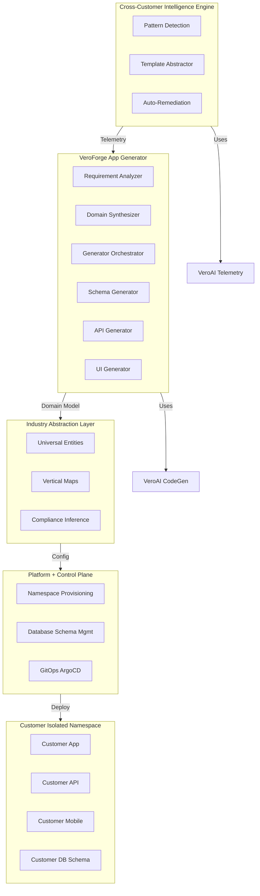
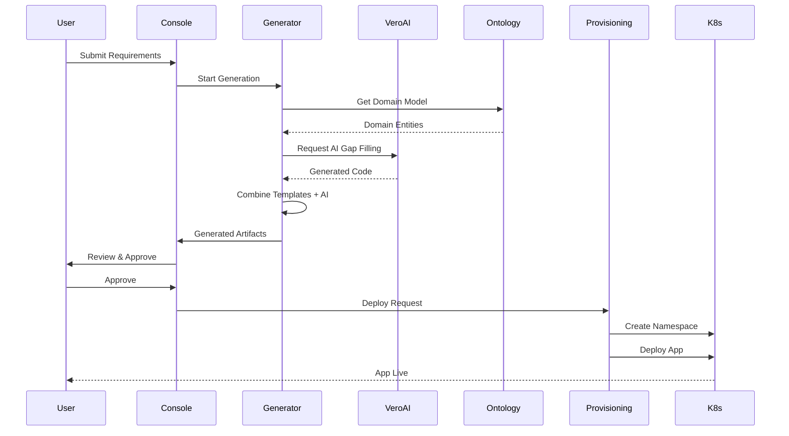
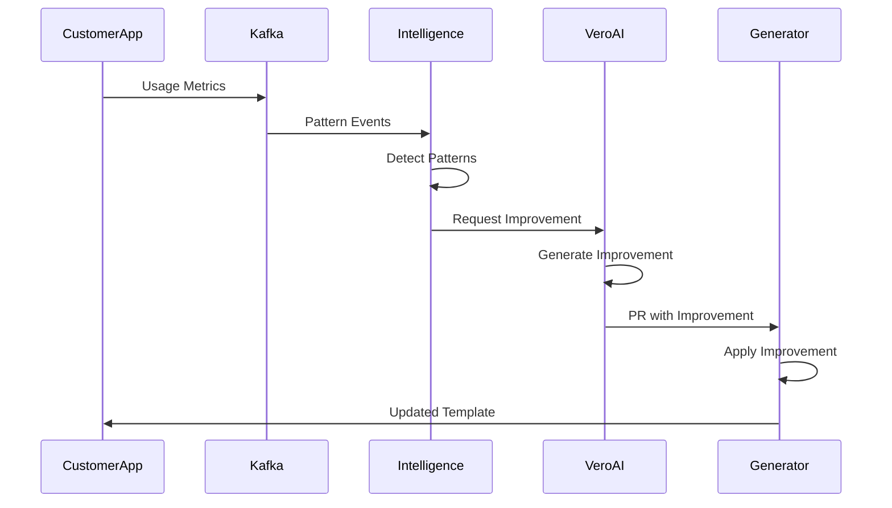

# VeroForge Architecture

**Status:** Strategic Initiative - Post-VeroAI  
**Last Updated:** 2025-12-05

---

## Executive Summary

VeroForge is the platform evolution of VeroField, transforming it from a single CRM application into a system for generating entire business applications. Built on top of VeroAI's capabilities, VeroForge enables template-first code generation with AI gap filling, multi-tenant isolation, marketplace extensibility, and telemetry-driven self-improvement.

---

## High-Level System Architecture

### System View (ASCII)

```
┌─────────────────────────────────────────────────────────────┐
│         Cross-Customer Intelligence Engine                   │
│      (Pattern Detection + Template Auto-Improvement)          │
│                                                               │
│  ┌──────────────┐  ┌──────────────┐  ┌──────────────┐      │
│  │ Pattern      │  │ Template     │  │ Auto-        │      │
│  │ Detection    │  │ Abstractor   │  │ Remediation  │      │
│  └──────────────┘  └──────────────┘  └──────────────┘      │
└───────────────────────▲──────────────────────────────────────┘
                        │ Telemetry (Kafka)
┌───────────────────────┴──────────────────────────────────────┐
│              VeroForge App Generator                          │
│         (Templates + VeroAI CodeGen + AST Manipulation)       │
│                                                               │
│  ┌──────────────┐  ┌──────────────┐  ┌──────────────┐      │
│  │ Requirement  │  │ Domain       │  │ Generator    │      │
│  │ Analyzer     │  │ Synthesizer  │  │ Orchestrator │      │
│  └──────────────┘  └──────────────┘  └──────────────┘      │
│                                                               │
│  ┌──────────────┐  ┌──────────────┐  ┌──────────────┐      │
│  │ Schema       │  │ API          │  │ UI           │      │
│  │ Generator    │  │ Generator    │  │ Generator    │      │
│  └──────────────┘  └──────────────┘  └──────────────┘      │
└───────────────────────▲──────────────────────────────────────┘
                        │ Domain Model
┌───────────────────────┴──────────────────────────────────────┐
│         Industry Abstraction Layer (Ontology Engine)          │
│    (Universal Entities + Workflow AST + Vertical Maps)       │
│                                                               │
│  ┌──────────────┐  ┌──────────────┐  ┌──────────────┐      │
│  │ Universal    │  │ Vertical     │  │ Compliance   │      │
│  │ Entities     │  │ Maps         │  │ Inference    │      │
│  └──────────────┘  └──────────────┘  └──────────────┘      │
└───────────────────────▲──────────────────────────────────────┘
                        │
┌───────────────────────┴──────────────────────────────────────┐
│              Platform + Control Plane                        │
│  (Provisioning + Security + Audit + Approvals + Billing)     │
│                                                               │
│  ┌──────────────┐  ┌──────────────┐  ┌──────────────┐      │
│  │ Namespace    │  │ Database     │  │ GitOps       │      │
│  │ Provisioning │  │ Schema Mgmt  │  │ (ArgoCD)     │      │
│  └──────────────┘  └──────────────┘  └──────────────┘      │
└───────────────────────▲──────────────────────────────────────┘
                        │
┌───────────────────────┴──────────────────────────────────────┐
│         Customer Isolated Namespace (Kubernetes)              │
│  (Per-Customer: App + API + DB Schema + Mobile + DevOps)     │
│                                                               │
│  ┌──────────────┐  ┌──────────────┐  ┌──────────────┐      │
│  │ Customer     │  │ Customer     │  │ Customer     │      │
│  │ App (React)  │  │ API (NestJS) │  │ Mobile (RN)  │      │
│  └──────────────┘  └──────────────┘  └──────────────┘      │
│                                                               │
│  ┌──────────────┐  ┌──────────────┐                        │
│  │ DB Schema    │  │ DevOps       │                        │
│  │ (Postgres)   │  │ Manifests    │                        │
│  └──────────────┘  └──────────────┘                        │
└───────────────────────────────────────────────────────────────┘
```

### System View (Mermaid)



---

## Integration with VeroAI

### VeroAI Services Integration

```
VeroAI Services (apps/)
├── crm-ai/              → VeroForge Generator (enhanced)
│   └── Provides: LLM code generation for gap filling
├── ai-soc/              → VeroForge Security Pipeline
│   └── Provides: Security scanning for generated code
├── feature-ingestion/   → VeroForge Telemetry Processor
│   └── Provides: Kafka event processing for pattern detection
└── kpi-gate/            → VeroForge Deployment Gates
    └── Provides: Canary deployment evaluation

VeroForge Services (apps/)
├── forge-generator/     → NEW: Template + AI generation pipeline
├── forge-console/       → NEW: Review & deployment UI
├── forge-marketplace/   → NEW: Plugin marketplace
├── forge-intelligence/  → NEW: Pattern detection engine
└── forge-provisioning/  → NEW: Customer namespace automation
```

### Meta-Improvement Loop

VeroAI continuously improves VeroForge itself:

```
VeroForge Generator
    │
    ├─→ Generates Customer Apps
    │       │
    │       └─→ VeroAI Telemetry (tracks metrics)
    │               │
    │               └─→ VeroAI Pattern Detection
    │                       │
    │                       └─→ VeroAI CodeGen (generates improvements)
    │                               │
    │                               └─→ VeroAI Governance (approves)
    │                                       │
    │                                       └─→ VeroForge Auto-Update
    │
    └─→ Generator Codebase
            │
            └─→ VeroAI CodeGen (optimizes generator)
                    │
                    └─→ Canary Deployment
```

---

## Core Components

### 1. Generator Pipeline

**Location:** `apps/forge-generator/`

**Components:**
- Requirement Analyzer (LLM → structured domain model)
- Domain Synthesizer (combines templates + AI)
- Schema Generator (Prisma)
- API Generator (NestJS)
- UI Generator (React)
- Mobile Generator (React Native)
- DevOps Generator (Helm + K8s)

**Flow:**
```
Requirements → LLM Analyzer → Domain Model → 
Schema → API → UI → Mobile → DevOps → 
Security Scan → Review → Staging → Production
```

See [Generator Pipeline Architecture](veroforge-generator-pipeline.md) for details.

### 2. Industry Abstraction Layer

**Location:** `libs/ontology/`

**Components:**
- Universal Entities (customer, order, employee, asset, workflow)
- Vertical Maps (10+ industry-specific mappings)
- Workflow AST (actions → entities → roles)
- Compliance Inference (HIPAA/PCI/GDPR mapping)

**Purpose:** Provides domain knowledge for cross-vertical generation.

### 3. Provisioning System

**Location:** `apps/forge-provisioning/`

**Components:**
- Namespace Provisioning (Kubernetes)
- Database Schema Management (Postgres schema-per-tenant)
- GitOps Integration (ArgoCD)
- Security Controls (RBAC, network policies)

**Purpose:** Automates customer environment setup.

### 4. Review & Deployment Console

**Location:** `apps/forge-console/`

**Components:**
- Diff Viewer (Monaco editor)
- Sectional Regeneration
- Approval Workflow
- Staging Environment
- Demo Environment

**Purpose:** Customer-facing UI for reviewing and approving generated apps.

### 5. Marketplace

**Location:** `apps/forge-marketplace/`

**Components:**
- Plugin SDK
- Sandboxed Runtime (gVisor/Firecracker)
- Billing System
- Developer Portal
- Customer Marketplace UI

See [Marketplace Architecture](veroforge-marketplace.md) for details.

### 6. Intelligence Engine

**Location:** `apps/forge-intelligence/`

**Components:**
- Pattern Detection (SQL + ML clustering)
- Template Abstractor (promotes patterns to templates)
- Auto-Remediation (suggests improvements)

**Purpose:** Cross-customer pattern analysis and template auto-improvement.

---

## Data Flow

### Generation Flow



### Telemetry Flow



---

## Multi-Tenant Infrastructure

### Namespace Isolation

```
Kubernetes Cluster
    │
    ├── Namespace: customer-001
    │   ├── App Pod
    │   ├── API Pod
    │   ├── Mobile Build
    │   └── DB Schema: customer_001
    │
    ├── Namespace: customer-002
    │   ├── App Pod
    │   ├── API Pod
    │   ├── Mobile Build
    │   └── DB Schema: customer_002
    │
    └── Namespace: Shared Services
        ├── VeroForge Generator
        ├── VeroAI Services
        └── Kafka
```

### Database Isolation

**Shared Instance (Basic Tier):**
- Schema-per-tenant: `customer_001`, `customer_002`, etc.
- RLS policies enforce isolation

**Dedicated Instance (Pro/Enterprise):**
- Separate Postgres instance per customer
- Full database isolation

---

## Security Architecture

### Security Layers

1. **Network Isolation**
   - Kubernetes network policies
   - Namespace-level isolation
   - Service mesh (Istio) for mTLS

2. **Application Security**
   - RLS in all generated code
   - Tenant context validation
   - Security scanning (SAST/DAST)

3. **Plugin Sandboxing**
   - gVisor/Firecracker VMs
   - Restricted API access
   - Resource limits

4. **Access Control**
   - RBAC in Kubernetes
   - OPA policies
   - Audit logging

---

## Deployment Architecture

### GitOps Flow

```
Generated App Code
    │
    └─→ Git Repository (per customer)
            │
            └─→ ArgoCD Sync
                    │
                    └─→ Kubernetes Apply
                            │
                            └─→ Customer Namespace
```

### Deployment Stages

1. **Generation** → Code generated in staging repo
2. **Review** → Customer reviews in console
3. **Approval** → Customer approves deployment
4. **GitOps** → ArgoCD syncs to customer namespace
5. **Deployment** → Kubernetes applies manifests
6. **Verification** → Health checks confirm deployment

---

## Observability

### Monitoring Stack

```
Generated Apps
    │
    ├─→ OpenTelemetry → Jaeger (Tracing)
    ├─→ Prometheus → Grafana (Metrics)
    └─→ Fluentbit → Loki (Logs)
            │
            └─→ Cross-Customer Intelligence
```

### Metrics Collected

- Generator pipeline performance
- Template usage patterns
- Customer app performance
- Security incidents
- Deployment success rates

---

## Technology Stack

### Generator Stack
- **Language**: TypeScript/Node.js
- **LLM Integration**: Anthropic Claude / OpenAI GPT-4
- **AST Manipulation**: Babel, TypeScript Compiler API
- **Template Engine**: Handlebars, EJS

### Infrastructure Stack
- **Container Orchestration**: Kubernetes
- **GitOps**: ArgoCD
- **Service Mesh**: Istio
- **Database**: PostgreSQL (schema-per-tenant)
- **Message Queue**: Kafka
- **Cache**: Redis

### Generated App Stack
- **Backend**: NestJS + Prisma
- **Frontend**: React + TypeScript
- **Mobile**: React Native
- **Database**: PostgreSQL with RLS

---

## Related Documentation

- [VeroForge Development Plan](../planning/VEROFORGE_DEVELOPMENT_PLAN.md)
- [Generator Pipeline Architecture](veroforge-generator-pipeline.md)
- [Marketplace Architecture](veroforge-marketplace.md)
- [System Overview](system-overview.md)

---

**Last Updated:** 2025-12-05  
**Status:** Planning - Awaiting VeroAI Completion  
**Owner:** Platform Engineering Team

