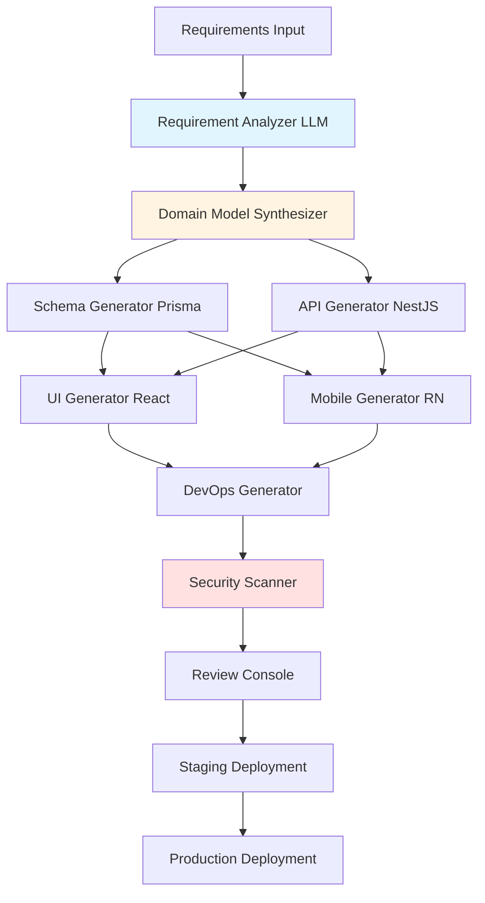

# VeroForge Generator Pipeline Architecture

**Status:** Strategic Initiative - Post-VeroAI  
**Last Updated:** 2025-11-16

---

## Overview

The VeroForge Generator Pipeline transforms natural language requirements into fully deployed business applications. It combines template-based generation (80%) with AI gap filling (20%) to create production-ready code.

---

## Pipeline Flow

### High-Level Flow (ASCII)

```
┌─────────────────────────────────────────────────────────────┐
│                    Requirement Input                          │
│  "I need a CRM for property management with tenant          │
│   tracking, lease management, and maintenance requests"     │
└───────────────────────┬──────────────────────────────────────┘
                        │
                        v
┌─────────────────────────────────────────────────────────────┐
│              Requirement Analyzer (LLM)                       │
│  - Extract entities (tenant, lease, maintenance)             │
│  - Identify relationships                                    │
│  - Map to universal entities                                 │
└───────────────────────┬──────────────────────────────────────┘
                        │
                        v
┌─────────────────────────────────────────────────────────────┐
│              Domain Model Synthesizer                         │
│  - Combine templates (80%)                                   │
│  - AI gap filling (20%)                                      │
│  - Generate domain model                                     │
└───────────────────────┬──────────────────────────────────────┘
                        │
                        v
        ┌───────────────┴───────────────┐
        │                               │
        v                               v
┌───────────────┐           ┌───────────────────────┐
│ Schema        │           │ API Generator         │
│ Generator     │           │ (NestJS)              │
│ (Prisma)      │           │                       │
└───────────────┘           └───────────────────────┘
        │                               │
        └───────────────┬───────────────┘
                        │
        ┌───────────────┴───────────────┐
        │                               │
        v                               v
┌───────────────┐           ┌───────────────────────┐
│ UI Generator  │           │ Mobile Generator      │
│ (React)       │           │ (React Native)        │
└───────────────┘           └───────────────────────┘
        │                               │
        └───────────────┬───────────────┘
                        │
                        v
┌─────────────────────────────────────────────────────────────┐
│              DevOps Generator                                 │
│  - Helm charts                                                │
│  - Kubernetes manifests                                       │
│  - CI/CD pipelines                                            │
└───────────────────────┬──────────────────────────────────────┘
                        │
                        v
┌─────────────────────────────────────────────────────────────┐
│              Security Scanner                                 │
│  - SAST (Semgrep)                                            │
│  - Dependency scanning                                        │
│  - RLS validation                                             │
└───────────────────────┬──────────────────────────────────────┘
                        │
                        v
┌─────────────────────────────────────────────────────────────┐
│              Review Console                                   │
│  - Diff viewer                                                │
│  - Sectional regeneration                                    │
│  - Approval workflow                                         │
└───────────────────────┬──────────────────────────────────────┘
                        │
                        v
┌─────────────────────────────────────────────────────────────┐
│              Staging Deployment                               │
│  - GitOps (ArgoCD)                                           │
│  - Kubernetes namespace                                      │
│  - Demo environment                                          │
└───────────────────────┬──────────────────────────────────────┘
                        │
                        v
┌─────────────────────────────────────────────────────────────┐
│              Production Deployment                           │
│  - Customer approval                                          │
│  - Production namespace                                       │
│  - Live application                                           │
└─────────────────────────────────────────────────────────────┘
```

### Pipeline Flow (Mermaid)



---

## Component Details

### 1. Requirement Analyzer

**Location:** `apps/forge-generator/src/pipeline/requirement-analyzer.service.ts`

**Purpose:** Converts natural language requirements into structured domain model.

**Process:**
1. Send requirements to VeroAI CodeGen (LLM)
2. Extract entities, relationships, and workflows
3. Map to universal entities from ontology
4. Identify vertical-specific patterns
5. Generate structured domain model

**Input:**
```typescript
interface RequirementInput {
  description: string;
  industry?: string;
  compliance?: string[];
  integrations?: string[];
}
```

**Output:**
```typescript
interface DomainModel {
  entities: Entity[];
  relationships: Relationship[];
  workflows: Workflow[];
  compliance: ComplianceRule[];
}
```

### 2. Domain Model Synthesizer

**Location:** `apps/forge-generator/src/pipeline/domain-synthesizer.service.ts`

**Purpose:** Combines templates (80%) with AI gap filling (20%).

**Process:**
1. Match requirements to templates
2. Identify gaps not covered by templates
3. Request AI generation for gaps
4. Combine template code + AI code
5. Validate consistency

**Template Matching:**
- CRUD Master-Detail → Entity management
- Workflow Engine → Business processes
- File Management → Document handling
- User Management → Authentication/authorization

**AI Gap Filling:**
- Custom business logic
- Industry-specific features
- Integration code
- Complex validations

### 3. Schema Generator

**Location:** `apps/forge-generator/src/generators/schema/prisma-generator.service.ts`

**Purpose:** Generates Prisma schema from domain model.

**Process:**
1. Convert entities to Prisma models
2. Add relationships (1:1, 1:N, N:N)
3. Add RLS policies
4. Add indexes for performance
5. Generate migrations

**Output:**
```prisma
model Tenant {
  id        String   @id @default(uuid())
  tenantId  String   // RLS enforcement
  name      String
  email     String   @unique
  leases    Lease[]
  createdAt DateTime @default(now())
  
  @@index([tenantId])
  @@map("tenants")
}
```

### 4. API Generator

**Location:** `apps/forge-generator/src/generators/api/nestjs-generator.service.ts`

**Purpose:** Generates NestJS API from domain model.

**Process:**
1. Generate controllers for each entity
2. Generate services with CRUD operations
3. Add DTOs for validation
4. Add RLS middleware
5. Generate OpenAPI/Swagger docs

**Output Structure:**
```
api/
├── src/
│   ├── tenant/
│   │   ├── tenant.controller.ts
│   │   ├── tenant.service.ts
│   │   ├── tenant.module.ts
│   │   └── dto/
│   │       ├── create-tenant.dto.ts
│   │       └── update-tenant.dto.ts
│   └── lease/
│       └── ...
```

### 5. UI Generator

**Location:** `apps/forge-generator/src/generators/ui/react-generator.service.ts`

**Purpose:** Generates React frontend from domain model.

**Process:**
1. Generate list views for entities
2. Generate detail/edit forms
3. Add search and filtering
4. Add routing
5. Integrate with API

**Output Structure:**
```
frontend/
├── src/
│   ├── pages/
│   │   ├── tenants/
│   │   │   ├── TenantList.tsx
│   │   │   ├── TenantDetail.tsx
│   │   │   └── TenantForm.tsx
│   └── components/
│       └── ...
```

### 6. Mobile Generator

**Location:** `apps/forge-generator/src/generators/mobile/react-native-generator.service.ts`

**Purpose:** Generates React Native mobile app from domain model.

**Process:**
1. Generate offline-first data models
2. Generate sync engine
3. Generate UI screens
4. Add navigation
5. Add offline capabilities

**Output Structure:**
```
mobile/
├── src/
│   ├── screens/
│   │   ├── TenantsScreen.tsx
│   │   └── TenantDetailScreen.tsx
│   ├── services/
│   │   └── sync.service.ts
│   └── models/
│       └── tenant.model.ts
```

### 7. DevOps Generator

**Location:** `apps/forge-generator/src/generators/devops/helm-generator.service.ts`

**Purpose:** Generates Kubernetes manifests and Helm charts.

**Process:**
1. Generate Dockerfiles
2. Generate Kubernetes deployments
3. Generate services and ingress
4. Generate Helm charts
5. Generate ArgoCD application manifests

**Output Structure:**
```
devops/
├── Dockerfile
├── k8s/
│   ├── deployment.yaml
│   ├── service.yaml
│   └── ingress.yaml
├── helm/
│   └── Chart.yaml
└── argo/
    └── application.yaml
```

### 8. Security Scanner

**Location:** `apps/forge-generator/src/security/scanner.service.ts`

**Purpose:** Validates generated code for security issues.

**Checks:**
- RLS enforcement in all queries
- Input validation
- SQL injection prevention
- XSS prevention
- Dependency vulnerabilities
- Secret exposure

**Integration:** Uses VeroAI SOC for scanning.

### 9. Review Console

**Location:** `apps/forge-console/`

**Purpose:** Provides UI for reviewing and approving generated code.

**Features:**
- Monaco diff viewer
- Sectional regeneration
- Approval workflow
- Staging preview

---

## Template System

### Template Structure

```
apps/forge-generator/src/templates/<template-id>/
├── manifest.json          # Template metadata
├── api/                   # API template code
│   ├── controller.template.ts
│   ├── service.template.ts
│   └── dto.template.ts
├── ui/                    # UI template code
│   ├── list.template.tsx
│   ├── detail.template.tsx
│   └── form.template.tsx
├── prisma/                # Database template
│   └── model.template.prisma
└── tests/                 # Test templates
    └── spec.template.ts
```

### Template Manifest

```json
{
  "id": "crud-master-detail",
  "name": "CRUD Master-Detail",
  "version": "1.0.0",
  "description": "Full CRUD operations with master-detail relationship",
  "entities": ["Entity", "DetailEntity"],
  "relationships": ["1:N"],
  "features": ["list", "create", "update", "delete", "detail"],
  "compliance": ["GDPR", "HIPAA"],
  "dependencies": []
}
```

---

## Integration with VeroAI

### VeroAI CodeGen Integration

```typescript
// Request AI generation for gaps
const aiCode = await veroAICodeGen.generate({
  prompt: `Generate NestJS service for ${entity.name} with RLS`,
  context: domainModel,
  template: 'nestjs-service'
});
```

### VeroAI Telemetry Integration

```typescript
// Track generation metrics
await veroAITelemetry.track({
  type: 'generation',
  template: templateId,
  duration: generationTime,
  success: true
});
```

---

## Performance Targets

- **Generation Time:** <20 minutes end-to-end
- **Template Matching:** <5 seconds
- **AI Gap Filling:** <10 minutes
- **Security Scan:** <2 minutes
- **Deployment:** <5 minutes

---

## Error Handling

### Generation Failures

1. **Template Not Found:** Fallback to AI-only generation
2. **AI Generation Failure:** Retry with different prompt
3. **Validation Failure:** Return to requirement analyzer
4. **Security Scan Failure:** Auto-fix or flag for review

### Rollback Strategy

- Keep previous version in Git
- ArgoCD rollback capability
- Template versioning

---

## Related Documentation

- [VeroForge Architecture](veroforge-architecture.md)
- [VeroForge Development Plan](../planning/VEROFORGE_DEVELOPMENT_PLAN.md)
- [Template System Design](../planning/VEROFORGE_TEMPLATE_SYSTEM.md)

---

**Last Updated:** 2025-11-16  
**Status:** Planning - Awaiting VeroAI Completion  
**Owner:** Platform Engineering Team

