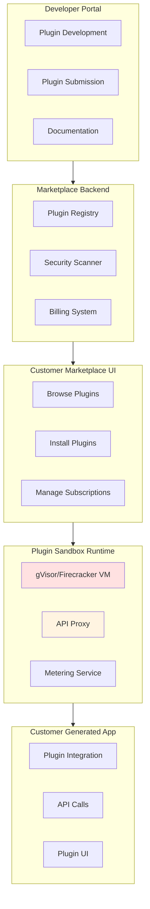

# VeroForge Marketplace Architecture

**Status:** Strategic Initiative - Post-VeroAI  
**Last Updated:** 2025-11-16

---

## Overview

The VeroForge Marketplace enables third-party developers to create and distribute plugins that extend generated applications. Plugins run in sandboxed environments with controlled API access and billing integration.

---

## Marketplace Architecture

### High-Level Architecture (ASCII)

```
┌─────────────────────────────────────────────────────────────┐
│                    Developer Portal                           │
│  - Plugin Development                                      │
│  - Plugin Submission                                             │
│  - Documentation                                             │
│  - Version Management                                        │
└───────────────────────┬──────────────────────────────────────┘
                        │
                        v
┌─────────────────────────────────────────────────────────────┐
│                    Marketplace Backend                        │
│  ┌──────────────┐  ┌──────────────┐  ┌──────────────┐      │
│  │ Plugin       │  │ Security     │  │ Billing       │      │
│  │ Registry     │  │ Scanner      │  │ System        │      │
│  └──────────────┘  └──────────────┘  └──────────────┘      │
└───────────────────────┬──────────────────────────────────────┘
                        │
                        v
┌─────────────────────────────────────────────────────────────┐
│                    Customer Marketplace UI                    │
│  - Browse Plugins                                             │
│  - Install Plugins                                            │
│  - Manage Subscriptions                                       │
└───────────────────────┬──────────────────────────────────────┘
                        │
                        v
┌─────────────────────────────────────────────────────────────┐
│                    Plugin Sandbox Runtime                     │
│  ┌──────────────┐  ┌──────────────┐  ┌──────────────┐      │
│  │ gVisor/Fire  │  │ API Proxy     │  │ Metering     │      │
│  │ cracker VM   │  │ (Restricted)  │  │ Service      │      │
│  └──────────────┘  └──────────────┘  └──────────────┘      │
└───────────────────────┬──────────────────────────────────────┘
                        │
                        v
┌─────────────────────────────────────────────────────────────┐
│                    Customer Generated App                     │
│  - Plugin Integration                                        │
│  - API Calls to Plugin                                        │
│  - Plugin UI Components                                       │
└─────────────────────────────────────────────────────────────┘
```

### Marketplace Architecture (Mermaid)



---

## Components

### 1. Developer Portal

**Location:** `apps/forge-marketplace/src/developer-portal/`

**Features:**
- Plugin SDK documentation
- Plugin development tools
- Submission workflow
- Version management
- Analytics dashboard

**Developer Workflow:**
1. Register as developer
2. Download Plugin SDK
3. Develop plugin locally
4. Submit plugin for review
5. Plugin approved and published
6. Receive revenue share (70/30)

### 2. Plugin Registry

**Location:** `apps/forge-marketplace/src/plugin-registry/`

**Features:**
- Plugin metadata storage
- Version management
- Dependency resolution
- Search and discovery
- Rating and reviews

**Plugin Metadata:**
```typescript
interface PluginMetadata {
  id: string;
  name: string;
  version: string;
  description: string;
  author: string;
  category: string;
  pricing: PricingModel;
  dependencies: string[];
  apiSurface: string[];
  permissions: Permission[];
}
```

### 3. Security Scanner

**Location:** `apps/forge-marketplace/src/security/scanner.service.ts`

**Checks:**
- Malicious code detection
- Dependency vulnerabilities
- API access validation
- Resource limit compliance
- Secret exposure

**Integration:** Uses VeroAI SOC for scanning.

### 4. Sandbox Runtime

**Location:** `apps/forge-marketplace/src/sandbox/runtime.service.ts`

**Runtime Options:**

**Option 1: gVisor**
- User-space kernel
- Fast startup
- Good for most plugins

**Option 2: Firecracker**
- Micro-VM
- Stronger isolation
- Slower startup
- Good for untrusted plugins

**Sandbox Features:**
- Isolated execution environment
- Restricted API access
- Resource limits (CPU, memory, network)
- Time limits for execution
- Network isolation

### 5. API Proxy

**Location:** `apps/forge-marketplace/src/sandbox/api-proxy.service.ts`

**Purpose:** Controls plugin access to customer app APIs.

**API Surface:**
```typescript
interface PluginAPI {
  // Allowed operations
  readData(entity: string, filters: Filter[]): Promise<Data[]>;
  writeData(entity: string, data: Data): Promise<Data>;
  triggerWorkflow(workflowId: string, data: any): Promise<void>;
  
  // Restricted operations
  // - No direct database access
  // - No file system access (except temp)
  // - No network access (except to customer app)
}
```

**Security:**
- Whitelist-based API access
- Rate limiting
- Audit logging
- Tenant isolation

### 6. Metering Service

**Location:** `apps/forge-marketplace/src/billing/metering.service.ts`

**Purpose:** Tracks plugin usage for billing.

**Metrics:**
- API calls
- Execution time
- Data processed
- Storage used

**Billing Models:**
- Pay-per-use
- Subscription
- One-time purchase
- Freemium

### 7. Billing System

**Location:** `apps/forge-marketplace/src/billing/billing.service.ts`

**Features:**
- Revenue share calculation (70/30)
- Payment processing
- Invoice generation
- Developer payouts
- Customer billing

**Revenue Split:**
- 70% to developer
- 30% to VeroForge platform

### 8. Customer Marketplace UI

**Location:** `apps/forge-marketplace/src/customer-marketplace/`

**Features:**
- Browse plugins by category
- Search and filter
- View plugin details
- Install/uninstall plugins
- Manage subscriptions
- View usage analytics

---

## Plugin SDK

**Location:** `packages/forge-sdk/`

### SDK Structure

```typescript
// Plugin entry point
export interface Plugin {
  name: string;
  version: string;
  initialize(context: PluginContext): Promise<void>;
  execute(request: PluginRequest): Promise<PluginResponse>;
  cleanup?(): Promise<void>;
}

// Plugin context
export interface PluginContext {
  api: PluginAPI;
  config: PluginConfig;
  logger: Logger;
}

// Plugin API (restricted)
export interface PluginAPI {
  readData(entity: string, filters: Filter[]): Promise<Data[]>;
  writeData(entity: string, data: Data): Promise<Data>;
  triggerWorkflow(workflowId: string, data: any): Promise<void>;
}
```

### Plugin Example

```typescript
import { Plugin, PluginContext, PluginRequest, PluginResponse } from '@veroforge/sdk';

export class StripeBillingPlugin implements Plugin {
  name = 'stripe-billing';
  version = '1.0.0';
  
  private context: PluginContext;
  
  async initialize(context: PluginContext): Promise<void> {
    this.context = context;
    // Initialize Stripe SDK
  }
  
  async execute(request: PluginRequest): Promise<PluginResponse> {
    if (request.action === 'create-subscription') {
      // Create Stripe subscription
      const subscription = await this.createSubscription(request.data);
      return { success: true, data: subscription };
    }
    return { success: false, error: 'Unknown action' };
  }
}
```

---

## Plugin Lifecycle

### Development

1. Developer downloads SDK
2. Develops plugin locally
3. Tests with plugin simulator
4. Packages plugin bundle

### Submission

1. Developer submits plugin
2. Security scanner validates
3. Manual review (if needed)
4. Plugin approved/rejected

### Installation

1. Customer browses marketplace
2. Customer installs plugin
3. Plugin deployed to sandbox
4. Plugin initialized in customer app

### Execution

1. Customer app calls plugin
2. API proxy validates request
3. Plugin executes in sandbox
4. Response returned to app
5. Usage metered for billing

### Updates

1. Developer releases new version
2. Security scanner validates
3. Customers notified
4. Customers approve update
5. Plugin updated in sandbox

---

## Security Architecture

### Sandbox Isolation

```
Customer App Namespace
    │
    └── Plugin Sandbox (gVisor/Firecracker)
            │
            ├── Isolated Filesystem
            ├── Restricted Network
            ├── Limited CPU/Memory
            └── API Proxy (whitelist)
```

### Security Controls

1. **Code Isolation**
   - Plugin runs in separate VM
   - No direct access to customer data
   - All access via API proxy

2. **API Access Control**
   - Whitelist-based permissions
   - Rate limiting
   - Audit logging

3. **Resource Limits**
   - CPU limits
   - Memory limits
   - Network bandwidth limits
   - Execution time limits

4. **Data Protection**
   - No direct database access
   - Encrypted data in transit
   - Tenant isolation enforced

---

## Billing Architecture

### Revenue Flow

```
Customer Payment
    │
    ├── 70% → Developer
    └── 30% → VeroForge Platform
```

### Billing Models

**Pay-per-use:**
- Meter API calls
- Bill monthly
- Usage-based pricing

**Subscription:**
- Fixed monthly fee
- Unlimited usage
- Tiered plans

**One-time:**
- Single payment
- Lifetime access
- No recurring billing

**Freemium:**
- Free tier with limits
- Paid tier for more features
- Upgrade path

---

## Launch Plugins

### Planned Launch Plugins

1. **Stripe Advanced Billing**
   - Subscription management
   - Payment processing
   - Invoice generation

2. **QuickBooks Sync**
   - Accounting integration
   - Financial data sync
   - Report generation

3. **Slack Integration**
   - Notifications
   - Workflow triggers
   - Team collaboration

4. **Twilio Integration**
   - SMS notifications
   - Voice calls
   - Two-factor authentication

5. **DocuSign Integration**
   - Document signing
   - Contract management
   - E-signature workflows

---

## Performance Targets

- **Plugin Startup:** <2 seconds
- **API Call Latency:** <100ms (p99)
- **Sandbox Overhead:** <10% CPU
- **Concurrent Plugins:** 100+ per customer

---

## Related Documentation

- [VeroForge Architecture](veroforge-architecture.md)
- [VeroForge Development Plan](../planning/VEROFORGE_DEVELOPMENT_PLAN.md)
- [SDK Guide](../guides/development/veroforge-sdk-guide.md)

---

**Last Updated:** 2025-11-16  
**Status:** Planning - Awaiting VeroAI Completion  
**Owner:** Platform Engineering Team

